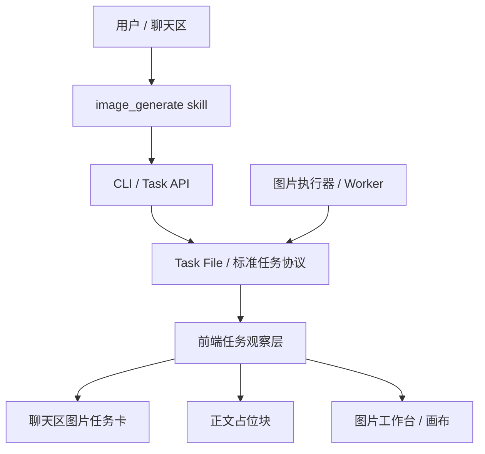

# Skills 异步图片任务与动态渲染 PRD

> 说明：本文件已降级为历史背景文档，`@配图` current 主方案请以 [docs/prd/gongneng/peitu/prd.md](/Users/coso/Documents/dev/ai/aiclientproxy/lime/docs/prd/gongneng/peitu/prd.md) 与 [docs/aiprompts/command-runtime.md](/Users/coso/Documents/dev/ai/aiclientproxy/lime/docs/aiprompts/command-runtime.md) 为准。当前首发入口已经统一收敛到 `image_skill_launch -> Agent -> Skill(image_generate) -> task file` 主链，不再保留“前端快路径”作为 current 实现。

> 文档版本：v1.0
> 状态：Draft
> 更新时间：2026-04-06
> 适用范围：`image_generate` skill、`lime-cli`、媒体任务协议、聊天区、图片工作台
> 目标读者：产品、前端、Rust/CLI、测试

---

## 一、背景与问题定义

图片生成不是一个“页面功能”，而是一个会被正文配图、封面生成、自动化工作流、批处理、队列任务、Agent 组合频繁复用的核心技能。

当前 Lime 已存在两条相关链路：

1. `@配图` 前端快路径  
   已具备占位反馈、图片卡、图片工作台展开等体验，但真相源偏前端本地运行时。
2. `image_generate` skill 任务路径  
   已具备稳定的任务创建能力，能输出 `task_id / task_type / path / status`，但当前只做到“提交任务”，没有把任务状态与结果动态回流到聊天区。

这导致三个核心问题：

1. **能力割裂**：前端快路径与 skill 任务路径体验不一致。
2. **黑盒感强**：用户在聊天区中看不到真实生成进度与真实结果替换。
3. **难以组合与测试**：如果图片生成过程继续停留在某个前端页面或某个 skill 内部，就很难在自动化、批处理、队列、重试、回放中复用。

本 PRD 的目标是把图片生成正式收敛为一条异步、解耦、标准化的主链：

- `skill` 只负责创建图片任务
- `CLI / task file` 作为唯一状态真相源
- `worker / 执行器` 异步消费任务并回写结果
- `前端` 只观察任务状态，先渲染占位，再替换成真实图片

---

## 二、产品目标与非目标

### 2.1 产品目标

1. 让用户在聊天区中发起图片 skill 后，立即看到可感知的动态反馈。
2. 让图片 skill 与正文配图、封面、自动化、未来 worker 共用同一套任务协议。
3. 让图片任务具备标准生命周期：创建、排队、执行、成功、失败、重试、取消、恢复。
4. 让前端显示的是“真实任务状态”，而不是 assistant 文案猜测。
5. 让图片生成具备良好的可测试性、可回放性与幂等能力。

### 2.2 非目标

1. 不把 `image_generate` 改成同步阻塞 skill。
2. 不让前端直接成为图片业务真相源。
3. 不为图片业务单独发明第二套状态协议。
4. 不要求首期实现复杂多 worker 调度系统，但协议必须为其预留空间。

---

## 三、核心原则

### 3.1 Skill 只负责创建任务

`image_generate` 的职责是把用户意图转成高质量图片任务，而不是持有整个生成生命周期。

### 3.2 Task File 是唯一真相源

图片任务的状态、结果、错误、来源关系都必须落到标准 task file 或其等价协议存储中。聊天区、工作台、CLI、测试统一读取这一事实源。

### 3.3 前端是观察者，不是执行器

前端只负责：

- 插入任务卡
- 观察任务状态
- 渲染占位态、成功态、失败态
- 提供“打开图片工作台/重试/查看详情”等交互

前端不直接持有真实图片任务状态机。

### 3.4 任务必须可组合

图片生成将被多个能力组合调用，因此协议必须天然支持：

- 幂等
- 重试
- 队列
- 历史恢复
- 任务结果回放
- 多入口共用

### 3.5 动态渲染绑定 `task_id`

前端可以用类似 `[img:multimodal:描述]` 的占位语义做用户可见反馈，但真正的替换与状态更新必须绑定 `task_id`，不能只依赖原始文本占位符。

---

## 四、用户体验目标

## 4.1 聊天区中的图片任务体验

用户在聊天区中触发 `image_generate` 后，系统行为应如下：

1. 立即创建图片任务。
2. 聊天区立即出现一张图片任务卡。
3. 任务卡先展示动态占位图与摘要文案。
4. 任务进入 `queued / running` 后，任务卡持续保持“处理中”态。
5. 任务成功后，任务卡原位替换为真实图片。
6. 用户点击真实图片后，可打开图片工作台或图片画布。
7. 任务失败后，任务卡切为失败态，并显示可重试入口。

用户不应该遇到以下情况：

- 技能明明已经提交任务，但聊天区无任何视觉反馈
- 图片生成成功了，但聊天区仍显示失败
- 成功后又额外插入第二条“结果消息”，造成重复
- 只有前端快路径有占位体验，skill 路径没有

## 4.2 正文或富文本中的占位体验

当正文、说明文稿或富文本内容需要“边写边配图”时，前端允许展示图片占位块，视觉上可参考：

- 行内占位文本：`[img:主题摘要]`
- 块级占位组件：带边框、骨架图、说明文案的图片占位块

但内部必须维护如下映射：

- `render_slot_id -> task_id`
- `task_id -> 最新任务状态`
- `task_id -> 最新结果图片`

首期规则：

1. 如果已有 `task_id` 映射，前端按任务状态动态渲染。
2. 如果只有文本占位，没有映射，则保留为普通文本，不做伪替换。
3. 成功后，块级占位直接替换为真实图片视图。

## 4.3 历史恢复

用户刷新、重开会话、切换主题后，只要任务仍存在于 task file 中，前端应能够恢复：

- 未完成任务的占位态
- 已完成任务的真实图片态
- 已失败任务的失败态

---

## 五、总体架构



### 5.1 分层职责

#### Skill 层

- 解析用户意图
- 整理 prompt、尺寸、数量、风格、用途
- 创建标准图片任务
- 返回结构化任务摘要

#### CLI / Task API 层

- 创建任务
- 查询状态
- 查询结果
- 列出任务
- 重试任务
- 取消任务

#### Task File / 协议层

- 保存任务元数据
- 保存任务状态
- 保存任务结果
- 保存任务错误
- 保存重试链路与幂等信息

#### Worker / 执行器层

- 异步读取图片任务
- 调用真实图片服务
- 更新状态与结果

#### 前端观察层

- 插入任务卡
- 轮询或订阅状态变化
- 渲染占位与替换结果
- 打开图片工作台

---

## 六、标准任务协议

## 6.1 `image_generate` skill 输出要求

`image_generate` skill 的固定输出至少包含：

- `task_id`
- `task_type = image_generate`
- `status`
- `path`
- `absolute_path`
- `idempotency_key`
- `payload.prompt`
- `payload.size`
- `payload.count`
- `payload.style`
- `payload.usage`

skill 输出的语义是：

- “我已经创建了一个图片任务”
- 而不是“我已经拿到了最终图片结果”

## 6.2 任务状态机

统一状态如下：

- `pending_submit`
- `queued`
- `running`
- `succeeded`
- `failed`
- `cancelled`

状态语义：

- `pending_submit`：任务文件已创建，但尚未进入执行队列
- `queued`：已进入执行队列，等待执行器消费
- `running`：执行器已开始调用图片服务
- `succeeded`：结果已生成并已写回任务文件
- `failed`：任务失败，错误已落盘
- `cancelled`：任务被取消

## 6.3 任务结果结构

建议图片任务结果最小结构如下：

```json
{
  "task_id": "img-task-123",
  "task_type": "image_generate",
  "status": "succeeded",
  "payload": {
    "prompt": "一个充满未来感的实验室，中心是一个发光的大脑",
    "size": "1280x720",
    "count": 1,
    "style": "cinematic",
    "usage": "article-inline"
  },
  "result": {
    "prompt": "一个充满未来感的实验室，中心是一个发光的大脑",
    "provider": "fal",
    "model": "fal-ai/nano-banana-pro",
    "images": [
      {
        "url": "https://...",
        "thumbnail_url": "https://...",
        "width": 1280,
        "height": 720,
        "mime_type": "image/png"
      }
    ]
  },
  "last_error": null
}
```

失败时：

- `status = failed`
- `result = null`
- `last_error` 必须有明确错误文案

## 6.4 幂等字段

所有图片任务默认支持 `idempotency_key`。

约束如下：

1. 同一业务入口重复提交同一个请求时，应优先复用现有任务。
2. 同一 `idempotency_key` 不应重复生成多条等价任务。
3. 前端消息卡更新也必须以 `task_id` 幂等更新，避免重复插卡。

## 6.5 CLI / Tauri 接口

标准 CLI 主链：

- `lime media image generate --json`
- `lime task create image --json`（兼容入口，但必须复用同一条执行链）
- `lime task status <task-ref>`
- `lime task result <task-ref>`
- `lime task retry <task-ref>`
- `lime task cancel <task-ref>`
- `lime task list`

前端推荐通过统一网关暴露：

- `lime_task_get_status`
- `lime_task_get_result`
- `lime_task_list_active`

前端不应在页面组件中散落裸 `invoke`。

---

## 七、动态渲染方案

## 7.1 聊天区图片任务卡

聊天区新增标准图片任务卡视图模型，最少包含：

- `taskId`
- `prompt`
- `status`
- `progressText`
- `imageUrl`
- `imageCount`
- `size`
- `errorMessage`
- `projectId`
- `contentId`

渲染规则：

1. `pending_submit / queued / running`
   - 显示占位图
   - 显示“正在生成预览”或类似文案
   - 显示 prompt 摘要
2. `succeeded`
   - 用真实图片替换占位图
   - 保留点击打开图片工作台入口
3. `failed`
   - 显示失败态
   - 展示错误文案
   - 展示“重试”入口

## 7.2 行内或块级占位渲染

当正文内容中出现图片占位槽位时，前端可以渲染为块级组件，示例视觉语义如下：

```text
[img:multimodal:一个充满未来感的实验室，中心是一个发光的大脑]
```

推荐规则：

1. 视觉层允许显示类似上述可读文本摘要。
2. 内部必须附带不可见绑定信息：
   - `slot_id`
   - `task_id`
   - `status`
3. 一旦任务完成，块级组件直接替换为真实图片视图，而不是简单替换字符串。

## 7.3 状态回流方式

首期推荐主线：

1. 创建任务时，通过 `creation_task_submitted` 拿到 `task_id / path`
2. 前端将该任务加入本地“活跃图片任务集合”
3. 前端对活跃任务执行轻量轮询：
   - `status`
   - `result`
4. 一旦状态变化，原位更新对应消息卡或占位块

后续可升级为事件驱动，但首期必须先有轮询闭环。

## 7.4 消息幂等更新规则

同一个 `task_id` 只允许存在一个主任务卡消息。

更新策略：

- 找到相同 `task_id` 的消息则原位替换
- 找不到则插入新消息
- 禁止在成功时再追加第二条“结果消息”

---

## 八、Worker / 执行器要求

## 8.1 执行器职责

图片执行器必须独立于 skill 运行，负责：

1. 读取 `image_generate` 任务
2. 更新任务状态为 `queued / running`
3. 调用真实图片服务
4. 成功时把结果写回 `result`
5. 失败时把错误写回 `last_error`
6. 支持 retry

## 8.2 渠道要求

当前默认图片执行渠道可使用 FAL，但协议层不能写死某一家 provider。

需要保证：

- `provider`
- `model`
- `result.images[]`

都从执行结果中标准化落盘。

## 8.3 队列与并发

图片任务默认是异步队列任务。

首期不要求完整的分布式调度，但必须支持以下语义：

- 队列中等待
- 运行中
- 同一任务不重复执行
- 失败后可重试

---

## 九、错误、重试、队列、幂等

## 9.1 错误处理

失败任务必须满足：

- `status = failed`
- `last_error` 不为空
- 前端任务卡可显示错误摘要

不允许只 toast 一下然后丢失任务状态。

## 9.2 重试

重试规则：

1. 重试不直接覆写旧任务。
2. 重试创建一条新的任务尝试记录。
3. 新任务需要保留 `source_task_id` 指向原任务。
4. 前端重试入口默认追踪新任务卡或更新同一业务槽位绑定。

## 9.3 队列

当执行资源不足时，任务可停留在 `queued`。

前端应明确展示：

- 当前任务尚未开始执行
- 并非失败

## 9.4 幂等

同一张图片请求在网络抖动、用户重复点击、skill 重复提交时，不应创建多条等价任务。

幂等策略默认基于：

- `session_id`
- `entry_source`
- `prompt`
- `size`
- `count`
- `usage`
- 可选 `content_id`

组合生成稳定 `idempotency_key`。

---

## 十、与现有能力的收敛关系

本方案不是完全推翻现有实现，而是做主链收敛。

### 10.1 可复用现有能力

- `@配图` 路径已有的图片任务卡视觉样式
- 图片工作台的展开与聚焦交互
- 图片消息原位更新能力

### 10.2 需要补齐的主链

- `image_generate` skill 的任务结果回流
- task status / result 前端统一读取网关
- 文本占位与 `task_id` 映射
- 历史恢复逻辑

### 10.3 最终收敛目标

无论入口来自：

- `@配图`
- `image_generate`
- 正文自动配图
- 封面生成
- 自动化流程

都应尽量统一为：

- 同一套任务协议
- 同一套状态机
- 同一套图片任务卡语义
- 同一套图片结果回写规则

---

## 十一、验收标准

### 11.1 用户体验验收

1. 用户在聊天区中通过图片 skill 发起任务后，聊天区立刻出现图片占位卡。
2. 任务执行中，占位卡保持动态渲染，不出现“无反馈空窗”。
3. 任务成功后，占位卡自动替换为真实图片。
4. 点击成功图片可以打开图片工作台或图片画布。
5. 任务失败后，聊天区显示失败态和重试入口。
6. 刷新或恢复会话后，图片任务状态能恢复。
7. 同一任务不会在聊天区生成多张重复卡片。

### 11.2 协议验收

1. `image_generate` skill 输出稳定任务字段。
2. `lime media image generate --json` 与 `lime task create image --json` 都返回稳定 JSON，且共享同一条图片执行链。
3. `lime task status` 能读到标准状态。
4. `lime task result` 能读到标准结果结构。
5. `retry / cancel / list` 行为符合任务协议。

### 11.3 工程验收

1. 前端新增稳定回归测试：
   - 占位卡插入
   - 原位更新
   - 成功替换
   - 失败切换
   - 历史恢复
2. 命令边界校验通过：
   - `npm run test:contracts`
3. GUI 最小冒烟通过：
   - `npm run verify:gui-smoke`

---

## 十二、实施建议

### Phase 1：协议补齐

- 明确图片任务结果 schema
- 暴露前端任务读取接口
- 保证执行器会写回结果与错误

### Phase 2：聊天区动态卡

- 监听任务创建
- 插入占位图片卡
- 轮询状态并原位更新

### Phase 3：正文占位替换

- 支持正文中的图片占位槽位
- 建立 `slot_id -> task_id` 映射
- 完成后原位替换为真实图片

### Phase 4：统一收敛

- 让 `@配图` 与 `image_generate` 共用统一图片任务 UI 语义
- 推进封面、自动配图、自动化流程复用同一协议

---

## 十三、结论

图片生成必须被定义为一个异步、解耦、标准化的核心 skill，而不是某个页面里的特殊前端逻辑。

真正正确的主线不是“让 skill 自己流式出图”，而是：

- `skill 创建任务`
- `任务协议承载状态`
- `执行器异步生成`
- `前端动态渲染并原位替换`

这样才能同时满足：

- 用户体验可见
- 工程边界清晰
- 测试可做
- 能力可组合
- 后续可扩展到队列、重试、自动化与多 worker
