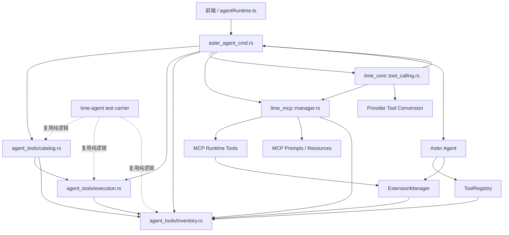
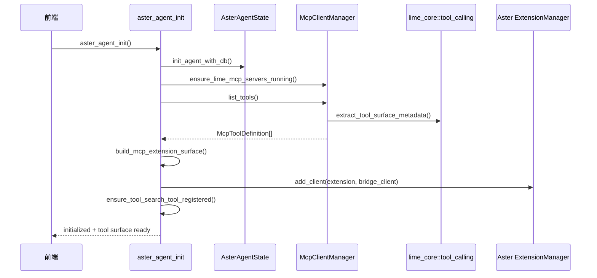
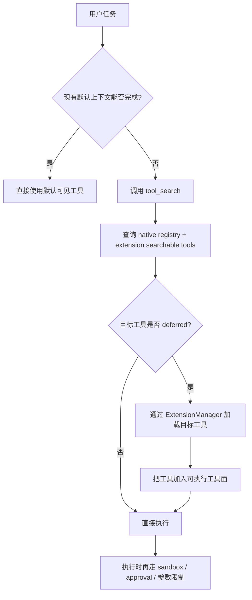
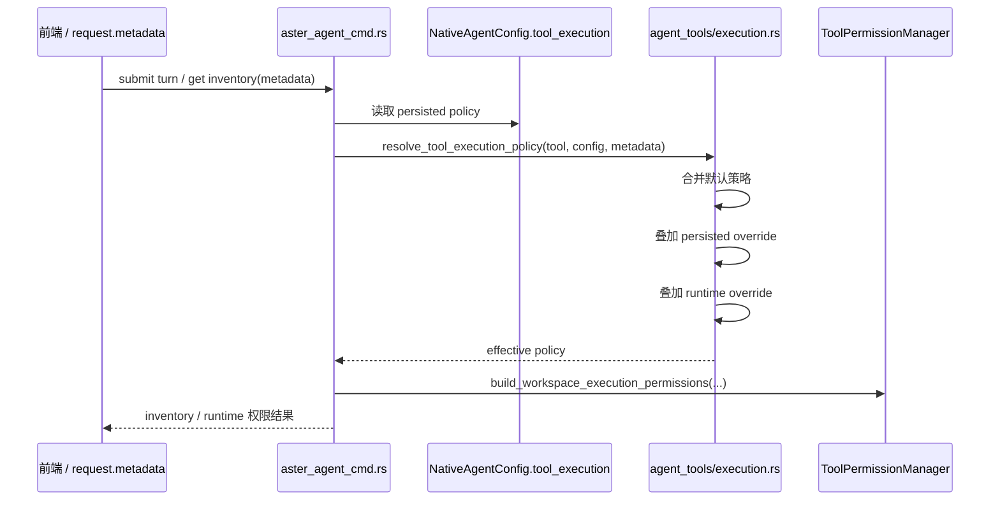

# Lime 工具治理架构

## 1. 设计目标

本次工具治理的设计目标只有四个：

1. **只保留一套 metadata 解释器**
2. **只保留一份 native tool catalog**
3. **MCP 独立运行，但统一注入 Agent runtime**
4. **把“工具发现”和“工具权限执行”彻底分开**

---

## 2. 核心事实源

### 2.1 统一元数据事实源

路径：`src-tauri/crates/core/src/tool_calling.rs`

负责：

- `deferred_loading`
- `always_visible`
- `allowed_callers`
- `tags`
- `input_examples`
- tool search 打分
- caller 归一化

任何地方如果还在自己读 `x-lime` / `x_lime`，都应视为治理退化。

### 2.2 native 目录事实源

路径：`src-tauri/src/agent_tools/catalog.rs`

负责：

- 工具目录完整性
- source / lifecycle / capability / permission_plane
- 默认 allowlist 子集
- Workbench / Browser Assist surface 裁剪
- MCP extension surface 聚合

### 2.3 执行权限事实源

路径：`src-tauri/src/agent_tools/execution.rs`

负责：

- execution 层 warning gate 收口
- workspace 参数限制模板收口
- sandbox profile 归类
- permission 模板生成
- inventory execution profile 暴露
- 默认策略、persisted policy、runtime session override 的优先级合并

### 2.4 MCP runtime 事实源

路径：`src-tauri/crates/mcp/src/manager.rs`

负责：

- MCP server lifecycle
- tool cache
- `list_tools`
- `list_tools_for_context`
- `search_tools`
- runtime metadata 继承与自动 defer 策略

### 2.5 Agent 注入事实源

路径：`src-tauri/src/commands/aster_agent_cmd.rs`

负责：

- `tool_search` bridge tool
- MCP -> Aster extension 注入
- workspace tool allowlist
- runtime tool inventory 命令

### 2.6 轻量测试载体

路径：

- `src-tauri/crates/agent/src/lib.rs`
- `src-tauri/crates/agent/src/agent_tools/mod.rs`

负责：

- 把 `src-tauri/src/agent_tools/catalog.rs`
- 把 `src-tauri/src/agent_tools/execution.rs`
- 把 `src-tauri/src/agent_tools/inventory.rs`

以模块方式复用到 `lime-agent` crate 内，供纯逻辑单测执行。

注意：

- 它不是新的 runtime 事实源
- 它只是测试载体，避免 `lime` 主包为 Tauri/App wiring 做超大链接
- 运行时事实源仍然是 app crate 下的 `catalog.rs` / `execution.rs` / `inventory.rs`

---

## 3. 总体架构图

---

## 4. 初始化时序图

下面是 Lime 启动 Agent 并把 MCP 工具面注入 Aster 的主链路。

---

## 5. 工具检索 / 按需加载流程图

这个流程对应 Anthropic Tool Search / Codex defer loading 的同类思路。

关键点：

- `tool_search` 负责“找工具”
- `allowed_callers` 负责“谁能看见 / 调用”
- `deferred_loading` 负责“是否默认进上下文”
- sandbox / approval 负责“执行时能不能做”

---

## 6. 权限平面拆分

## 6.1 目录层

由 `catalog.rs` 定义。

回答的问题：

- 这个工具属于哪个产品 surface
- 是 current 还是 compat
- 是 Aster builtin、Lime injected 还是 Browser compatibility

## 6.2 上下文层

由 `tool_calling.rs` + `mcp manager` + `tool_search` 定义。

回答的问题：

- 默认可见还是 deferred
- caller 是否匹配
- 是否需要 tool_search 后再进入

## 6.3 执行层

由 `agent_tools/execution.rs` + Aster `ToolPermissionManager` + workspace sandbox / runtime approval 定义。

回答的问题：

- 参数是否受限
- 是否要求审批
- 是否要进入 sandbox
- 当前 workspace 是否允许

> 结论：**不要再让目录层和执行层共享同一套“权限”语义。**

---

## 7. 与 Codex 的对照

## 6.4 执行策略解析时序图

下面是一次工具执行前，effective execution policy 的解析链路。

结论：

- `catalog.rs` 仍只定义目录层事实
- `execution.rs` 独占执行层合并逻辑
- `aster_agent_cmd.rs` 只负责 orchestration，不再手工散写 permission 模板
- provenance 也在 `execution.rs` 统一生成，inventory 只消费结果，不再自行推断来源

---

## 7. 与 Codex 的对照

## 7.1 Codex 怎么做

参考：

- `codex-rs/app-server-protocol/src/protocol/v2.rs`
- `codex-rs/state/src/runtime/threads.rs`

Codex 的关键点：

1. **小型常驻工具配置**
   - `ToolsV2` 只保留少量稳定入口，例如 `web_search`、`view_image`

2. **动态工具独立建模**
   - `DynamicToolSpec` 单独描述动态工具
   - 包含 `defer_loading`

3. **线程级动态工具持久化**
   - `thread_dynamic_tools`
   - 动态工具跟着 thread，而不是全局把所有 schema 塞进 prompt

4. **权限与工具发现分离**
   - `AppToolsConfig` 管具体 app tool 的 enable / approval mode
   - sandbox / approval 是另一套系统

## 7.2 Lime 应该学什么

Lime 不需要一比一复制 Codex，但要学到这三个原则：

1. **常驻工具面要小**
2. **长尾工具靠搜索和 deferred loading**
3. **权限执行不要和工具目录绑死**

## 7.3 Lime 当前对应关系

| Codex                           | Lime 对应实现                                                        |
| ------------------------------- | -------------------------------------------------------------------- |
| `DynamicToolSpec.defer_loading` | `x-lime.deferred_loading` + `McpToolDefinition.deferred_loading`     |
| `thread_dynamic_tools`          | Aster ExtensionManager searchable tools + MCP runtime cache          |
| 小常驻工具面                    | `workspace_default_allowed_tool_names(...)`                          |
| app tool config / approval 分离 | `catalog.rs` + `execution.rs` + workspace sandbox / Aster permission |
| persisted permissions profile   | `NativeAgentConfig.tool_execution`                                   |
| thread/request runtime override | `request.metadata.harness.executionPolicy`                           |

---

## 8. MCP 在架构里的位置

MCP 不是 native tools 的附属物，也不是另起一套 Agent。

它在 Lime 中应被视为：

- **独立的 runtime tool fabric**
- 但通过 **统一的 extension 注入边界** 进入 Agent

这意味着：

- MCP server 启停、缓存、resource/prompt 仍然独立
- Agent 只看到统一后的 prefixed tool surface
- 工具搜索可以同时搜 native 与 extension
- 库存命令可以同时做 catalog / runtime / MCP 三视角盘点

---

## 9. dead-candidate 说明

以下路径当前不在主链路：

- `src-tauri/crates/agent/src/tool_permissions.rs`
- `src-tauri/crates/agent/src/shell_security.rs`

状态建议：

- 当前标记为 `dead-candidate`
- 暂不删除
- 如果后续确认完全无运行时回流，再单独发起一次“删除旧权限系统”的治理变更
