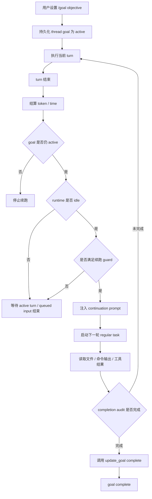
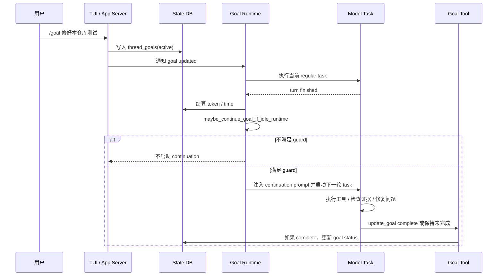
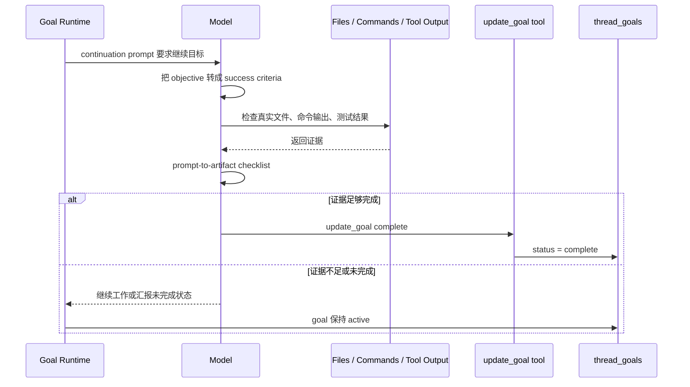
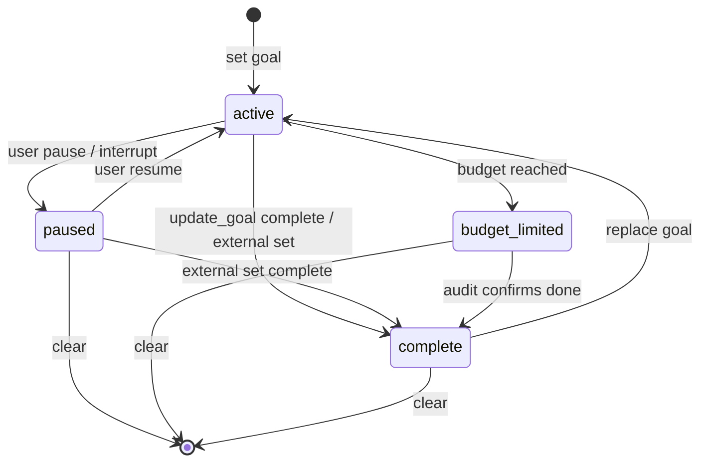
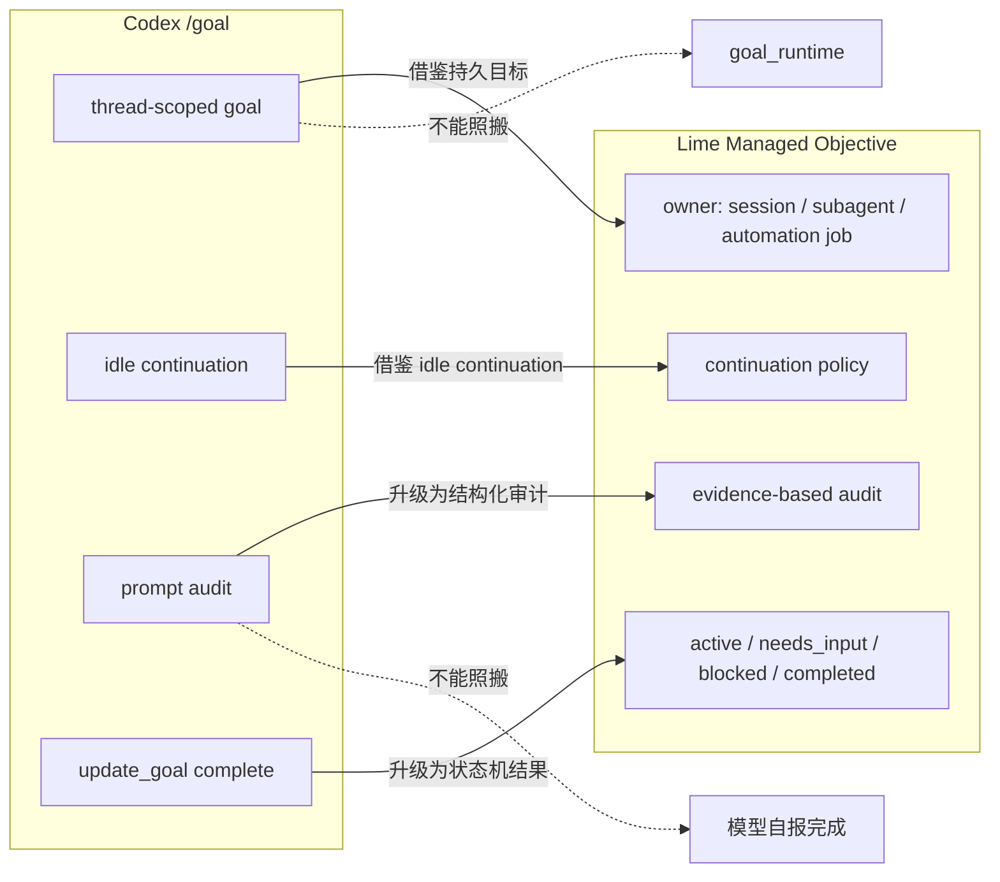

# Codex `/goal` Thread Goal Loop 图纸

> 状态：current research reference  
> 更新时间：2026-05-05  
> 来源：本地源码调研 `/Users/coso/Documents/dev/rust/codex`  
> 目标：用架构图、时序图、流程图和状态图解释 Codex `/goal` 的 thread goal loop，避免把它误读成普通 slash command 或完整 workflow engine。

配套文档：

- [./README.md](./README.md)

## 1. 总体架构图

```mermaid
flowchart TB
    User[用户 / TUI / App Server] --> Entry[/goal set / pause / resume / clear]
    Entry --> Protocol[thread/goal protocol surface]
    Protocol --> State[(thread_goals state DB)]

    State --> Runtime[core goals runtime]
    Runtime --> Hooks[turn start / tool complete / turn finish / abort / resume]
    Hooks --> Accounting[token / time accounting]
    Hooks --> Idle[maybe_continue_goal_if_idle_runtime]

    Idle --> Guard{Continuation guard}
    Guard -->|不满足| Wait[保持 idle / 等用户输入]
    Guard -->|满足| Prompt[注入 continuation prompt]
    Prompt --> Turn[启动下一轮 regular task]

    Turn --> Tools[模型执行工具 / 修改文件 / 跑命令]
    Tools --> Audit[completion audit]
    Audit --> UpdateGoal[model-visible update_goal complete]
    UpdateGoal --> State
    Audit -->|未完成| State
```

固定判断：

1. `/goal` 命令只是入口。
2. `thread_goals` 是持久目标状态。
3. `core goals runtime` 才是 loop 的拥有者。
4. continuation turn 仍是一轮普通 task。
5. 完成出口是 `update_goal complete`，不是自然语言自报。

## 2. 分层架构图

```mermaid
flowchart LR
    subgraph EntryLayer[入口层]
        Slash[/goal slash command]
        API[thread/goal API]
    end

    subgraph StateLayer[状态层]
        DB[(thread_goals)]
        Status[active / paused / budget_limited / complete]
    end

    subgraph RuntimeLayer[Runtime hook 层]
        TurnStart[turn start]
        ToolDone[tool complete]
        TurnFinish[turn finish]
        Abort[abort / interrupt]
        Resume[thread resume]
    end

    subgraph ContinuationLayer[续跑层]
        IdleCheck[idle continuation check]
        Budget[budget steering]
        Prompt[continuation developer prompt]
    end

    subgraph ModelLayer[模型审计层]
        Work[执行下一步]
        Audit[completion audit]
        Complete[update_goal complete]
    end

    Slash --> DB
    API --> DB
    DB --> TurnStart
    DB --> Resume
    TurnStart --> Budget
    ToolDone --> Budget
    TurnFinish --> IdleCheck
    Abort --> Status
    IdleCheck --> Prompt
    Prompt --> Work
    Work --> Audit
    Audit --> Complete
    Complete --> DB
```

固定判断：

**Thread Goal Loop 是 runtime pattern，不是 UI pattern。**

## 3. Thread Goal Loop 流程图



续跑 guard 至少包括：

1. feature flag 开启。
2. 不是 Plan mode。
3. 没有 active turn。
4. 没有 queued input。
5. 没有 pending trigger mailbox input。
6. persisted thread 有 active goal。
7. 预算未进入 budget-limited 停止条件。

## 4. 关键时序图：从 `/goal` 到自动续跑



固定判断：

**续跑不是模型自己在回复里递归调用自己，而是 runtime 在 idle 时启动下一轮 task。**

## 5. Completion Audit 时序图



Codex 的限制：

1. audit discipline 主要靠 continuation prompt 约束。
2. `thread_goals` 不保存 artifact refs。
3. 没有 Lime 式 evidence pack。
4. 因此 Lime 不能只照搬 `update_goal complete`，必须接结构化 evidence audit。

## 6. 状态机图



这个状态机说明：

1. Codex `/goal` 没有 `needs_input`。
2. Codex `/goal` 没有 `blocked`。
3. Codex `/goal` 没有 `failed`。
4. Codex `/goal` 没有 `scheduled`。
5. 所以它是 thread goal loop，不是业务任务状态机。

## 7. 与 Lime Managed Objective 对照图



固定判断：

1. Lime 借鉴的是 runtime continuation pattern。
2. Lime 不照搬 thread-only 作用域。
3. Lime 不照搬 prompt-only audit。
4. Lime 不新增 `goal_runtime`。

## 8. 最小心智原型图

这是 Codex `/goal` 对用户可见的最小交互原型，不是 Lime UI 方案：

```text
┌────────────────────────────────────────────────────────────┐
│ Codex Thread                                               │
├────────────────────────────────────────────────────────────┤
│ Active Goal                                                │
│ 目标：修好本仓库测试                                       │
│ 状态：active                                               │
│ 预算：token 80k / 已用 31k                                 │
├────────────────────────────────────────────────────────────┤
│ 当前 turn                                                  │
│ - 已运行测试：失败 3 个                                    │
│ - 已修复：配置路径、mock 数据                              │
│ - 仍需继续：剩余 1 个 flaky case                           │
├────────────────────────────────────────────────────────────┤
│ Runtime decision                                           │
│ idle: yes                                                  │
│ queued input: no                                           │
│ plan mode: no                                              │
│ decision: start continuation turn                          │
├────────────────────────────────────────────────────────────┤
│ 下一轮                                                     │
│ Continue working toward the active thread goal...           │
└────────────────────────────────────────────────────────────┘
```

这个原型只用于理解机制：

**用户感受到的是“目标还在继续推进”，真实实现是 runtime 在 thread 级状态上续开 turn。**
