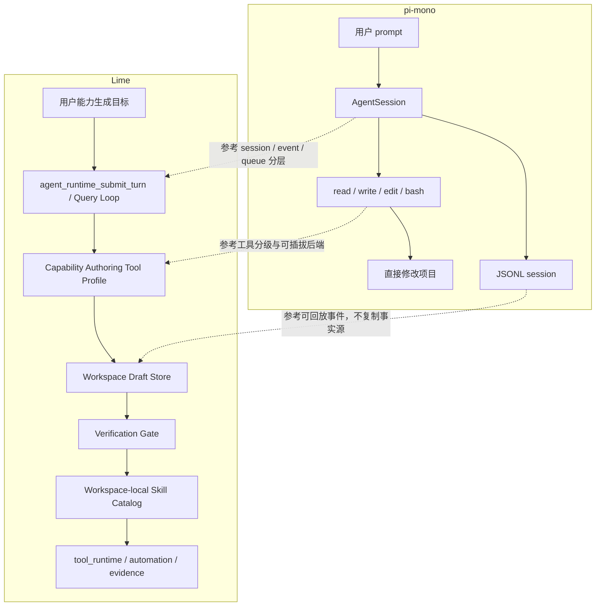
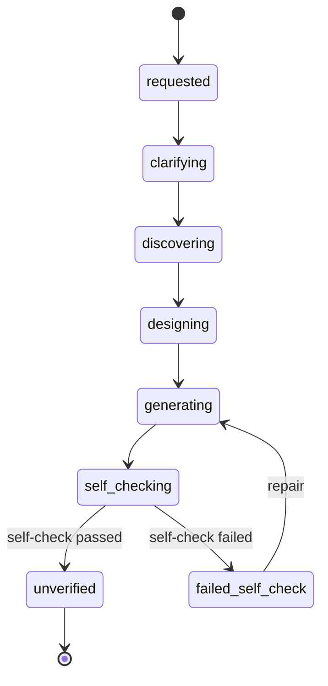

# pi-mono Coding Agent 研究入口

> 状态：current research reference  
> 更新时间：2026-05-05  
> 目标：调研 `/Users/coso/Documents/dev/js/pi-mono` 中 `@mariozechner/pi-coding-agent` 的架构，把可借鉴点收敛为 Lime `Capability Authoring Agent / Skill Forge` 的实现参考，避免把 Lime 误改成另一个终端 Coding Agent。

## 1. 结论先行

`pi-mono` 可以参考，而且很有价值，但参考对象不是“独立 Coding Agent 产品形态”，而是它背后的 **coding harness 工程切面**。

对 Lime 的正确结论是：

**不要把 Lime 改造成 pi；要把 pi 的受控会话、最小工具面、可插拔工具后端、事件生命周期和测试 harness 借鉴到 Lime 的 Capability Authoring Agent。**

换句话说：

```text
pi-mono：终端 coding harness
  -> 目标是让模型直接读写代码、跑命令、改项目

Lime：桌面 Agent Workspace
  -> 目标是让模型生成受治理的 Skill / Adapter draft
  -> 再通过 verification gate 注册到现有 Query Loop / tool_runtime 主链
```

因此，Lime 可以学 pi-mono 的：

1. `AgentSession / AgentSessionRuntime / services` 分层。
2. `read-only tools` 与 `coding tools` 的工具面分级。
3. `noTools / tools allowlist / customTools` 的能力开关。
4. `BashOperations / EditOperations` 这种可插拔执行后端。
5. agent lifecycle、tool lifecycle、session lifecycle 事件。
6. JSONL 事件流、RPC、SDK 嵌入模式的可观测性设计。
7. faux provider + harness 的确定性测试方式。

Lime 不应该学 pi-mono 的：

1. 不新增 `coding_agent_runtime`。
2. 不把 JSONL session 变成第二事实源。
3. 不开放全仓库 `bash / write / edit` 给能力生成任务。
4. 不让 pi-style extension runtime 替代 Lime governance / evidence / tool_runtime。
5. 不把终端 UI 和命令系统搬到 Lime 前台。
6. 不把未验证生成脚本直接注册成工具。

## 2. 来源边界

本研究只基于本地仓库快照：

```text
/Users/coso/Documents/dev/js/pi-mono
```

已重点阅读的本地文件：

1. `README.md`
2. `package.json`
3. `packages/coding-agent/README.md`
4. `packages/agent/src/agent-loop.ts`
5. `packages/coding-agent/src/core/agent-session.ts`
6. `packages/coding-agent/src/core/agent-session-runtime.ts`
7. `packages/coding-agent/src/core/sdk.ts`
8. `packages/coding-agent/src/core/tools/index.ts`
9. `packages/coding-agent/src/core/tools/bash.ts`
10. `packages/coding-agent/src/core/tools/edit.ts`
11. `packages/coding-agent/src/core/session-manager.ts`
12. `packages/coding-agent/src/core/extensions/types.ts`
13. `packages/coding-agent/docs/extensions.md`
14. `packages/coding-agent/docs/skills.md`
15. `packages/coding-agent/docs/rpc.md`
16. `packages/coding-agent/docs/json.md`
17. `packages/coding-agent/docs/sessions.md`
18. `packages/coding-agent/docs/session-format.md`
19. `packages/coding-agent/test/suite/README.md`
20. `packages/coding-agent/test/agent-session-dynamic-tools.test.ts`
21. `packages/coding-agent/test/agent-session-runtime-events.test.ts`
22. `packages/coding-agent/test/file-mutation-queue.test.ts`

固定边界：

1. 本文不是对 pi-mono 质量、商业化或维护状态的评价。
2. 本文不建议把 pi-mono 作为 Lime 运行时依赖直接引入。
3. 本文只提炼对 Lime `Skill Forge / Capability Authoring Agent` 有用的架构参考。

## 3. pi-mono 的系统骨架

`pi-mono` 是一个 monorepo，根 README 将包拆为：

| 包 | 作用 | 对 Lime 的参考价值 |
| --- | --- | --- |
| `@mariozechner/pi-ai` | 多 provider LLM API | 低；Lime 已有 provider / runtime 主链 |
| `@mariozechner/pi-agent-core` | tool calling + state management 的 agent runtime | 中；可参考 agent loop 事件和 queue 语义 |
| `@mariozechner/pi-coding-agent` | interactive coding agent CLI | 高；可参考最小工具面、session、extension、SDK |
| `@mariozechner/pi-tui` | terminal UI library | 低；Lime 是 GUI 桌面产品 |
| `@mariozechner/pi-web-ui` | AI chat web components | 低到中；只参考事件投影，不搬 UI |

`pi-coding-agent` README 直接把 pi 定义成 **minimal terminal coding harness**。它默认给模型四个工具：

```text
read / write / edit / bash
```

同时在工具工厂里还有只读工具组：

```text
read / grep / find / ls
```

这对 Lime 非常关键：

**P1A 的 Capability Authoring Agent 不能一开始就拿到完整 coding tools；它应该先拿到 read-only + draft-scoped write/edit + dry-run 结果读取。**

## 4. Agent Loop 可借鉴点

`packages/agent/src/agent-loop.ts` 里有清晰的 agent loop：

```text
agentLoop / agentLoopContinue
  -> runAgentLoop / runAgentLoopContinue
  -> runLoop
  -> streamAssistantResponse
  -> executeToolCalls
```

它支持：

1. `agent_start / agent_end`
2. `turn_start / turn_end`
3. `message_start / message_update / message_end`
4. `tool_execution_start / tool_execution_update / tool_execution_end`
5. sequential / parallel tool execution
6. `beforeToolCall / afterToolCall`
7. `shouldStopAfterTurn`
8. steering messages
9. follow-up messages

对 Lime 的参考方式：

| pi-mono 设计 | Lime 映射 |
| --- | --- |
| `agentLoopContinue` | Managed Objective 的 continuation turn 只能回到 `agent_runtime_submit_turn / runtime_queue` |
| `shouldStopAfterTurn` | completion audit / budget / pause / needs_input 判断 |
| steering / follow-up | Lime 的用户插队、补充输入、下一轮 continuation 语义可参考，但不能新增第二 queue |
| tool lifecycle events | 映射为 timeline / evidence / replay facts |
| parallel / sequential tool calls | verification dry-run 和 draft 写入默认 sequential，避免文件竞争 |

固定边界：

**Lime 已有 Query Loop；不能因为 pi-mono 有 agent loop，就复制一个平行 loop。**

## 5. AgentSession / Runtime / Services 分层

`AgentSession` 的定位很清楚：同一个核心类被 interactive、print、RPC、SDK 模式复用。它封装：

1. Agent state access。
2. Event subscription 和 session persistence。
3. model / thinking level 管理。
4. compaction。
5. bash execution。
6. session switching / branching。
7. prompt / steer / followUp queue。
8. extension binding。
9. tool registry 和 active tools。

`AgentSessionRuntime` 则负责：

1. 创建 cwd-bound services。
2. 管理当前 `AgentSession`。
3. session switch / new / fork。
4. session shutdown / startup lifecycle。
5. rebind session。

`sdk.ts` 暴露：

1. `createAgentSession`
2. `createAgentSessionRuntime`
3. `createAgentSessionServices`
4. `createCodingTools`
5. `createReadOnlyTools`
6. `createReadTool / createBashTool / createEditTool / createWriteTool`
7. `noTools`
8. `tools` allowlist
9. `customTools`
10. `resourceLoader`
11. `sessionManager`

对 Lime 的启发不是“照搬类名”，而是固定三层心智：

```text
Capability Authoring Session
  -> 当前能力生成任务的状态、事件、draft、patch、self-check

Capability Authoring Runtime Binding
  -> 仍然绑定 Lime agent turn / Query Loop，不是新 runtime

Capability Authoring Services
  -> draft store、source refs、permission scanner、verification gate adapter
```

## 6. 工具面分级是最重要借鉴

pi-mono 的工具分组非常适合作为 Lime P1A 的风险边界参考。

### 6.1 pi-mono 工具分组

```text
coding tools = read / bash / edit / write
read-only tools = read / grep / find / ls
```

`createAgentSession` 还支持：

```text
noTools: "all" | "builtin"
tools: string[]
customTools: ToolDefinition[]
```

这说明 coding harness 不是“默认什么都开放”，而是可以做能力裁剪。

### 6.2 Lime P1A 推荐工具面

Lime 首期不应该给 Capability Authoring Agent 完整 `bash / write / edit`。推荐分三档：

| 档位 | 工具面 | 用途 | P1A 是否开放 |
| --- | --- | --- | --- |
| `author_readonly` | 读 workspace docs、读 source refs、查 CLI help、列 draft 目录 | discover / design | 开放 |
| `author_draft_write` | 只写 draft root 内文件、只做结构化 patch | generate | 开放，但路径强校验 |
| `author_dryrun` | 只运行 fixture / dry-run，不允许外部写操作 | self-check | 有限开放 |
| `author_full_shell` | 任意 bash / install / network write | 通用 coding agent | P1A 不开放，后续需 sandbox + 升级授权 |
| `author_external_write` | 发布、下单、改价、发消息 | 业务执行 | P1A 不开放，后续需人工确认或策略批准 |

固定规则：

1. P1A 不开放全局 shell。
2. P1A 不自动安装依赖。
3. P1A 写入范围只限 draft store。
4. P1A 的 CLI 探索优先是 `--help / version / schema / dry-run`，不是任意命令。
5. P1A 的输出只能是 unverified draft artifact。

## 7. 可插拔工具后端的启发

`bash.ts` 定义了 `BashOperations`：

```text
exec(command, cwd, options)
```

并支持：

1. timeout。
2. AbortSignal。
3. kill process tree。
4. `BashSpawnHook` 修改 command / cwd / env。
5. 自定义 operations，把执行委托给远程或受控后端。

`edit.ts` 定义了 `EditOperations`：

```text
readFile(absolutePath)
writeFile(absolutePath, content)
access(absolutePath)
```

并且测试中有 `withFileMutationQueue`，用于串行化同一文件的并发修改。

对 Lime 的启发：

1. 不要把 “run CLI” 等同于本地 shell。
2. 不要把 “write draft” 等同于任意文件写入。
3. 所有能力都应该是可替换 backend：本地、远程、mock、dry-run。
4. 同一 draft 文件的并发写入需要队列或 patch 顺序保护。
5. verification gate 读取的行为事实应该来自工具后端，而不是模型自述。

推荐 Lime 术语：

```text
CapabilityAuthoringToolBackend
  -> SourceReadBackend
  -> DraftFileBackend
  -> CliProbeBackend
  -> DryRunBackend
```

这不是新 runtime，只是 `tool_runtime` 下的受控工具后端 profile。

## 8. Extension 机制的可借鉴与禁止照搬

pi-mono 的 extension 可以：

1. 订阅 lifecycle events。
2. 注册 LLM-callable tools。
3. 注册 slash commands、shortcuts、flags。
4. 通过 UI prompt 用户确认。
5. 拦截 tool_call。
6. 修改 tool_result。
7. 注入 context。
8. 修改 provider request。
9. 持久化 CustomEntry。
10. 注入 CustomMessage。
11. 注册 provider。

它的 docs 也明确提醒：extension 以完整系统权限运行，只能安装可信来源。

对 Lime 的借鉴：

| pi-mono extension 能力 | Lime 应该怎么收敛 |
| --- | --- |
| `tool_call` block | verification / permission gate |
| `tool_result` modify | dry-run result normalization |
| `context` inject | Query Loop prompt augmentation / capability_generation metadata |
| `CustomEntry` | timeline / artifact / evidence event |
| `registerTool` | 只能在 verified registration 后映射到 Skill / ServiceSkill / tool_runtime |
| `registerCommand` | Lime 不需要复制 terminal command system |
| `registerProvider` | 与 Skill Forge P1A 无关，不进入首期 |

固定边界：

**Lime 不新增 pi-style extension runtime；Lime 只吸收 hook / gate / event lifecycle 这类工程思想。**

## 9. Session JSONL 的启发与边界

pi-mono session 是 JSONL tree：

1. header。
2. message entries。
3. model change。
4. thinking level change。
5. compaction。
6. branch summary。
7. custom entry。
8. custom message entry。
9. label。
10. session info。

它支持 tree branching、compaction、branch summary，以及 extension state persistence。

对 Lime 的启发：

1. generation / verification / repair 应该有可回放的 timeline。
2. draft patch、source ref、self-check、gate result 都需要稳定事件。
3. branch / retry / repair 不能只落在自然语言消息里。

但 Lime 不能照搬 JSONL 做第二事实源。Lime 当前事实链仍是：

```text
agent_runtime_submit_turn
  -> runtime_turn / TurnInputEnvelope
  -> runtime_queue
  -> stream events
  -> timeline / artifact / memory
  -> thread_read / evidence / replay / review
```

因此 Capability Authoring 的事件应该进入现有事实链，例如：

```text
capability_generation_started
source_ref_read
capability_draft_file_written
capability_patch_applied
capability_self_check_run
capability_draft_created
capability_verification_run
capability_verification_result
capability_registration_result
```

P1A 只需要前六个事件，后续 P2 / P3 再补 verification / registration。

## 10. 测试 harness 的启发

`packages/coding-agent/test/suite/README.md` 固定了测试规则：

1. 使用 suite harness。
2. 使用 faux provider。
3. 不使用真实 provider API。
4. 不使用真实 API key。
5. 不调用网络或付费 token。
6. CI-safe、deterministic。

相关测试覆盖了：

1. dynamic tool registration。
2. SDK custom tools。
3. tools allowlist。
4. queue / steering / follow-up。
5. session lifecycle events。
6. file mutation queue。
7. package command path。
8. runtime replacement stale context。

对 Lime 的直接要求：

**P1A 不能只靠 GUI 试跑；必须先有 deterministic harness 测试。**

推荐 P1A 测试矩阵：

| 测试项 | 目标 |
| --- | --- |
| metadata builder | `capability_generation` turn metadata 可稳定生成 |
| draft path guard | `generated_files` 不能逃出 draft root |
| draft write backend | 只允许写 draft root 内文件 |
| read-only source probe | CLI help / docs probe 不产生外部写操作 |
| unverified isolation | draft 不进入 default tool surface |
| self-check result | fixture dry-run 失败时状态为 `failed_self_check` |
| event emission | draft_created / file_written / self_check_run 进入 timeline 或 artifact |

## 11. Lime 对照图



固定判断：

1. pi-mono 的核心是“直接 coding”。
2. Lime 的核心是“能力生成后治理注册”。
3. 二者参考关系在 harness 层，不在产品入口层。

## 12. Capability Authoring Agent 最小形态

考虑用户担心“Lime 原本不是 Coding Agent，所以这块会弱”，建议不要把 P1A 命名为完整独立 Coding Agent，而是更准确地称为：

**Capability Authoring Agent**

它是 Coding Agent 的一个受控子集，只做能力草案生成。

### 12.1 最小循环

```text
clarify
  -> discover source refs
  -> design skill / adapter draft
  -> generate draft files
  -> self-check
  -> mark unverified or failed_self_check
```

### 12.2 最小状态机



### 12.3 最小权限面

```text
允许：
  - 读取用户指定 docs / CLI help / OpenAPI / 本地代码片段
  - 写 draft root 内 SKILL.md / manifest / scripts / examples / tests
  - 运行 fixture dry-run 或静态检查
  - 生成 artifact 和 evidence 事件

禁止：
  - 任意 shell
  - 自动安装依赖
  - 自动读取 secret
  - 自动访问未声明域名
  - 自动执行外部写操作
  - 自动注册到 tool surface
```

### 12.4 最小输出目录

P1A 推荐先把 draft 作为 workspace-local 文件事实源：

```text
<workspace>/.lime/capability-drafts/<draft_id>/
  manifest.json
  SKILL.md
  scripts/
  examples/
  tests/
  self-check.json
```

说明：

1. 这是建议目录，不是已实现事实。
2. 若 Lime 现有 artifact store 已有更合适路径，应优先复用现有封装。
3. 不要为了 P1A 新增全局数据库主事实源。

## 13. 和 Skill Forge / Managed Objective 的关系

pi-mono 参考的是 Skill Forge 三层里的第一层：

```text
Coding Agent / Agent Builder
```

不是第二层：

```text
Autonomous Execution / Managed Objective
```

也不是第三层：

```text
Workspace / Agent App Surface
```

因此实施顺序应该保持：

```text
P1A Capability Authoring Agent draft
  -> P1B self-check
  -> P2 verification gate
  -> P3 registration
  -> P4 Managed Objective / automation job
```

如果先做 P4，就会变成“已有工具多跑几轮”；如果先做 P1A，才开始补 Lime 最弱的 coding capability authoring 层。

## 14. 是否引入 pi-mono 作为依赖

当前建议：**不要引入运行时依赖。**

理由：

1. Lime 是 Tauri GUI + Rust runtime 主链，pi 是 Node terminal harness。
2. Lime 已有 Query Loop、runtime queue、tool_runtime、evidence pack。
3. 直接引入会带来第二套 session、tool registry、extension、auth、UI 和 provider 抽象。
4. P1A 需要的是设计模式，不是终端 agent 产品。

可以复制的不是代码，而是约束：

1. 工具 allowlist。
2. read-only / write / bash 分级。
3. pluggable operations。
4. deterministic faux provider tests。
5. lifecycle event names。
6. session/runtime/services 分层边界。

## 15. 权限宗旨：default deny 不是永久低权限

pi-mono 的默认场景是开发者终端 coding harness，因此默认 `read / write / edit / bash` 是合理的；Lime 的首期场景是 generated capability authoring，生成结果未来会进入 Skill Catalog、automation job 和 evidence 主链，因此必须更保守。

固定宗旨：

**权限永远显式受控，能力逐级开放；限制的是未经验证、未经授权、不可审计的执行，不是限制 agent 的理解、设计、编码和修复能力。**

对 Lime 的含义：

1. `P1A` 限制 full shell / external write，是为了控制未验证 draft 的 blast radius。
2. 这不代表 Lime 永远只能做 read-only 或 draft-only。
3. 后续可以逐级开放 sandbox shell、verified execution、human-confirmed external write 和 policy-approved scheduled write。
4. 每一级开放都必须有对应的 sandbox、verification gate、permission policy、用户确认或 evidence audit。
5. 如果一个能力不能解释“为什么这次执行被允许”，就不能进入 current tool surface 或 automation job。

推荐分级：

```text
Level 0: read-only discovery
Level 1: draft-scoped write
Level 2: fixture dry-run
Level 3: sandbox shell
Level 4: workspace-local verified execution
Level 5: human-confirmed external write
Level 6: policy-approved scheduled external write
```

一句话：

**不是永远限制能力；是永远限制未经验证、未经授权、不可审计的执行。**

## 16. 最终建议

对用户问题“独立 Coding Agent 是否可以参考 pi-mono”，答案是：

**可以，但只能参考为 Lime 的 Capability Authoring Agent 设计，不应把 Lime 改造成 pi-style 独立 Coding Agent。**

更具体地说：

1. P1A 参考 pi-mono 的 read-only tools / allowlist / customTools 思路。
2. P1A 不参考 pi-mono 默认 `read / write / edit / bash` 全能力。
3. P1A 参考 `AgentSession` 分层，但挂回 Lime Query Loop。
4. P1A 参考 session event / JSON event stream，但写入 Lime timeline / artifact / evidence。
5. P1A 参考 test suite harness，不用真实 provider / API key / network。
6. P1A 输出 unverified draft，不注册、不运行、不调度。

一句话：

**pi-mono 告诉我们 Coding Agent 的工程骨架应该长什么样；Lime 要做的是把这套骨架关进 Skill Forge 的治理边界里。**
