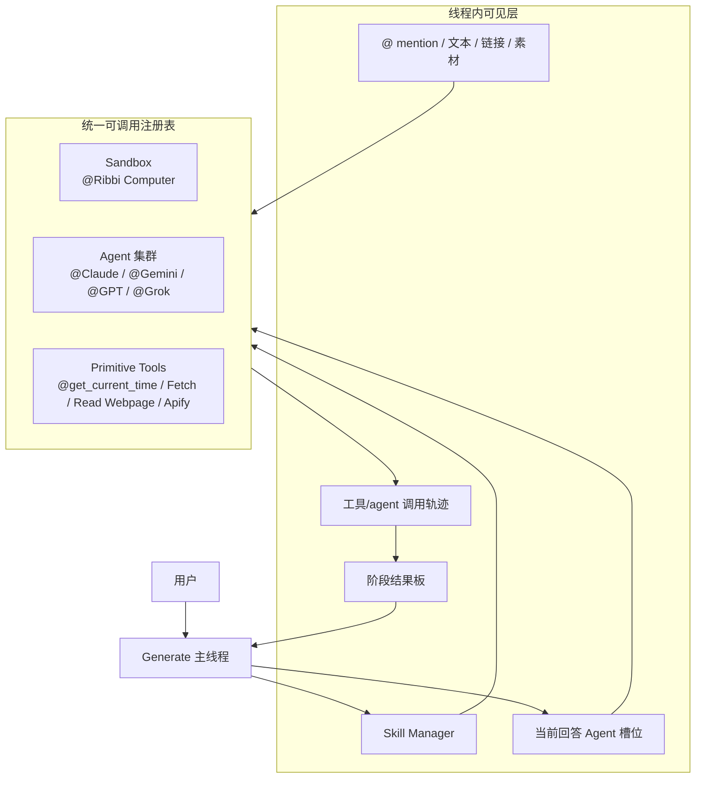
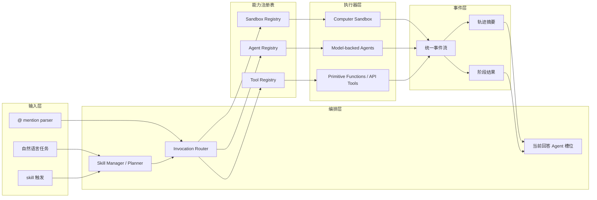
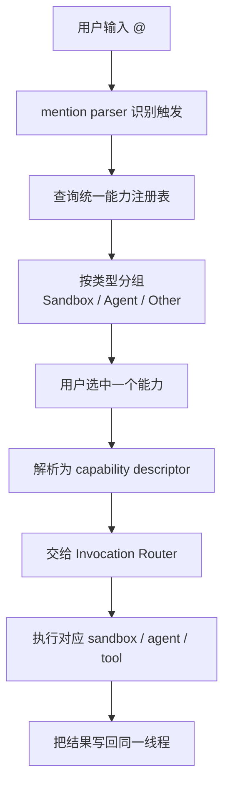
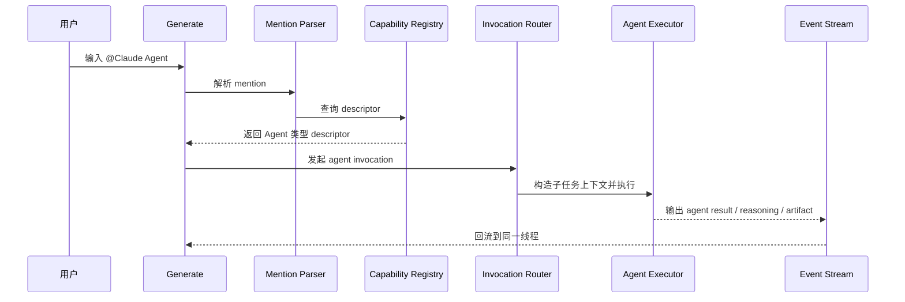
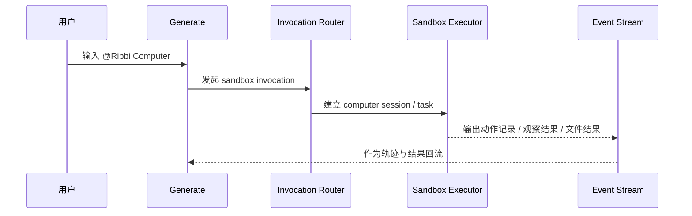
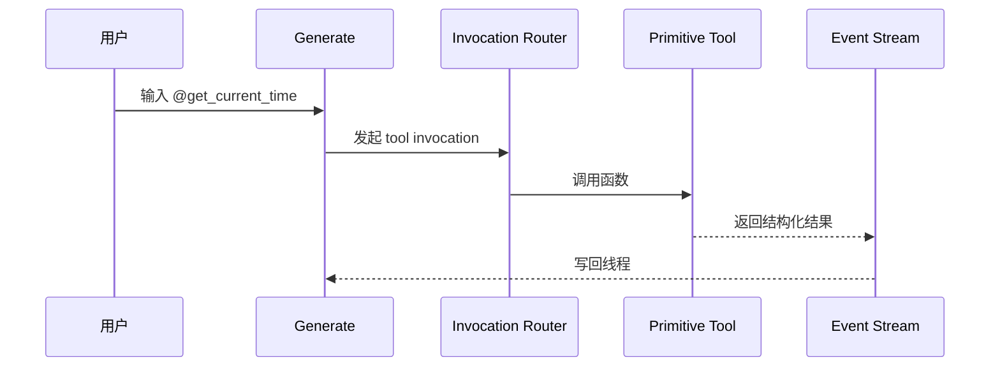

# Ribbi 的 Agent / Sandbox / Tool 编排深拆

> 状态：current research reference  
> 更新时间：2026-04-18  
> 目标：把截图里出现的 `@Claude Agent`、`@Gemini Agent`、`@Ribbi Computer`、`@get_current_time` 这类对象拆清楚，说明它们在同一个 Generate 容器里是如何被统一编排的。

补充入口：

1. 如果要看当前已观察到的 Ribbi 命令总表，先读 [command-inventory.md](./command-inventory.md)。

## 1. 先修正一个误区

看到截图里的：

1. `@Claude Agent`
2. `@Gemini Agent`
3. `@GPT 5 Agent`
4. `@Grok 4 Agent`
5. `@Ribbi Computer`
6. `@get_current_time`

最容易产生的误解是：

**以为前台真正存在很多平级主 Agent 在互相对话。**

但更合理的理解是：

1. Generate 只有一个主线程
2. 线程里有一个统一的“可调用能力面”
3. 这个能力面里同时挂了：
   - sandbox
   - model-backed agents
   - primitive tools
4. 当前线程的主回答体，未必永远是 Claude；Claude 只是其中一个 agent slot 的实现

一句话：

**这更像“单线程里的统一调用注册表”，而不是“多个平级主角在前台同时说话”。**

## 2. 从截图反推出的能力分类

从你给的截图，至少能明确看到三类对象：

### 2.1 Sandbox

例如：

1. `@Ribbi Computer`

它更像：

1. computer use 执行器
2. 可操作桌面/浏览器/环境的 sandbox
3. 高能力、长动作链的执行面

### 2.2 Agent

例如：

1. `@Gemini Agent`
2. `@Claude Agent`
3. `@GPT 5 Agent`
4. `@Grok 4 Agent`

它们更像：

1. 绑定不同模型或不同 agent profile 的子执行器
2. 可以承接某段子任务
3. 输出再回流到同一个 Generate 线程

### 2.3 Other / Primitive Tool

例如：

1. `@get_current_time`

以及线程里可见的：

1. `Fetch`
2. `Apify Social`
3. `Read Webpage`

它们更像：

1. primitive function
2. fetch/read/search 类工具
3. 不需要独立人格，只返回结构化结果

## 3. 更准确的前台架构图

固定判断：

1. `@` 打开的不是“一个工具列表”，而是统一能力注册表。
2. `Agent`、`Sandbox`、`Tool` 是不同类型的执行器。
3. 它们都往同一个线程事件流里回写结果。

## 4. 更细的后台实现推断图

固定判断：

1. `Skill Manager` 更像 planner，不等于具体执行器。
2. `当前回答 Agent 槽位` 更像 presenter/executor slot，不等于某个固定模型。
3. 真正的统一点是事件流，不是某个具体模型名。

## 5. `@` 调用是怎么工作的

### 5.1 前台体验

用户在输入框里输入 `@`，系统弹出统一列表：

1. SANDBOX
2. AGENT
3. OTHER

这说明前台至少有：

1. mention parser
2. registry search
3. typed capability catalog

### 5.2 实现推断流程图

固定判断：

1. 这个 `@` 不只是文案快捷输入。
2. 它是统一调用面的 UI 壳。
3. 分类展示意味着后端一定存在 typed descriptor。

## 6. 一次 agent 调用的细时序

这里最重要的一点是：

**被调用的 agent 返回的是线程事件，不一定直接成为最后对用户说话的“主人格”。**

## 7. 一次 sandbox 调用的细时序

固定判断：

1. sandbox 更像“会动手的执行器”
2. 它的输出通常是动作轨迹、观察结果和产物，而不只是文字

## 8. 一次 primitive tool 调用的细时序

固定判断：

1. primitive tool 不需要复杂人格层
2. 它的价值是低成本直接返回结构化信息

## 9. 为什么这不等于传统 multi-agent

从截图推断，这更像：

1. 单主线程
2. 统一注册表
3. typed executors
4. 统一事件流

而不是：

1. 多个平级 agent 各自持有一段上下文
2. 在前台轮流成为主角
3. 各自有独立线程和独立工作区

所以更准确的说法是：

**single visible thread + multi-type executors**

而不是：

**classic multi-agent workspace**

## 10. 对 Lime 的直接启发

这块对 Lime 的影响非常直接：

1. `生成` 里也应该有统一调用面，而不是只区分“提示词”和“工具”
2. `@` 最终应统一代理：
   - sandbox
   - agent
   - primitive tools
3. `生成` 的主线程应始终是唯一事实源
4. 被调用的 agent/tool/sandbox 都应该回到同一事件流，而不是再开平行结果页

一句话：

**Ribbi 真正强的不是“有很多 agent”，而是把不同类型的执行器都压进了同一个 Generate 线程。**
