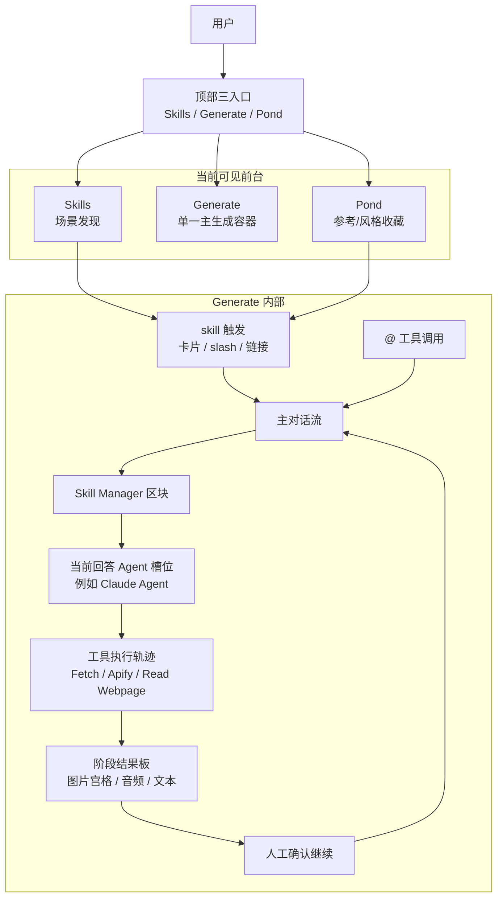
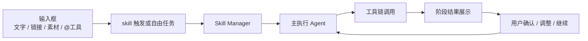
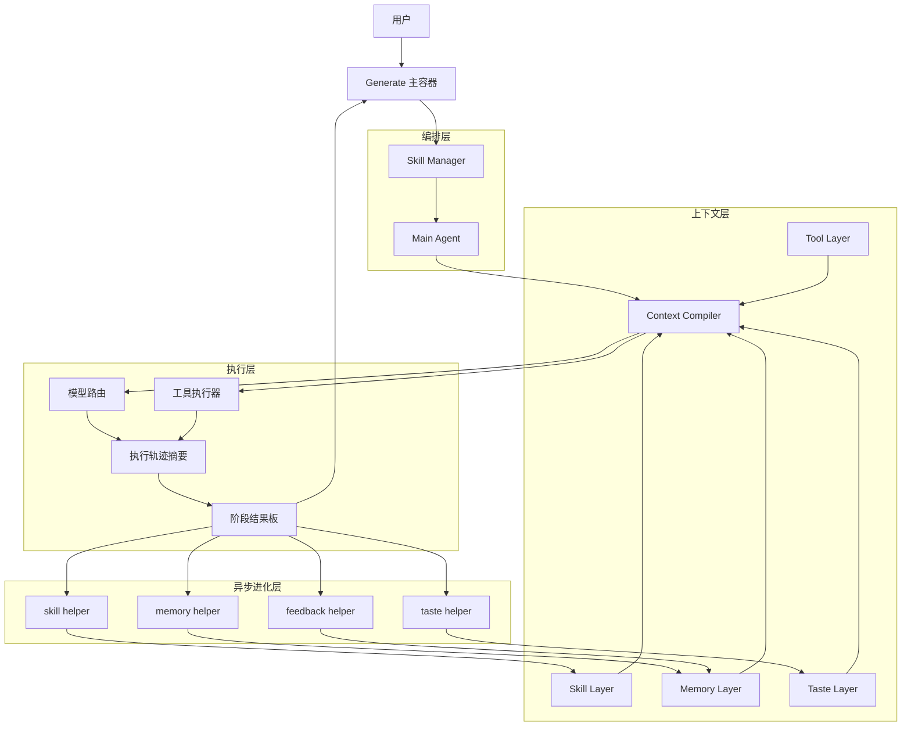

# Ribbi 架构图

> 状态：current research reference  
> 更新时间：2026-04-18  
> 目标：基于截图和访谈，把 Ribbi 的“可见产品结构”和“推断出的执行结构”分开画清楚，避免把系统愿景误画成当前前台 IA。

## 1. 先修正一个关键判断

我上一版图最大的问题是：

**把 Ribbi 画得太像“多个页面组成的平台”，但截图更像“一个主生成容器，外面挂少量入口”。**

从你给的图看，当前更接近下面这个事实：

1. 顶部主要是 `Skills / Generate / Pond`
2. 真正的主舞台是 `Generate`
3. `Generate` 里同时容纳：
   - skill 触发
   - 多角色消息
   - 工具执行轨迹
   - 阶段性结果板
   - 用户确认继续
   - `@` 直接调用工具

所以之前把“结果查看 / 复盘”画成并列前台主面，是不准确的。

## 2. 可见产品架构图

这张图只描述截图里能明确看见的前台结构：

固定判断：

1. `Generate` 不是普通聊天页，而是统一执行容器。
2. `Skills` 更像发现层，不是主生产舞台。
3. `Pond` 是并列入口，但更偏参考资产层，不是主执行层。

## 3. Generate 主容器结构图

这张图用来解释为什么截图里的体验不像“一个技能页 + 一个结果页”，而像“同一线程里的连续分阶段执行”。

固定判断：

1. 用户不是先进入一个固定 workflow，再看结果。
2. 而是在一个连续线程里逐段推进任务。
3. 每一段都可能暂停，让用户确认后继续下一段。

## 4. 推断执行架构图

这张图才是基于访谈推断出来的后台结构，不等于当前截图里的前台 IA。

固定判断：

1. `Skill Manager` 更像编排人格/编排层，而不是单独页面。
2. 工具轨迹是前台可见对象，但工具本体仍属于后台执行层。
3. 异步 helper 更可能在后台回写，而不是前台直接露出为多个主 Agent。

## 5. 哪些地方和我上一版不同

这次修正后的核心变化：

1. 不再把“结果页 / 复盘页”画成当前并列主舞台。
2. 明确 `Generate` 才是核心容器。
3. 明确 `Skill Manager` 是线程内对象，不一定是独立页面。
4. 明确阶段结果板和人工确认是当前产品结构的重要部分。
5. 明确 `@工具` 是 Generate 内的第二调用面。
6. 不再把 `Claude Agent` 写成固定主回答体，而是写成“当前回答 Agent 的一种可能实现”。
