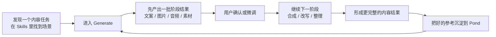
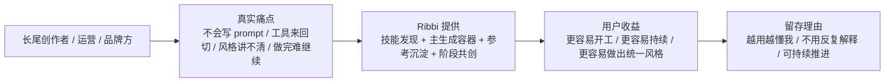
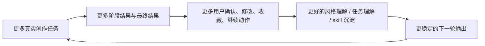
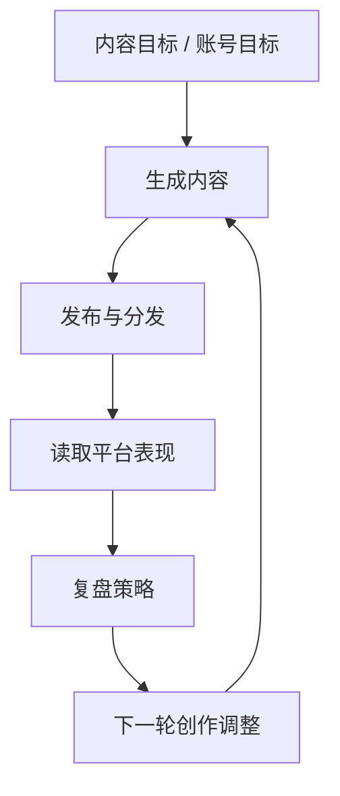

# Ribbi 业务图

> 状态：current research reference  
> 更新时间：2026-04-18  
> 目标：把 Ribbi 的业务价值链、当前可见业务面和长期闭环愿景分开画清楚，避免把“系统目标”误当成“当前前台结构”。

## 1. 先修正一个关键判断

我上一版业务图的问题，是把“发布-监控-复盘闭环”画得太像当前已经完整前台化的主路径。

但从你给的截图看，当前更准确的业务面是：

1. `Skills` 负责发现任务
2. `Generate` 负责把任务推进成一段段结果
3. `Pond` 负责沉淀参考和风格
4. 阶段性结果会在 Generate 中直接展示，并等待人工确认继续

也就是说：

**当前可见业务面更像“连续共创式生产面”，而不是“完整运营控制台”。**

## 2. 当前可见业务面

固定判断：

1. 当前前台卖的是“持续推进一个内容任务”。
2. 用户不是只拿到一次性结果，而是在同一线程里反复确认和推进。
3. `Pond` 在业务上承担的是参考资产沉淀，不是单纯附件仓库。

## 3. 用户价值链

固定判断：

1. 它优先解决的是“内容任务能否持续推进”。
2. 不是单纯比谁一张图出得更好。

## 4. 业务飞轮图

固定判断：

1. Ribbi 的飞轮不是“更多模型=更好产品”。
2. 而是“更多真实任务与反馈=更强的任务系统”。

## 5. 长期业务闭环愿景

这张图不是当前截图里完全可见的前台，而是访谈里表达的业务终局。

固定判断：

1. 这是 Ribbi 的业务北极星。
2. 但当前前台可见形态更像“Generate 内的阶段式共创”。
3. 所以后续对照时，不能把终局愿景直接画成当前 IA。

## 6. 对 Lime 的业务启发

Lime 真正该学的业务点是：

1. 让用户感觉自己在持续推进一个内容任务
2. 把阶段结果直接放在主执行面里
3. 把参考沉淀做成业务飞轮的一部分
4. 把长期发布/复盘闭环作为系统目标，但不要过早当前台并列页面
