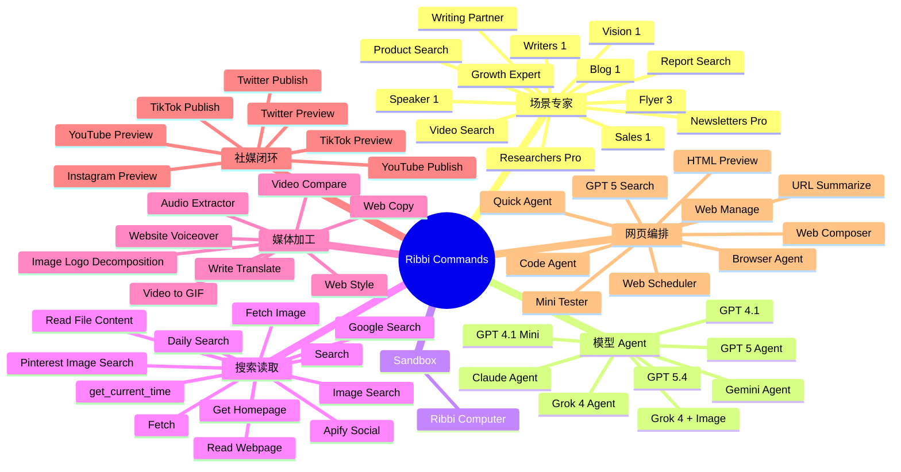
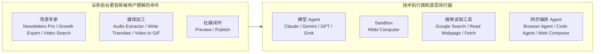

# Ribbi 命令清单

> 状态：current research reference  
> 更新时间：2026-04-18  
> 目标：把当前已观察到的 Ribbi 命令、agent、tool 标签整理成唯一标准目录，后续所有架构分析、流程图与 Lime 对照都默认引用本文件，不再在其他文档里重复维护散落版本。

## 1. 范围与判定规则

这份清单整合两类观察来源：

1. 你给的 Ribbi 长列表截图
2. 之前几张 Ribbi Generate 截图里已明确可见的对象，例如 `@Claude Agent`、`@Ribbi Computer`、`@get_current_time`

固定规则：

1. 这里整理的是**当前已观察到的前台命令标签与执行标签**，不是官方 API 文档。
2. 名称以截图可见标签为准，不替 Ribbi 发明新名字。
3. 少数对象可能同时出现在 `@` 面板和执行轨迹里，本文件只做“统一命名”，不强行假设其唯一入口。
4. 受截图分辨率限制，无法稳定辨识的条目标注为 `低置信`，不会混入正式高置信总表。
5. 对 Lime 来说，关键不是抄名字，而是认清这些名字分别属于：
   - 业务前台命令
   - 技术执行器
   - 底层工具
   - 发布闭环能力

## 2. 总体判断

从现有截图反推，Ribbi 的命令系统不是“模型切换器”也不是“工具超市”，而是一个混合注册表：

1. 场景专家型命令
2. 模型型 agent 槽位
3. sandbox / computer use 执行器
4. 搜索 / 抓取 / 读取 primitive tools
5. 图文音视频加工工具
6. 社媒 preview / publish 工具
7. 浏览器 / 网页 / 编排型 agent

一句话：

**Ribbi 的 `@` 面板更像内容创作 Agent OS 的统一调用注册表，而不是普通工具栏。**

## 3. 命令心智图

这张图保留给“先看全貌”的阅读方式，方便快速理解 Ribbi 的命令面到底覆盖了哪些层。

## 4. 命令统计总览

当前已观察到的标签总数：

1. 高置信：`59`
2. 低置信待补：`8`
3. 合计观察到：`67`

高置信分布：

| 类别 | 数量 | 业务归属 | 说明 |
| --- | ---: | --- | --- |
| 场景专家 / 业务入口 | 13 | 业务前台 | 面向具体内容任务的“做什么”入口 |
| 模型 Agent 槽位 | 8 | 技术执行面 | 显式点名某个模型或 agent profile |
| Sandbox 执行器 | 1 | 底层执行器 | computer use / 环境操作 |
| 搜索 / 抓取 / 读取工具 | 12 | 执行中台 | 搜索、读取、抓取、时间与外部数据 |
| 媒体加工工具 | 8 | 跨层 | 创作中间加工，既贴业务又偏工具 |
| 社媒 Preview / Publish | 7 | 业务闭环 | 预览、发布、渠道落地 |
| 浏览器 / 网页 / 编排 Agent | 10 | 跨层 | 浏览器、代码、网页编排、任务调度 |

## 5. 业务面与技术面的命令分层图

这个分层很重要，因为它解释了两件事：

1. 用户前台看到的是“做什么”。
2. 真正让系统成立的是后面的模型、sandbox、搜索、浏览器与发布执行器。

## 6. 高置信命令总表

以下是当前可作为事实源使用的高置信命令目录。

### 6.1 场景专家 / 业务入口

| 命令 | 业务归属 | 技术形态 | 作用理解 |
| --- | --- | --- | --- |
| `@Newsletters Pro` | 业务前台 | Expert profile | Newsletter / 简报类内容任务入口 |
| `@Report Search` | 业务前台 | Expert profile | 报告搜索与整理场景 |
| `@Growth Expert` | 业务前台 | Expert profile | 增长策略或增长内容场景 |
| `@Product Search` | 业务前台 | Expert profile | 产品研究 / 产品素材搜索场景 |
| `@Researchers Pro` | 业务前台 | Expert profile | 深度研究型内容场景 |
| `@Sales 1` | 业务前台 | Expert profile | 销售导向内容场景 |
| `@Blog 1` | 业务前台 | Expert profile | Blog 创作场景 |
| `@Writing Partner` | 业务前台 | Expert profile | 文案共创场景 |
| `@Video Search` | 业务前台 | Expert profile | 视频案例 / 视频素材搜索场景 |
| `@Flyer 3` | 业务前台 | Expert profile | Flyer / 宣传单内容场景 |
| `@Writers 1` | 业务前台 | Expert profile | 写作型场景预设 |
| `@Speaker 1` | 业务前台 | Expert profile | 演讲 / 口播输出场景 |
| `@Vision 1` | 业务前台 | Expert profile | 视觉创意型场景 |

固定判断：

1. 这批不是底层工具，而是结果导向的场景入口。
2. `Pro`、`1`、`3` 更像 preset / profile 标识，不是用户真正要理解的核心概念。

### 6.2 模型 Agent 槽位

| 命令 | 业务归属 | 技术形态 | 作用理解 |
| --- | --- | --- | --- |
| `@Claude Agent` | 技术执行面 | Model-backed agent | 显式点名 Claude 风格的 agent 槽位 |
| `@Gemini Agent` | 技术执行面 | Model-backed agent | 显式点名 Gemini agent 槽位 |
| `@GPT 5 Agent` | 技术执行面 | Model-backed agent | GPT 5 agent profile |
| `@GPT 5.4` | 技术执行面 | Model slot | 直接点名 GPT 5.4 模型版本 |
| `@GPT 4.1` | 技术执行面 | Model slot | 直接点名 GPT 4.1 |
| `@GPT 4.1 Mini` | 技术执行面 | Model slot | 轻量版 GPT 4.1 槽位 |
| `@Grok 4 Agent` | 技术执行面 | Model-backed agent | Grok 4 agent profile |
| `@Grok 4 + Image` | 技术执行面 | Multimodal model slot | 带图像能力的 Grok 4 槽位 |

固定判断：

1. 这里混合了“agent profile 名”和“模型版本名”两种表达。
2. 它们并不代表前台存在多个平级主线程，更像同一 Generate 线程可调用的回答槽位。

### 6.3 Sandbox 执行器

| 命令 | 业务归属 | 技术形态 | 作用理解 |
| --- | --- | --- | --- |
| `@Ribbi Computer` | 底层执行器 | Computer-use sandbox | 对桌面、浏览器、环境进行长动作链操作 |

固定判断：

1. 这是高能力执行器，不是普通工具按钮。
2. 它更接近“会动手的执行面”而不是“会解释的模型”。

### 6.4 搜索 / 抓取 / 读取工具

| 命令 | 业务归属 | 技术形态 | 作用理解 |
| --- | --- | --- | --- |
| `@get_current_time` | 执行中台 | Primitive tool | 获取时间上下文 |
| `Fetch` | 执行中台 | Primitive tool | 抓取外部资源或网页内容 |
| `Apify Social` | 执行中台 | External connector | 调用社媒采集能力 |
| `@Read Webpage` | 执行中台 | Read tool | 读取网页正文 |
| `@Pinterest Image Search` | 执行中台 | Search tool | Pinterest 图像搜索 |
| `@Google Search` | 执行中台 | Search tool | Google 搜索 |
| `@Search` | 执行中台 | Search tool | 通用搜索入口 |
| `@Fetch Image` | 执行中台 | Fetch tool | 抓取图像资源 |
| `@Daily Search` | 执行中台 | Search tool | 偏日更 / 趋势查询搜索 |
| `@Get Homepage` | 执行中台 | Read tool | 获取站点首页内容 |
| `@Read File Content` | 执行中台 | Read tool | 读取文件内容 |
| `@Image Search` | 执行中台 | Search tool | 通用图片搜索 |

固定判断：

1. 这批能力说明 Ribbi 已经把外部信息采集压进统一执行面。
2. 这是它能做“灵感 -> 生成 -> 发布 -> 复盘”闭环的必要基础设施。

### 6.5 媒体加工工具

| 命令 | 业务归属 | 技术形态 | 作用理解 |
| --- | --- | --- | --- |
| `@Audio Extractor` | 跨层 | Media tool | 提取音频 |
| `@Website Voiceover` | 跨层 | Media tool | 为网页内容生成配音 / 旁白 |
| `@Image Logo Decomposition` | 跨层 | Media tool | 拆解图片或 logo 结构 |
| `@Write Translate` | 跨层 | Transform tool | 写作与翻译转换 |
| `@Video to GIF` | 跨层 | Media tool | 视频转 GIF |
| `@Video Compare` | 跨层 | Analysis tool | 对比视频内容 |
| `@Web Copy` | 跨层 | Transform tool | 提取或改写网页文案 |
| `@Web Style` | 跨层 | Style tool | 提炼或迁移网页风格 |

固定判断：

1. 这一层不是纯模型输出，而是创作过程中的中间加工工具。
2. 它们和模型 agent 混在同一面板里，说明 Ribbi 的编排核心是“统一调用面”。

### 6.6 社媒 Preview / Publish

| 命令 | 业务归属 | 技术形态 | 作用理解 |
| --- | --- | --- | --- |
| `@Instagram Preview` | 业务闭环 | Preview tool | Instagram 渠道预览 |
| `@TikTok Preview` | 业务闭环 | Preview tool | TikTok 渠道预览 |
| `@Twitter Preview` | 业务闭环 | Preview tool | Twitter / X 渠道预览 |
| `@YouTube Preview` | 业务闭环 | Preview tool | YouTube 渠道预览 |
| `@TikTok Publish` | 业务闭环 | Publish tool | 发布到 TikTok |
| `@Twitter Publish` | 业务闭环 | Publish tool | 发布到 Twitter / X |
| `@YouTube Publish` | 业务闭环 | Publish tool | 发布到 YouTube |

固定判断：

1. Ribbi 已经把“生成之后的渠道预演”和“正式发布”做成显式命令。
2. 这说明它不是单点生成器，而是开始进入运营闭环。

### 6.7 浏览器 / 网页 / 编排 Agent

| 命令 | 业务归属 | 技术形态 | 作用理解 |
| --- | --- | --- | --- |
| `@Mini Tester` | 跨层 | Task agent | 小型测试或验证 agent |
| `@Web Scheduler` | 跨层 | Task agent | 网页任务编排 / 调度 |
| `@HTML Preview` | 跨层 | Preview agent | HTML 结果预览 |
| `@Web Manage` | 跨层 | Task agent | 网页管理类动作 |
| `@Browser Agent` | 技术执行面 | Browser agent | 浏览器自动化执行器 |
| `@Code Agent` | 技术执行面 | Code agent | 代码处理或代码生成执行器 |
| `@URL Summarize` | 跨层 | Summarize tool | URL 摘要化 |
| `@Web Composer` | 跨层 | Composition agent | 网页编排与结果组合 |
| `@GPT 5 Search` | 技术执行面 | Search-capable agent | 带搜索能力的 GPT 5 槽位 |
| `@Quick Agent` | 技术执行面 | Fast agent profile | 快速响应 agent |

固定判断：

1. 这一组不再是单一 primitive tool，而是面向任务的编排执行体。
2. Ribbi 不只集成模型，还集成浏览器 agent、代码 agent 和网页编排 agent。

## 7. 低置信待补表

以下条目在截图里能看出“存在”，但当前无法稳定辨识到足够可当事实源的程度。  
它们保留在这张表里，是为了提醒后续拿到更高清截图时优先回填，而不是让这些名字提前进入主线规划。

| 命令 | 概率分类 | 置信度 | 备注 |
| --- | --- | --- | --- |
| `@PM Expert` | 场景专家 / 业务入口 | 低置信 | 位于 `@Product Search` 之后、`@Researchers Pro` 之前 |
| `@Music TTS` | 媒体加工工具 | 低置信 | 位于 `@Vision 1` 之后、`@Audio Extractor` 之前 |
| `@Music Lyrics` | 媒体加工工具 | 低置信 | 位于 `@Website Voiceover` 之后 |
| `@Music GPT` | 模型 Agent 或音乐工具 | 低置信 | 位于 `@Music Lyrics` 之后、`@GPT 5.4` 之前 |
| `@Instagram Research` | 搜索 / 研究工具 | 低置信 | 位于 `@Image Logo Decomposition` 之后、`@Image Search` 之前 |
| `@Browser Tab` | 浏览器 / 网页工具 | 低置信 | 位于 `@YouTube Publish` 之后、`@Mini Tester` 之前 |
| `@Web Replay` | 浏览器 / 网页工具 | 低置信 | 位于 `@HTML Preview` 之后、`@Web Manage` 之前 |
| `@Search Agent` | 搜索型 agent | 低置信 | 位于 `@Web Composer` 之后、`@GPT 5 Search` 之前 |

## 8. 从命令表反推 Ribbi 的业务与技术意图

这张命令总表最重要的启发不是“Ribbi 有 67 个名字”，而是它把三层东西压成了一个前台入口：

1. 业务任务入口
   - 例如 `@Newsletters Pro`、`@Growth Expert`、`@Video Search`
2. 创作与运营中间层
   - 例如 `@Audio Extractor`、`@Write Translate`、`@Instagram Preview`、`@Twitter Publish`
3. 技术执行层
   - 例如 `@Claude Agent`、`@Ribbi Computer`、`@Google Search`、`@Browser Agent`

也就是说：

**Ribbi 并没有把“业务命令”和“技术命令”拆成两个产品，而是用一个 Generate 容器承接了全部调用。**

## 9. 对 Lime 的直接要求

Lime 后续对照 Ribbi 时，默认遵守这五条：

1. 不要只抄命令名，要先判断命令属于哪一层。
2. 不要把后台执行器直接翻成前台并列页面。
3. 要区分：
   - 用户看到的命令标签
   - 后台真实绑定的 skill / tool / agent / sandbox
4. 要学它把 `生成 + 搜索 + 加工 + preview + publish + browser/code` 压到同一执行面里的方式。
5. 不要把“命令很多”误读成“前台应该很复杂”。

一句话：

**Ribbi 真正值得学的是“统一调用面 + 单线程编排”，不是“命令超市”。**
