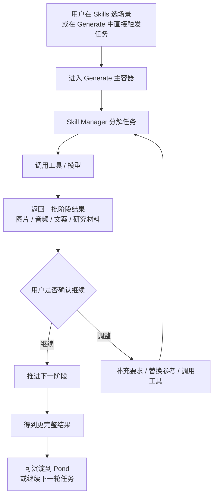
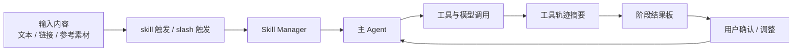
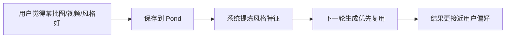
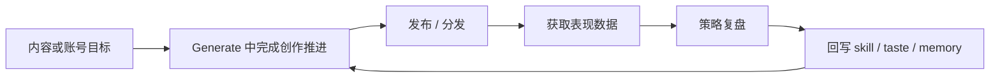

# Ribbi 流程图

> 状态：current research reference  
> 更新时间：2026-04-18  
> 目标：把截图里更可信的前台流程和访谈里更长期的系统流程分开画，避免“把愿景当现状”。

## 1. 当前可见的主流程

固定判断：

1. 当前主流程是阶段式共创，不是一次跑完的黑盒流水线。
2. Generate 里存在明确的人工确认节点。
3. 阶段结果板本身是产品对象，不只是附件列表。

## 2. Generate 内部调用流程

固定判断：

1. `Skill Manager` 在产品上更像线程里的编排对象。
2. 工具轨迹不是最终结果，而是阶段证据。
3. 结果板和确认动作比“单次回复文本”更重要。

## 3. Pond 回流流程

固定判断：

1. Pond 不是静态收藏夹。
2. 它在流程上承担“把喜欢的东西变成下一轮偏好输入”。

## 4. 长期闭环流程

这张图表达的是 Ribbi 访谈中的长期系统流程，不代表截图里当前每个页面都已经显式露出。

固定判断：

1. 这条链是系统目标。
2. 当前前台更像先把“生成中的多阶段推进”做强。
