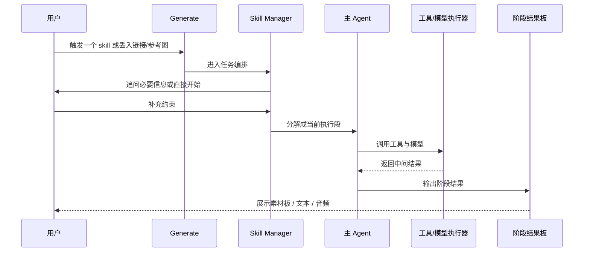
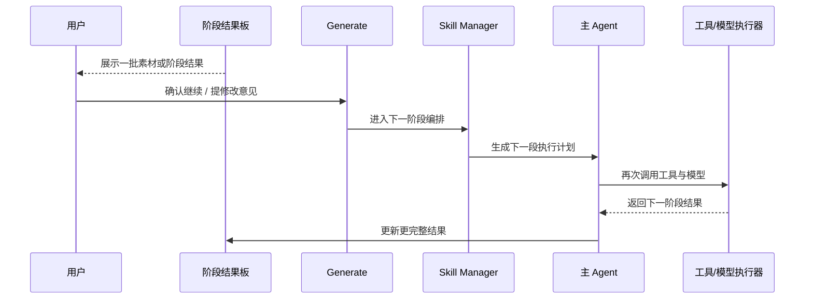
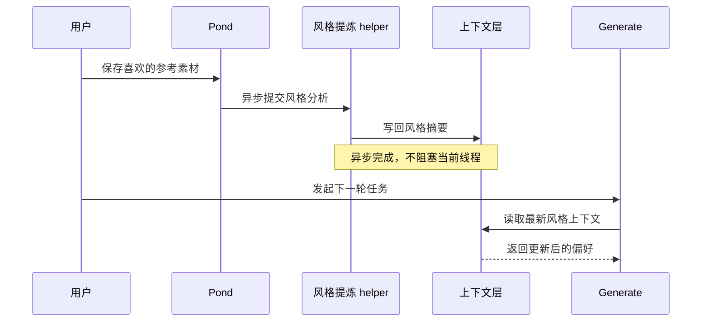
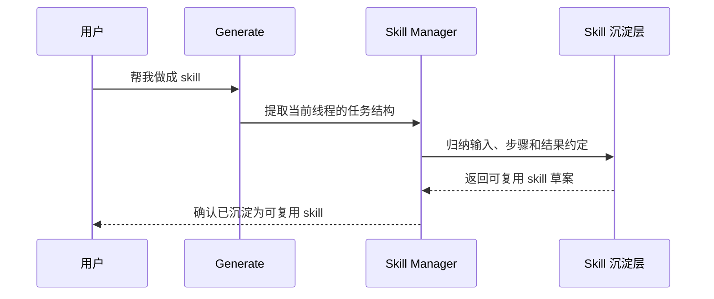

# Ribbi 时序图

> 状态：current research reference  
> 更新时间：2026-04-18  
> 目标：用更贴近截图的时序图解释 Ribbi 在一个线程里如何分角色、分阶段推进任务。

## 1. 一次 skill 启动的时序

## 2. 一次“阶段确认再继续”的时序

这条时序是截图里最关键但我上一版没有画清楚的点。

固定判断：

1. Ribbi 当前体验明显有“阶段门”。
2. 用户不是只看最终结果，而是在每一阶段参与继续/调整。

## 3. 一次保存参考到 Pond 的时序

## 4. 一次“帮我做成 skill”的时序

这条时序来自截图里显式出现的“帮我做成 skill”。

固定判断：

1. Ribbi 的 skill 不只是预置目录。
2. 它还把对话中的成功路径继续沉淀成 skill。
