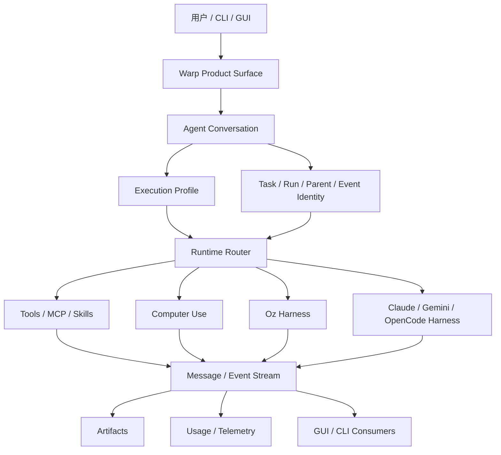

# Warp 架构拆解

> 状态：current research reference  
> 更新时间：2026-04-29  
> 目标：把 Warp 开源客户端里对 Lime 有价值的系统骨架拆成稳定层次，避免只看“终端 + Agent”表象就误判它的借鉴价值。

## 1. 先给结论

Warp 的本质不是“带 AI 的终端”，而是：

**一个以 terminal/session 为执行 substrate、以 Agent conversation 为主线、以 harness/profile/artifact 为治理边界的 Agentic Runtime。**

可以把它稳定拆成八层：

```text
产品入口
  -> Agent / Conversation 主线程
  -> Task / Run 身份层
  -> Execution Profile 策略层
  -> Harness 适配层
  -> Skill / Tool / MCP / Computer Use 能力层
  -> Attachment / Artifact 多模态上下文层
  -> Event / Usage / Evidence 消费层
  -> Cloud / Local / CLI 多入口同步层
```

这八层才是 Lime 应该学习的部分。

## 2. Product Surface Layer

Warp 的前台以 terminal 为出生点，但开源 README 已经把产品定位改成 agentic development environment。

前台对象包括：

1. Terminal / pane / tab / workspace
2. Agent mode pane
3. Cloud agent / local agent
4. CLI agent 接入
5. Artifact 展示
6. Agent management 与 profile 设置

对 Lime 的启发不是“也把终端当主页”，而是：

1. 前台可以很轻，但后台必须有完整运行身份。
2. 用户看到的是一个连续任务面，而不是 provider、tool、model、artifact 的散列表。
3. GUI、CLI、cloud run 都可以消费同一条运行事实。

## 3. Agent / Conversation Layer

Warp 的 `AIConversation` 不是简单 chat state。它同时承载：

1. local conversation id
2. server conversation token
3. task/run id
4. parent agent id
5. child agent / remote child 标记
6. event sequence
7. artifacts
8. usage metadata
9. hidden/reverted/action state

这说明 Warp 的 conversation 是运行时主对象。

对 Lime 的借鉴：

1. `thread` 不能只是 UI 消息列表。
2. `turn` 不能只是一次模型请求。
3. 多模态调用必须能回挂到 thread/turn/task/artifact，而不是只存在于某个 React state 或 task json。

## 4. Task / Run Identity Layer

Warp 明确区分：

1. conversation
2. server conversation token
3. task/run id
4. parent/child task
5. event sequence
6. message inbox

CLI 侧也提供 task list / get / conversation / message watch / send / read / delivered 等命令。

对 Lime 的借鉴：

1. 长任务需要 run identity，不只是 session id。
2. 子任务、异步 worker、云端 scene run、本地工具执行都需要能用同一组关联键串起来。
3. 多模态管理必须先解决“这张图/这段音频/这次浏览器截图属于哪个 turn/run”的问题。

## 5. Execution Profile Layer

Warp 的 `AIExecutionProfile` 是一个策略包，而不是单一模型配置。

它包括：

1. `base_model`
2. `coding_model`
3. `cli_agent_model`
4. `computer_use_model`
5. 文件读取权限
6. 命令执行权限
7. PTY 写入权限
8. MCP 权限
9. computer use 权限
10. web search 开关
11. command / directory / MCP allowlist 与 denylist

对 Lime 的借鉴：

1. 多模态模型策略应该和权限策略放在同一个 runtime profile 里。
2. `图片生成用哪个模型`、`浏览器能否自动操作`、`PDF 能否读本地文件` 不应分散在多个页面或 skill 内部。
3. 自动路由必须受 profile 约束，不能绕过用户显式锁定和租户策略。

## 6. Harness Adapter Layer

Warp 的 `Harness` 把 `oz / claude / opencode / gemini` 收成统一枚举。

第三方 harness 共同遵守：

1. validate CLI 是否可用
2. prepare environment config
3. build runner
4. start
5. save conversation
6. exit
7. resume payload
8. 上传 block snapshot 或 transcript

这说明 harness 是一个受控适配器，不是“让模型自己写 Bash”。

对 Lime 的借鉴：

1. `local_cli` 可以存在，但必须是 typed binding。
2. 外部工具接入需要 adapter contract，包括输入、环境、退出、保存、恢复、错误映射。
3. current 首发入口仍应优先是结构化 binding，不是自由 shell。

## 7. Skill / Tool / MCP / Computer Use Layer

Warp 的能力层不是单一 tool list：

1. Skill provider 覆盖多生态目录
2. MCP 有 manager、templatable manager、file watcher
3. Computer Use 是独立 crate，包含 typed mouse/key/text/wheel actions 和 screenshot result
4. Tool call 与 subagent call 都进入 multi-agent API message
5. Web search / fetch / file / code review / document tools 都能作为 conversation output message 呈现

对 Lime 的借鉴：

1. `@` 能力入口应该是 typed capability registry，而不是前端字符串分支。
2. Browser Assist 应归为 high-risk computer/browser use，不是普通搜索。
3. ServiceSkill、MCP、本地工具、云端 API 都应该进入同一套 descriptor 与 timeline。

## 8. Attachment / Artifact Layer

Warp 明确区分输入附件与输出产物：

1. `attachments` 用于云 agent query 输入
2. `referenced_attachments` 用于恢复 runtime skill / attachment
3. `Artifact` 用于输出：Plan、PullRequest、Screenshot、File
4. 文件 artifact upload 会绑定 run id / conversation id / `OZ_RUN_ID`
5. screenshot artifact 有单独 lightbox 展示

对 Lime 的借鉴：

1. `image_task`、`voice_task`、`pdf_extract`、`browser_snapshot` 不应只落成通用 file。
2. 输入材料与输出产物必须分开建模。
3. 产物必须能按 run/turn/content_id 恢复，不能只靠文件路径。

## 9. Cloud / Local / CLI 多入口层

Warp 允许：

1. GUI 本地运行
2. cloud agent run
3. CLI `agent run`
4. CLI `agent run-cloud`
5. CLI `artifact upload/get/download`
6. CLI `task message watch/send/list/read`
7. 第三方 CLI harness

对 Lime 的借鉴：

1. Lime 桌面、LimeCore Gateway、Scene、ServiceSkill、CLI / MCP 可以共用 contract。
2. 但共用 contract 不等于共用执行地点。
3. LimeCore 应优先下发目录、策略、模型与审计；Lime 仍负责本地优先执行。

## 10. 总体架构图



## 11. 对 Lime 的直接结论

Lime 应该把 Warp 拆出来的八层映射成自己的八层：

1. `生成 / 工作区` 主执行面
2. `Agent thread / turn` 主线程
3. `task / run / content_id` 身份层
4. `ModalityExecutionProfile` 策略层
5. `binding / executor / harness` 适配层
6. `skills / tools / ServiceSkill / Browser / MCP` 能力层
7. `modality input / artifact graph / viewer` 上下文与产物层
8. `evidence / replay / review / LimeCore audit` 消费层

一句话：

**Warp 证明了 Agent 产品真正稳定的不是聊天 UI，而是运行身份、策略、能力、产物和证据五件事都能对齐同一条主线。**
