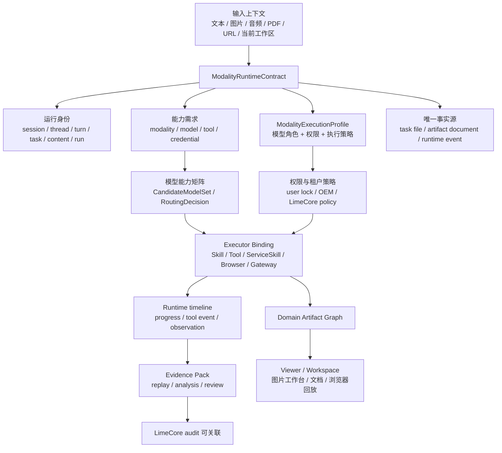
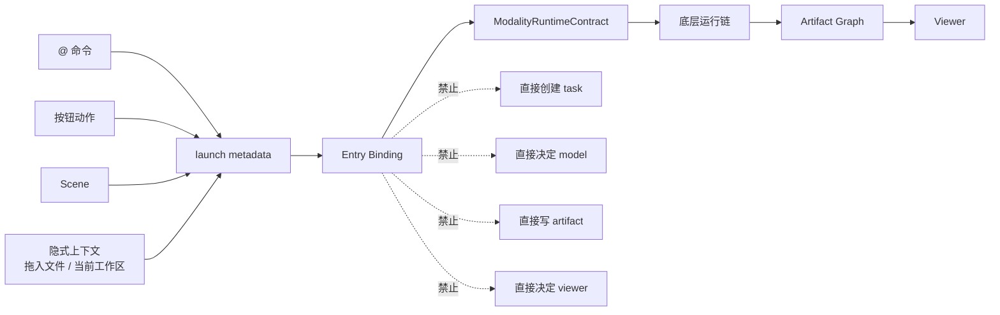
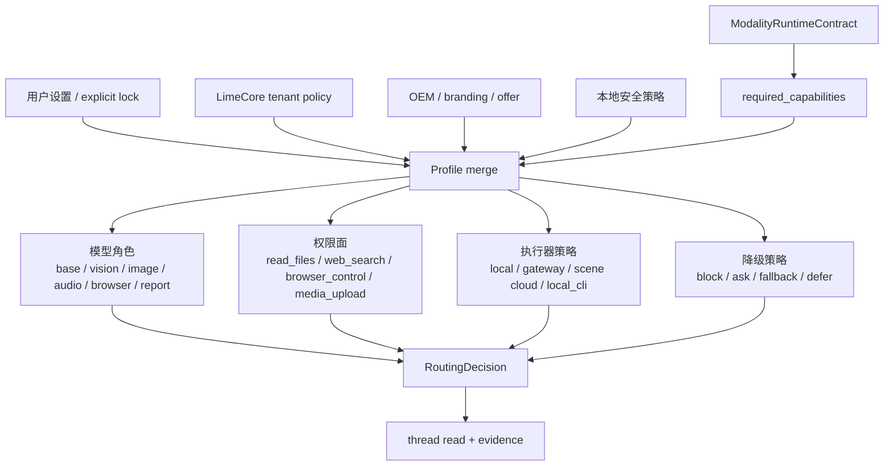
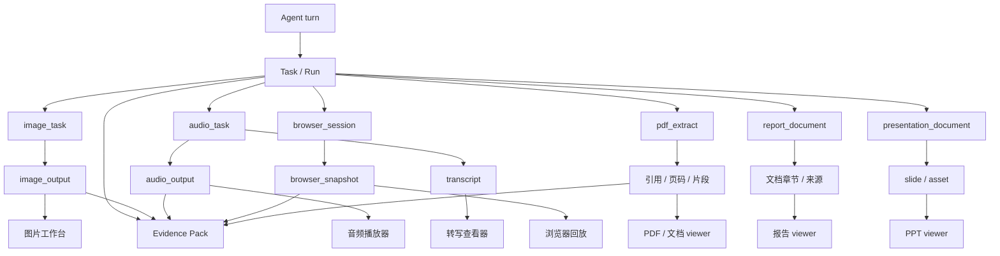
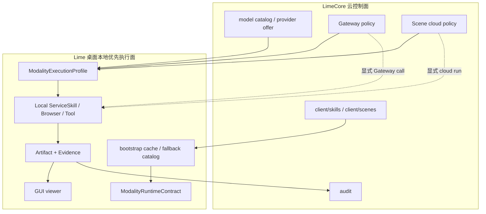

# Warp 参考架构图

> 状态：current research reference  
> 更新时间：2026-04-29  
> 目标：把 Warp 与 ClaudeCode 对 Lime 的不同参考层画清楚，并把 Lime 多模态底层运行合同、artifact、profile、LimeCore 协作边界可视化。

## 1. 图谱使用边界

这些图不是要把 Lime 改成 Warp，也不是要把 `@` 命令画成底层架构。

固定读法：

1. ClaudeCode 是 Agent 内核主参考。
2. Warp 是多执行器、多产物、多运行地点的治理参考。
3. Lime 自己决定 GUI、viewer、本地优先执行和 LimeCore 云边界。
4. `@` 命令、按钮、Scene 都只在最上层绑定底层 contract。

## 2. 总体参考分层图

```mermaid
flowchart TB
    subgraph RefA["ClaudeCode 主参考层"]
        CC1["Agent loop"]
        CC2["ToolUseContext"]
        CC3["Permission rules"]
        CC4["Slash command / SkillTool"]
        CC5["AgentTool / Subagent task"]
        CC6["Session / transcript"]
    end

    subgraph RefB["Warp 补充参考层"]
        W1["Run / Task identity"]
        W2["Execution profile"]
        W3["Harness adapter"]
        W4["Attachment / Artifact"]
        W5["Computer use"]
        W6["Cloud / Local split"]
    end

    subgraph LimeRuntime["Lime 底层运行层"]
        R1["ModalityRuntimeContract"]
        R2["Model capability matrix"]
        R3["ModalityExecutionProfile"]
        R4["Executor binding"]
        R5["Domain artifact graph"]
        R6["Evidence / replay / review"]
    end

    subgraph LimeProduct["Lime 产品层"]
        P1["@ 命令"]
        P2["按钮动作"]
        P3["Scene"]
        P4["聊天轻卡"]
        P5["右侧 viewer / workspace"]
    end

    subgraph LimeCore["LimeCore 云控制面"]
        C1["client/skills"]
        C2["client/scenes"]
        C3["model catalog / provider offer"]
        C4["Gateway / Scene policy"]
        C5["audit"]
    end

    CC1 --> R1
    CC2 --> R4
    CC3 --> R3
    CC4 --> P1
    CC5 --> R6
    CC6 --> R6

    W1 --> R1
    W2 --> R3
    W3 --> R4
    W4 --> R5
    W5 --> R4
    W6 --> C4

    C1 --> R1
    C2 --> R1
    C3 --> R2
    C4 --> R3
    C5 --> R6

    P1 --> R1
    P2 --> R1
    P3 --> R1
    R5 --> P4
    R5 --> P5
```

固定判断：

1. Lime 的底层运行层在 ClaudeCode 与 Warp 之间做融合。
2. 产品层不直接写事实源，只绑定底层 contract。
3. LimeCore 是云控制面，不是默认执行面。

## 3. Lime 多模态底层目标架构

这张图给实现的硬约束：

1. `ModalityRuntimeContract` 是底层主语，不是 `@` 命令。
2. 模型路由、权限、执行器必须在写 artifact 前完成。
3. viewer 只能读 artifact graph 或 runtime truth source。
4. evidence 不从 viewer 反推，而从 runtime timeline 导出。

## 4. 上层入口绑定图

固定判断：

1. 上层入口只负责用户意图和 metadata。
2. 上层入口不直接拥有 task、model、artifact、viewer。
3. 后续增加新入口时，先找能复用的 contract；没有 contract 先补底层。

## 5. Execution Profile 架构图

这张图回答两个问题：

1. 模型不是单独决定的；它受 capability、用户锁定、租户策略、权限共同约束。
2. 权限不是执行器内部临时问一句；它必须进入 profile 决策和 evidence。

## 6. Artifact Graph 架构图

固定判断：

1. `generic_file` 只能兜底，不能作为多模态默认结果。
2. 同一个 turn 可以产生多个 domain artifact，但必须共享关联键。
3. viewer 映射由 artifact kind 决定，不由消息文本猜。

## 7. LimeCore 协作边界图

边界结论：

1. LimeCore 下发目录、策略和模型 offer。
2. Lime 执行本地 ServiceSkill、Browser Assist、artifact 与 viewer 主链。
3. 只有显式 Gateway call 或 Scene cloud run 才进入云执行面。
