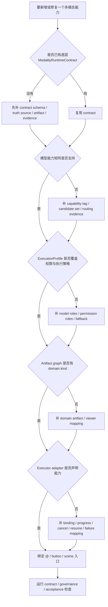
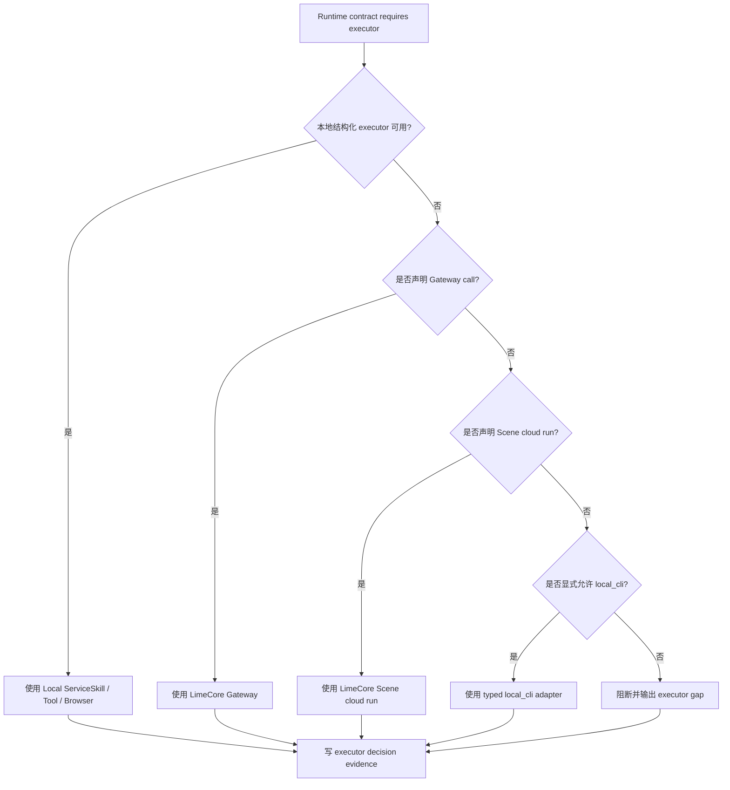
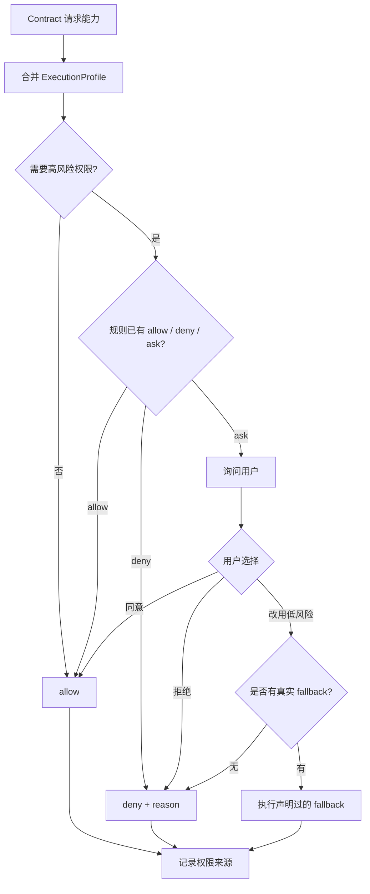
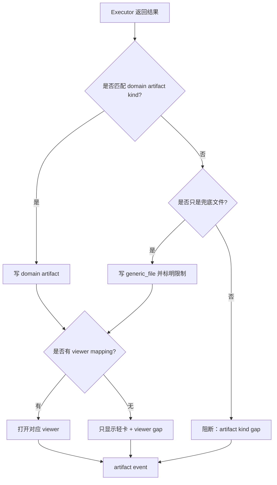
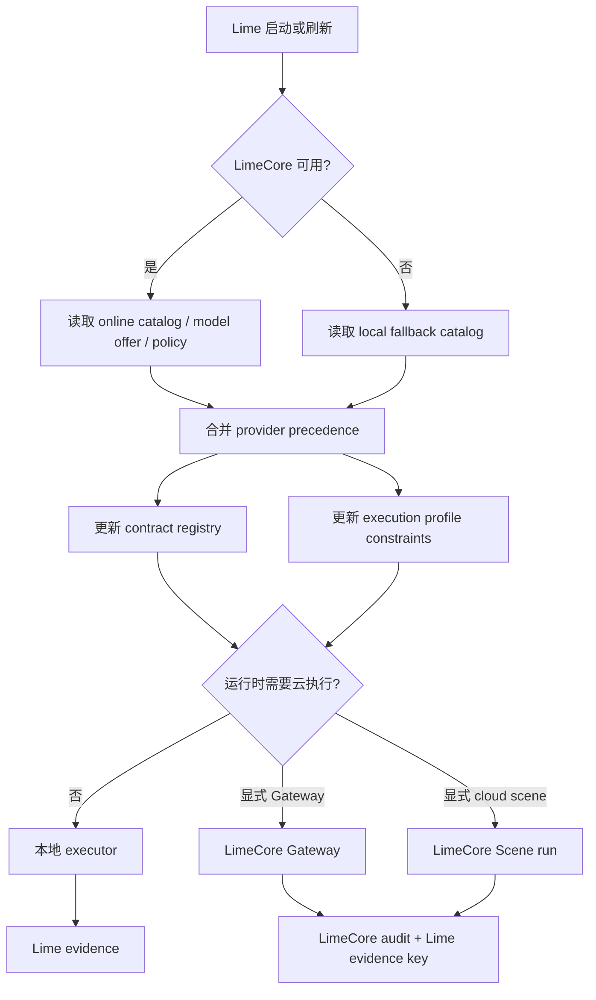
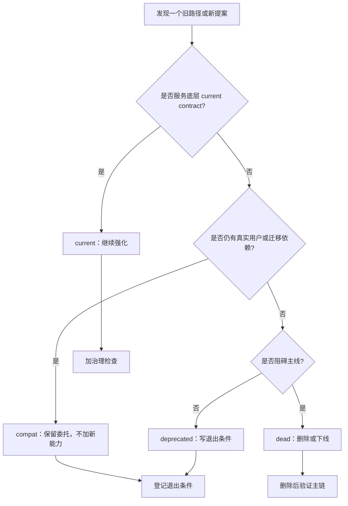

# Warp 对照流程图

> 状态：current research reference  
> 更新时间：2026-04-29  
> 目标：把 Lime 多模态演进中的关键决策流程画清楚，尤其防止从 `@` 命令、viewer 或 CLI 旁路倒推底层事实源。

## 1. 新增多模态能力决策流程

固定判断：

1. `@` 命令绑定在最后。
2. 没有 contract 时，不允许用入口代码临时绕过。
3. artifact、viewer、evidence 都必须在入口绑定前有定义。

## 2. Executor 选择流程

固定判断：

1. 本地结构化 executor 优先。
2. Gateway / cloud scene 需要 contract 显式声明。
3. CLI 只能是 typed adapter，不能成为默认 current 捷径。

## 3. 权限与降级流程

禁止：

1. `browser_control` 被拒绝后伪装成 WebSearch 完成。
2. `media_upload` 被拒绝后偷偷走本地临时文件上传。
3. 无真实 fallback 时输出“已完成”。

## 4. Artifact / Viewer 选择流程

固定判断：

1. 多模态主结果应尽量是 domain artifact。
2. `generic_file` 不是失败，但不能伪装成完整体验。
3. 没有 viewer mapping 时，要暴露 gap，不能让聊天消息假装打开成功。

## 5. LimeCore 协作流程

固定判断：

1. online catalog 命中时，客户端不再维护第二份业务定义。
2. fallback 只做韧性，不做产品事实源扩张。
3. audit 与 evidence 必须通过关联键互相解释。

## 6. current / compat / deprecated / dead 收敛流程

固定判断：

1. compat 不是续命许可。
2. deprecated 必须有退出条件。
3. dead 路径如果阻塞 current contract，应优先清掉。
