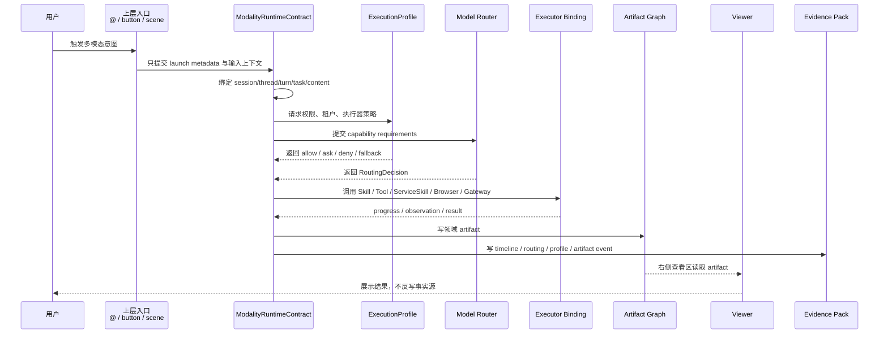
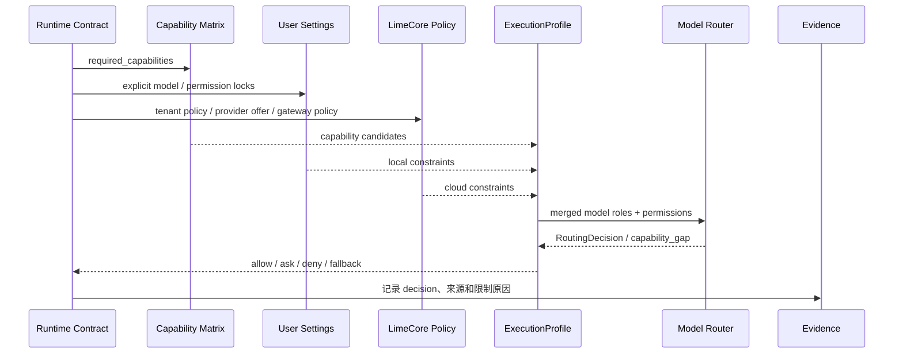
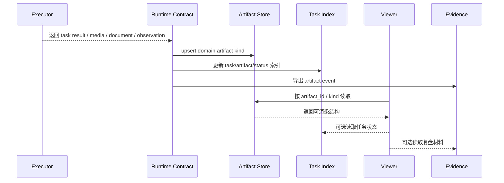
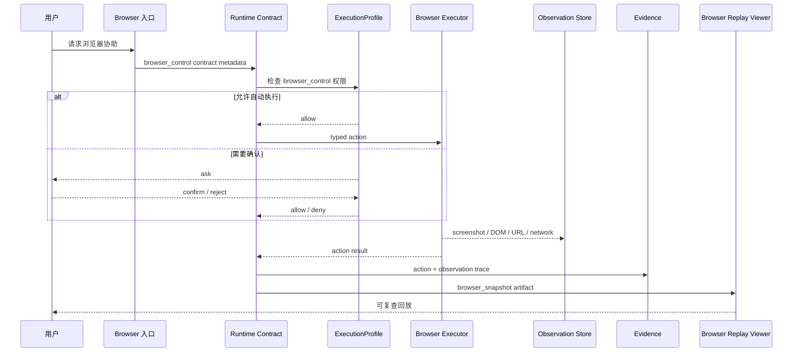
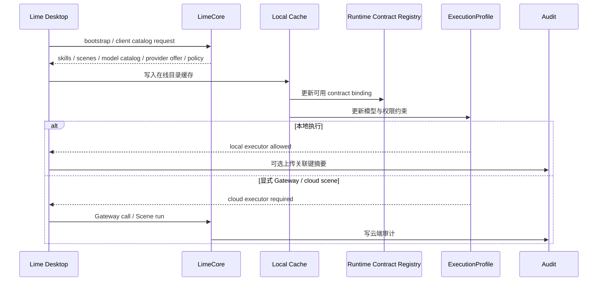
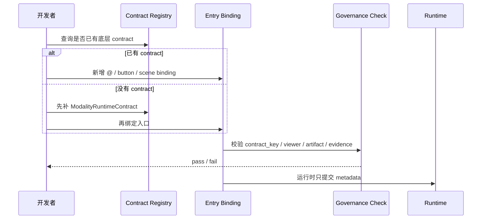

# Warp 对照时序图

> 状态：current research reference  
> 更新时间：2026-04-29  
> 目标：用时序图说明 Lime 采用 ClaudeCode 主参考、Warp 治理补充后，一次多模态任务应如何从上层入口进入底层 contract、路由、执行、artifact、evidence 和 LimeCore audit。

## 1. 底层 contract 先行的标准时序

固定判断：

1. Entry 不创建 task，不写 artifact，不决定 viewer。
2. Runtime 先绑定身份，再做路由和权限。
3. Evidence 由 runtime timeline 导出，不由 viewer 回推。

## 2. 模型路由与权限合并时序

验收重点：

1. 租户禁用某能力时，候选模型再强也不能绕过。
2. 用户锁定模型时仍要做 capability check。
3. 候选为空时必须输出 capability gap，而不是静默 fallback。

## 3. Artifact 与 viewer 时序

禁止路径：

1. Viewer 不能从聊天文本猜 artifact。
2. Viewer 不能把空文件或中间文件提升为最终结果。
3. Artifact 不能只靠本地路径作为唯一身份。

## 4. Browser Assist typed action 时序

固定判断：

1. Browser 不是 WebSearch。
2. 每个关键动作必须有 observation。
3. 高风险动作进入 profile，而不是工具内部临时绕过。

## 5. LimeCore catalog / policy 接线时序

边界判断：

1. LimeCore 先做目录和策略事实源。
2. 本地执行仍在 Lime。
3. 云执行必须显式进入 Gateway 或 Scene cloud run，不默认劫持所有入口。

## 6. 新入口绑定时序

固定判断：

1. 新入口不是新架构。
2. 新入口必须复用或先补底层 contract。
3. 治理检查要阻止“入口直接写事实源”。
