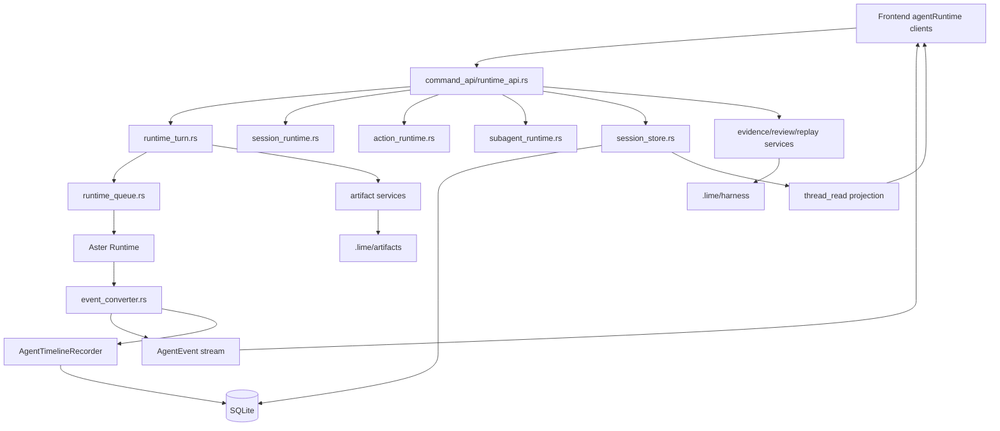

# Lime AgentUI 后端协作架构

> 状态：后端协作设计
> 更新时间：2026-04-30
> 目标：明确 AgentUI 下一阶段需要后端稳定提供哪些投影、分页、指标和批量接口，避免前端靠全量 detail 和字符串推断撑 UI。

## 1. 后端职责总览

AgentUI 的后端不只是“把模型输出传给前端”。它需要提供五类能力：

| 能力 | 后端职责 | UI 收益 |
| --- | --- | --- |
| 事件流 | 尽早发 `runtime_status`，分型发 text/thinking/tool/artifact/action/queue | 首字前有反馈，流式不串音 |
| 会话分页 | tail window、cursor、older page、summary snapshot | 旧会话秒开，长历史不卡 |
| 过程持久化 | runtime event -> timeline turn/item | tool/thinking/process 可追溯 |
| 产物持久化 | artifact document、版本、metadata、diff | 交付物离开正文进入 workbench |
| 证据导出 | evidence、review、replay、handoff | 结果可审计、可复盘、可继续 |

后端协作的核心原则：

- 前端首屏只拿必要 summary，不拿全量历史。
- 运行态由事件流驱动，历史态由 session detail 和 timeline 驱动。
- process、artifact、evidence 必须有稳定 id，不能只靠显示文本。
- 慢点日志要前后端同名可拼接。

## 2. 后端模块分层



## 3. Command API 合同

### 3.1 Session 读取

当前主入口：

- 前端：`getAgentRuntimeSession(sessionId, options)`
- 后端：`agent_runtime_get_session(...)`

当前已支持：

- `historyLimit`
- `historyOffset`
- `historyBeforeMessageId`
- `resumeSessionStartHooks`
- `history_cursor`
- `history_truncated`
- `messages_count`
- `thread_read`
- `queued_turns`

下一阶段建议：

| 需求 | 接口建议 | 说明 |
| --- | --- | --- |
| tab 快速恢复 | `agent_runtime_get_session_snapshot` 或 list summary 扩展 | 只返回 title、last message preview、status、unread/running、capsule summary |
| 旧会话分段 hydrate | 保持 `getSession(historyLimit=40)`，补 `timelineDetailLimit` | 首屏 messages 先到，timeline detail 可更少 |
| 更早历史 | `historyBeforeMessageId` 优先于 offset | offset 对持续插入不稳定，cursor 更适合分页 |
| 非活跃 tab 刷新 | summary refresh | 避免后台 tab 拉 detail |
| list 与 detail 抢通道 | list low priority / debounce | 点击历史会话时 detail 优先 |

### 3.2 Turn 提交

当前主入口：

- 前端：`submitAgentRuntimeTurn(request)`
- 后端：`agent_runtime_submit_turn`

必须保持：

- event listener 先注册。
- command 尽早接受请求。
- runtime 尽早发 `runtime_status`。
- busy 时明确 queue 或 steer。

下一阶段建议：

| 需求 | 后端配合 |
| --- | --- |
| 首字慢观测 | 在 submit accepted、runtime queued、runtime starting、provider request started、first model event 处发 status 或 tracing |
| Queue / Steer 区分 | request 和 event 均带 `submission_mode` / `queue_policy` / `target_turn_id` |
| 取消与中断 | interrupt marker 进入 thread_read，事件流发 cancelled/aborted 状态 |
| provider 慢 | runtime status 包含 provider/model/routing stage，但不暴露敏感配置 |

### 3.3 Action Required

当前主入口：

- 前端：`respondAgentRuntimeAction(request)`
- 后端：`agent_runtime_respond_action`
- 事件：`action_required`
- 投影：`thread_read.pending_requests`

下一阶段建议：

| 需求 | 后端配合 |
| --- | --- |
| needs input capsule | thread_read 输出 pending request count、highest severity、oldest age |
| 权限确认可审计 | approval request item 写入 timeline，并记录 response summary |
| replay pending request | pending request 带 replay metadata 和稳定 request id |
| 表单型请求 | action data 使用稳定 schema，而不是 Markdown 文本 |

### 3.4 Queue

当前主入口：

- 前端：`removeAgentRuntimeQueuedTurn`、`promoteAgentRuntimeQueuedTurn`
- 后端：runtime queue service
- 事件：`queue_added`、`queue_removed`、`queue_started`、`queue_cleared`

下一阶段建议：

| 需求 | 后端配合 |
| --- | --- |
| task capsule | queue snapshot 返回 `queued_turn_id`、preview、created_at、mode、target turn |
| 多 tab 快 | list session summary 带 queue/running counts，不需要 detail |
| 队列操作稳定 | queue mutation 以 id 为键，返回最新 queue snapshot |
| 后台恢复 | `resume_runtime_queue_if_needed` 不由普通 getSession 顺手触发 |

## 4. Session Store 与历史分页

当前关键入口：

- `get_runtime_session_detail_with_history_page`
- `get_session_sync_with_history_page`
- `AgentDao::get_message_window_info`
- `count_session_messages_sync`

当前已做到：

- tail page 读取 messages。
- 对 turns/items 使用同窗口限制。
- limited history 下跳过部分重型 runtime overlay。
- full history 时启用 tool IO eviction。

下一阶段建议后端继续提供三种粒度：

| 粒度 | 用途 | 内容 |
| --- | --- | --- |
| summary | sidebar/tab/capsule | session id、title、preview、status、running/queued/pending counts、last activity |
| window detail | active conversation 首屏 | 最近 N 条 messages、少量 turns/items、thread_read、history_cursor |
| full detail page | 用户主动加载更早历史或展开 timeline | older messages、对应 turns/items、artifact refs |

不要把“打开会话”和“加载所有证据”绑成同一个接口。

## 5. Timeline 与 Process 投影

当前关键入口：

- `AgentTimelineRecorder`
- `AgentTimelineDao::list_turns_by_thread_tail_page`
- `AgentTimelineDao::list_items_by_thread_tail_page`
- `thread_reliability_projection_service`

Timeline 后端应对 UI 提供两层数据：

| 层 | 内容 | UI 使用 |
| --- | --- | --- |
| compact process summary | turn status、tool count、artifact count、last tool、errors、duration | 消息旁 process summary、capsule、tab |
| detailed timeline items | reasoning、tool call、command、web search、approval、artifact | Timeline drawer / evidence |

下一阶段建议：

1. 给 `getSession` 增加可选 `timelineDetailLimit` 或 `includeTimelineDetails=false`。
2. 提供 `getThreadTimelinePage(sessionId, cursor, limit)`，用于展开过程详情时再加载。
3. 对 tool 大输出默认返回 summary + offload ref，详情按需读取。
4. timeline item 需要稳定 type 和 status，前端不要解析中文过程文本。

## 6. Artifact 协作

当前关键入口：

- `artifact_document_service.rs`
- `artifact_ops_service.rs`
- `artifact_protocol.rs`
- `write_artifact_events.rs`
- `AgentThreadTimelineArtifactCard`
- `useWorkspaceArtifactPreviewActions`

后端需要保证：

- artifact id、request id、path key 归一化一致。
- `artifact_snapshot` 能映射到 timeline item 和 ArtifactDocument。
- 大 artifact 内容可以按 preview 读取，不把完整内容塞进 message。
- artifact ops envelope 可增量展示：
  - `artifact.begin`
  - `artifact.meta.patch`
  - `artifact.source.upsert`
  - `artifact.block.upsert`
  - `artifact.block.remove`
  - `artifact.complete`
  - `artifact.fail`

下一阶段建议：

| 需求 | 后端配合 |
| --- | --- |
| workbench 自动打开 | artifact snapshot 返回 display title、mime/kind、preview mode |
| artifact 列表快 | session summary 带 latest artifacts summary |
| artifact diff | file checkpoint / artifact diff service 打通 |
| artifact 失败恢复 | artifact fail event 进入 thread_read incident |

## 7. Evidence / Review / Replay 协作

当前关键入口：

- `runtime_evidence_pack_service.rs`
- `runtime_review_decision_service.rs`
- `runtime_replay_case_service.rs`
- `runtime_analysis_handoff_service.rs`
- `runtime_handoff_artifact_service.rs`

证据层应保持：

```text
session detail + thread_read + timeline + artifacts + verification
  -> evidence pack
  -> review decision / replay / handoff
```

下一阶段建议：

| 需求 | 后端配合 |
| --- | --- |
| evidence 后台导出 | command 返回 job/snapshot 状态，UI 用 capsule 展示 |
| review 状态 | session summary 带 latest review status / pending review |
| replay 可见 | replay case 生成后进入 evidence panel |
| 验证摘要 | thread_read 或 evidence summary 输出 pass/fail/needs_review，不由前端推断 |

## 8. 日志与性能指标合同

### 8.1 旧会话恢复

后端已经输出：

- `total_ms`
- `resume_queue_ms`
- `detail_ms`
- `hooks_ms`
- `queue_snapshots_ms`
- `projection_ms`
- `interrupt_marker_ms`
- `dto_ms`
- `history_limit`
- `history_offset`
- `messages`
- `turns`
- `items`
- `queued_turns`

前端应对齐输出：

- `switchTopic.start`
- `snapshot.apply.ms`
- `runtimeGetSession.start/success/slow`
- `hydrate.messages.ms`
- `messageList.timelineBuild.ms`
- `messageList.firstStablePaint.ms`
- `historicalTimeline.idleComplete.ms`

### 8.2 首字慢

建议后端补齐：

- `submit.accepted.ms`
- `queue.wait.ms`
- `turn.start.ms`
- `provider.request.start.ms`
- `provider.first_event.ms`
- `provider.first_text_delta.ms`
- `tool.first_start.ms`

建议前端补齐：

- `listener.bound.ms`
- `submit.invoke.ms`
- `first_event.ms`
- `first_runtime_status.ms`
- `first_text_delta.ms`
- `first_text_paint.ms`
- `text_delta.queue_depth`
- `text_delta.oldest_unrendered_age_ms`
- `stream.catch_up_mode`

### 8.3 CPU / 内存

建议补：

- active tab count。
- hydrated detail tab count。
- mounted MessageList count。
- mounted timeline item count。
- streaming buffer chars。
- deferred timeline pending count。
- artifact preview loaded bytes。

这些指标可以先通过 debug log 实现，不必一开始接入完整遥测系统。

## 9. UI 需要的后端新增能力清单

| 优先级 | 能力 | 建议位置 | 验收 |
| --- | --- | --- | --- |
| P0 | session summary snapshot | `session_runtime.rs` / DTO | 打开 tab 不拉全量 detail |
| P0 | first event / first text tracing | `runtime_turn.rs` / event converter | 首字慢可分段定位 |
| P0 | getSession 可关闭 timeline detail | `runtime_api.rs` / `session_store.rs` | 旧会话 messages 先渲染 |
| P1 | timeline page API | runtime command + DAO | 展开过程时分页加载 |
| P1 | batch session patch | session update command | access mode/provider/strategy 回填合并 |
| P1 | queue/capsule summary in list | session list DTO | sidebar/tab 不抢 detail |
| P1 | tool detail on-demand | tool IO offload + command | 大工具输出不进正文 |
| P2 | background evidence job | evidence service | 证据导出不阻塞 UI |
| P2 | artifact preview manifest | artifact service | workbench 列表快速加载 |
| P3 | worker-friendly projection DTO | protocol projection | 前端 worker 可直接消费 |

## 10. 命令边界注意事项

任何新增或修改 Tauri command 必须同步四侧：

1. 前端 API client。
2. Rust command 注册。
3. command catalog。
4. mock / browser fallback。

最低校验：

```bash
npm run test:contracts
```

如果改动影响 GUI 主路径，再补：

```bash
npm run verify:gui-smoke
```

本轮文档只定义目标，不新增 command。后续实现时必须按命令边界治理执行。
