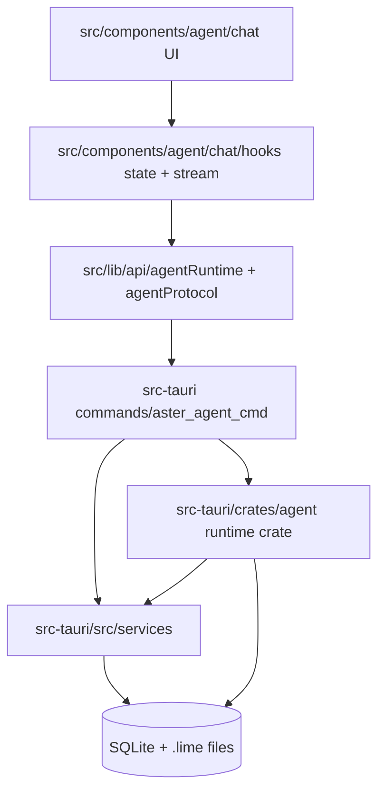

# Lime AgentUI 代码层级地图

> 状态：代码事实地图
> 更新时间：2026-04-30
> 目标：把 AgentUI 相关前端、协议、Tauri command、Rust runtime、service、持久化入口分层，作为后续拆分和性能优化的定位图。

## 1. 总览

当前 AgentUI 不是缺少底座，而是底座集中在少数大入口里。下一步代码架构的重点是把聚合入口拆成稳定子层，而不是复制一条新链。

## 2. 前端 UI 层

| 区域 | 关键文件 | 当前职责 | 后续架构方向 |
| --- | --- | --- | --- |
| 工作区总入口 | `src/components/agent/chat/AgentChatWorkspace.tsx` | 组合 chat、inputbar、workspace、artifact、timeline、team、harness、task center | 保留 shell 入口，逐步拆出 `SessionChrome`、`ConversationPane`、`WorkbenchPane`、`ProcessDrawer` |
| 消息列表 | `src/components/agent/chat/components/MessageList.tsx` | 渲染 messages、timeline、queued、pending action、历史窗口、progressive render | 继续做首屏轻量投影；timeline/tool/artifact detail 延迟或虚拟化 |
| 流式渲染 | `src/components/agent/chat/components/StreamingRenderer.tsx` | 渲染 text/thinking/tool/action/runtime status、A2UI、计划块 | 保持 content part 分型；补 backlog/catch-up 指标和重复吐字防线 |
| 输入区 | `src/components/agent/chat/components/Inputbar/index.tsx` | 输入容器与状态接线 | 收敛为 composer shell |
| 输入核心 | `src/components/agent/chat/components/Inputbar/components/InputbarCore.tsx` | 文本、图片、provider、model、execution strategy、access mode、team、workflow、hint popup | 抽出 composer state machine，明确 send / queue / steer |
| 运行状态行 | `src/components/agent/chat/components/Inputbar/components/InputbarRuntimeStatusLine.tsx` | 输入区状态提示 | 升级为首字前可信 runtime strip，可和 task capsule 共享投影 |
| 队列面板 | `src/components/agent/chat/components/Inputbar/components/QueuedTurnsPanel.tsx` | 展示 queued turns | 作为 task capsule 的详情面板 |
| 时间线 | `src/components/agent/chat/components/AgentThreadTimeline.tsx` | 展示 turn/item/tool/artifact 过程 | 从 MessageList 正文中继续抽离，默认延迟渲染历史项 |
| 工具步骤 | `src/components/agent/chat/components/InlineToolProcessStep.tsx`、`ToolCallDisplay.tsx` | 工具调用、工具结果展示 | 大输出进入详情抽屉，正文只保留摘要 |
| 计划与决策 | `AgentPlanBlock.tsx`、`DecisionPanel.tsx`、`ActionRequestA2UIPreviewCard.tsx` | 计划、审批、action_required | 统一为 HITL pattern：批准、拒绝、编辑、重放 |
| 任务中心 | `TaskCenterTabStrip.tsx`、`A2UITaskCard.tsx` | task center / A2UI 任务卡 | 进入 task layer，和 tab/capsule 统一 |
| Team 工作台 | `components/team-workspace-board/*` | 子代理、团队、画布式协作 | 成为 task layer 的 team 视图，不和普通 chat 首屏抢渲染 |
| Harness | `HarnessStatusPanel.tsx`、`RuntimeReviewDecisionDialog.tsx` | evidence、review、verification 展示 | 成为 evidence layer，默认由 task/evidence 胶囊进入 |
| Workbench | `CanvasWorkbenchLayout.tsx`、`GeneralWorkbench*`、`useWorkspaceArtifactPreviewActions.ts` | artifact/canvas/general workbench | 成为 artifact layer 的首要承载面 |

## 3. 前端状态与 Hook 层

| 文件 | 当前职责 | 关键事实 | 后续方向 |
| --- | --- | --- | --- |
| `hooks/useAgentSession.ts` | 会话主状态、topic、messages、threadTurns、threadItems、queuedTurns、threadRead、executionRuntime | 已有 `SESSION_HISTORY_LOAD_PAGE_SIZE = 50`、`SESSION_DETAIL_PREFETCH_HISTORY_LIMIT = 40`、deferred hydration、prefetch、cached snapshot | 逐步拆为 session controller、history controller、topic/tab controller、runtime projection selector |
| `hooks/agentStreamSubmitExecution.ts` | 提交流式 turn | 先注册 event binding，再 `submitOp` | 保持顺序，避免首事件丢失 |
| `hooks/agentStreamTurnEventBinding.ts` | 注册事件 listener、watchdog、silent recovery | `STREAM_FIRST_EVENT_TIMEOUT_MS = 12_000`、`STREAM_INACTIVITY_TIMEOUT_MS = 120_000` | 首字慢排查应采集 first event / first text / inactivity 指标 |
| `hooks/agentStreamRuntimeHandler.ts` | `handleTurnStreamEvent` 分发事件到前端状态 | `TEXT_DELTA_RENDER_FLUSH_MS = 32`，含 `reconcileFinalContentParts` | 抽成 reducer，补 backlog depth / oldest age / catch-up mode |
| `utils/threadTimelineView.ts` | messages + turns + items -> timeline 投影 | MessageList 同步计算热点之一 | 大会话改为 idle/worker/懒加载 |
| `utils/messageTurnGrouping.ts` | timeline grouping | 与渲染批次绑定 | 与 virtualization 结合 |
| `utils/processDisplayText.ts` | 过程文本规范化 | 防 `<think>` / 工具日志污染正文 | 继续作为 text/thinking/tool 分型防线 |

## 4. 前端协议 / API 层

| 文件 | 当前职责 | 关键能力 |
| --- | --- | --- |
| `src/lib/api/agentRuntime/index.ts` | agent runtime API 统一导出 | session、thread、export、subagent、site、media client |
| `src/lib/api/agentRuntime/sessionClient.ts` | create/list/get/update session | `getAgentRuntimeSession(sessionId, { historyLimit, historyOffset, historyBeforeMessageId })`；有 `runtimeGetSession.slow` 日志 |
| `src/lib/api/agentRuntime/threadClient.ts` | submit、interrupt、compact、resume、respond action、queue 操作、thread read | `submitAgentRuntimeTurn`、`respondAgentRuntimeAction`、`getAgentRuntimeThreadRead` |
| `src/lib/api/agentRuntime/types.ts` | DTO 类型 | `AsterSessionDetail`、`AgentRuntimeThreadReadModel`、`AgentRuntimeSubmitTurnRequest`、history cursor |
| `src/lib/api/agentProtocol.ts` | AgentEvent 类型和兼容 normalizer | `turn_started`、`text_delta`、`thinking_delta`、`tool_start/end`、`artifact_snapshot`、`runtime_status`、queue、subagent、`done/final_done` |
| `src/lib/api/agentTextNormalization.ts` | legacy 文本与 item normalizer | 兼容旧事件/旧 item | 继续收口 compat，不新增旧形态 |

协议层的架构判断：

- UI 只能消费结构化事件和 DTO，不应通过字符串猜测 Agent 状态。
- `parseAgentEvent` 是兼容边界，不是鼓励继续新增 legacy 事件。
- `historyLimit/historyOffset/historyBeforeMessageId` 是旧会话性能主接口，后续 pagination/virtualization 要继续沿用。

## 5. Tauri Command 层

| 文件 | 当前职责 | AgentUI 相关能力 |
| --- | --- | --- |
| `src-tauri/src/commands/aster_agent_cmd/command_api/runtime_api.rs` | runtime Tauri command 主入口 | submit、interrupt、compact、resume、get session、thread read、file checkpoint、evidence/review export |
| `src-tauri/src/commands/aster_agent_cmd/runtime_turn.rs` | turn 执行主链 | 提前发 `runtime_status`、执行 provider/runtime/tool/hook/memory/artifact/auto compact |
| `src-tauri/src/commands/aster_agent_cmd/session_runtime.rs` | session create/list/update/recent runtime context | sidebar/session summary 和 tab 管理基础 |
| `src-tauri/src/commands/aster_agent_cmd/subagent_runtime.rs` | subagent runtime | team/capsule 子代理状态基础 |
| `src-tauri/src/commands/aster_agent_cmd/action_runtime.rs` | action required / response | HITL、权限确认、用户输入请求 |
| `src-tauri/src/commands/aster_agent_cmd/tool_runtime/*` | tool bridge | browser、workspace、service skill、media、mcp、subagent、site |
| `src-tauri/src/commands/aster_agent_cmd/dto.rs` | 后端 DTO | `AgentRuntimeSessionDetail`、history cursor、thread_read 投影 |

`agent_runtime_get_session` 当前关键行为：

- 默认 `RUNTIME_SESSION_OPEN_HISTORY_LIMIT = 40`。
- 最大 `RUNTIME_SESSION_MAX_HISTORY_LIMIT = 2000`。
- `historyLimit = 0` 表示不裁剪。
- 返回 detail、queue snapshots、interrupt marker、thread_read、history cursor。
- tracing 已拆出 `detail_ms`、`hooks_ms`、`queue_snapshots_ms`、`projection_ms`、`dto_ms`。

这意味着旧会话恢复慢的排查不应只看前端感受，必须把前端 `runtimeGetSession.slow` 与后端 `agent_runtime_get_session` 分段日志对齐。

## 6. Rust Agent Crate 层

| 文件 | 当前职责 | AgentUI 意义 |
| --- | --- | --- |
| `src-tauri/crates/agent/src/runtime_queue.rs` | turn queue、resume、queue event | queue/capsule/task layer 的事实源 |
| `src-tauri/crates/agent/src/session_store.rs` | session detail、messages、turns、items、todo、runtime overlay、subagent context | old session restore、history pagination、thread_read 的底层事实源 |
| `src-tauri/crates/agent/src/session_query.rs` | parent/child/cascade 查询 | team/subagent 视图 |
| `src-tauri/crates/agent/src/event_converter.rs` | Aster event -> Lime runtime event | text/thinking/tool/artifact/status 的协议生成点 |
| `src-tauri/crates/agent/src/protocol_projection.rs` | current projection 入口 | 新 UI 应优先跟 current projection 对齐 |
| `src-tauri/crates/agent/src/runtime_projection_snapshot.rs` | runtime summary snapshot | tab/capsule/sidebar summary 可复用 |
| `src-tauri/crates/agent/src/session_execution_runtime.rs` | execution runtime/cost/limit/routing | provider/model/cost/context usage UI |
| `src-tauri/crates/agent/src/queued_turn.rs` | queue snapshot 数据结构 | queue panel、task capsule |
| `src-tauri/crates/agent/src/tool_io_offload.rs` | tool 大输出 offload | tool UI 大输出不卡顿的后端基础 |
| `src-tauri/crates/agent/src/write_artifact_events.rs` | artifact write event | artifact snapshot / workbench 联动 |

## 7. Service 层

| 文件 | 当前职责 | AgentUI 使用方式 |
| --- | --- | --- |
| `src-tauri/src/services/agent_timeline_service.rs` | `AgentTimelineRecorder` 持久化 runtime event -> turn/item | Process layer 与 Evidence layer 的过程事实 |
| `src-tauri/src/services/artifact_document_service.rs` | ArtifactDocument 持久化、版本、`.lime/artifacts` | Artifact layer 主事实源 |
| `src-tauri/src/services/artifact_ops_service.rs` | incremental artifact envelope | artifact.begin/meta/source/block/complete/fail |
| `src-tauri/src/services/runtime_evidence_pack_service.rs` | evidence pack 导出 | Evidence layer 输出 `summary.md/runtime.json/timeline.json/artifacts.json` |
| `src-tauri/src/services/runtime_review_decision_service.rs` | review decision 模板与保存 | Human review 闭环 |
| `src-tauri/src/services/runtime_replay_case_service.rs` | replay case | 失败复现与验证 |
| `src-tauri/src/services/runtime_handoff_artifact_service.rs` | handoff bundle | 跨 agent/人工交接 |
| `src-tauri/src/services/runtime_file_checkpoint_service.rs` | file checkpoint / diff | 代码任务可审查变更 |
| `src-tauri/src/services/thread_reliability_projection_service.rs` | reliability projection | thread_read、incident、pending request |

## 8. 存储与文件事实源

| 事实源 | 内容 | UI 映射 |
| --- | --- | --- |
| SQLite session tables | sessions、messages、metadata | sidebar、tabs、Conversation layer |
| SQLite timeline tables | turns、items、tool、artifact item | Process layer、Evidence layer |
| `.lime/artifacts` | artifact documents、版本、snapshot | Artifact layer |
| `.lime/harness/sessions/<session>/evidence` | evidence pack | Evidence panel |
| `.lime/harness/sessions/<session>/review` | review decision | Review dialog/panel |
| runtime in-memory state | running turns、interrupt marker、queue | Runtime strip、capsule、queue |

## 9. 测试入口

| 范围 | 现有测试入口 |
| --- | --- |
| MessageList | `src/components/agent/chat/components/MessageList.test.tsx` |
| StreamingRenderer | `src/components/agent/chat/components/StreamingRenderer.test.tsx` |
| Stream event binding | `src/components/agent/chat/hooks/agentStreamTurnEventBinding.test.ts` |
| Stream runtime reducer | `src/components/agent/chat/hooks/agentStreamRuntimeHandler.test.ts` |
| Inputbar | `InputbarCore.test.tsx`、`InputbarRuntimeStatusLine.test.tsx`、`QueuedTurnsPanel.test.tsx` |
| Timeline | `AgentThreadTimeline.test.tsx`、`AgentThreadTimelineArtifactCard.test.tsx` |
| Task center / team | `TaskCenterTabStrip.test.tsx`、`TeamWorkspaceBoard*.test.tsx` |
| Harness | `HarnessStatusPanel.test.tsx` |
| Backend history/session | `src-tauri/crates/agent/src/session_store.rs` unit tests |
| Command contract | `npm run test:contracts` |
| GUI smoke | `npm run verify:gui-smoke` |

## 10. 后续拆分边界

建议优先拆这些边界，避免继续扩大主入口：

1. `useAgentSession` 拆出 `useSessionHistoryWindow`、`useTopicTabs`、`useRuntimeProjection`。
2. `agentStreamRuntimeHandler` 抽出纯 reducer，测试 first event、first text、thinking/final 去重、tool/action/artifact 合并。
3. `MessageList` 把 timeline projection 和 rendering 分离，历史 timeline 默认 idle/worker。
4. `AgentChatWorkspace` 把 workbench/harness/team 的状态接线移到各自 controller hook。
5. `InputbarCore` 把 textarea、attachments、slash/hint、queue/steer 拆为 composer state machine。
