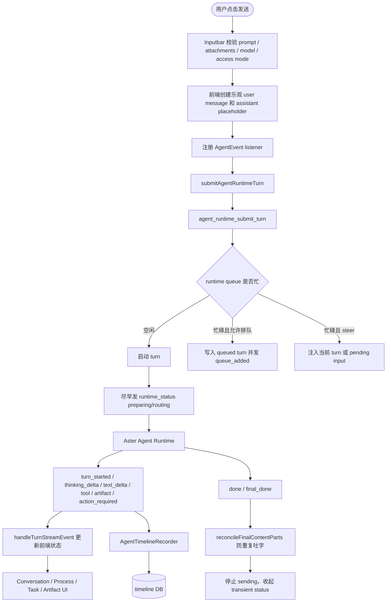
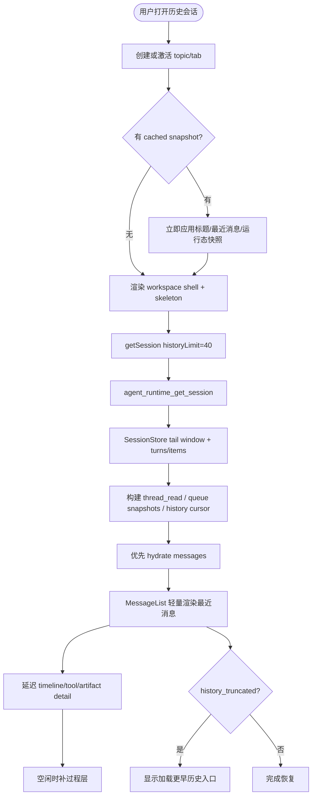
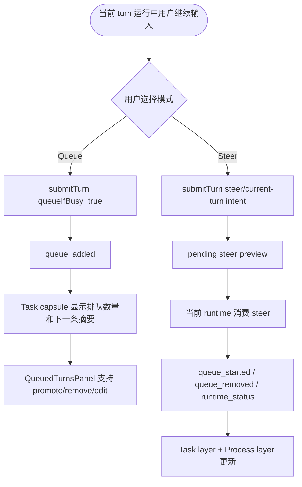
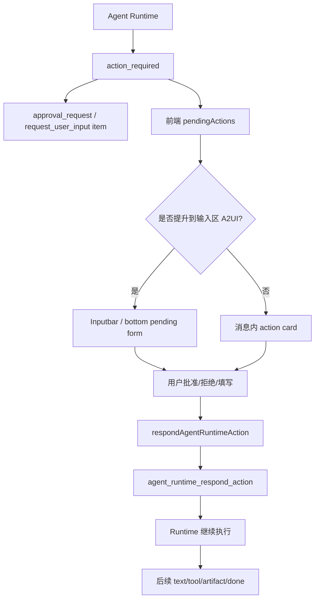
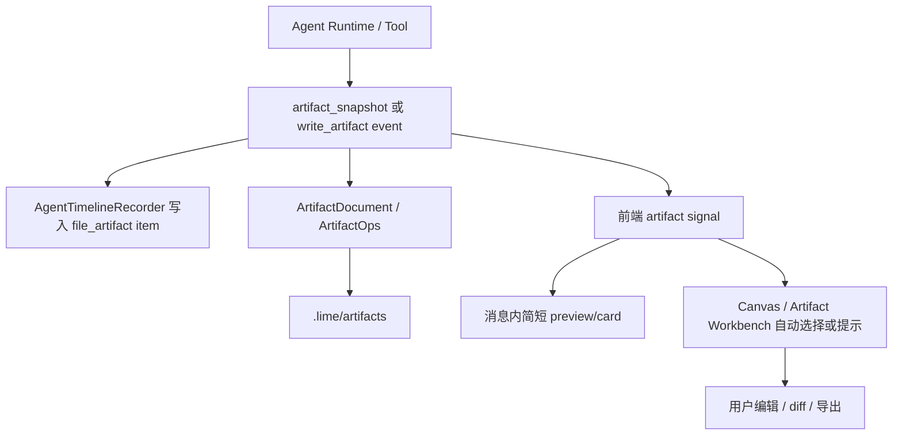
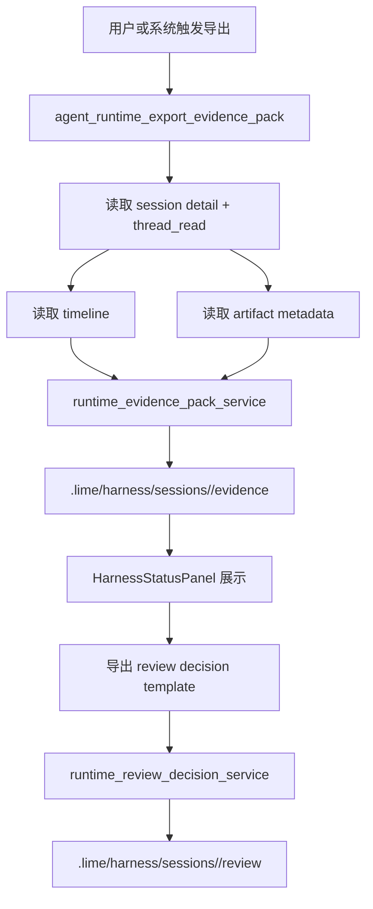
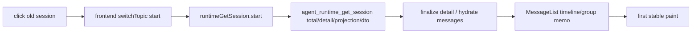
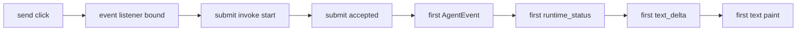

# Lime AgentUI 事件流程

> 状态：流程设计
> 更新时间：2026-04-30
> 目标：固定 AgentUI 的关键运行流，避免 UI 层用局部状态猜测 runtime 行为。

## 1. 事件事实源

AgentUI 的运行事实来自五类投影：

| 投影 | 入口 | UI 消费 |
| --- | --- | --- |
| AgentEvent stream | `src/lib/api/agentProtocol.ts` | 流式文本、thinking、tool、artifact、runtime status、queue、done |
| Session detail | `getAgentRuntimeSession` / `agent_runtime_get_session` | 打开旧会话、历史窗口、thread items、queued turns、thread read |
| Thread read | `getAgentRuntimeThreadRead` / session detail 内联 | pending requests、last outcome、incident、interrupt、queue |
| Timeline | `AgentTimelineRecorder` 持久化的 turn/item | Process layer、Evidence layer |
| Artifact/Evidence files | `.lime/artifacts`、`.lime/harness` | Workbench、Harness、Review、Replay |

事件流原则：

1. 新 UI 只新增投影或 selector，不新增第二条 runtime event。
2. 对话正文只消费 `text` 和最终答复相关 preview。
3. thinking/tool/status/action/artifact 必须分型，不拼接进同一个 Markdown 字符串。
4. 历史恢复消费 session detail，流式执行消费 AgentEvent，两者最终进入同一前端 state shape。

## 2. 发送消息流程

关键约束：

- listener 必须先于 submit 注册，避免首事件丢失。
- `runtime_status` 应早于首个 `text_delta`，用于首字前反馈。
- `text_delta` 只进入 text part；`thinking_delta` 只进入 thinking part。
- `final_done` 只能 reconcile，不应把完整 final text 再追加一遍。
- tool/artifact/action 事件进入 process/task/artifact 投影，不污染最终正文。

## 3. 打开旧会话流程

关键约束：

- 不等待全量历史再挂载 UI。
- 不在打开旧会话时同时触发无 `historyLimit` 的 `getSession`。
- sidebar list 刷新应低优先级，不能抢 session detail 主链。
- 非活跃 tab 只保留 snapshot，不构建完整 MessageList/timeline。
- full history 只能分页，不回退到 `historyLimit: 0` 的默认路径。

## 4. Queue / Steer 流程

UI 规则：

- Queue 表示“本轮结束后执行”，Steer 表示“影响当前执行”。
- 两者必须有不同视觉和文案。
- queue 入口不应该触发新 tab 全量恢复。
- queue 操作应以 `queued_turn_id` 为稳定键，避免列表重排导致操作错位。

## 5. Action Required / Human-in-the-loop 流程

UI 规则：

- `needs_input` 和 `plan_ready` 是 task capsule 的高优先级状态。
- 高风险动作必须显示明确操作对象、影响范围和确认按钮。
- action card 完成后应收起为历史摘要，不继续占据首屏。
- replay pending request 应从 `thread_read.pending_requests` 进入，不从文本猜测。

## 6. Artifact 流程

UI 规则：

- artifact 主体不长期留在正文。
- 消息内 card 只做摘要和打开入口。
- artifact 版本、路径、metadata 应来自 artifact service，不由前端拼路径。
- `artifact_snapshot` 同时属于 process evidence 和 artifact delivery。

## 7. Evidence / Review 流程

UI 规则：

- evidence/review 是证据层，不应阻塞聊天流式输出。
- 导出动作应显示后台任务状态，完成后给 capsule/harness 入口。
- evidence 的 summary、timeline、artifact、verification 必须同源，不允许前端伪造通过状态。

## 8. 慢点排查流程

### 8.1 旧会话恢复慢

需要同时记录：

- click -> shell rendered。
- click -> `runtimeGetSession.start`。
- `runtimeGetSession.start` -> success。
- 后端 `detail_ms/projection_ms/dto_ms`。
- detail success -> messages rendered。
- messages rendered -> historical timeline idle completed。

### 8.2 首字慢

需要同时记录：

- listener bound 时间。
- submit invoke 耗时。
- first event 时间。
- first runtime status 时间。
- first text delta 时间。
- delta flush queue depth。
- oldest unrendered delta age。
- catch-up mode transition。

### 8.3 CPU / 内存飙高

优先检查：

1. 是否多个 tab 同时全量恢复。
2. 是否非活跃会话仍在构建 `MessageList` 和 timeline。
3. 是否 `getSession(historyLimit: 0)` 或无 limit 请求被触发。
4. 是否 sidebar list 与 session detail 抢同一 invoke 通道。
5. 是否 streaming text 逐字动画在 backlog 很大时仍慢速推进。
6. 是否 tool output / artifact preview 被一次性塞入正文渲染。
