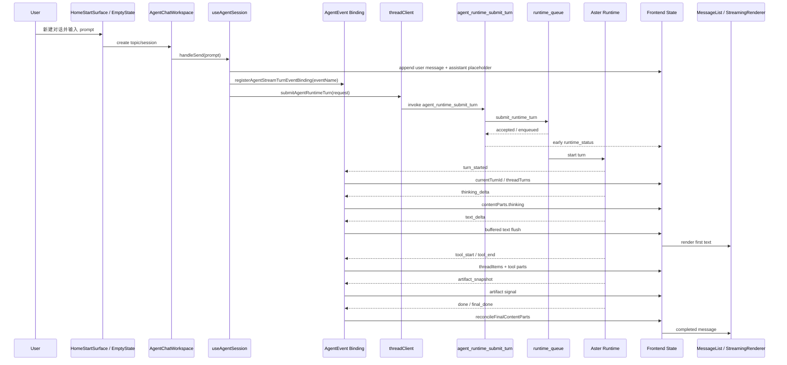
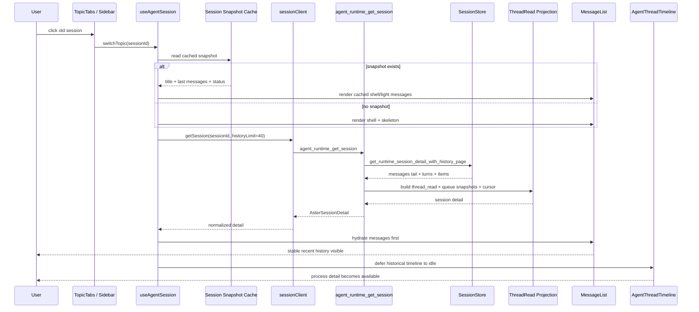
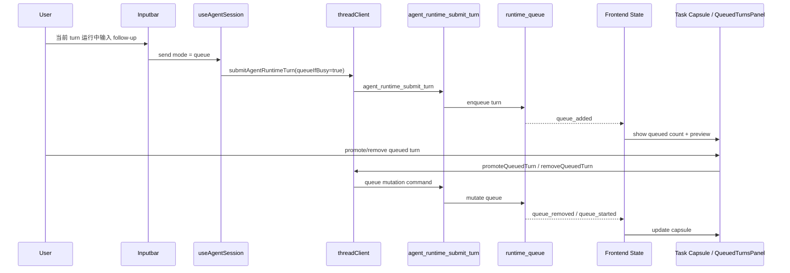
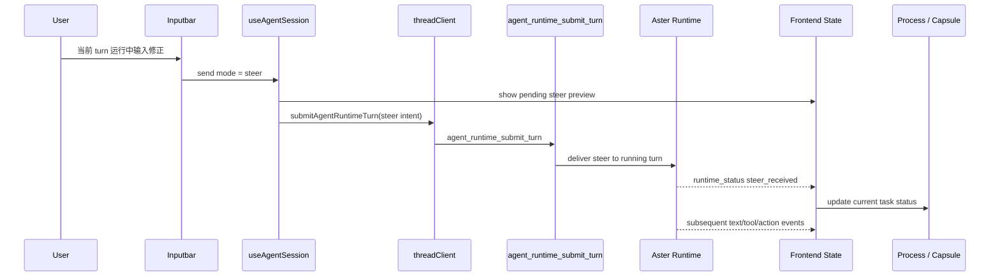
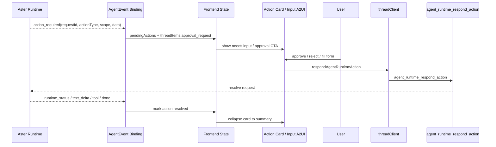
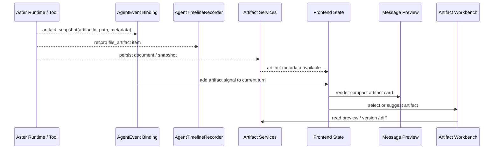
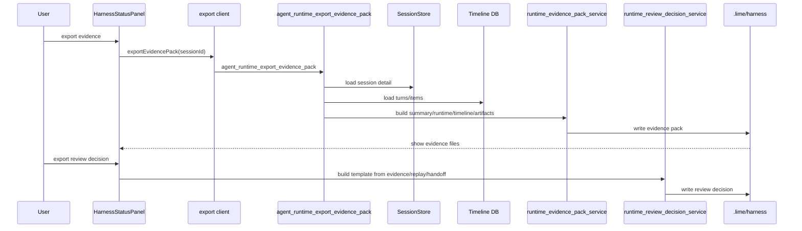
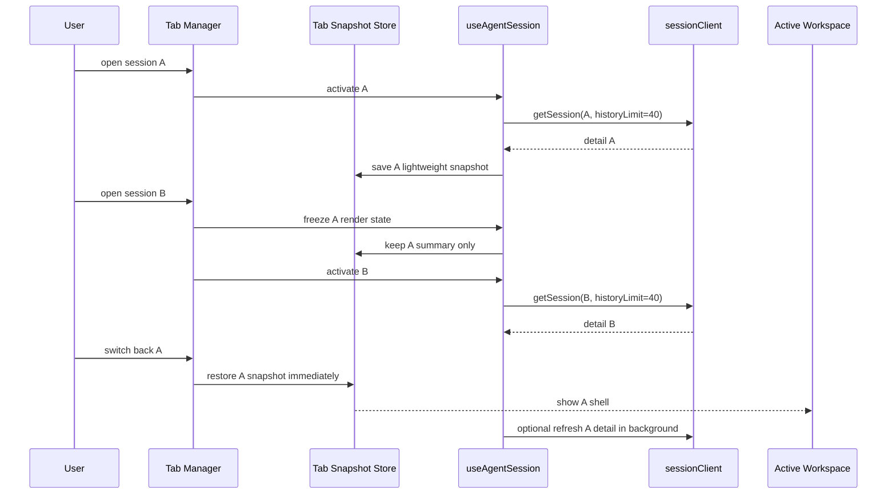

# Lime AgentUI 时序图

> 状态：时序设计
> 更新时间：2026-04-30
> 目标：为实现、E2E、性能日志和故障排查提供端到端时序基线。

## 1. 新建会话并发送消息

验收点：

- `registerAgentStreamTurnEventBinding` 早于 submit invoke。
- 首个 `runtime_status` 能在首个 `text_delta` 前显示。
- `final_done` 不导致完整答案重复追加。

## 2. 打开旧会话渐进恢复

验收点：

- `switchTopic` 后 shell 立即出现。
- `historyLimit=40` 是默认恢复路径。
- timeline 的历史构建不阻塞最近消息可读。
- 非活跃 tab 不触发完整 timeline 渲染。

## 3. 运行中 Queue 后续输入

验收点：

- queue 不创建假消息正文。
- queue 操作不会触发旧会话全量恢复。
- 运行中任务和排队任务视觉不同。

## 4. 运行中 Steer 当前任务

验收点：

- steer 文案明确“影响当前任务”。
- pending steer 可取消或至少可见。
- steer 后状态进入当前 turn，而不是排队 turn。

## 5. Action Required / 权限确认

验收点：

- `needs_input` 在 task capsule 中可见。
- action 完成后不能继续以 pending 状态吸顶。
- 高风险动作必须保留审批结果摘要。

## 6. Artifact Snapshot 到 Workbench

验收点：

- 聊天正文只显示 artifact 摘要卡。
- Workbench 是 artifact 主编辑面。
- timeline 和 evidence 能追到同一个 artifact id/path。

## 7. Evidence Pack 与 Review Decision

验收点：

- evidence 导出不阻塞当前流式 turn。
- review decision 只保存人工审核，不自动批准或自动应用修复。
- UI 展示的证据路径来自后端返回值。

## 8. 多 Tab / 多历史会话

验收点：

- 打开第二个历史会话不会让第一个历史会话继续全量渲染。
- tab 切换先恢复 snapshot，再后台刷新。
- 关闭 tab 释放 MessageList/timeline 重对象。
