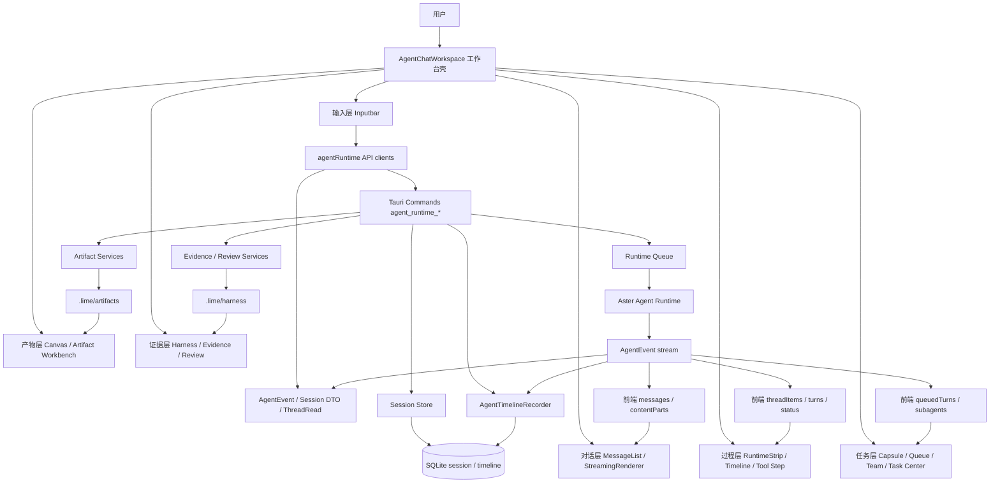

# Lime AgentUI 目标架构

> 状态：目标架构
> 更新时间：2026-04-30
> 适用范围：`src/components/agent/chat` 主工作区、`src/lib/api/agentRuntime` 前端协议层、`src-tauri` agent runtime 主链。

## 1. 架构原则

Lime 的下一代 AgentUI 应是一个桌面工作台，而不是单列聊天页。它应当同时回答：

1. 用户当前目标是什么。
2. Agent 正在执行哪一步。
3. 哪些工具、权限、文件、网页、子代理和队列参与了执行。
4. 哪些内容是最终产物。
5. 结果能否被验证、复盘、重放和继续编辑。

因此目标 UI 分为五层：

| 层 | 用户问题 | 主要 UI | 主要事实源 |
| --- | --- | --- | --- |
| 对话层 Conversation | 我和 Agent 说了什么，最终答复是什么 | `MessageList`、`StreamingRenderer`、用户消息、助手正文 | `messages`、`contentParts`、`text_delta` |
| 过程层 Process | Agent 现在在做什么，卡在哪里 | runtime strip、thinking、tool step、timeline | `runtime_status`、`thinking_delta`、`threadItems`、`threadTurns` |
| 任务层 Task | 还有哪些后台任务、排队输入、子代理 | capsule、task center、queue panel、team board | `queuedTurns`、`childSubagentSessions`、`thread_read` |
| 产物层 Artifact | 最终交付物在哪里继续编辑 | canvas、artifact preview、workbench | `artifact_snapshot`、ArtifactDocument、`.lime/artifacts` |
| 证据层 Evidence | 这次执行是否可靠，如何复盘 | harness panel、evidence pack、review decision、replay | `thread_read`、timeline、evidence/review services |

## 2. 总体架构图



## 3. UI 布局目标

下一阶段建议把 `AgentChatWorkspace` 从“组件巨石”逐步收敛为稳定布局骨架：

```text
AgentChatWorkspace
  AgentWorkspaceShell
    SessionChrome
      TopicTabs
      TaskCapsuleStrip
      RuntimeHealthIndicator
    AgentMainLayout
      ConversationPane
        MessageList
        StreamingRenderer
        Inputbar
      WorkbenchPane
        ArtifactCanvas
        TaskCenter
        EvidencePanel
      ProcessDrawer
        AgentThreadTimeline
        ToolDetail
        RuntimeDiagnostics
```

这不是要求一次性重写，而是给后续拆分一个归宿。当前可以继续复用 `AgentChatWorkspace.tsx`，但新增能力应尽量下沉到更小的 selector、hook、panel，而不是继续把状态和渲染堆到主文件。

## 4. 五层 UI 的职责边界

### 4.1 对话层

对话层只负责高信噪比协作：

- 用户消息。
- 助手最终答复。
- 必要的流式占位。
- 与最终答复强相关的引用、预览和操作。

对话层不应承担：

- 全量 tool output。
- 全量 thinking 原文。
- 后台队列管理。
- 证据包文件树。
- artifact 编辑器主体。

### 4.2 过程层

过程层负责把“Agent 是否活着、正在做什么”变成低噪声状态：

- 首事件前显示可信阶段：submitted、routing、preparing、waiting provider。
- 首字前显示 `runtime_status`，不要只给鼠标 loading。
- thinking 默认折叠，完成后显示摘要。
- tool 默认压缩为 step，点击进入详情。
- 历史会话默认延迟渲染 timeline。

过程层的关键是分型，不是堆文本。

### 4.3 任务层

任务层负责多会话、多 turn、多子代理的压缩索引：

- `running`：低调胶囊，不抢注意力。
- `queued`：显示队列长度和下一条摘要。
- `needs_input`：高优先级 CTA。
- `plan_ready`：高优先级 CTA，进入计划审批。
- `failed`：可恢复错误胶囊，点击打开诊断。
- `team/subagent`：显示数量、状态和焦点会话。

任务层应学习浏览器 tab 的管理方式：可快速打开、切换、关闭、懒加载、后台冻结，避免多个旧会话同时全量恢复导致 CPU 和内存飙高。

### 4.4 产物层

产物层承接最终交付：

- 文档、代码、报告、图片、视频、网页、表单等不应长期塞在聊天正文里。
- `artifact_snapshot` 应生成 artifact card，并自动同步到 workbench。
- artifact 的编辑、预览、diff、保存、导出由 workbench 负责。
- 聊天消息只保留摘要、解释和打开入口。

### 4.5 证据层

证据层负责证明执行可信：

- `thread_read` 负责待处理请求、last outcome、incident、queue、interrupt。
- timeline 负责过程证据。
- evidence pack 负责导出 `summary.md`、`runtime.json`、`timeline.json`、`artifacts.json`。
- review decision 负责人工审核闭环。
- replay 负责复现失败场景。

证据层默认不出现在首屏正文里，但必须能从任务、timeline 或 harness panel 快速进入。

## 5. 状态所有权

| 状态 | 所有权建议 | 当前关键入口 |
| --- | --- | --- |
| 当前会话、topic、messages | `useAgentSession` 继续作为临时聚合层，逐步拆 selector | `src/components/agent/chat/hooks/useAgentSession.ts` |
| 流式事件绑定 | 独立 stream controller | `agentStreamSubmitExecution.ts`、`agentStreamTurnEventBinding.ts` |
| 流式 reducer | 独立 runtime event reducer | `agentStreamRuntimeHandler.ts` |
| 消息渲染投影 | MessageList selector / memo | `MessageList.tsx`、`threadTimelineView.ts`、`messageTurnGrouping.ts` |
| 队列与 capsule | Task state selector | `queuedTurns`、`TaskCenterTabStrip.tsx`、`QueuedTurnsPanel.tsx` |
| artifact 工作台 | Workbench controller | `useWorkspaceArtifactPreviewActions.ts`、artifact services |
| evidence/review | Harness controller | `HarnessStatusPanel.tsx`、runtime evidence/review services |

## 6. 性能目标

| 场景 | 目标体验 | 架构要求 |
| --- | --- | --- |
| 打开旧会话 | 立即显示 shell 和最近消息骨架，随后渐进 hydrate | `getSession(historyLimit: 40)`，timeline 延迟，full history 分页 |
| 首字前等待 | 用户看到明确阶段，而不是应用卡死 | 先发 `runtime_status`，前端显示 runtime strip |
| 大量 text_delta | 流式平滑，catch-up 时不逐字拖慢 | delta buffer、flush 指标、catch-up mode |
| 多 tab / 多历史会话 | 非活跃 tab 不全量渲染 | tab snapshot、懒加载、后台冻结、关闭释放 |
| 大 tool output | 正文不卡，详情可查 | tool output 截断、offload、timeline 详情 |
| evidence/review | 导出不阻塞聊天 | 后台任务 + 完成胶囊 + workbench 入口 |

## 7. 非目标

短期不做这些事：

- 不新增第二套 event bus。
- 不把所有 timeline 迁到前端本地推断。
- 不把 artifact 编辑器塞回 `MessageList`。
- 不为了视觉新鲜感引入和 Lime 现有设计语言冲突的大面积渐变、半透明主表面或嵌套卡片。
- 不一次性重写整个 `AgentChatWorkspace`；先用 selector、panel、controller 拆出稳定边界。
