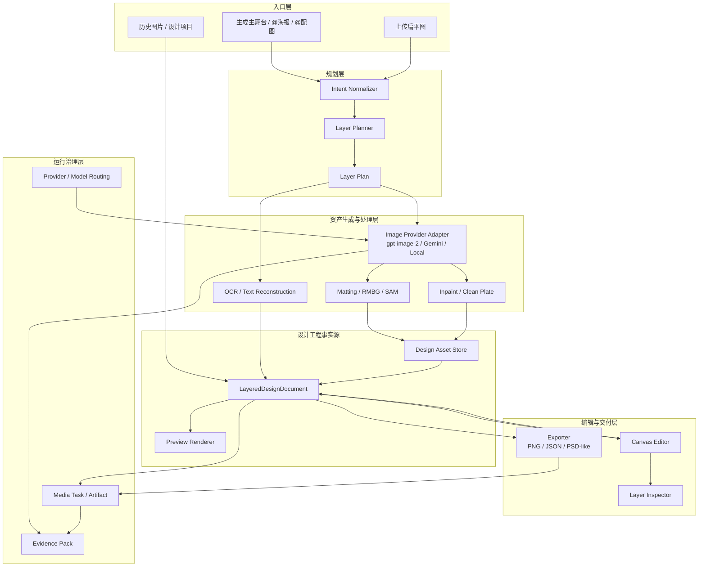
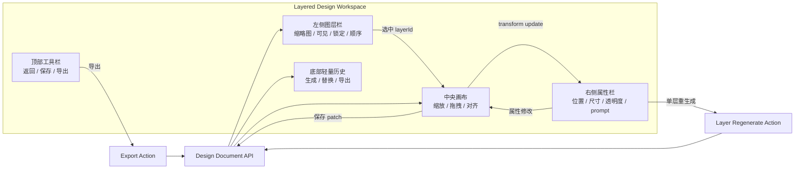
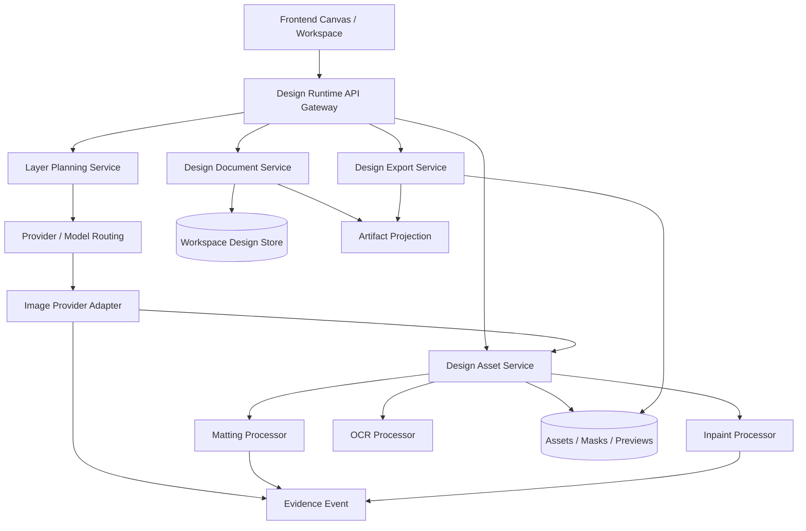
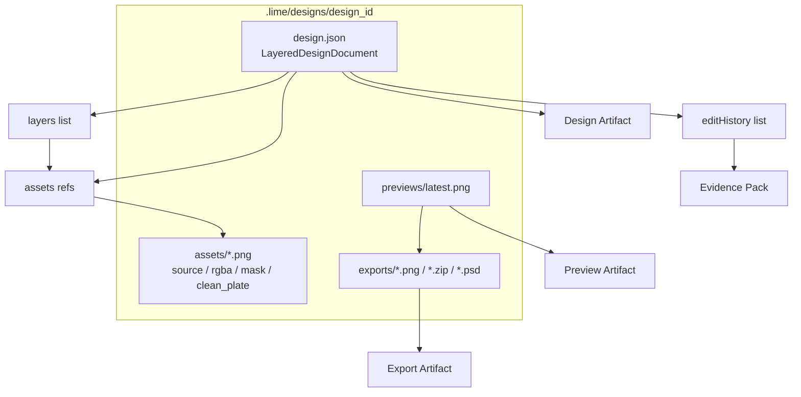
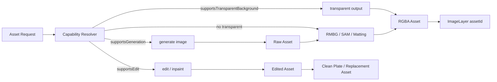
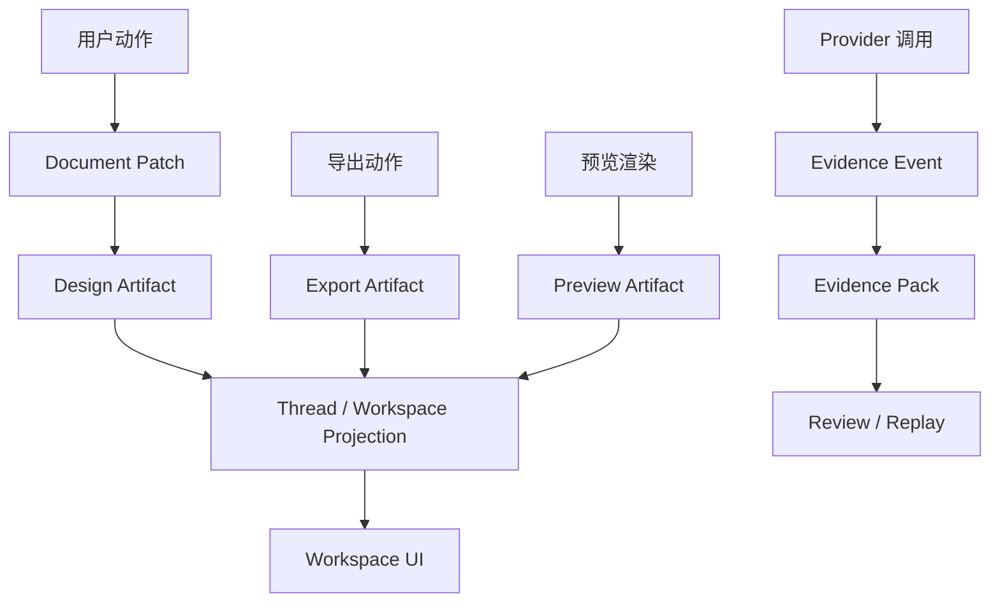

# AI 图层化设计架构图

> 状态：proposal  
> 更新时间：2026-05-05  
> 目标：把 `LayeredDesignDocument`、Canvas Editor、媒体任务、provider seam、asset store、artifact/evidence 的边界画清楚，防止后续实现变成单图输出旁路。

## 1. 总体系统分层图

固定判断：

1. `LayeredDesignDocument` 是 current 事实源。
2. provider 输出只进入 `AssetStore`，不能直接成为最终产品状态。
3. Canvas 的每次用户编辑都必须回写设计文档。
4. artifact / evidence 记录生成与导出事实，不定义新的图层协议。

## 2. 前端工作台架构图

页面类型：这是**宽内容区工作台**，不是窄表单页。视觉应遵守 Lime 现有设计语言：主表面实体底色、浅边框、信息优先、低干扰背景。

## 3. 后端服务边界图

实现约束：

1. 不新增平行图片 runtime；服务必须挂回现有媒体任务、Workspace 与 artifact 主链。
2. 如果未来新增 Tauri 命令，必须同步前端调用、Rust 注册、治理目录册和 mock。
3. provider adapter 只暴露能力和结果，不暴露产品层“图层”语义。

## 4. 数据与存储架构图

最低持久化原则：

1. `design.json` 可单独解释工程结构。
2. `assets/` 可被重新绑定到图层。
3. `previews/latest.png` 只做加速显示和分享预览。
4. `exports/` 是投影结果，不能反向成为事实源。

## 5. Provider 能力边界图

核心规则：

1. `gpt-image-2`、Gemini、Flux 的差异只停留在 capability 层。
2. 图层协议不依赖某个模型是否支持透明背景。
3. 透明输出失败时可以回退到后处理，但必须记录 `alphaMode`。

## 6. Artifact / Evidence 分层图

这层的目标不是让 evidence 接管设计文档，而是让后续 review / replay 能解释：

1. 哪个模型生成了哪个 asset。
2. 用户什么时候替换了哪个 layer。
3. 导出结果来自哪个 document 版本。
