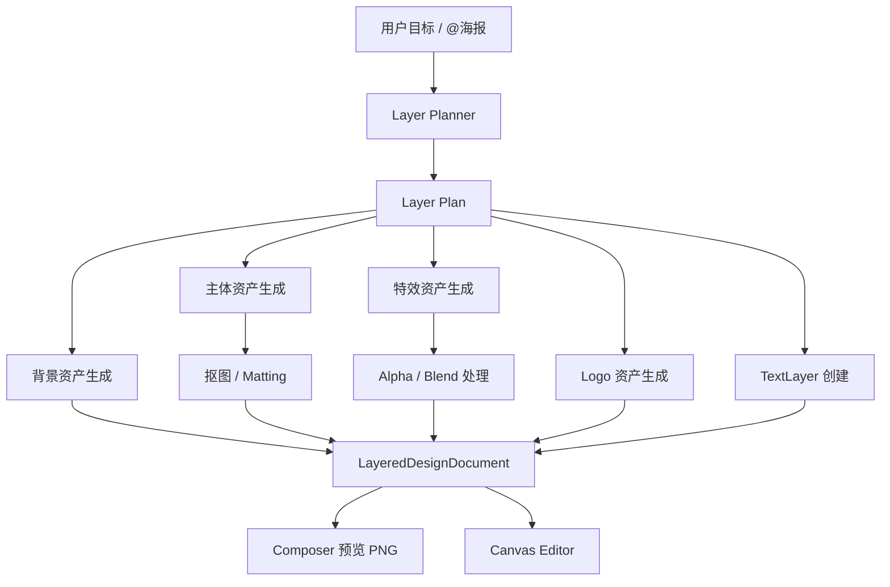
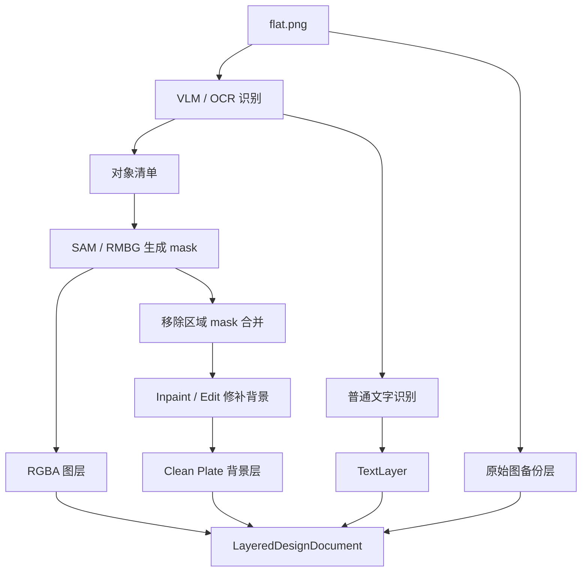
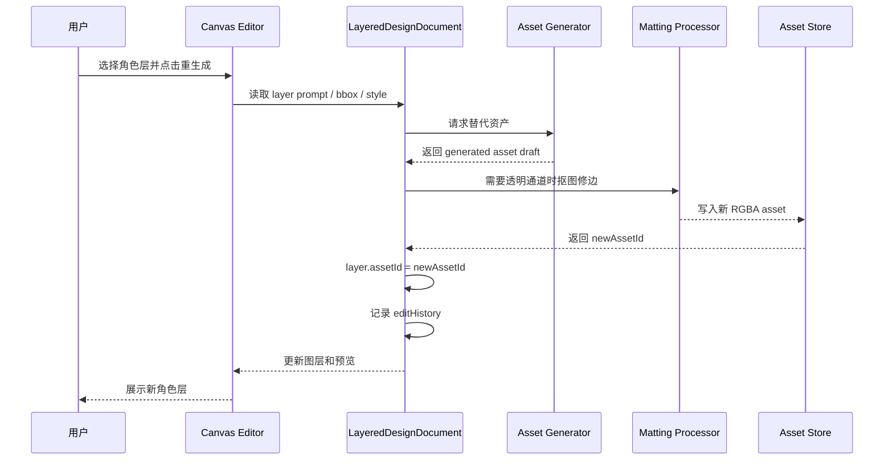
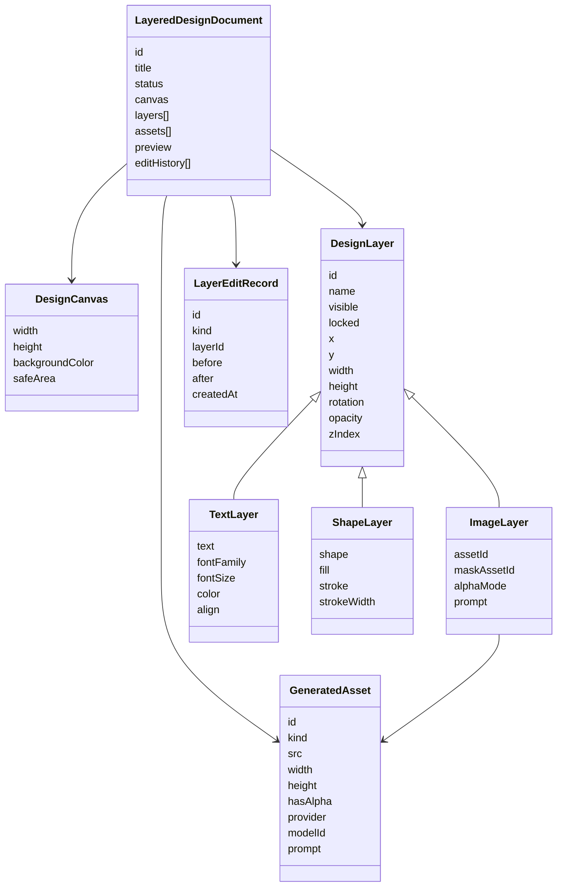
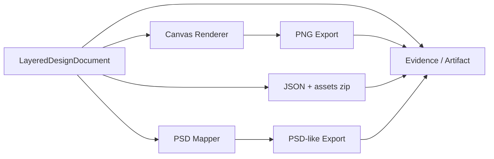
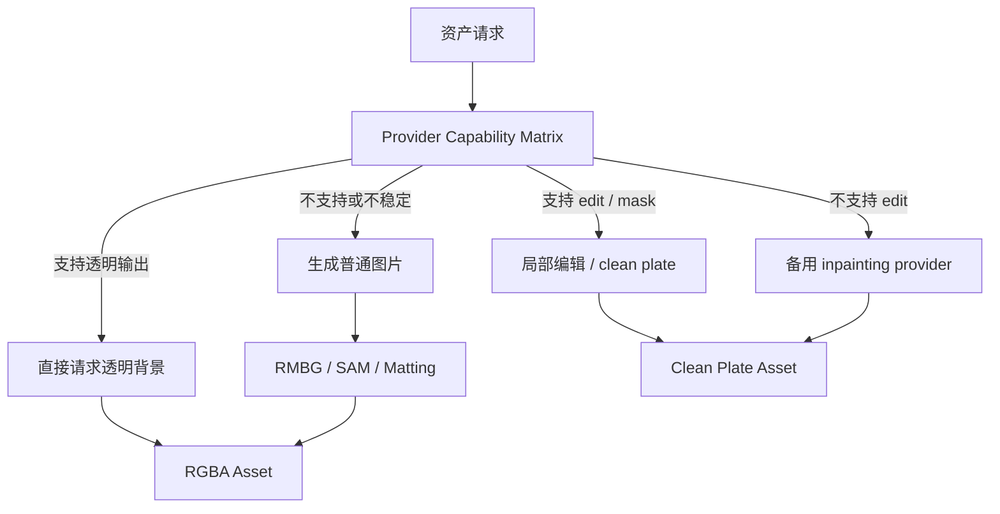

# AI 图层化设计图纸

> 状态：proposal  
> 更新时间：2026-05-05  
> 目标：用图示固定原生分层生成、扁平图拆层、单层重生成和导出链路，避免后续实现回退成单图输出。

## 0. 图纸索引

本文件保留早期总览图。后续具体设计优先阅读：

1. [architecture-diagrams.md](./architecture-diagrams.md)
2. [prototype.md](./prototype.md)
3. [sequences.md](./sequences.md)
4. [flowcharts.md](./flowcharts.md)

## 1. 原生分层生成流程

## 2. 扁平图拆层流程

## 3. 单层重生成时序

## 4. 图层文档对象关系

## 5. 导出链路

## 6. Provider 能力分流

