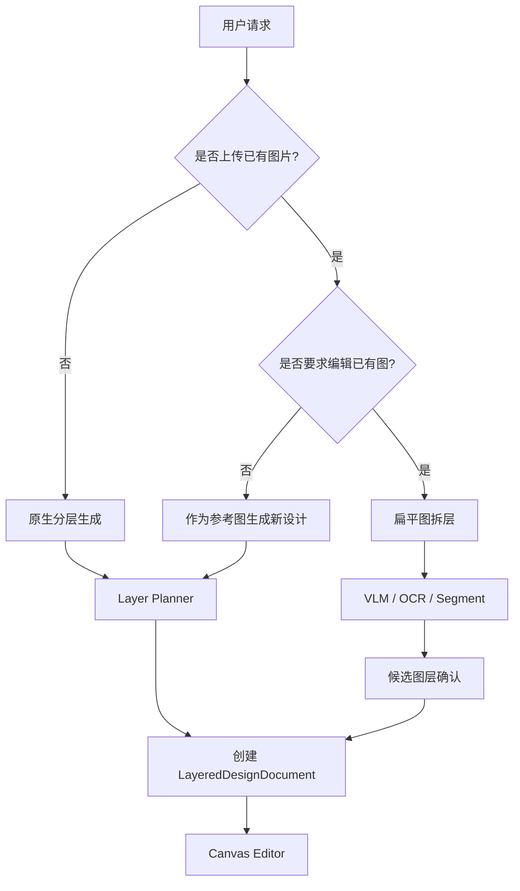
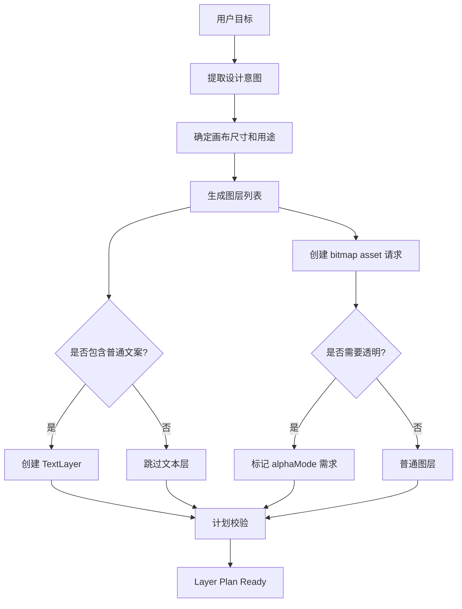
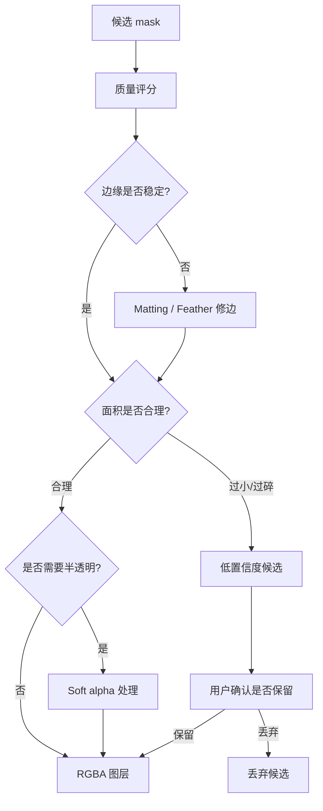
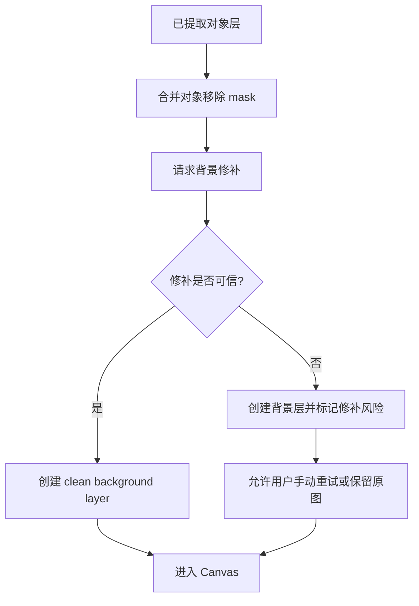
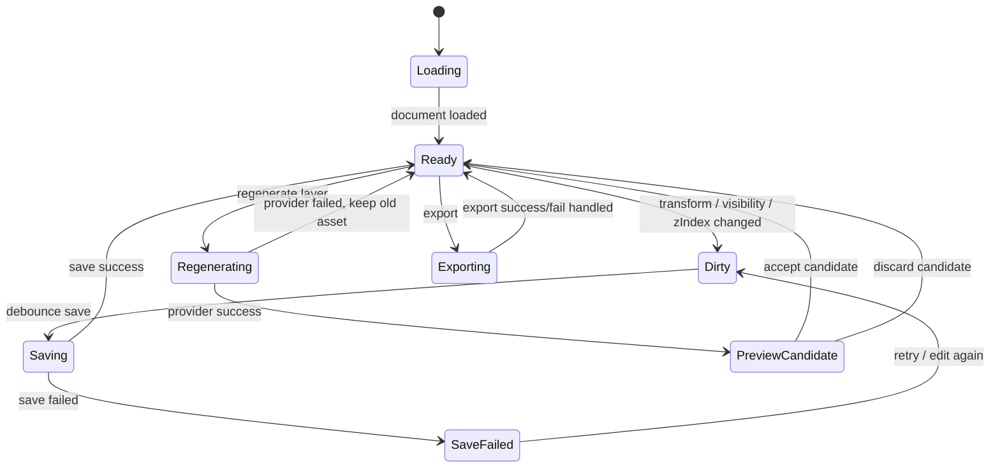
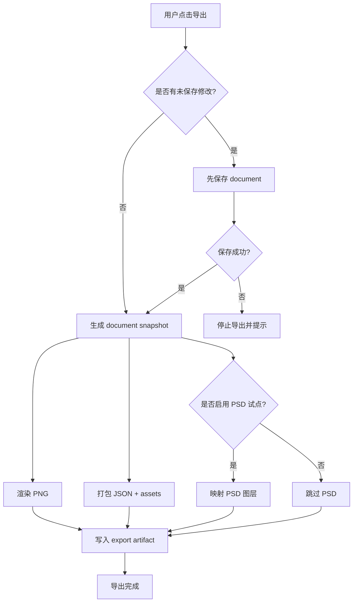
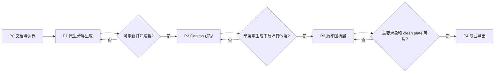

# AI 图层化设计流程图

> 状态：proposal  
> 更新时间：2026-05-05  
> 目标：固定入口分流、图层计划、mask 质量、Canvas 编辑和导出决策流程，避免实现时混成单条不可维护长链。

## 1. 入口分流流程

## 2. Layer Planner 决策流程

计划校验至少检查：

1. 背景层存在。
2. 普通文案不是 ImageLayer。
3. 每个 ImageLayer 有 asset 生成或提取来源。
4. zIndex 不冲突。
5. 画布尺寸合法。

## 3. Mask 质量门禁流程

门禁原则：

1. 不把低质量 mask 静默变成正式图层。
2. 烟雾、头发、玻璃等半透明元素走 soft alpha。
3. mask 失败时保留原图备份层。

## 4. Clean Plate 流程

移动图层体验是否可信，取决于 clean plate 是否可用。

## 5. Canvas 编辑状态机

状态规则：

1. `Dirty` 状态离开页面要提示。
2. `Regenerating` 不锁死整个画布，只锁当前层和相关操作。
3. provider 失败必须回到旧 asset。

## 6. 导出决策流程

## 7. 分阶段推进流程

阶段门禁：

1. P1 不通过，不做复杂 Canvas。
2. P2 不通过，不做任意图拆层。
3. P3 不通过，不承诺 PSD-like 专业交付。
