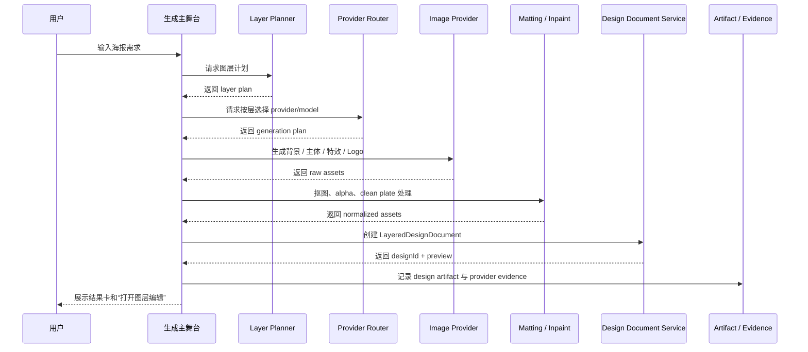
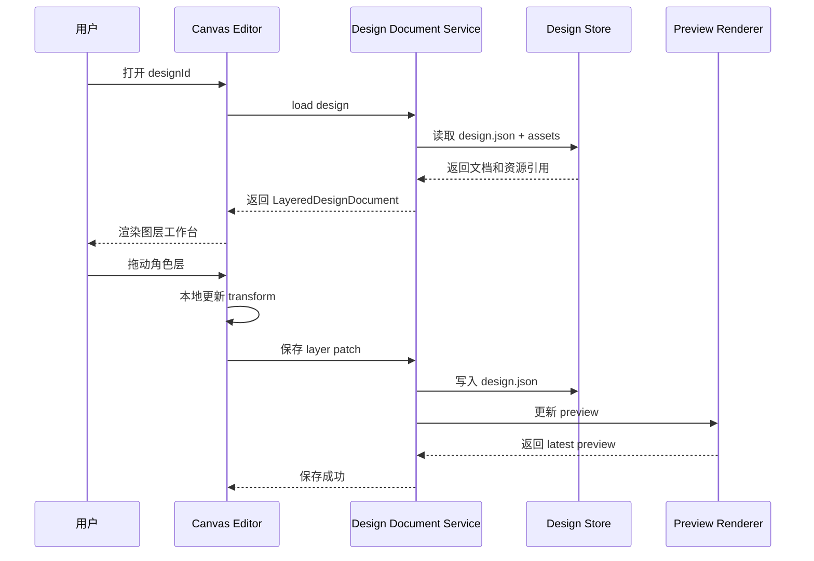
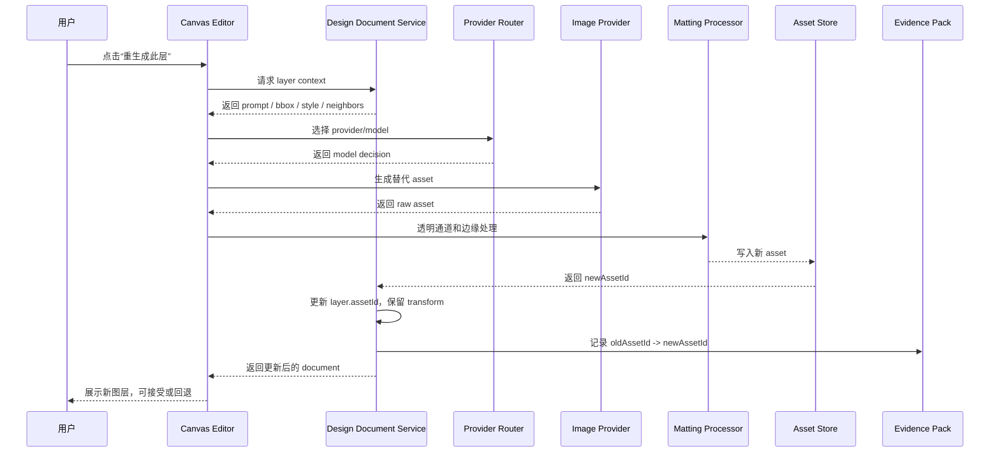
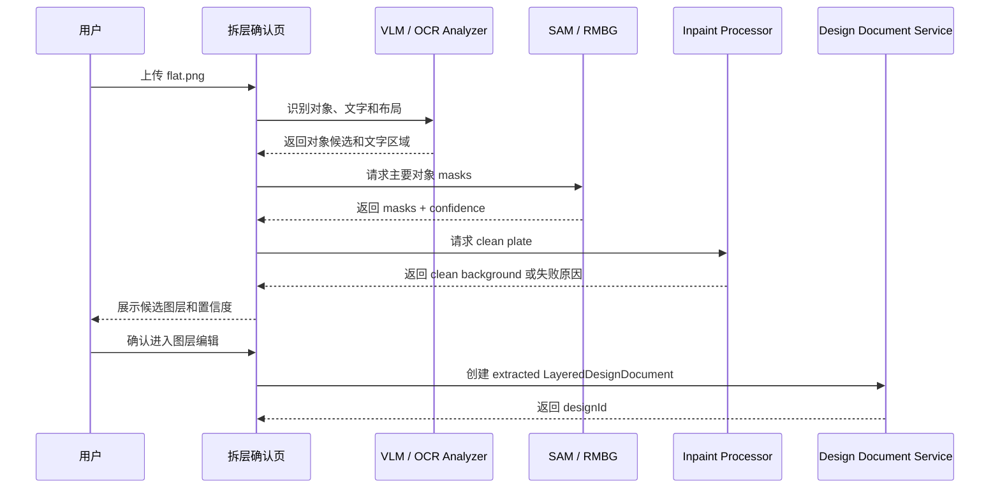
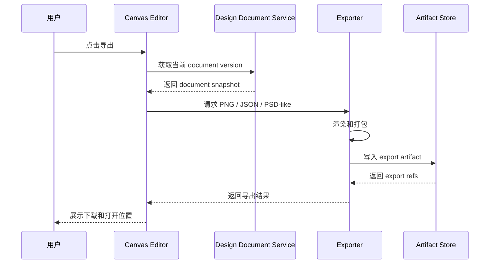
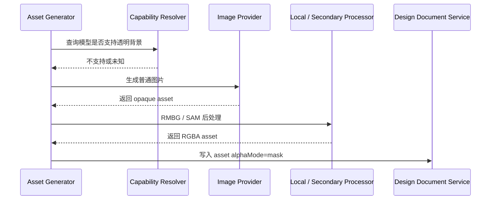

# AI 图层化设计时序图

> 状态：proposal  
> 更新时间：2026-05-05  
> 目标：固定首期核心用户流和系统调用顺序，确保生成、编辑、拆层、导出都回到 `LayeredDesignDocument`。

## 1. 原生分层生成时序

关键约束：

1. 生成成功的判断不是 provider 返回图片，而是 document 创建成功。
2. evidence 记录 provider 调用，artifact 记录设计工程。

## 2. 打开与保存编辑时序

关键约束：

1. Canvas 可以做本地乐观更新，但最终必须保存 patch。
2. 保存失败时 UI 必须保留未保存状态，不能假装已写入。

## 3. 单层重生成时序

关键约束：

1. 重生成失败不能覆盖旧 asset。
2. 重生成成功只替换资产，不改 layer id、位置和层级。

## 4. 扁平图拆层时序

关键约束：

1. 低置信度层必须让用户确认。
2. clean plate 失败不阻断进入编辑，但必须显式提示风险。

## 5. 导出时序

关键约束：

1. 导出必须绑定 document version。
2. PNG、JSON、PSD-like 都是同一份 document 的投影。

## 6. Provider 能力降级时序

关键约束：

1. 能力降级必须体现在 asset metadata。
2. UI 只显示“透明图层已生成”，不把降级细节暴露成主流程噪音。
