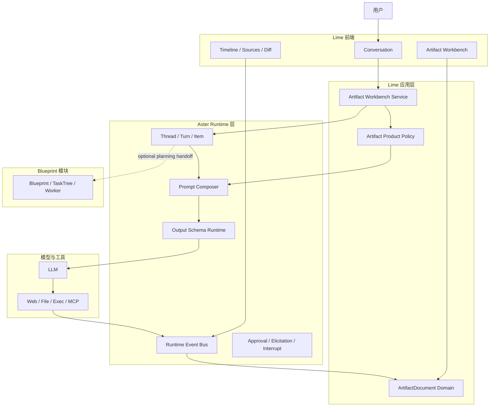
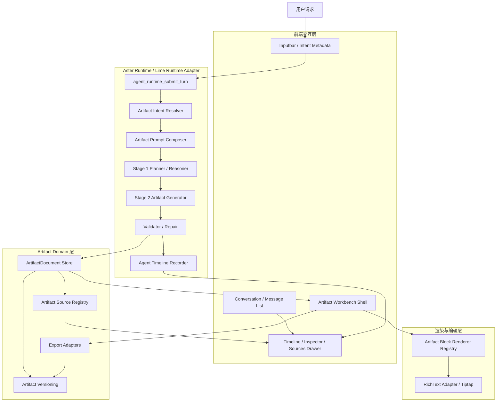
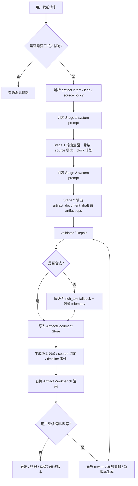
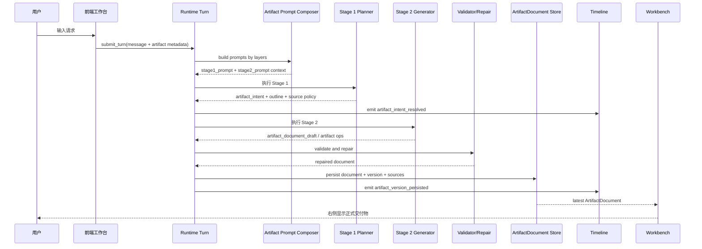
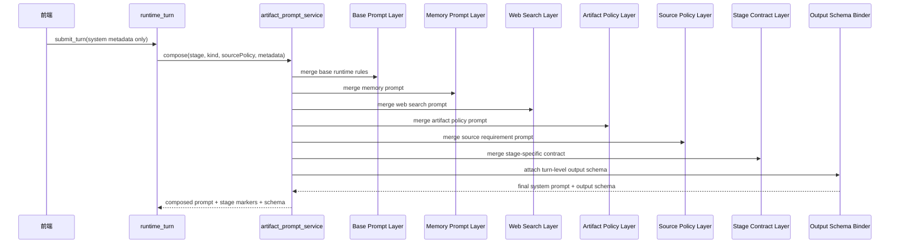
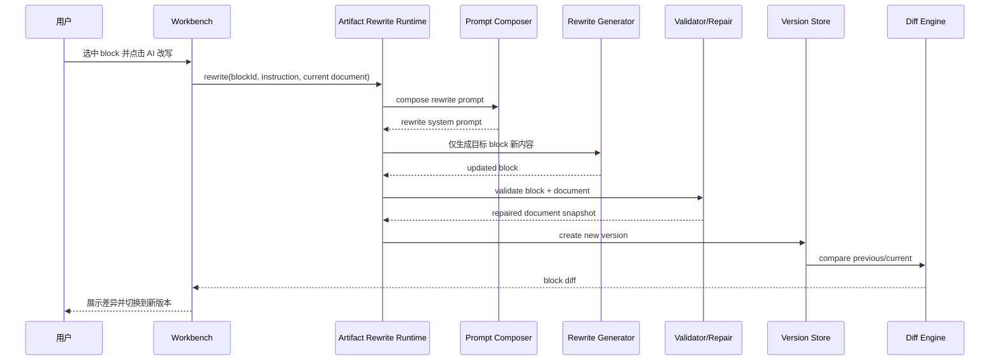
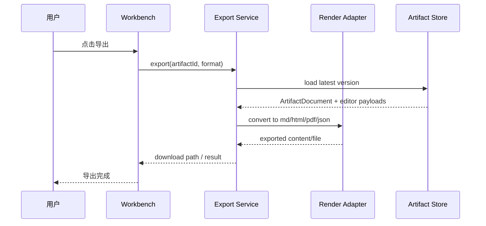

# Lime Artifact Workbench 架构蓝图

> 状态：提案  
> 更新时间：2026-03-24  
> 运行时边界：凡涉及发送边界、runtime metadata、Team 委派、Op/Event 收口，均以 `docs/roadmap/lime-conversation-execution-efficiency-roadmap.md` 为准；本文只细化 Artifact Workbench 架构  
> 依赖文档：
> - `docs/roadmap/artifacts/roadmap.md`
> - `docs/roadmap/artifacts/artifact-document-v1.md`
> - `docs/roadmap/artifacts/framework-boundary.md`
> - `docs/roadmap/artifacts/system-prompt-and-schema-contract.md`
> 目标：把 Lime 高配版 Artifact Workbench 的产品形态、运行链路、时序关系、system prompt 组装策略与实现边界收敛成一份可直接指导开发实施的总装图

## 1. 固定决策

本蓝图固定以下 v1 决策，不再留给后续实现阶段临时判断：

1. **右侧主工作台**  
   Artifact Workbench 的主交互面是聊天右侧工作台，不以全屏页为默认入口。

2. **双阶段生成**  
   高价值结构化交付物默认采用：
   - Stage 1：Reasoning / Outline / Intent Resolution
   - Stage 2：ArtifactDocument 结构化产出

3. **分层组装 prompt**  
   system prompt 由后端统一分层拼装，不让前端直接拼完整 prompt。

4. **产品层 canonical model**
   - `ArtifactDocument JSON` 是长期事实源
   - `Tiptap / ProseMirror JSON` 仅是 `rich_text` block 的编辑器载荷
   - `Markdown / HTML / PDF` 是导出快照

5. **研究类 source 强约束**
   - `report / analysis / comparison / research`：必须有 source
   - `roadmap / prd / plan / brief`：source 可选，但建议保留

6. **消息区与交付区职责分离**
   - 消息区负责解释、进度、追问、下一步
   - 交付区负责正式产物
   - 不允许整篇 Artifact 再重复贴回消息区

7. **框架层与产品层分离**
   - Lime 持有 `ArtifactDocument` 与 Workbench 产品能力
   - Aster Runtime 持有 `thread / turn / item / event / output schema`
   - `blueprint` 只是可选 planning module，不是主运行时

## 2. 文档依据

本文基于以下现役事实源：

- `src/components/agent/chat/hooks/agentRuntimeAdapter.ts`
- `src-tauri/src/commands/aster_agent_cmd/runtime_turn.rs`
- `src-tauri/src/commands/aster_agent_cmd/prompt_context.rs`
- `src-tauri/src/services/memory_profile_prompt_service.rs`
- `src-tauri/src/services/web_search_prompt_service.rs`
- `src/components/agent/chat/workspace/workbenchPreview.tsx`
- `src/components/agent/chat/workspace/WorkspaceCanvasContent.tsx`
- `src/components/artifact/ArtifactRenderer.tsx`
- `src/components/content-creator/canvas/document/editor/NotionEditor.tsx`
- `src-tauri/src/services/agent_timeline_service.rs`

从这些事实源可以确认：

1. 前端已支持 turn 级 `systemPrompt` 透传。
2. 后端现有主链已按阶段合并 `runtime agents / memory / web search / request policy / elicitation / team preference / auto continue`。
3. Lime 已具备右侧工作台、Artifact 渲染、Timeline 投影与富文本编辑器底座。
4. 需要新增的是 Artifact 相关的产品层协议、编排层与 prompt 层，而不是另造第二套聊天系统。

## 3. 总体架构

## 3.0 跨层总装图



## 3.1 总体架构图



## 3.2 分层职责

### 前端交互层

- 收集用户输入与 UI 场景元数据
- 展示消息区、右侧 Artifact Workbench、Timeline / Source Inspector
- 不负责拼装完整 system prompt
- 不负责决定最终 block schema

### Runtime 层

- 判断本次 turn 是否进入 Artifact 主链
- 组装 prompt
- 绑定 turn 级 output schema
- 执行 Stage 1 / Stage 2
- 做 validator / repair
- 产出 timeline 事件
- 持有 item / delta / approval / interrupt 语义

### Artifact Domain 层

- 作为 `ArtifactDocument` 的持久化与版本事实源
- 管理 sources、version、export records
- 连接 turn / item 与 artifact

### 渲染与编辑层

- 把 block 渲染成统一视觉组件
- 让 `rich_text` block 接入 Tiptap
- 承载局部编辑、局部 AI 改写、diff、导出

## 4. 生命周期流程

## 4.1 生命周期流程图



## 4.2 状态机

| 状态 | 说明 | 可迁移到 |
|------|------|------|
| `draft` | 已建立 ArtifactDocument，尚未开始正式流式写入 | `streaming` / `failed` |
| `streaming` | 正在由 Stage 2 或局部 rewrite 写入 | `ready` / `failed` |
| `ready` | 当前版本可用 | `streaming` / `archived` |
| `failed` | 当前回合生成失败，但文档对象仍保留 | `streaming` / `archived` |
| `archived` | 已归档，只读 | - |

触发原则：

- `artifact.begin` 或创建 draft 时进入 `draft`
- 第一个有效 block 写入时进入 `streaming`
- validator / repair 完成并落盘进入 `ready`
- Stage 2 或 rewrite 失败进入 `failed`
- 归档操作进入 `archived`

## 5. 核心时序图

以下时序图只表达产品层与运行时层的职责分工，不单独定义 Lime 当前仓库的 on-wire 字段名、命令名或 metadata 归一化细节。

这些当前实施细节统一以 `docs/roadmap/lime-conversation-execution-efficiency-roadmap.md` 为准。

## 5.1 生成时序图



## 5.2 Prompt 组装时序图



## 5.3 局部改写时序图



## 5.4 导出时序图



## 6. Prompt 架构

## 6.1 为什么必须由后端组装

当前现役事实源已经说明，system prompt 的主要规则是在后端主链按阶段合并：

- `runtime agents`
- `memory`
- `web search`
- `request tool policy`
- `elicitation`
- `team preference`
- `auto continue`

Artifact Workbench 不应绕开这条链，也不应让前端页面继续自行决定 prompt 顺序。  
因此：

- 前端只传意图元数据
- 后端统一决定 prompt 层级、去重 marker、冲突处理与日志记录

## 6.2 Prompt 分层

v1 固定采用 7 层 prompt：

### 1) Base Runtime Layer

职责：

- 基础身份
- 输出语言
- 工具边界
- 安全约束
- “消息区 vs 交付区”职责分工

### 2) Runtime Agents Layer

复用现有运行时能力提示与工作目录上下文。

### 3) Memory Layer

复用现有记忆画像和记忆来源提示。

### 4) Search / Source Layer

包含：

- 现有 web search 偏好
- 新增 Artifact source policy

规则：

- 研究类任务要求引用来源
- 普通计划类任务仅鼓励来源

### 5) Artifact Policy Layer

新增 Artifact 专属系统规则，至少包含：

1. 何时必须生成 Artifact
2. 不要把完整文档重复发回聊天区
3. 模型只输出语义结构，不输出视觉样式
4. block 类型必须来自白名单

### 6) Stage Contract Layer

根据 stage 动态切换：

- `stage1`: 输出 artifact intent / outline / source policy / block plan
- `stage2`: 输出 `artifact_document_draft` 或 `artifact ops`
- `rewrite`: 只重写指定 block

### 7) Turn Context Layer

来自 turn metadata 的本次上下文：

- theme
- artifact kind
- source policy
- selected block
- rewrite instruction
- workspace mode

### 8) Output Schema Hint Layer

职责：

- 提醒模型当前 turn 存在严格 schema
- 明确优先满足结构合同，而不是自由排版
- 让 stage1 / stage2 / rewrite 三条链分别受约束

## 6.3 Prompt marker 约定

为避免重复拼装，建议引入新 marker：

- `【Artifact 交付策略】`
- `【Artifact 来源策略】`
- `【Artifact Stage 1 合同】`
- `【Artifact Stage 2 合同】`
- `【Artifact Rewrite 合同】`

规则与现有服务一致：

- 已包含 marker 时不重复追加
- 空 prompt 不插入空段落
- 每层都是可独立观测的 prompt section

## 6.4 前端到后端的 Artifact 意图字段

前端不直接传完整 prompt，而是透传结构化 Artifact 意图。

这里的接口只描述 Artifact 领域希望表达的最小语义，不等于 Lime 当前请求载荷的最终 wire contract。  
当前仓库实际发送边界、`harness` 结构和 metadata 归一化，统一以执行效率路线图为准。

建议长期需要表达的 Artifact turn intent 包含：

```ts
interface ArtifactTurnMetadata {
  artifact_mode?: "none" | "draft" | "rewrite";
  artifact_kind?:
    | "report"
    | "roadmap"
    | "prd"
    | "brief"
    | "analysis"
    | "comparison"
    | "plan";
  artifact_stage?: "stage1" | "stage2" | "rewrite";
  source_policy?: "required" | "preferred" | "none";
  workbench_surface?: "right_panel" | "fullscreen";
  artifact_request_id?: string;
  artifact_target_block_id?: string;
  artifact_rewrite_instruction?: string;
}
```

用途：

- 驱动 prompt 组装
- 写入 timeline
- 连接 ArtifactDocument 与本次 turn

## 6.5 Stage 1 system prompt 目标

Stage 1 的职责不是写正文，而是锁定结构。

必须输出：

- 是否需要 Artifact
- `kind`
- 建议标题
- source policy
- block 计划
- section 骨架
- 风险或缺失信息

不得输出：

- 完整长文
- 任意 HTML
- 样式参数

## 6.6 Stage 2 system prompt 目标

Stage 2 的职责是生成正式结构化交付物。

必须输出：

- `artifact_document_draft`
- 或增量 `artifact ops`

必须遵守：

- block 类型白名单
- source 绑定要求
- 不重复把全文写回消息区

## 6.7 Prompt 不是唯一控制点

本蓝图在此明确：

- prompt 负责行为引导
- turn 级 output schema 负责结构约束
- validator / repair 负责最后兜底

如果只做 prompt，不做 schema 和 validator，Workbench 最终只会退化成“更漂亮的 Markdown 容器”。

## 7. 运行时服务设计

## 7.1 新增服务

建议新增：

- `src-tauri/src/services/artifact_prompt_service.rs`
- `src-tauri/src/services/artifact_document_service.rs`
- `src-tauri/src/services/artifact_document_validator.rs`
- 可选 `src-tauri/src/services/artifact_generation_orchestrator.rs`

如果同步建设 `aster-rust`，则建议把运行时通用能力下沉为独立 runtime 模块：

- `/Users/coso/Documents/dev/ai/astercloud/aster-rust/crates/aster/src/runtime/thread.rs`
- `/Users/coso/Documents/dev/ai/astercloud/aster-rust/crates/aster/src/runtime/turn.rs`
- `/Users/coso/Documents/dev/ai/astercloud/aster-rust/crates/aster/src/runtime/item.rs`
- `/Users/coso/Documents/dev/ai/astercloud/aster-rust/crates/aster/src/runtime/event.rs`
- `/Users/coso/Documents/dev/ai/astercloud/aster-rust/crates/aster/src/runtime/prompt.rs`
- `/Users/coso/Documents/dev/ai/astercloud/aster-rust/crates/aster/src/runtime/schema.rs`

这部分是框架层远期形态参考，不构成 Lime 当前仓库的直接实施清单。

职责：

### `artifact_prompt_service`

- 组装 Artifact 相关 prompt 层
- 输出 stage1/stage2/rewrite 的最终 system prompt
- 记录 prompt stage 结果

### `artifact_document_service`

- 持久化 `ArtifactDocument`
- 管理版本、sources、导出记录
- 提供读模型给右侧 Workbench

### `artifact_document_validator`

- 做 schema 校验
- 做 repair
- 输出 telemetry 与错误信息

### `artifact_generation_orchestrator`

- 负责编排 Stage 1 / Stage 2
- 连接 timeline 与 store
- 负责失败回退

## 7.2 建议新增事件

建议新增以下运行时事件，既供前端消费，也供 timeline 投影：

- `artifact_intent_resolved`
- `artifact_stage_started`
- `artifact_stage_completed`
- `artifact_validation_repaired`
- `artifact_validation_failed`
- `artifact_version_persisted`
- `artifact_ready_for_render`

## 8. 前端工作台设计

## 8.1 右侧主工作台壳层

建议新增 `ArtifactWorkbenchShell`，统一承载：

- 阅读态
- 编辑态
- 版本条
- source drawer
- diff 入口
- 导出入口

### 阅读态

- 主渲染面
- 使用 block renderer
- `rich_text` block 才接 Tiptap static renderer

### 编辑态

- 仅对 `rich_text` block 进入 Tiptap 编辑
- 结构型 block 走专用编辑表单或轻量编辑器

### 来源抽屉

- 展示 `sourceId -> locator`
- 可跳转到 timeline item / web result / file path

## 8.2 与现有模块的关系

| 现有模块 | 蓝图定位 |
|------|------|
| `workbenchPreview.tsx` | 过渡期入口壳 |
| `WorkspaceCanvasContent.tsx` | 右侧容器事实源 |
| `ArtifactRenderer.tsx` | 兼容层入口，后续可下沉为 block renderer 包装器 |
| `NotionEditor.tsx` | `rich_text` block 编辑器 |
| `AgentThreadTimeline.tsx` | 过程和证据面 |

## 9. 数据与导出

## 9.1 产品层事实源

唯一长期事实源：

- `ArtifactDocument JSON`

附属快照：

- `editor_payload_snapshot`
- `markdown_snapshot`
- `render_manifest`

规则：

- 产品逻辑只依赖 `ArtifactDocument`
- 编辑器恢复依赖 `editor_payload_snapshot`
- 导出依赖 `markdown_snapshot` 或渲染适配

## 9.2 导出策略

v1 支持：

- Markdown
- HTML
- PDF
- JSON

其中：

- Markdown 面向可复用文本
- HTML/PDF 面向阅读和交付
- JSON 面向版本、调试、二次处理

## 10. 失败与回退

## 10.1 Stage 1 失败

- 回退为普通消息链路
- timeline 标记本次未进入 Artifact 主链

## 10.2 Stage 2 失败

- 仍创建 ArtifactDocument
- 状态记为 `failed`
- 保留最小 fallback 内容：
  - 一个 `rich_text(markdown)` block
  - 错误诊断进入 timeline / telemetry

## 10.3 validator 失败

- 优先 repair
- repair 后仍失败则降级为 `rich_text(markdown)`
- 不允许把不合法结构直接渲染成 ready

## 11. 验收标准

满足以下条件，才算架构蓝图落地正确：

1. 右侧 Workbench 成为高价值交付物默认展示面。
2. system prompt 的 Artifact 规则由后端统一组装，不由前端页面拼接。
3. Stage 1 与 Stage 2 的输出边界清晰，timeline 能区分。
4. `ArtifactDocument JSON` 与 `Tiptap/ProseMirror JSON` 的层级关系明确，不混淆。
5. 研究类交付物缺 source 时不会直接进入 ready。
6. 消息区不再重复整篇 Artifact。
7. `blueprint` 不承担 Artifact 主链的根抽象。
8. turn 级 output schema 已纳入主链，而不是只靠 prompt。

## 12. 本蓝图刻意不做

1. 不做无限开放的 block DSL。
2. 不做任意页面搭建器。
3. 不做完整协同编辑协议。
4. 不做全屏页优先的主导航改造。
5. 不做所有内容类型一次性统一迁移。

## 13. 实施顺序建议

建议严格按以下顺序推进：

1. 实现 `artifact_prompt_service` 与 prompt marker
2. 实现 Stage 1 / Stage 2 编排
3. 实现 validator / repair
4. 实现 `ArtifactWorkbenchShell`
5. 接入 3 个核心结构块：
   - `hero_summary`
   - `callout`
   - `table`
6. 最后再接入 source drawer、diff、导出

原因：

**没有 prompt 合同和 validator，WorkBench 只会成为更漂亮的 Markdown 容器。**
