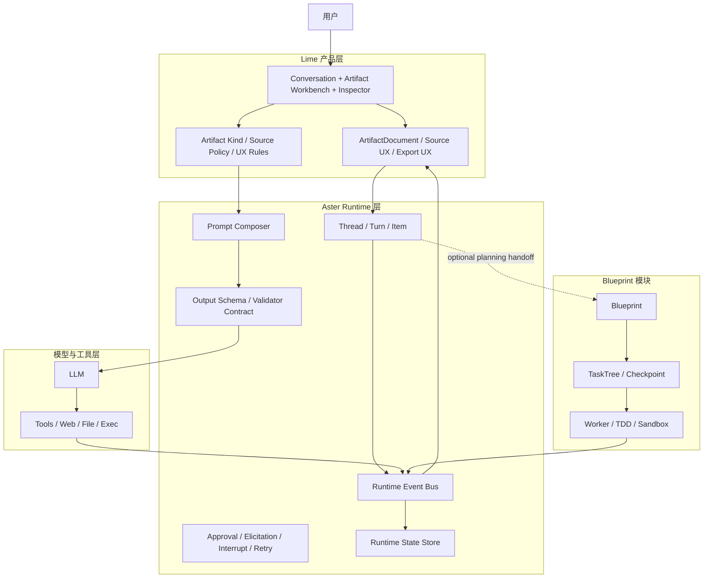
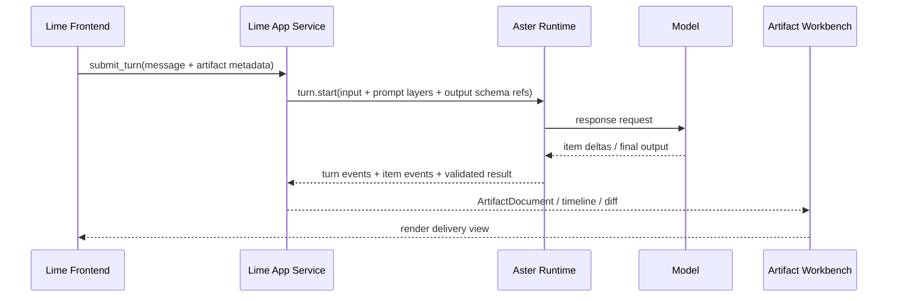

# Lime Artifact Workbench 与 Aster Runtime 分层边界

> 状态：提案  
> 更新时间：2026-03-24  
> 运行时边界：凡涉及发送边界、runtime metadata、Team 委派、Op/Event 收口、状态同步，均以 `docs/aiprompts/query-loop.md`、`docs/aiprompts/task-agent-taxonomy.md`、`docs/aiprompts/state-history-telemetry.md` 与 `docs/exec-plans/upstream-runtime-alignment-plan.md` 为准；本文只定义长期框架分层原则与远期边界  
> 关联文档：
> - `docs/roadmap/artifacts/roadmap.md`
> - `docs/roadmap/artifacts/architecture-blueprint.md`
> - `docs/roadmap/artifacts/system-prompt-and-schema-contract.md`
> 目标：明确 Lime 产品层、Aster 框架层、Blueprint 规划模块三者的长期职责边界，避免后续把产品协议、任务规划、运行时编排混成一团

## 1. 结论先行

本文件锁定以下分层判断：

1. **Lime 持有产品层交付物模型**
   - `ArtifactDocument`
   - Workbench UI
   - block renderer / editor / source drawer / export
   - `report / roadmap / prd / analysis / comparison` 这些产品语义

2. **Aster 应补齐通用 runtime substrate**
   - `thread / turn / item / event`
   - prompt 组装管线
   - turn 级 `output schema`
   - approval / elicitation / interrupt / retry
   - 运行时状态持久化与事件流

3. **Blueprint 不是 Artifact Workbench 的根抽象**
   - Blueprint 应定位为长期规划与执行模块
   - 适合承接需求蓝图、任务树、TDD loop、worker coordination
   - 不适合作为 Lime 文档交付协议或聊天主运行时

4. **Codex 值得参考的是运行时协议，不是它的 artifact 名字**
   - `codex` 的强项在 `turn/start + outputSchema + item events + thread state`
   - `codex-artifacts` 则是本地 JS runtime 的 presentation/spreadsheet 工具，不是报告文档协议

一句话总结：

**Lime 负责“交付物产品”，Aster 负责“代理运行时”，Blueprint 负责“长周期规划”。**

## 2. 事实依据

## 2.1 Lime 现役事实

来自以下文件：

- `src-tauri/src/commands/aster_agent_cmd/runtime_turn.rs`
- `src-tauri/src/commands/aster_agent_cmd/prompt_context.rs`
- `src-tauri/src/services/memory_profile_prompt_service.rs`
- `src-tauri/src/services/web_search_prompt_service.rs`
- `src/components/agent/chat/hooks/agentRuntimeAdapter.ts`

可确认：

1. Lime 已经有以 turn 为单位的运行链路。
2. system prompt 已经是后端分层组装，而不是纯前端拼接。
3. 前端只需要透传结构化 metadata，就可以驱动不同运行策略。
4. Lime 当前缺的是正式 Artifact 产品协议与工作台闭环，而不是重新发明 thread/turn 的概念。

## 2.2 Aster Blueprint 现役事实

来自以下文件：

- `src-tauri/crates/aster-rust/crates/aster/src/blueprint/README.md`
- `src-tauri/crates/aster-rust/crates/aster/src/blueprint/types.rs`
- `src-tauri/crates/aster-rust/crates/aster/src/blueprint/task_tree_manager.rs`
- `src-tauri/crates/aster-rust/crates/aster/src/blueprint/worker_executor.rs`

可确认：

1. Blueprint 的中心对象是 `Blueprint / TaskTree / TaskNode / Checkpoint / WorkerAgent`。
2. 它的 `ArtifactType` 是 `file / patch / command`，明显偏代码执行产物。
3. prompt 模板围绕 TDD 测试、写代码、重构，不围绕正式交付文档。
4. Timeline 也是任务执行事件，不是聊天交付事件。

因此：

**Blueprint 与 Artifact Workbench 存在概念相邻，但语义核心不同。**

## 2.3 Codex 现役事实

来自以下文件：

- `/Users/coso/Documents/dev/rust/codex/codex-rs/app-server/README.md`
- `/Users/coso/Documents/dev/rust/codex/codex-rs/app-server-protocol/schema/typescript/v2/TurnStartParams.ts`
- `/Users/coso/Documents/dev/rust/codex/codex-rs/app-server/src/thread_state.rs`
- `/Users/coso/Documents/dev/rust/codex/codex-rs/codex-api/src/common.rs`
- `/Users/coso/Documents/dev/rust/codex/codex-rs/core/src/memories/phase1.rs`
- `/Users/coso/Documents/dev/rust/codex/codex-rs/artifacts/README.md`

可确认：

1. `turn/start` 支持 turn 级 `outputSchema`。
2. app-server 明确定义了 `thread / turn / item / item delta / approval / interruption` 协议。
3. 内部已经把结构化输出作为 runtime 能力，而不是业务页面私货。
4. `codex-artifacts` 只是受控 JS artifact runtime，不是文档产品协议。

因此：

**Codex 给我们的参考点，是 runtime substrate 的形状。**

## 3. 分层总图



## 4. 职责边界表

| 能力 | Lime 产品层 | Aster Runtime 层 | Blueprint 模块 |
|------|------|------|------|
| 线程 / 回合 / item 生命周期 | 不持有根定义 | 持有 | 可消费 |
| turn 级 `output schema` | 提供业务 schema | 持有执行通道 | 不负责 |
| prompt 分层组装 | 提供 Artifact 业务片段 | 持有总组装器 | 仅自有规划 prompt |
| 正式交付物对象 | 持有 `ArtifactDocument` | 不持有业务语义 | 不持有 |
| block renderer / editor | 持有 | 不持有 | 不持有 |
| source policy | 持有业务规则 | 负责执行与校验挂钩 | 不持有 |
| approvals / elicitation / interrupt | UI 展示与交互 | 持有协议与状态 | 可复用 |
| task tree / TDD loop | 仅作为某类 Artifact 来源 | 可桥接 | 持有 |
| file / patch / command 代码产物 | 只做引用展示 | 可流转 | 持有 |

## 5. 为什么 Blueprint 不应直接接管 Artifact Workbench

## 5.1 对象模型不匹配

Blueprint 的产物中心是：

- 模块
- 任务
- 测试
- patch
- command

Lime Artifact Workbench 的产物中心是：

- 文档
- block
- source
- version
- reading/edit/export

这不是同一类对象。

## 5.2 生命周期不匹配

Blueprint 关注：

- 立项
- 拆任务
- 执行
- 回滚
- 验收

Artifact Workbench 关注：

- 生成草稿
- 结构校验
- 工作台阅读
- 局部改写
- 版本 diff
- 导出分享

前者是执行治理，后者是交付体验。

## 5.3 prompt 不匹配

Blueprint 的 prompt 语言天然偏：

- 写测试
- 写实现
- 修复错误
- 重构代码

Artifact Workbench 要控制的是：

- 交付物 kind
- source policy
- block plan
- report / roadmap / comparison 结构

直接混用会让 runtime 概念污染产品协议。

## 6. 应从 Codex 借鉴什么

## 6.1 必须借鉴

1. **turn 级输出 schema**
   - 每次调用都能带一个明确的结构目标
   - 不把“结构化输出”写死成某个固定产品

2. **thread / turn / item / delta 协议**
   - UI 能增量渲染
   - 持久化层能重建历史
   - 工具、计划、消息、文件改动可归一化

3. **独立的事件流**
   - `turn_started`
   - `item_started`
   - `item_delta`
   - `item_completed`
   - `turn_completed`

4. **approval / elicitation / interrupt 是 runtime 一等公民**
   - 不能散落在某个单独产品页面中硬编码

## 6.2 不应照搬

1. 不照搬 `codex-artifacts` 的 JS runtime 工具模型。
2. 不照搬终端/TUI 的 UI 心智。
3. 不把 Lime 的文档协议退化成单一 `outputSchema` 结果对象。

因为 Lime 的核心仍然是：

**多轮对话中的正式交付物工作台。**

## 7. 建议中的 Aster Runtime 新边界

这里要明确：

- 本节描述的是 **Aster 框架层的目标形状参考**
- 不是 Lime 当前仓库的直接实施主计划
- 如果与上述 current 文档的当前迁移顺序、协议收口方式冲突，以 current 文档为准

建议在 `aster-rust` 中，把通用 agent runtime 从 `blueprint` 旁边独立出来，而不是继续把所有能力堆进 `blueprint/`。

建议中的模块形态：

```text
crates/aster/src/runtime/
  mod.rs
  thread.rs
  turn.rs
  item.rs
  event.rs
  prompt.rs
  schema.rs
  approval.rs
  persistence.rs
  orchestration.rs
```

建议职责：

- `thread.rs`：线程与上下文边界
- `turn.rs`：turn 生命周期、输入、状态机
- `item.rs`：消息、plan、tool、artifact stage 等 item 定义
- `event.rs`：统一事件类型与 delta
- `prompt.rs`：分层 prompt composer
- `schema.rs`：turn 级输出 schema 注册与校验入口
- `approval.rs`：approval / elicitation / interrupt / retry
- `persistence.rs`：runtime state 存储
- `orchestration.rs`：Stage Runner、模型调用与失败恢复

## 8. Lime 与 Aster 的连接方式

本节时序图只表达长期职责连接，不单独定义 Lime 当前发送协议字段名。

建议 Lime 不直接自己实现第二套完整 runtime，而是成为 Aster runtime 的产品适配层：



这里的关键是：

- Lime 提供业务语义和工作台
- Aster 提供运行时协议和编排
- 两者通过 turn metadata、schema id、event taxonomy 对接
- 但 Lime 当前仓库里的实际发送边界和 runtime 收口步骤，仍按执行效率路线图推进

## 9. 实施顺序建议

本节属于框架层远期演进建议，不覆盖 Lime 当前仓库已确定的 P1 / P2 / P3 / P4 执行顺序。

## Phase A：先立 runtime 边界

- 在文档和接口层确认 Aster runtime 与 Blueprint 分家
- 定义 `thread / turn / item / event / schema`

## Phase B：再接 Artifact 主链

- Lime 将 Stage 1 / Stage 2 接到 Aster runtime turn
- 引入 Artifact 专用 output schema

## Phase C：最后接 Blueprint

- 仅在需要“长周期规划 / 多 worker 执行”时，把 Blueprint 作为特殊 item 或 planning capability 接入
- 不让 Blueprint 接管普通 report / prd / roadmap 生成

## 10. 最终决策

长期最稳的架构不是：

**Blueprint 不断膨胀，最后既当聊天 runtime，又当 Artifact 协议，又当任务执行器。**

长期最稳的架构应该是：

**Codex 式 runtime substrate + Blueprint 式 planning module + Lime 式 artifact product layer。**
