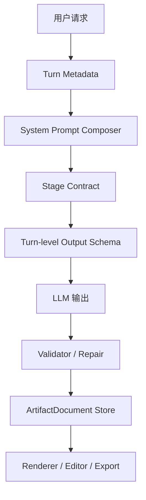
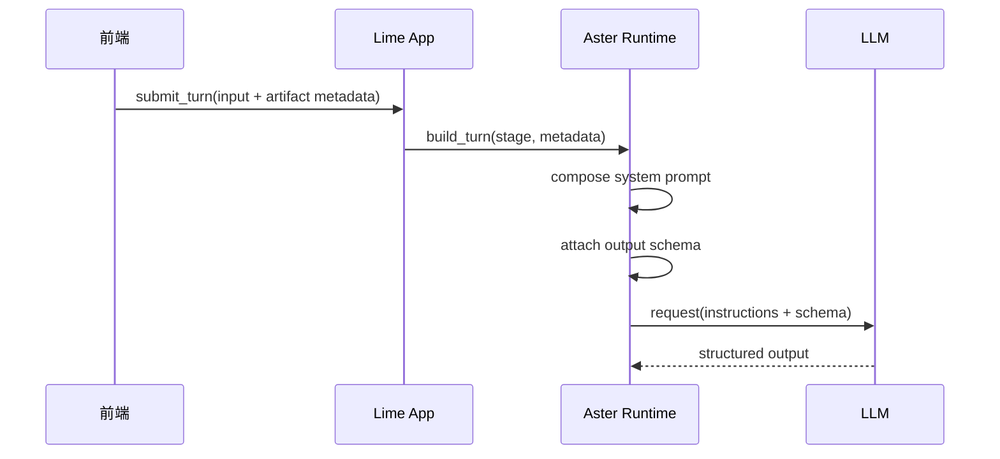

# Artifact Workbench 的 System Prompt 与 Schema 合同

> 状态：进行中，核心合同已落地，P3 产品闭环已落地，rewrite typed patch 与 current incremental 合同已落地  
> 更新时间：2026-03-31  
> 运行时边界：prompt 组装入口、turn metadata 主合同、runtime output schema 注入链以 `docs/aiprompts/query-loop.md`、`docs/aiprompts/state-history-telemetry.md` 与 `docs/exec-plans/upstream-runtime-alignment-plan.md` 为准；本文只细化 Artifact 相关合同  
> 关联文档：
> - `docs/roadmap/artifacts/architecture-blueprint.md`
> - `docs/roadmap/artifacts/artifact-document-v1.md`
> - `docs/roadmap/artifacts/framework-boundary.md`
> 目标：定义 Artifact Workbench 在运行时如何通过 prompt、turn metadata、output schema、validator 四层协同控制结构化输出质量

## 当前落地状态

以下能力已经进入实现态：

1. 后端已按 turn metadata 组装 Artifact 专属 prompt 段落。
2. Artifact 回合已在 `runtime_turn` 中绑定 turn-level output schema。
3. 结构化输出已经接入 validator / repair / fallback，并可落盘为 `ArtifactDocument v1`。
4. `stage2` 已允许输出 `artifact_document_draft | current 单条 incremental op | artifact_ops`，`rewrite` 已允许输出 `artifact_rewrite_patch | current 单条 incremental op | artifact_ops`。
5. 后端已支持最小 current-first 增量应用链，可在已有 Artifact 上执行 block / source / version 级增量更新；`artifact_ops` 只保留 compat 输入壳。
6. 当前版本已回灌 `currentVersionDiff / artifactVersionDiff`，Workbench 也已接入来源抽屉、差异面以及来源项 / 差异项到 block 的定位。
7. 当前版本已支持 `timeline item <-> artifact block` 双向跳转：timeline 可精确打开目标 block，Workbench 也可回跳对应过程项。
8. `rewrite` 已把 `artifact_target_block_id` 下沉到 prompt hint、turn-level output schema、runtime apply 与 persist validator context；非目标 block 的改写 / 绑定 / 删除会被忽略并记录 issue。
9. `rewrite` 已支持专用 `artifact_rewrite_patch` 输出 envelope，同时接受正式单条 incremental op；后端会直接把它们归一化到内部 action 列表，`artifact_ops` 只作为 compat 回退输入，便于逐步把改写合同从“通用 ops”收紧到“目标 block patch”。

仍未完全落地的部分：

1. rewrite 已具备 typed patch + current 单条 op 主合同，但当前仍保留 `artifact_ops` 兼容分支；待模型稳定后可进一步收紧到单一 rewrite envelope

## 1. 核心观点

用户之前的判断是对的：

**渲染只是结果层。**

如果模型上游没有被清晰约束，后面的漂亮渲染只是在给随机长文做包装。

Artifact Workbench 的真正控制链应是：

1. prompt policy 决定任务规则
2. stage contract 决定本轮该输出什么
3. output schema 决定结果必须长什么结构
4. validator / repair 决定是否可以进入 ready
5. renderer 决定最终视觉呈现

一句话：

**结构质量先于视觉质量。**

## 2. 总控制栈



## 3. 为什么不能只靠 Prompt

只靠 prompt，会稳定出现以下问题：

1. **阶段串线**
   - Stage 1 应该给结构计划，结果却开始写正文
2. **来源丢失**
   - 明明要求 source，模型仍然忘记挂引用
3. **block 漂移**
   - 一会儿输出表格，一会儿输出纯长文
4. **协议脆弱**
   - 一旦模型换版本，结果 shape 就可能漂

所以 prompt 只能解决“倾向”，不能单独保证“合同”。

## 4. 参考基准

本合同借鉴 `codex` 的一个关键思路：

- turn 可以携带自己的 `outputSchema`
- schema 只约束当前 turn 的结构，不污染整个产品层协议

依据：

- `/Users/coso/Documents/dev/rust/codex/codex-rs/app-server/README.md`
- `/Users/coso/Documents/dev/rust/codex/codex-rs/app-server-protocol/schema/typescript/v2/TurnStartParams.ts`
- `/Users/coso/Documents/dev/rust/codex/codex-rs/codex-api/src/common.rs`

这说明：

**把结构化输出做成 runtime 能力，比把所有结构约束硬写死在前端页面或单个 prompt 模板里更稳。**

## 5. 后端 Prompt 组装原则

## 5.1 前端不拼完整 prompt

前端只提供：

- 用户输入
- artifact metadata
- 工作台上下文
- 局部改写目标

后端负责：

- 合并基础 system prompt
- 合并记忆/搜索/source 规则
- 合并 Artifact 专属规则
- 合并 stage 合同
- 绑定 output schema

## 5.2 Prompt 分层

建议长期固定为以下 8 层：

1. `Base Runtime Layer`
   - 身份、语言、安全边界、消息区与交付区职责分离

2. `Workspace / Team Layer`
   - 团队偏好、项目约束、cwd、工作模式

3. `Memory Layer`
   - 记忆画像、长期偏好、已知上下文

4. `Search / Source Layer`
   - 搜索行为、来源要求、引文约束

5. `Artifact Policy Layer`
   - 什么时候必须进入 Artifact
   - 不要在消息区重复整篇文档
   - 只能输出白名单 block

6. `Stage Contract Layer`
   - 当前是 `stage1 / stage2 / rewrite`

7. `Turn Context Layer`
   - kind、source_policy、selected_block、rewrite_instruction

8. `Schema Hint Layer`
   - 明确提醒本轮有严格 output schema
   - 模型应优先满足 schema 而不是自由发挥

## 5.3 Marker 约定

建议统一 marker：

- `【Artifact 交付策略】`
- `【Artifact 来源策略】`
- `【Artifact Stage 1 合同】`
- `【Artifact Stage 2 合同】`
- `【Artifact Rewrite 合同】`
- `【Artifact 输出 Schema 提示】`

作用：

- 可观测
- 可去重
- 可调试

## 6. Turn Metadata 合同

这里的 `ArtifactTurnMetadata` 只表达 Artifact 领域的意图模型，不直接等于 Lime 当前仓库的请求 wire format。

当前实际发送边界、`harness` 结构、metadata 归一化与兼容收口，统一以上述 current 入口为准。

建议长期保留以下 Artifact turn intent：

```ts
interface ArtifactTurnMetadata {
  artifactMode?: "none" | "draft" | "rewrite";
  artifactKind?:
    | "report"
    | "roadmap"
    | "prd"
    | "brief"
    | "analysis"
    | "comparison"
    | "plan";
  artifactStage?: "stage1" | "stage2" | "rewrite";
  sourcePolicy?: "required" | "preferred" | "none";
  workbenchSurface?: "right_panel" | "fullscreen";
  artifactRequestId?: string;
  artifactTargetBlockId?: string;
  artifactRewriteInstruction?: string;
}
```

这里的设计原则是：

- metadata 表达意图
- prompt 表达规则
- schema 表达结构

三者不要混写。

## 7. Stage 合同

## 7.1 Stage 1

职责：

- 判断是否需要正式交付物
- 锁定 `kind`
- 生成标题建议
- 生成 source policy
- 生成 block plan / section outline
- 标记缺口与风险

禁止：

- 直接写完整长文
- 输出 HTML / CSS
- 输出最终排版说明

建议 schema 形态：

```ts
interface ArtifactStage1Result {
  needsArtifact: boolean;
  kind:
    | "report"
    | "roadmap"
    | "prd"
    | "brief"
    | "analysis"
    | "comparison"
    | "plan";
  title: string;
  sourcePolicy: "required" | "preferred" | "none";
  outline: Array<{
    id: string;
    title: string;
    goal: string;
  }>;
  blockPlan: Array<{
    id: string;
    type:
      | "section_header"
      | "hero_summary"
      | "key_points"
      | "rich_text"
      | "callout"
      | "table"
      | "checklist"
      | "metric_grid"
      | "citation_list";
    sectionId?: string;
    purpose: string;
  }>;
  gaps?: string[];
}
```

## 7.2 Stage 2

职责：

- 输出正式 `artifact_document_draft`
- 或输出正式单条 incremental op
- `artifact_ops` 只作为兼容回退

必须：

- 满足 `ArtifactDocument v1`
- 满足 source 约束
- block 类型只能来自白名单

建议 schema 形态：

```ts
type ArtifactStage2Result =
  | {
      type: "artifact_document_draft";
      document: ArtifactDocumentV1;
    }
  | ArtifactOpEnvelope
  | {
      type: "artifact_ops";
      artifactId: string;
      ops: Array<Record<string, unknown>>;
    };
```

## 7.3 Rewrite

职责：

- 只改目标 block
- 不允许顺手重写整篇文档

建议 schema 形态：

```ts
type ArtifactRewriteResult =
  | {
      type: "artifact_rewrite_patch";
      artifactId: string;
      targetBlockId: string;
      block: ArtifactBlockV1;
      source?: ArtifactSourceV1;
      sources?: ArtifactSourceV1[];
      summary?: string;
      status?: ArtifactStatus;
    }
  | Extract<
      ArtifactOpEnvelope,
      {
        type:
          | "artifact.source.upsert"
          | "artifact.block.upsert"
          | "artifact.complete"
          | "artifact.fail";
      }
    >
  | {
      type: "artifact_ops";
      artifactId: string;
      ops: Array<Record<string, unknown>>;
    };
```

## 8. Output Schema 策略

## 8.1 Schema 绑定位置

建议 schema 不是前端硬编码，而是由后端在 turn 发起时绑定。

以下时序图只表达“绑定责任在后端”，不单独定义当前仓库的命令名、函数名或中间结构：



## 8.2 Schema 颗粒度

建议采用三类 schema：

1. **运行时 schema**
   - 限制某一轮输出结构
2. **产品层 schema**
   - `ArtifactDocument v1`
3. **编辑器 payload schema**
   - `rich_text` 内的 ProseMirror/Tiptap JSON

不要把这三层混成一个巨大 schema。

## 8.3 Schema 与 Validator 的关系

schema 不是 validator 的替代品。

原因：

1. 模型可能输出“表面符合 schema，但业务仍非法”的内容
2. sourceId 引用、block 数量、fallback 等逻辑需要业务修复
3. 编辑器 payload 可能需要额外兼容修正

因此主链仍然必须有：

- schema check
- business validation
- repair
- fallback

## 9. Validator / Repair 策略

validator 至少负责：

1. 顶层字段校验
2. block 类型白名单校验
3. source 引用合法性校验
4. `rich_text` payload 兼容性校验
5. source policy 业务校验

repair 至少负责：

1. 缺省 title 补全
2. table 行列补齐
3. citation 无效项删除
4. block fallback 到 `rich_text(markdown)`
5. 整体失败时回退为单个 `rich_text` 文档

## 10. 推荐实现边界

## 10.1 Lime 产品层

建议新增或持有：

- `artifact_document_schema.ts`
- `artifact_stage1_schema.ts`
- `artifact_stage2_schema.ts`
- `artifact_rewrite_schema.ts`
- `artifact_document_validator.ts`
- `artifact_document_repair.ts`

## 10.2 Aster Runtime 层

建议持有：

- prompt composer
- turn 级 schema registry
- model invocation wrapper
- item/turn events
- output parsing / validation hook

## 11. 最终决策

Artifact Workbench 的输出质量，不应依赖“模型今天状态好不好”。

长期正确方案是：

**Prompt 负责引导，Schema 负责约束，Validator 负责兜底，Renderer 负责呈现。**
