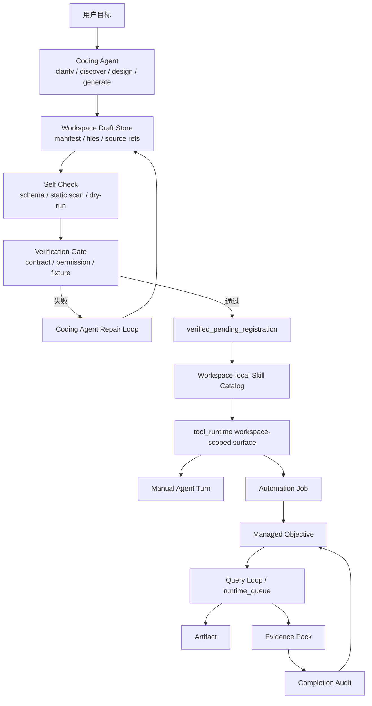

# CREAO / Coding Agent 方案架构 Review

> 状态：review gate  
> 更新时间：2026-05-06
> 目标：在进入实现前，重新检查 CREAO 启发下的 Lime 方案是否缺层、缺闭环，或误把 Skill / 目标续跑当成完整 Agent 系统。

依赖文档：

- [./README.md](./README.md)
- [./coding-agent-layer.md](./coding-agent-layer.md)
- [./implementation-plan.md](./implementation-plan.md)
- [./diagrams.md](./diagrams.md)
- [../managed-objective/README.md](../managed-objective/README.md)
- [../../research/creaoai/pivot-and-org-harness.md](../../research/creaoai/pivot-and-org-harness.md)
- [../../research/creaoai/agent-product-model.md](../../research/creaoai/agent-product-model.md)
- [../../research/creaoai/architecture-breakdown.md](../../research/creaoai/architecture-breakdown.md)
- [../../research/pi-mono-coding-agent/README.md](../../research/pi-mono-coding-agent/README.md)

## 1. Review 结论

当前方案已经比最初完整，但仍不能直接进入“大实现”。

最关键的修正是：

**必须先实现 Coding Agent / Skill Forge 的能力生成闭环，再实现 tool_runtime 授权调用与 Managed Objective 的可调度 rerun 闭环；Agent envelope 只能作为 Workspace 产品面叠在 verified skill 之后。**

如果反过来先做 Managed Objective，会得到一个目标续跑器；它能让已有工具多跑几轮，但不能复现 CREAO 案例里最关键的能力：

```text
AI 根据用户目标现场写 adapter / wrapper / script
  -> 调 CLI / API / docs / website
  -> 生成 contract / permission / tests
  -> 验证失败后自动修复
  -> 注册成 workspace-local skill
  -> 再由 runtime 可调度、可恢复、可 rerun
```

一句话：

**当前已经推进到 P3D；下一刀仍应是 P3E tool_runtime 授权裁剪与 session 显式启用，不能跳去做 public marketplace、平行 scheduler 或绕过 tool_runtime 的 Agent 自动运行。**

## 2. 权限宗旨 Review

本 review 固定一条不能被后续实现遗忘的原则：

**权限永远显式受控，能力逐级开放；限制的是未经验证、未经授权、不可审计的执行，不是限制 Coding Agent 的理解、设计、编码和修复能力。**

这意味着：

1. P1A 限制 full shell / external write 是阶段性 blast radius 控制，不是长期能力上限。
2. 后续可以开放 sandbox shell、verified execution、human-confirmed external write 和 policy-approved scheduled write。
3. 每一级开放都必须有相应的 sandbox、verification、permission policy、用户确认或 evidence audit。
4. 如果一个实现无法解释“这次放权由哪个 gate 保证安全”，就不应该进入 current 主链。

推荐分级：

```text
Level 0: read-only discovery
Level 1: draft-scoped write
Level 2: fixture dry-run
Level 3: sandbox shell
Level 4: workspace-local verified execution
Level 5: human-confirmed external write
Level 6: policy-approved scheduled external write
```

一句话：

**不是永远限制能力；是永远限制未经验证、未经授权、不可审计的执行。**

## 3. 已补齐的关键层

### 3.1 已有：Coding Agent / Skill Forge 层

来源：

- [./coding-agent-layer.md](./coding-agent-layer.md)

已明确：

1. Coding Agent 是 build-time capability author。
2. Skill Forge 是 draft / gate / registration 的产品边界。
3. Draft 未验证前不是 tool、不是 runtime。
4. Coding Agent 仍通过 Query Loop 和 tool_runtime 执行。

### 3.2 已有：Managed Objective 层

来源：

- [../managed-objective/README.md](../managed-objective/README.md)

已明确：

1. Managed Objective 是目标推进控制层。
2. 它只能挂到 `agent turn / subagent turn / automation job`。
3. 它不能新增 `goal_runtime / objective_scheduler / objective_queue / objective_evidence`。
4. 完成审计必须消费 artifact / thread_read / evidence pack。

### 3.3 已有：三层产品骨架

来源：

- [../../research/creaoai/architecture-breakdown.md](../../research/creaoai/architecture-breakdown.md)

已明确：

```text
Coding Agent / Agent Builder
  -> Autonomous Execution / Runtime
  -> Workspace / Agent App Surface
```

这说明方向没错，但实现还缺几个硬边界。

### 3.4 已补充：Agent envelope 产品层

来源：

- [../../research/creaoai/agent-product-model.md](../../research/creaoai/agent-product-model.md)
- [./README.md](./README.md)

已明确：

1. Skill 是 runbook / adapter，不是完整 Agent。
2. Agent envelope 由 Skill、Memory、Widget、Schedule、Permission、Evidence 组成。
3. Agent envelope 只属于 Workspace 产品组合面，不是新 runtime。
4. 成功任务可以主动建议固化为 Agent，但执行仍走 Query Loop / tool_runtime / automation job / Managed Objective。

### 3.5 已补充：组织 harness 边界

来源：

- [../../research/creaoai/pivot-and-org-harness.md](../../research/creaoai/pivot-and-org-harness.md)

已明确：

1. AI 发现需求、人类 planning、AI 实现、AB/log 反馈是组织层启发。
2. Lime 不新增平行 AI PM / AB / telemetry / evidence 系统。
3. 组织层结果必须回到 roadmap、exec-plan、artifact、telemetry 和 evidence 主链。

## 4. 仍缺的关键闭环

### 4.1 Capability Draft 的物理存储与索引

当前文档定义了 `GeneratedCapabilityDraft` 概念，但还没锁定：

1. draft 文件实际放在哪里。
2. draft manifest 使用什么结构。
3. draft 与 workspace、session、turn、artifact 的关联键是什么。
4. draft 如何被 Workspace 查询和展示。
5. draft 删除、重命名、重新生成时如何处理历史引用。

推荐实现前补一条设计：

```text
workspace-local draft store
  -> draft manifest
  -> generated files
  -> artifact / evidence refs
  -> verification status
```

首期建议：

1. 先以 workspace-local 文件目录 + manifest 作为事实源。
2. 只在 UI / API 中读取 manifest 投影。
3. 不急着新增复杂数据库表，除非现有 workspace artifact 无法表达。

### 4.2 Verification Gate 还缺“行为与权限一致性”设计

当前 gate 有结构校验、contract、permission、dry-run，但还不够。

真正危险的是：

```text
manifest 声明 read-only
但 wrapper 实际执行 network write / file delete / shell escape
```

因此 gate 至少要补三类检查：

1. **声明检查**
   - manifest 是否声明网络、文件、shell、浏览器、外部写操作。

2. **静态扫描**
   - wrapper 是否出现危险命令、绝对路径、shell 拼接、未声明网络调用。

3. **沙箱 dry-run**
   - dry-run 是否能限制文件写入范围、禁止外部写操作、记录实际行为。

首期可以做低风险版本：

1. 只支持只读 CLI。
2. 禁止 shell 拼接。
3. 输出只能写 workspace artifact。
4. 未通过 dry-run 不允许注册。

### 4.3 Tool Surface 注册还缺“隔离到可调用”的桥

当前方案说 verified skill 注册到 catalog，但还没完全写清：

```text
verified draft
  -> workspace-local skill catalog
  -> ServiceSkill 投影
  -> Query Loop metadata
  -> tool_runtime 裁剪
  -> evidence 记录来源
```

实现前需要明确：

1. 注册 API 是新增命令，还是复用现有 skill catalog 入口。
2. workspace-local skill 如何避免污染全局 seeded skill。
3. tool_runtime 如何只在当前 workspace 暴露该 skill。
4. 注册失败如何回滚。
5. 旧版本 skill 运行中的 automation job 如何处理版本漂移。

首期建议：

1. P1A 不做注册。
2. P2 gate 通过后只进入 `verified_pending_registration`。
3. P3 单独做注册和 tool surface 接入。

### 4.4 Evidence Pack 还缺 generation / verification 事实链

现在 evidence pack 主要面向 runtime execution。

但 CREAO 这条链还需要证明：

1. Coding Agent 为什么生成这些文件。
2. 它读取了哪些 source refs。
3. 它做过哪些 self-check。
4. verification gate 哪些项通过或失败。
5. 修复循环改了什么。
6. 注册时用了哪个 draft 版本。

否则后续 audit 只能看到“skill 被调用了”，看不到“skill 从哪来、是否可信”。

推荐补一条证据链：

```text
capability_generation
  -> draft_created
  -> patch_applied
  -> verification_run
  -> verification_result
  -> registration_result
  -> runtime_invocation
```

首期建议：

1. P1A 只把 draft_created / generated_files 写入 artifact 或 timeline。
2. P2 再把 verification_result 接入 evidence pack。
3. P3 注册后在 runtime invocation 中带 skill source metadata。

### 4.5 Coding Agent 的工具权限还缺最小能力面

要让 Coding Agent 写 adapter，不只是 prompt，它需要受控工具面：

1. 读 API docs / CLI help。
2. 读写 workspace draft 目录。
3. 运行只读 dry-run。
4. 生成 fixture。
5. 读取测试结果。

但每个能力都要受控：

1. 文件写入范围限制在 draft 目录。
2. CLI 执行必须 allowlist 或用户确认。
3. 网络访问必须按 source refs 限制。
4. 依赖安装首期不要做。
5. 浏览器登录态首期不要做。

否则 Coding Agent 层会变成“让模型随便写和跑代码”。

补充对照：

[../../research/pi-mono-coding-agent/README.md](../../research/pi-mono-coding-agent/README.md) 已确认 `pi-mono` 的默认 coding tools 是 `read / write / edit / bash`，另有 read-only tools `read / grep / find / ls`，并支持 `noTools / tools allowlist / customTools`。这说明 Lime 的首期不应该直接给模型完整 coding tools，而应该按 profile 给能力：

| profile | P1A 策略 | 风险控制 |
| --- | --- | --- |
| `author_readonly` | 允许 | 只读 docs / source refs / CLI help |
| `author_draft_write` | 允许 | 只写 draft root，禁止路径逃逸 |
| `author_dryrun` | 有限允许 | 只运行 fixture / dry-run，禁止外部写 |
| `author_full_shell` | P1A 禁止，后续需升级授权 | 不给未验证 draft 任意 bash / install |
| `author_external_write` | P1A 禁止，后续需升级授权 | 不给未验证 draft 发布 / 下单 / 改价 |

### 4.6 Agent envelope 还缺从成功任务到固化的产品 gate

P3D 之前解决的是 draft、verification、registration、readiness 和 Query Loop 只读 metadata。P4 不能直接把 registered skill 当成完整 Agent，还要补：

1. 什么样的成功运行可以触发“继续这套方法 / 转成 Agent”。
2. Agent envelope 如何引用 memory、schedule、permission、evidence。
3. Agent card 如何展示最近运行、下次运行、阻塞点和产物。
4. Agent envelope 如何版本化，并与 registered skill 的版本漂移保持一致。
5. 固化入口如何证明没有打开新的 runtime。

首期建议：

1. 只允许 verified read-only skill 的成功运行触发固化建议。
2. 只生成 Agent envelope 草案，不自动创建外部写任务。
3. Agent envelope 的执行 owner 只能是 automation job / Managed Objective。

### 4.7 Outcome telemetry 还缺与 evidence 的分界

CREAO 访谈强调 AB testing 和日志反馈，但 Lime 不能把它们塞进 evidence pack 里。

固定边界：

1. evidence 记录生成、验证、注册、调用、产物和审计事实。
2. telemetry / experiment 记录使用频次、成功率、阻塞率、rerun、留存等 outcome。
3. 两者可以互相引用同一个 run id / artifact id，但不能互相替代。


新增实现门槛：

1. P1A 需要先定义工具 profile，不是只加 prompt。
2. Draft 写入必须走受控 file backend，不是直接本地写文件。
3. CLI 探索必须是 allowlist / dry-run / user-confirmed，不是任意 shell。
4. 同一 draft 文件需要 patch 顺序或 mutation queue，避免并发覆盖。

### 4.8 Workspace UI 还缺“草案态”和“已注册态”的明确分离

当前 prototype 有 draft review 和 skill card，但实现时必须强约束：

1. `draft` 卡片不能有“运行”按钮。
2. `verified_pending_registration` 只能显示“注册”按钮。
3. `registered` 才能显示“手动运行 / 创建任务”。
4. `failed verification` 只能显示“修复 / 查看失败 / 丢弃”。

否则用户会误以为 AI 生成的代码已经安全可执行。

### 4.9 关闭浏览器 / 关闭 App / 云端执行的边界还没说透

访谈里的“关掉浏览器还在干”容易误导。

Lime 当前是桌面 GUI 产品，需要明确三种情况：

1. **关闭浏览器页签**
   - 如果 Lime App 仍在，automation job 可以继续。

2. **关闭 Lime App**
   - 本地 runtime 不应承诺继续执行，只能在下次启动后恢复 due job / queued turn。

3. **真正 24 小时运行**
   - 需要云端 worker / remote runtime / 常驻后台进程，不能由 Managed Objective 单独解决。

首期文档应明确：

**P1-P4 只承诺 app 内 durable state、重启恢复和明确阻塞，不承诺关 App 后仍执行。**

### 4.10 多 Skill workflow / DAG 还不能现在做

CREAO 电商案例是多能力链：监控、找货、生图、视频、文案、定价、上架。

但 Lime 首期如果直接做 DAG，会把范围炸开。

当前建议仍然正确：

1. 先做单 skill draft。
2. 再做 verification。
3. 再做注册。
4. 再做单 automation job + objective。
5. 最后才考虑多 skill workflow。

需要在实现计划里明确：

**多 step workflow 是后续扩展，不是 P1A / P2 / P3 的隐含需求。**

### 4.11 安全与供应链还缺明确非目标

Coding Agent 写代码时，供应链风险会立即出现：

1. 生成脚本引入 npm / pip 依赖。
2. 从外部复制未知代码。
3. 写入 shell 脚本并执行。
4. 读取本地敏感文件。
5. 上传数据到外部 API。

首期建议明确禁止：

1. 自动安装依赖。
2. 自动读取 secret 文件。
3. 自动访问未声明域名。
4. 自动执行外部写操作。
5. 自动把生成脚本注册成工具。

## 5. 关键架构图：完整闭环



固定判断：

1. Coding Agent 层在最前面。
2. Verification Gate 是 draft 到 registry 的唯一门。
3. Managed Objective 只出现在 verified skill 之后。
4. Evidence 贯穿生成、验证、注册、运行和审计。

## 6. 推荐实施顺序修正

### P0.5：实现前补设计细节

进入代码前，先补齐：

1. draft store 文件结构。
2. draft manifest schema。
3. verification gate 最小检查矩阵。
4. workspace draft UI 状态机。
5. evidence 事件命名。

### P1A：Coding Agent 生成未验证 draft

只做：

1. `capability_generation` request metadata。
2. draft 文件生成。
3. draft manifest。
4. Workspace draft review。
5. 未验证隔离。

不做：

1. 不注册。
2. 不直接长期运行。
3. 不自动续跑。
4. 不执行外部写操作。

### P1B：Draft self-check

只做：

1. schema 检查。
2. 静态权限扫描。
3. fixture dry-run。
4. 失败项可视化。

### P2：Verification Gate

只做：

1. gate API。
2. verification result。
3. repair loop 输入。
4. evidence / artifact 记录。

### P3：Registration

只做：

1. workspace-local catalog。
2. ServiceSkill 投影。
3. tool_runtime workspace-scoped surface。
4. runtime invocation source metadata。

### P4：Managed Objective + automation job

只做：

1. verified skill 绑定 automation job。
2. objective state。
3. manual continuation。
4. evidence audit。

自动 idle continuation 应继续后移，放到 P5。

## 7. 当前是否可以实现

可以，但只建议实现 P1A。

不建议现在实现：

1. Managed Objective 自动续跑。
2. automation job 长期绑定。
3. tool_runtime 注册。
4. 外部写操作。
5. 多 skill workflow。

进入 P1A 之前，建议先更新或确认以下文档：

1. 本 review 文档。
2. [./coding-agent-layer.md](./coding-agent-layer.md) 的 draft store 细节。
3. [./implementation-plan.md](./implementation-plan.md) 的 P0.5 / P1A / P1B 拆分。
4. [./diagrams.md](./diagrams.md) 的完整闭环图。

## 8. Test review

### P1A 最小测试图

```text
CODE PATH COVERAGE TARGET
=========================
[+] capability_generation metadata
    ├── [GAP] 正常生成 metadata snapshot
    ├── [GAP] 缺 workspace_id 拒绝
    └── [GAP] 高风险 source_kind 要求确认

[+] draft manifest builder
    ├── [GAP] 生成最小 manifest
    ├── [GAP] 缺 contract 标记 unverified
    └── [GAP] generated_files 路径不能逃出 draft root

[+] workspace draft projection
    ├── [GAP] draft 显示 unverified
    ├── [GAP] unverified 不显示运行按钮
    └── [GAP] failed verification 显示修复入口

[+] tool surface isolation
    ├── [GAP] unverified draft 不进入 default tools
    └── [GAP] automation job 不能绑定 unverified draft
```

P1A 必须至少补单测覆盖：

1. manifest builder。
2. path escape guard。
3. unverified draft isolation。
4. Workspace projection 状态。

GUI 变更还需要最小 smoke：

1. 打开 Workspace。
2. 看到 draft review 卡片。
3. 确认未验证状态没有运行入口。

## 9. NOT in scope

以下内容本阶段明确不做：

1. 多 agent 自主扩队：需要更成熟的 subagent governance。
2. 多 skill DAG workflow：先完成单 skill 能力治理。
3. 关 App 后云端运行：需要 remote runtime / worker，不属于本路线图首期。
4. 自动安装依赖：供应链风险过高。
5. 外部写操作自动执行：必须等权限、审计、人工确认闭环成熟。
6. 平行 workflow builder：会冲突现有 Skill / Query Loop / evidence 主链。

## 10. What already exists

当前 Lime 已有可复用基础：

1. Query Loop：`agent_runtime_submit_turn -> runtime_turn -> runtime_queue -> stream_reply_once`。
2. Tool Runtime：统一裁剪工具面。
3. Skill 标准：Agent Skill Bundle / ServiceSkill 投影。
4. Automation Service：durable job 承载。
5. Evidence Pack：运行事实导出。
6. Workspace / Artifact：产物展示与持久化主链。

这些都应该被复用，不应该重建。

## 11. 最终建议

推荐决策：

**当前不应跳过 P3E；先把 workspace-local skill 的 tool_runtime 授权裁剪、session 显式启用和调用证据打通，再进入 P4 Managed execution / Agent envelope。**

理由：

1. P1A-P3D 已经证明生成、验证、注册、只读 metadata 可以按 current 主链推进。
2. P3E 是从“可见候选”到“可授权调用”的唯一主链 gate。
3. Agent envelope 需要真实调用、产物和 evidence 作为输入，不能在 P3E 前空建产品壳。
4. 这能避免路线图带偏成“goal loop 产品”或“workspace card 伪 Agent”。

一句话：

**先让 AI 安全地产生工具，再让工具通过 tool_runtime 安全地跑，再把成功任务固化为可 rerun Agent。**
