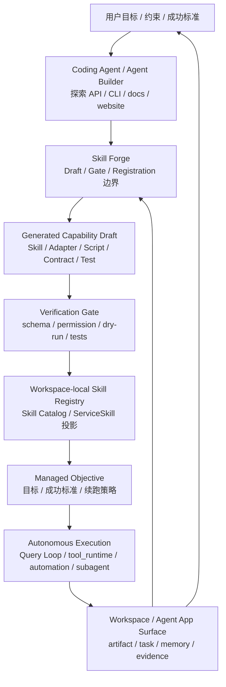
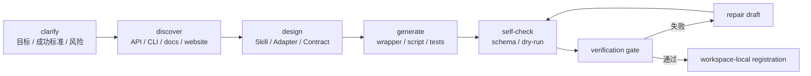
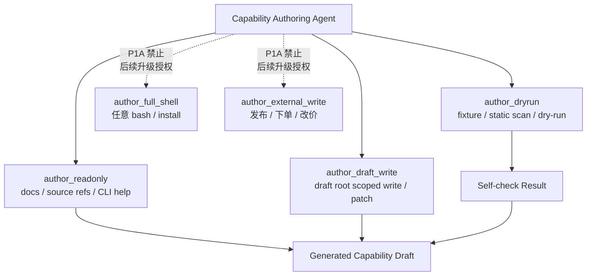
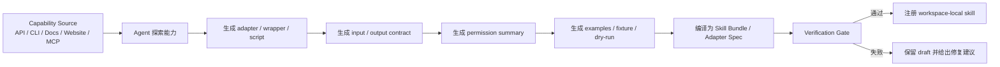
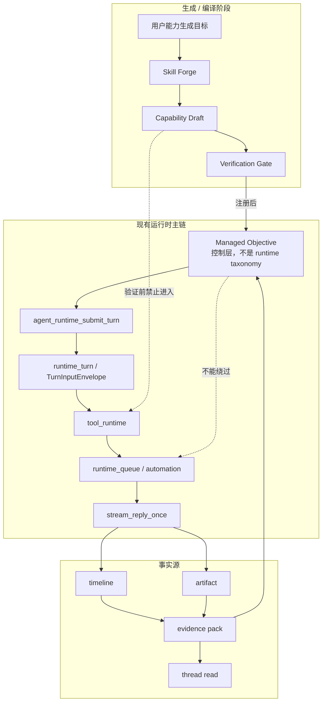
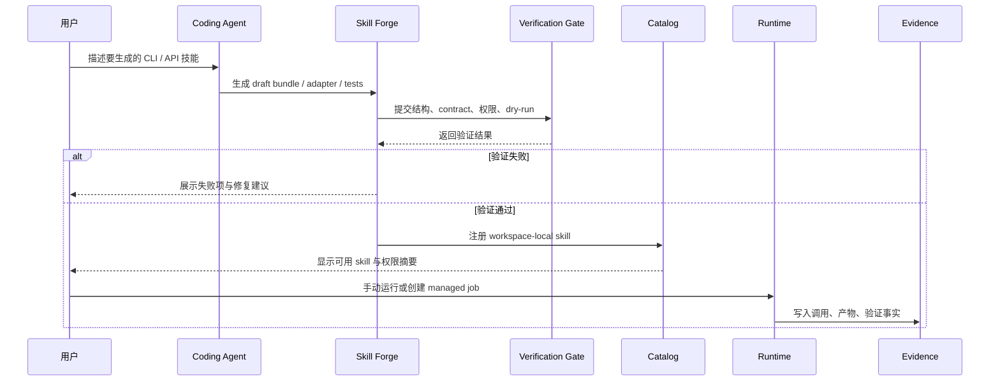
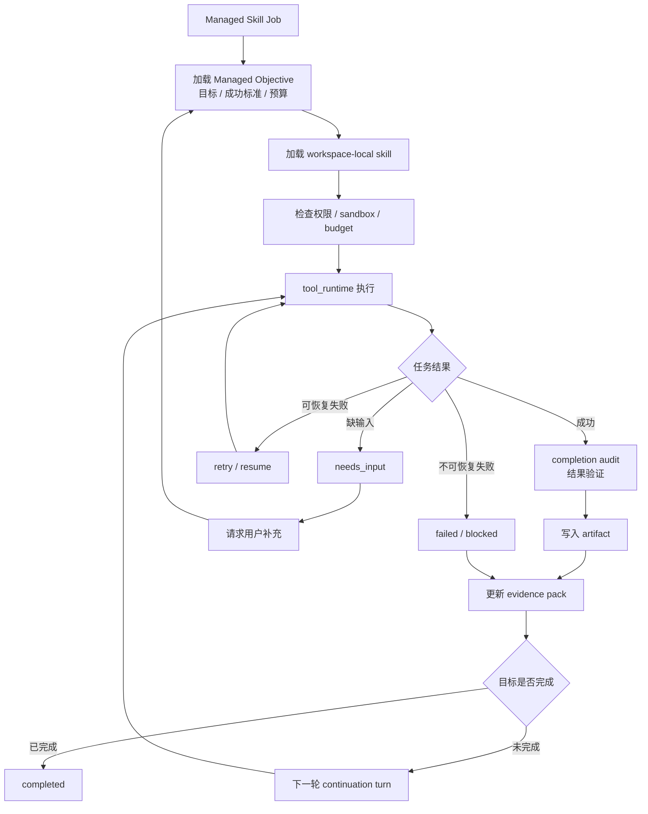
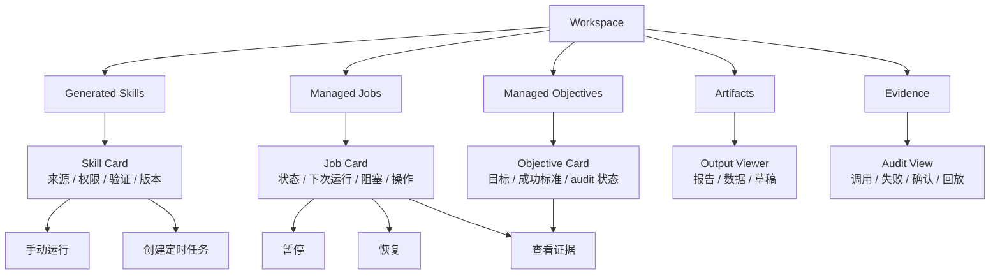
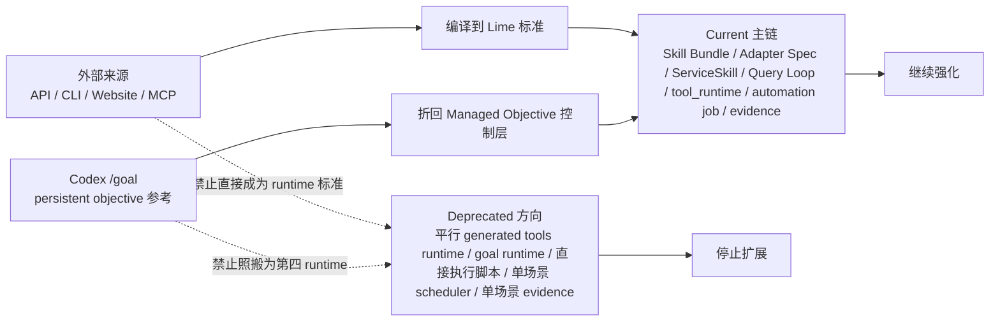
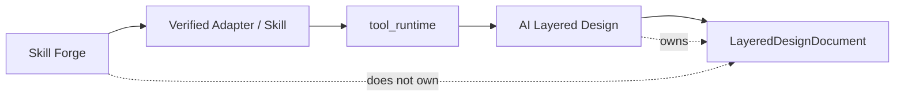

# CreoAI 启发下的 Lime 架构图与流程图

> 状态：proposal  
> 更新时间：2026-05-05  
> 作用：把 Skill Forge、generated capability、skills pipeline、runtime execution 和 evidence 闭环画成可复查图纸。

配套原型：

- [prototype.md](./prototype.md)

本文负责架构图、流程图、时序图和边界图；产品低保真原型统一放在 `prototype.md`。

## 1. 三层架构对照图

固定判断：

1. `Skill Forge` 是生成阶段，不是 runtime。
2. `Generated Capability Draft` 验证前不能进入默认工具面。
3. `Managed Objective` 只做目标推进控制，不是第四类 runtime。
4. 真实执行必须回到 Lime current runtime。

## 1.1 Coding Agent 内部循环图

固定判断：

1. Coding Agent 是能力作者，不是长期执行器。
2. 每一步仍必须通过 Query Loop / tool_runtime 的受控能力完成。
3. Gate 通过前，draft 不能进入默认 tool surface。

## 1.2 Capability Authoring 工具面分级图

固定判断：

1. 参考 pi-mono 的工具分级，但 P1A 比通用 coding harness 更保守。
2. `author_draft_write` 只能写 draft root，不能写 workspace 任意文件。
3. `author_dryrun` 只能产生 self-check 事实，不能长期执行任务。
4. 完整 shell 和外部写操作不是永远禁止，但必须等 sandbox / verification / permission / 人工确认 / evidence audit 闭环成熟后逐级开放。
5. 限制的是未经验证、未经授权、不可审计的执行，不是限制 agent 的理解、设计和编码能力。

## 2. 外部能力编译流程图

固定判断：

1. 来源格式只提供原料。
2. Lime 标准仍是 Skill Bundle / Adapter Spec。
3. gate 失败只能保留 draft，不能注册。

## 3. 与 Query Loop 的边界图

固定判断：

1. 生成阶段不能绕过 submit turn。
2. tool surface 仍由 `tool_runtime` 裁剪。
3. evidence pack 是执行事实源。
4. Managed Objective 必须消费 evidence / artifact 做完成审计，不能只靠模型自报完成。

## 4. Verification gate 时序图

## 5. 长期任务执行闭环

固定判断：

1. 长期任务必须能明确完成、阻塞或失败。
2. 失败路径和成功路径都要进入 evidence。
3. 需要用户输入时不能伪装成自动完成。
4. continuation turn 只能由 Managed Objective 策略触发，并继续走 Query Loop。

## 6. Workspace 可见面图

固定判断：

1. 用户必须能看见 agent 生成了什么能力。
2. 用户必须能看见能力权限和验证状态。
3. 用户必须能看见长期任务对应的目标和完成审计状态。
4. 用户必须能从任务回到 evidence。

## 7. current / deprecated 边界图

## 8. 与 AI 图层化设计的消费关系图

固定判断：

1. Skill Forge 可以生成 provider adapter、PSD exporter、OCR / matting wrapper。
2. 这些 adapter 通过验证后才能被 AI 图层化设计消费。
3. `LayeredDesignDocument`、Canvas Editor 和设计导出协议仍归 [../ai-layered-design/README.md](../ai-layered-design/README.md)。
4. 不允许为了图层化设计新增平行 generated tools runtime。

## 9. 后续补图原则

后续如果本路线图继续补图，遵守三条规则：

1. 只画 current 主链，不为平行 generated runtime 画主图。
2. 图中执行节点必须能对应到 Lime 现有 Query Loop、tool_runtime、workspace 或 evidence 主链。
3. 如果实现改变事实源或状态机，优先更新本文图纸和 `implementation-plan.md`。
