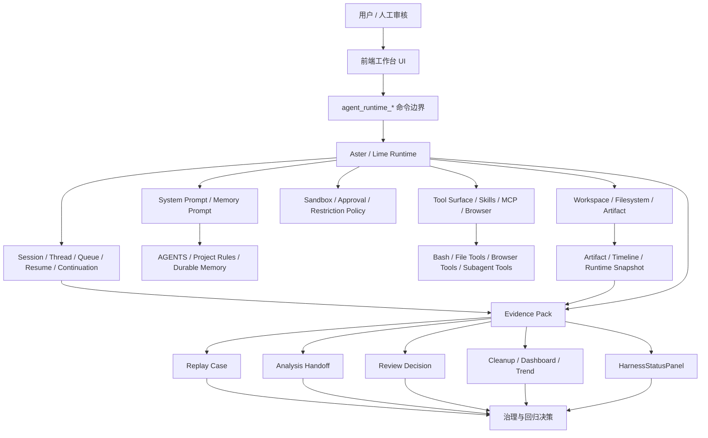
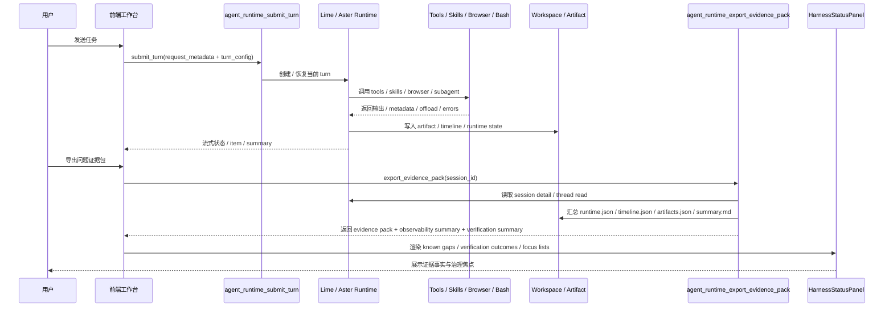
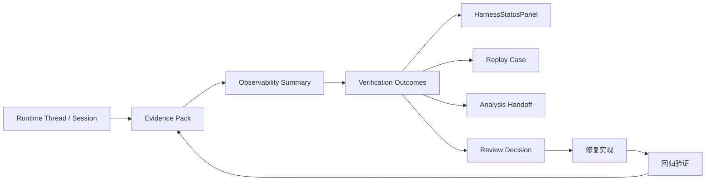
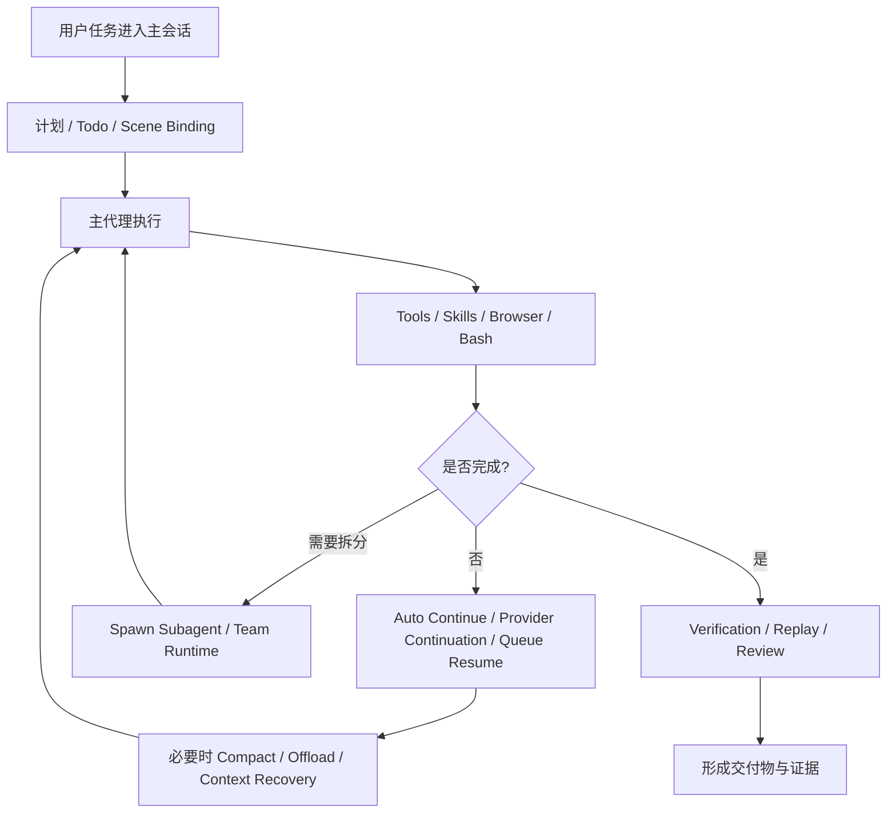
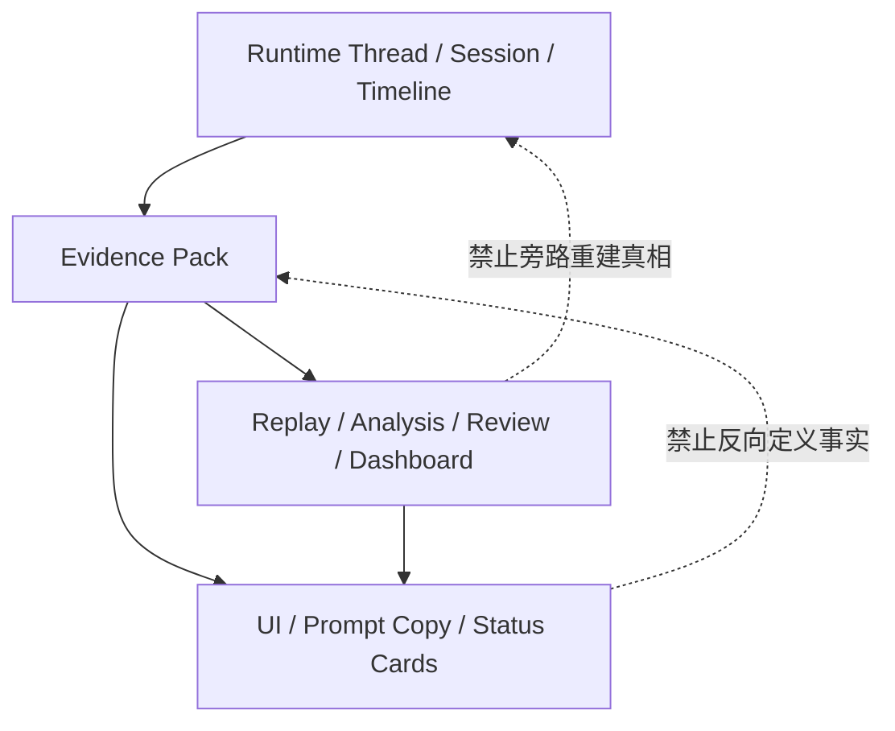

# Lime Harness Engine 架构图与流程图

> 状态：进行中
> 更新时间：2026-04-13
> 作用：把 Harness Engine 的关键结构、时序和治理闭环画成可复查的图，而不是只靠长文描述。

## 1. 总体架构图

## 2. 运行时与证据导出时序图

## 3. Evidence 驱动治理闭环

## 4. 长时任务执行闭环

## 5. 事实源分层图

## 6. 当前最关键的治理关注点

### 6.1 已经成形的图上主链

- `User -> UI -> agent_runtime_* -> Runtime -> Tools / Workspace -> Evidence`
- `Evidence -> Replay / Analysis / Review / StatusPanel`
- `Continuation / Compact / Offload / Resume`

### 6.2 仍需继续加强的图上闭环

- `Verification Outcomes -> Review / Cleanup / Dashboard` 还要更强一致
- `是否完成 -> Continue / Compact / Resume` 还没完全约束化
- `任务类型 -> JIT Tool / Context Assembly` 还没完全平台化

## 7. 后续补图原则

后续如果 Harness Engine 再新增图纸，遵守三条规则：

1. 只画 current 主链，不为 compat / deprecated 画主图。
2. 图中节点必须能对应到仓库真实模块、命令或文档，不画空概念。
3. 如果实现已经改变事实源或时序，优先更新图，而不是只改 README 文案。
