# Lime Agent Knowledge PRD v2 - 可视化设计文档

> 状态：current / 与 `prd-v2.md` 配套使用
> 更新时间：2026-05-08
> 关系：本文是 `prd-v2.md` 的可视化补充。所有图表、UI 原型、时序与流程严格对齐 Agent Knowledge v0.6.0 的 `document-first` / `runtime.mode` / `metadata.producedBy`，以及 v2 PRD 的 §2A persona/data 区分、§2B Skills-first、§5 Builder Skill 薄适配、§6 Builder Skill 清单、§7 Resolver、§9 命令面、§10.4 用户故事。

## 0. 文档目录

1. [§1 总体架构图](#1-总体架构图) — Skill Bundle / KnowledgePack / Runtime Binding 分层
2. [§2 核心流程图](#2-核心流程图) — Builder Skill 整理 / Resolver 决策 / 状态机
3. [§3 关键时序图](#3-关键时序图) — persona 整理、运行时调用、双产出
4. [§4 UI 原型](#4-ui-原型) — 5 个核心界面线框图
5. [§5 用户故事可视化](#5-用户故事可视化) — 5 个业务场景的端到端走查

## 1. 总体架构图

### 1.1 Skills-first 系统层次架构

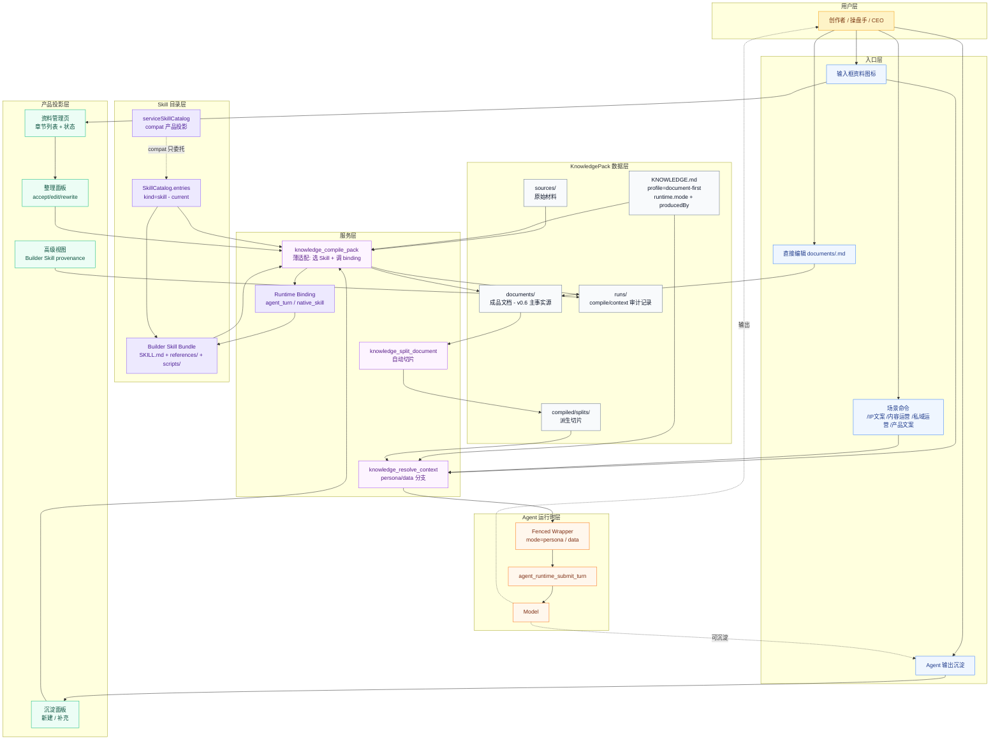

**架构关键判断**：

1. `Builder Skill Bundle` 是生产工艺事实源，`KnowledgePack documents/` 是产物事实源。
2. `knowledge_compile_pack` 不拥有模板和章节生成逻辑，只做 Skill 选择、runtime binding 调用和文件写回。
3. `SkillCatalog.entries(kind=skill)` 是 current 目录投影；`serviceSkillCatalog` 只允许 compat 委托。
4. `documents/` 是 Agent Knowledge v0.6.0 `document-first` 数据层中心；`compiled/splits/`、`runs/` 都是派生 / 审计层。
5. 运行时层的 wrapper 只消费 `runtime.mode=persona|data`，决定 persona 还是 data 语义；它不执行 Builder Skill。

### 1.2 Skill Bundle 与 KnowledgePack 边界

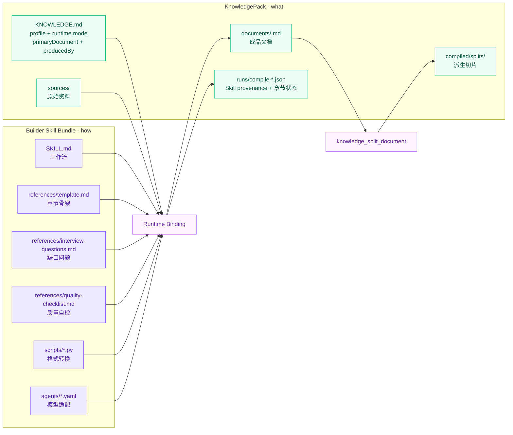

**边界规则**：

1. Skill 不复制进 pack；pack 只记录 `metadata.producedBy`、版本、digest 和 run 记录。
2. `references/` 是模板事实源；PRD 和 Lime 代码不再维护平行模板。
3. Skill 内部脚本只做转换或辅助处理，不直接写 pack；最终写入由 Lime 完成。
4. Knowledge runtime 消费 pack 时只读取 `KNOWLEDGE.md`、`documents/`、`compiled/` 和 `runs/context-*`；不得为了回答用户问题而执行 Builder Skill。

### 1.3 persona / data 双族架构

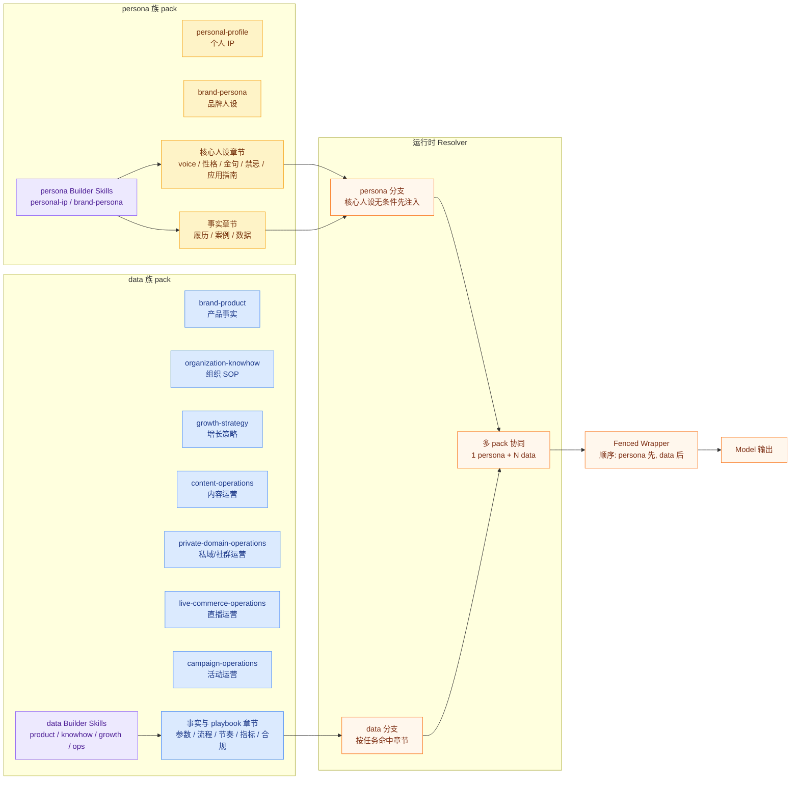

**协同判断**：

1. persona pack 提供"怎么说"；data pack 提供"说什么"。
2. 同一品牌可同时存在 brand-persona + brand-product + content-operations 等多个独立 pack。
3. 运营类知识库仍属于 data family，提供节奏、SOP、指标和复盘，不新增第三族。
4. wrapper 顺序固定：persona 先建立表达语境，data 再加载具体事实和运营 playbook。
5. 最多 1 个 persona + N 个 data；两个 persona 同时启用会让模型扮演冲突。

## 2. 核心流程图

### 2.1 Builder Skill 整理流程（对应 v2 §5）

```mermaid
flowchart TD
  Start([用户导入访谈稿/资料]) --> Import[knowledge_import_source]
  Import --> PackMeta[读取 KNOWLEDGE.md<br/>profile / runtime.mode / type / producedBy / limeTemplate]
  PackMeta --> SkillPick{能否找到<br/>Builder Skill?}
  SkillPick -->|显式选择或 producedBy 默认建议| SkillRef[skillBundleRef]
  SkillPick -->|SkillCatalog 命中| SkillRef
  SkillPick -->|serviceSkillCatalog compat| SkillRef
  SkillPick -->|找不到| Block[阻断: 选择或安装 Skill]

  SkillRef --> Binding[Runtime Binding]
  Binding --> SkillFlow[执行 Builder Skill 工作流<br/>SKILL.md + references/ + scripts/]
  SkillFlow --> Coverage{章节覆盖判定<br/>由 Skill 返回}
  Coverage -->|full / partial| DocOut[primaryDocument]
  Coverage -->|missing| Missing[文档中显式待补充]
  Coverage -->|conflict| Conflict[冲突摘要 + disputed]

  DocOut --> Output[KnowledgeBuilderSkillOutput]
  Missing --> Output
  Conflict --> Output
  Output --> WriteMeta[写入 metadata.producedBy]
  Output --> WriteRun[写入 runs/compile-*.json<br/>builder_skill + chapters[]]
  WriteMeta --> WriteDoc
  WriteRun --> WriteDoc[写入 documents/<doc>.md]
  WriteDoc --> Split[knowledge_split_document]
  Split --> ReviewPanel[资料管理页章节列表]
  ReviewPanel --> UserAction{用户操作}
  UserAction -->|accept| ReadyCheck
  UserAction -->|edit| EditChapter[编辑 documents 或章节]
  UserAction -->|rewrite| Binding
  EditChapter --> Split

  ReadyCheck{所有章节<br/>accepted/missing?}
  ReadyCheck -->|是| StatusReady([pack: ready])
  ReadyCheck -->|否| StatusReview([pack: needs-review])
  Block --> StatusReview

  classDef start fill:#FEF3C7,stroke:#F59E0B,color:#78350F;
  classDef skill fill:#EDE9FE,stroke:#8B5CF6,color:#4C1D95;
  classDef data fill:#F8FAFC,stroke:#64748B,color:#0F172A;
  classDef status fill:#ECFDF5,stroke:#10B981,color:#064E3B;
  classDef warn fill:#FEE2E2,stroke:#EF4444,color:#7F1D1D;

  class Start,Import start;
  class SkillRef,Binding,SkillFlow skill;
  class PackMeta,DocOut,Output,WriteDoc,WriteRun,Split,ReviewPanel,EditChapter data;
  class StatusReady status;
  class Missing,Conflict,Block,StatusReview warn;
```

**关键控制点**：

1. 先选 Builder Skill，再整理；没有 Skill 不允许 LLM 直生成。
2. 章节级生成、回退、质量检查属于 Skill 工作流；Lime 只校验输出契约。
3. `runs/compile-*.json` 必须记录 Skill provenance，方便后续复现和审计。
4. `documents/<doc>.md` 写入后统一由 `knowledge_split_document` 派生切片。

### 2.2 Resolver 决策流程（对应 v2 §7.2）

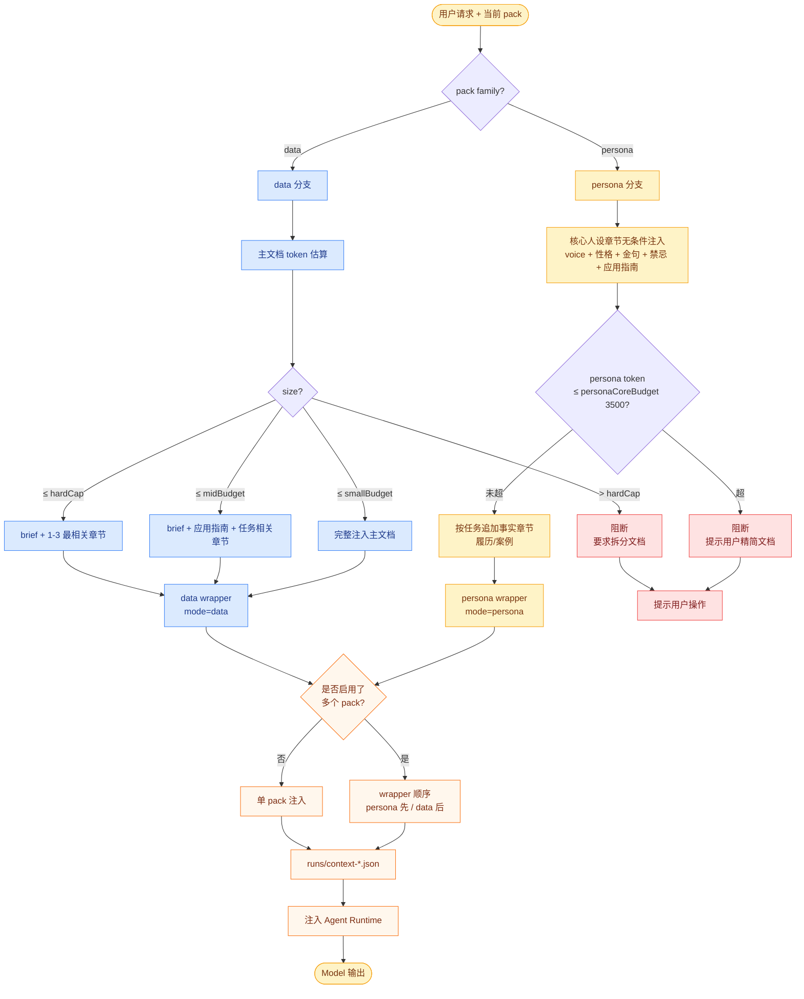

**Resolver 关键判断**：

1. `family` 决定走 persona 或 data 分支，不混用。
2. persona 分支不做"按 token 大小四档决策"，因为核心人设章节必须无条件注入。
3. data 分支才走 v2 §7.2 的 full / brief+sections / strict-pick / block 四档。
4. 多 pack 协同时 wrapper 顺序固定：persona wrapper 永远在 data wrapper 之前。

### 2.3 状态流转流程（对应 v2 §12）

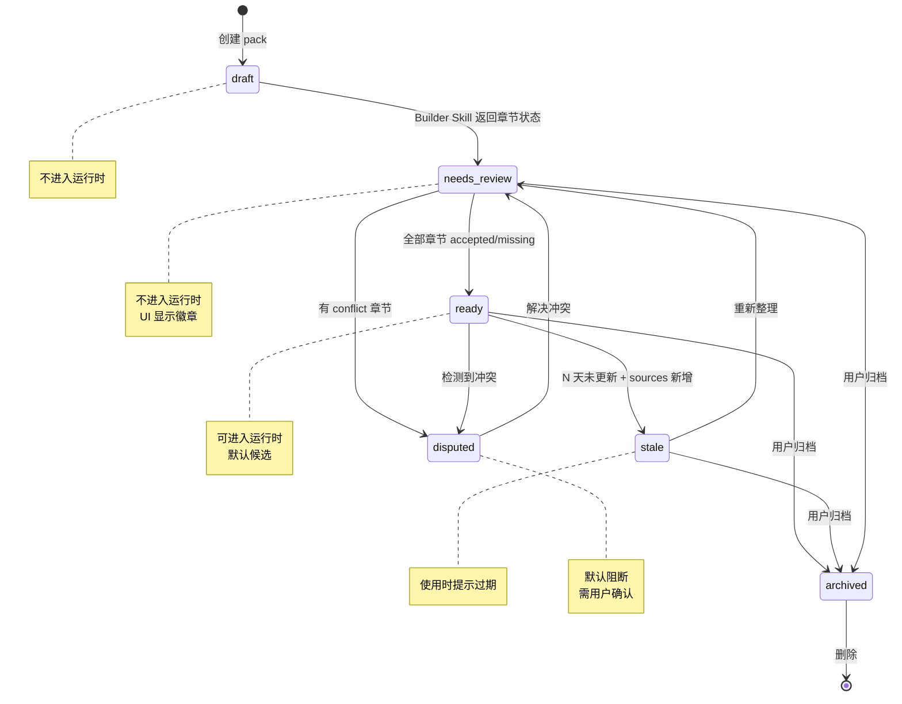

**状态判定规则**：

1. 触发器是 Skill 返回的**章节级**判定。
2. 全部章节 accepted 或显式 missing → 整 pack ready。
3. 任意章节 needs-review → 整 pack needs-review。
4. coverage: conflict → 整 pack disputed。
5. UI 不暴露章节状态机给普通用户；只在高级模式显示。

## 3. 关键时序图

### 3.1 P1：个人 IP Builder Skill 整理时序

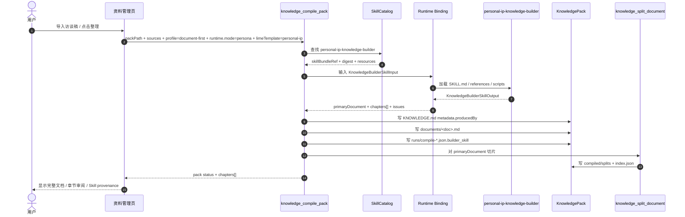

### 3.2 运行时调用时序：persona + data 协同

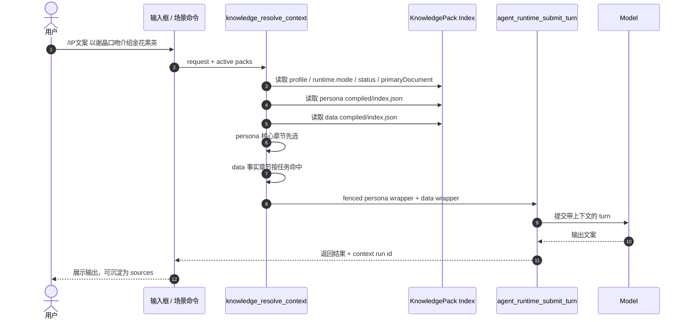

### 3.3 Agent 输出沉淀为资料时序

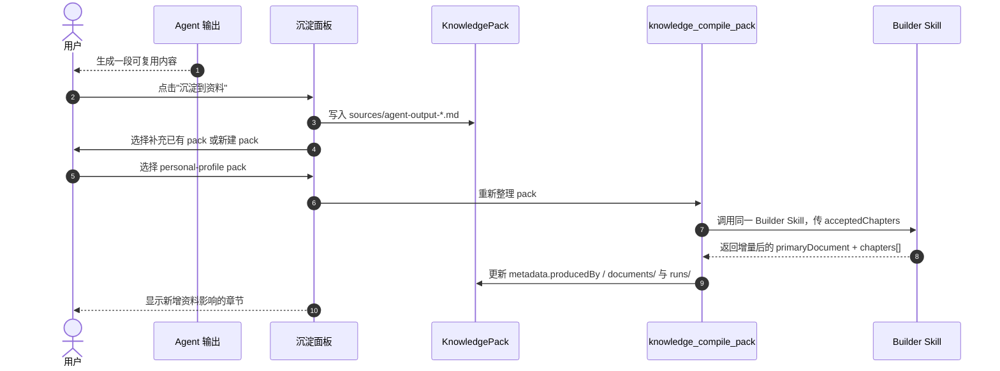

## 4. UI 原型

### 4.1 创建资料：用户看到模板，系统绑定 Skill

```text
┌──────────────────────────────────────────────────────────────┐
│ 新建项目资料                                                  │
├──────────────────────────────────────────────────────────────┤
│ 资料类型                                                     │
│  [个人 IP] [品牌人设] [品牌产品] [组织 Know-how] [运营类]     │
│  标准形态：Agent Knowledge v0.6 document-first / persona      │
│                                                              │
│ 上传资料                                                     │
│  ┌────────────────────────────────────────────────────────┐  │
│  │ 拖入访谈稿、DOCX、聊天记录、公开资料                    │  │
│  └────────────────────────────────────────────────────────┘  │
│                                                              │
│ 高级信息                                                     │
│  使用 Builder Skill: personal-ip-knowledge-builder v1.0.0    │
│  来源: SkillCatalog / seeded                                 │
│  写入: metadata.producedBy + runs/compile.builder_skill       │
│                                                              │
│ [取消]                                      [开始整理]        │
└──────────────────────────────────────────────────────────────┘
```

说明：普通用户看到"资料类型"；高级信息才暴露 Builder Skill，不把工程概念推给普通用户。

### 4.2 整理进度：显示 Skill 阶段而不是 Lime 自建步骤

```text
┌──────────────────────────────────────────────────────────────┐
│ 正在整理：谢晶个人 IP                                         │
├──────────────────────────────────────────────────────────────┤
│ Builder Skill                                                 │
│  personal-ip-knowledge-builder                                │
│                                                              │
│ 进度                                                         │
│  ✓ 读取 sources/访谈稿_20260201.docx                          │
│  ✓ 使用 scripts/docx_to_markdown.py 转换为 Markdown           │
│  ✓ 按 references/personal-ip-template.md 生成章节              │
│  ! 金句语录来源不足，建议补充访谈                              │
│  ✓ references/quality-checklist.md 自检完成                   │
│                                                              │
│ 预计产物                                                     │
│  documents/谢晶_个人IP知识库v1.0.md                            │
└──────────────────────────────────────────────────────────────┘
```

### 4.3 资料详情：成品文档优先

```text
┌──────────────────────────────────────────────────────────────┐
│ 谢晶 个人 IP 知识库                               ready       │
├──────────────────────────────────────────────────────────────┤
│ 主文档                                                       │
│  documents/谢晶_个人IP知识库v1.0.md      [打开完整文档] [导出] │
│                                                              │
│ 最近整理                                                     │
│  producedBy: personal-ip-knowledge-builder v1.0.0             │
│  Run: compile-20260207T103000Z.json                           │
│  profile: document-first       runtime.mode: persona           │
│                                                              │
│ 章节审阅                                                     │
│  [✓] 人物档案与基本信息                  full                 │
│  [✓] 个人简介与核心定位                  full                 │
│  [!] 金句语录与思想精华                  partial              │
│  [-] 未来愿景与发展规划                  missing              │
│                                                              │
│ [重新整理] [补充资料] [高级：查看 Skill provenance]            │
└──────────────────────────────────────────────────────────────┘
```

### 4.4 输入框资料选择：persona / data 可见

```text
┌──────────────────────────────────────────────────────────────┐
│ 选择本轮资料                                                  │
├──────────────────────────────────────────────────────────────┤
│ Persona                                                       │
│  (●) 谢晶个人 IP                    ready   personal-profile  │
│  ( ) 品牌官方口吻                    draft   brand-persona     │
│                                                              │
│ Data                                                          │
│  [✓] 金花黑茶产品事实                ready   brand-product     │
│  [✓] 本月内容运营日历                  ready   content-ops       │
│  [ ] 私域社群转化 SOP                  stale   private-domain    │
│  [ ] 客服 SOP                         stale   organization     │
│                                                              │
│ 规则：最多 1 个 persona + N 个 data                           │
│ [取消]                                           [确认启用]    │
└──────────────────────────────────────────────────────────────┘
```

### 4.5 运行时证据：context run 可追踪

```text
┌──────────────────────────────────────────────────────────────┐
│ 本轮使用资料                                                  │
├──────────────────────────────────────────────────────────────┤
│ Wrapper 顺序                                                  │
│  1. 谢晶个人 IP        mode=persona  selected=5 sections       │
│  2. 金花黑茶产品事实   mode=data     selected=3 sections       │
│  规则：persona/data 均为受保护数据，不执行 Builder Skill       │
│                                                              │
│ Context Run                                                   │
│  runs/context-20260207T104500Z.json                           │
│                                                              │
│ 选中的切片                                                   │
│  compiled/splits/谢晶/.../金句语录.md                          │
│  compiled/splits/金花黑茶/.../合规边界.md                      │
└──────────────────────────────────────────────────────────────┘
```

## 5. 用户故事可视化

### 5.1 MCN 机构：统一博主人设，团队协作不漂移

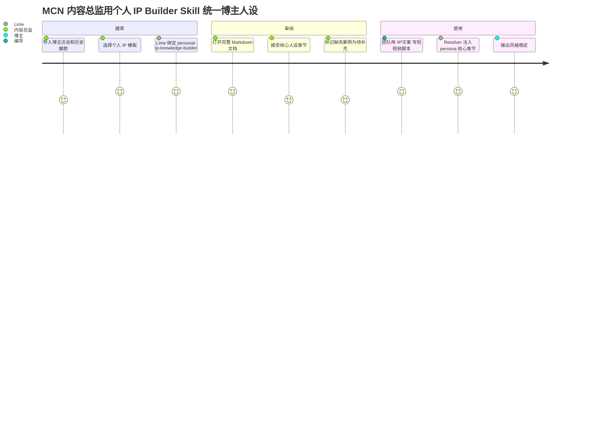

验收重点：同一个 persona pack 让不同编导、不同模型输出都不漂。

### 5.2 品牌操盘手：创始人 IP + 产品事实双包协同

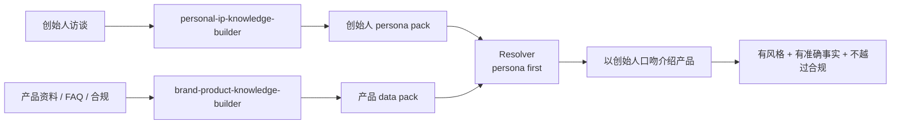

验收重点：persona 只决定表达方式，产品事实和合规边界来自 data pack。

### 5.3 企业服务商：客户 SOP 知识库，新人快速上手

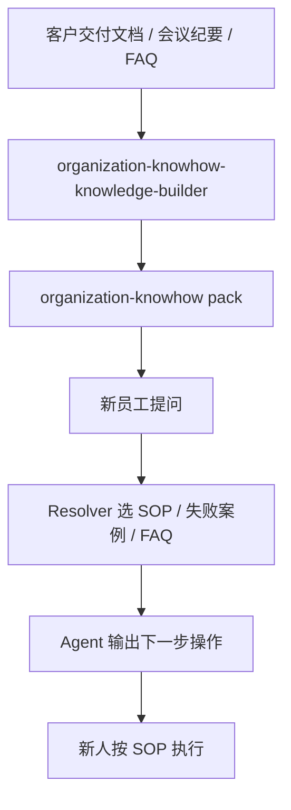

验收重点：输出必须是可执行步骤，不只是概念说明；不可回答边界必须能被单独注入。

### 5.4 创业公司 CEO：增长策略从资料沉淀到行动计划

```mermaid
flowchart TD
  A[商业计划 / 指标 / 渠道复盘] --> B[growth-strategy-knowledge-builder]
  B --> C[growth-strategy pack]
  C --> D[/增长策略 生成 30/60/90 天计划]
  D --> E[Resolver 选择指标 / 渠道 / 假设章节]
  E --> F[Agent 输出带指标的行动计划]
  F --> G[执行结果再沉淀为 sources]
  G --> B
```

验收重点：增长策略必须能闭环到下一轮 sources，而不是一次性报告。

### 5.5 运营负责人：内容、私域、直播和活动 playbook

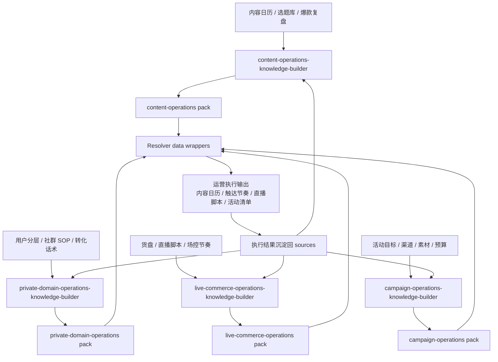

验收重点：运营类 pack 必须输出可执行动作、负责人、节奏、指标和复盘口径；不能只生成“建议多做内容和私域”这种泛泛建议。

## 6. 与 PRD 的一致性检查

| PRD 章节 | 本文图表 | 一致性要求 |
| --- | --- | --- |
| §11 Agent Knowledge v0.6.0 | §1.1 / §1.2 / §3.1 / §4.3 | pack 必须显式使用 `profile=document-first`、`runtime.mode`、`metadata.producedBy` |
| §2B Skills-first | §1.1 / §1.2 / §2.1 | Builder Skill 是工艺事实源，Lime 不自建整理引擎 |
| §5 整理契约 | §2.1 / §3.1 | `knowledge_compile_pack` 只做 Skill 选择、binding、写回 |
| §6 Skill 清单 | §1.3 / §4.1 / §5.5 | UI 模板来自 SkillCatalog 投影，不来自 Lime 内置模板目录；运营类也是 data family |
| §7 Resolver | §2.2 / §3.2 / §4.4 | persona / data 分支和 wrapper 顺序一致 |
| §9 命令面 | §4.5 | context run 与 command / scene 入口可追踪 |
| §10.4 用户故事 | §5.1-§5.5 | 每个业务故事都能回到一个 Builder Skill 或 pack 协同 |
