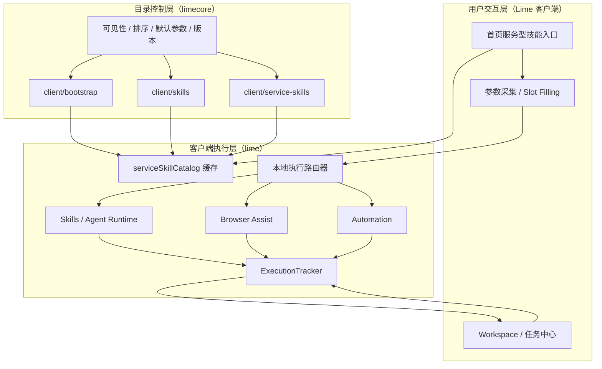

# Lime 服务型技能：目录云同步、本地执行 PRD

> 状态：current supporting cross-repo plan  
> 更新时间：2026-04-21  
> 当前主规划：`docs/roadmap/limenextv2/README.md`
> 目标：吸收 Ribbi 式服务型技能入口的方法，但保持 `limecore` 只做目录控制、`lime` 客户端负责全部执行
> 作用域：本文只保留 `ServiceSkill` 在 `lime` / `limecore` 之间的产品对象、目录边界与本地执行原则，不替代 `docs/aiprompts/command-runtime.md`、`docs/aiprompts/limecore-collaboration-entry.md`

## 1. 为什么要重写这份文档

这份文档原本承接过一条“端优先执行、云特例执行”的设计叙事，里面出现过：

- `cloud_required`
- `executionLocation`
- 旧的云执行器命名（如 `scene-orchestrator-svc` / `remote run plane`）作为特例执行器
- 目录命中后服务端 run / poll

现在这条叙事已经不再成立。

用户已明确新的产品边界：

1. 云端不会执行任何东西
2. `limecore` 只负责目录控制、发布治理与配置同步
3. `lime` 客户端负责全部 `@` 命令、`/scene`、`service skill` 执行

因此，本文件重写后的目标只有一个：

**把 `ServiceSkill` 收口成“目录云同步、本地执行”的产品对象。**

## 2. 当前事实

### 2.1 `lime` 侧

客户端已经具备：

- 工作区、项目、消息与执行追踪主链
- Agent 编排、browser assist、automation、本地 task 主链
- `skillCatalog` 与 `serviceSkillCatalog` 的 seeded / fallback 兜底

### 2.2 `limecore` 侧

服务端当前应继续承担：

- `client/bootstrap`
- `client/skills`
- `client/service-skills`
- OEM / 租户目录发布、排序、可见性、默认参数、版本、灰度

固定约束：

**`limecore` 不执行 `@` 命令，不执行 `/scene`，不执行 `service skill`。**

## 3. 核心判断

本方案采用如下主张：

**目录云同步，本地执行。**

具体含义：

1. `limecore` 是在线目录事实源，而不是运行时执行面
2. `lime` 客户端负责：
   - 参数采集
   - 本地运行时路由
   - Agent / tool / browser / task / viewer
3. 服务型技能目录采用“云主本辅”：
   - 云目录提供产品默认入口
   - 客户端 seeded / fallback 保证离线与降级可用
4. 目录命中不等于服务端执行

一句话总结：

**LimeCore 决定前台能看到什么，Lime 决定真正如何执行。**

## 4. 目标与非目标

### 4.1 总目标

让用户以“我要完成什么任务”作为入口，而不是先理解底层模型、Provider 或工具名。

目标链路：

`服务型技能入口 -> 参数采集 -> 本地执行路由 -> 结果与追踪`

### 4.2 子目标

1. 首页优先展示在线下发的服务型技能目录
2. 参数采集走结构化 `slotSchema`
3. 默认执行继续落在客户端 `skill / agent / browser / automation`
4. 离线时仍能依赖缓存目录和本地执行能力
5. 为 OEM / 租户提供目录与策略配置能力，但不把服务端变成执行器

### 4.3 非目标

1. 不把旧云执行器命名写成当前主链执行器
2. 不继续使用 `executionLocation = cloud_required`
3. 不在本阶段做服务端代跑内容生成
4. 不把目录控制面和执行面重新混在一起

## 5. 术语与对象模型

### 5.1 ServiceSkill

`ServiceSkill` 是面向用户的产品入口对象，不等同于云端 scene，也不等同于某个单一 tool。

建议最小字段如下：

| 字段 | 说明 |
|------|------|
| `id` | 服务型技能唯一标识 |
| `title` | 用户可理解的名称 |
| `summary` | 服务收益描述 |
| `category` | 分类，如社媒、视频、图文、运营 |
| `slotSchema` | 参数槽位定义 |
| `runnerType` | `instant / scheduled / managed` |
| `defaultExecutorBinding` | `native_skill / agent_turn / browser_assist / automation_job / local_service_skill` |
| `readinessRequirements` | 模型、浏览器、技能、项目、账号等依赖 |
| `version` | 目录版本或服务项版本 |
| `source` | `cloud_catalog / local_custom` |

固定约束：

- `ServiceSkill` 允许由云端目录下发
- `ServiceSkill` 的执行必须落在客户端本地 runtime

### 5.2 ServiceSkillCatalog

当前客户端目录分成两层：

1. `skillCatalog`
   - 聚合后的技能中心目录
   - `entries` 负责统一 `@ / / / skill` 发现协议
2. `serviceSkillCatalog`
   - 完整服务型技能目录
   - 适合技能发布、诊断、细粒度刷新与运行时绑定解析

`serviceSkillCatalog` 不应复用 `serviceCatalog`。

### 5.3 SlotSchema

服务型技能的参数采集协议，首期支持：

- `text`
- `url`
- `file`
- `enum`
- `platform`
- `region`
- `schedule_time`
- `account_list`

### 5.4 RunnerType

`runnerType` 只表达任务形态：

- `instant`
- `scheduled`
- `managed`

固定约束：

- `runnerType` 不再隐含云执行
- `managed` 与 `scheduled` 也不自动等于服务端运行

## 6. 系统架构

## 7. 边界说明

### 7.1 `limecore` 负责

- 目录模型
- 发布状态
- OEM / 租户可见性
- 默认参数、别名、排序、灰度
- bootstrap 聚合输出

### 7.2 `lime` 负责

- `@` 命令与 `/scene` 命中
- 参数采集与补参
- Agent 首刀分析
- 本地 skill / tool / browser / automation / task 执行
- timeline / artifact / viewer / recovery

### 7.3 不再允许的叙事

- `cloud_required`
- 目录命中后服务端创建 run
- 旧云执行器命名 / 任何远端 run plane 作为服务型技能执行器
- 把 `lime_run_service_skill` 解释成云端调用入口

## 8. 对客户端实现的直接要求

1. `service_scene_launch` 只作为本地运行时路由提示
2. `serviceSkills` / seeded fallback 命中后，必须继续走本地执行链
3. 历史命名如 `cloud-video-dubbing` 若仍存在，也只能按本地 skill 标识理解
4. 输入区、场景面板、首页技能入口统一消费在线目录 + seeded fallback

## 9. 与服务端计划的关系

服务端文档纠偏由 `limecore/docs/exec-plans/at-command-control-plane-only.md` 统一承接。

本文件只描述客户端如何消费目录与执行，不替服务端继续定义执行协议。

## 10. 当前状态

- 2026-04-21：本文重写为“目录云同步、本地执行”版 PRD
- 2026-04-21：旧的 `cloud_required / 云特例执行` 叙事应视为 `deprecated`
- 2026-04-21：后续实现只允许继续向“目录控制面 + 本地执行面”收敛
