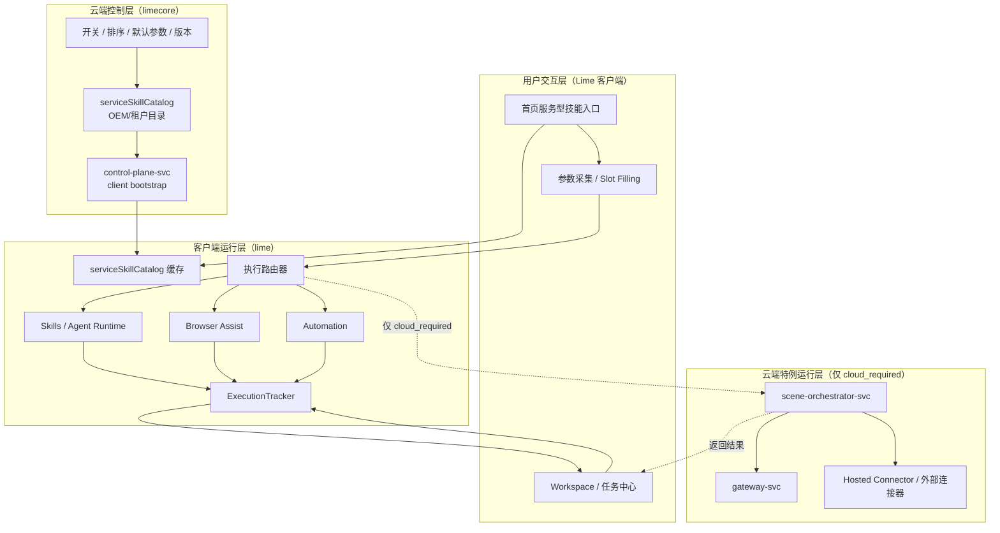
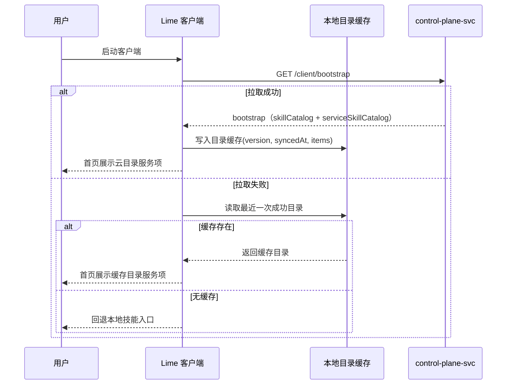
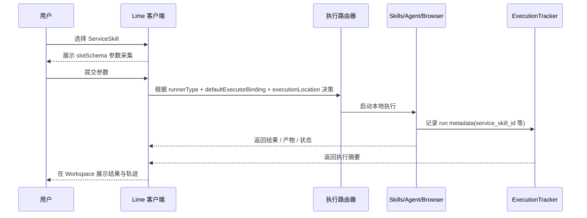
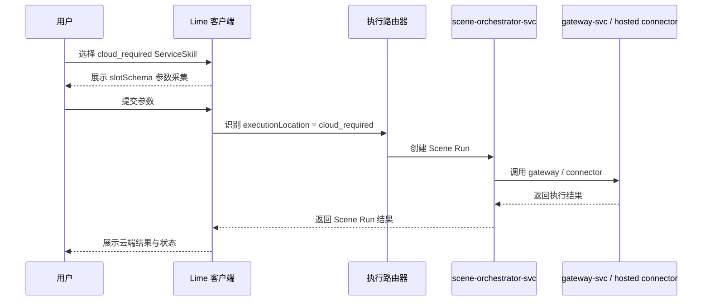
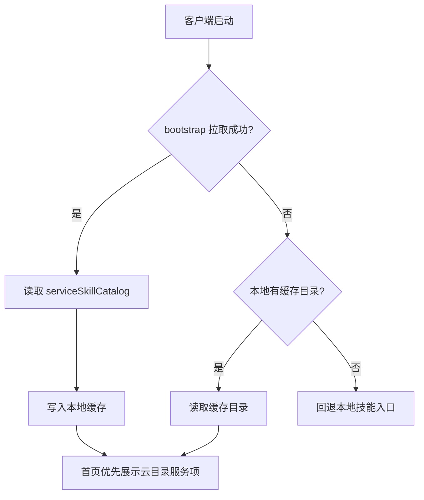
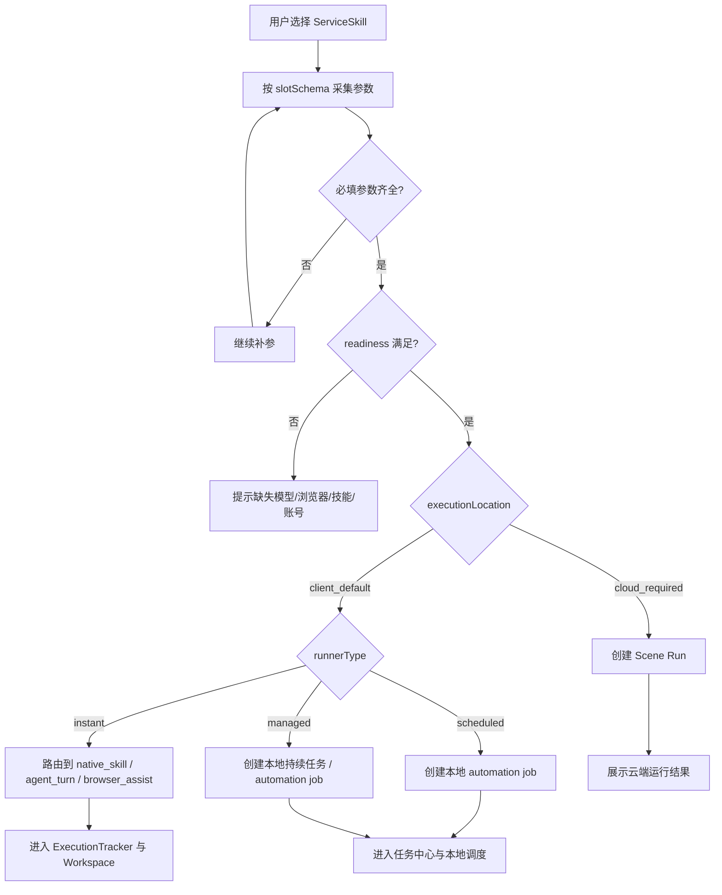
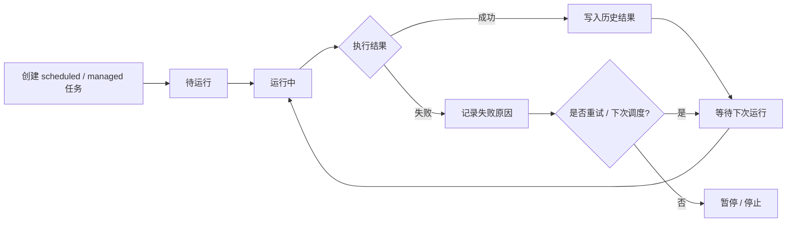

# Lime 服务型技能：端优先执行、云配置同步 PRD

> 状态：current supporting cross-repo plan  
> 更新时间：2026-04-19  
> 当前主规划：`docs/roadmap/limenextv2/README.md`
> 目标：吸收 Ribbi 式服务型技能入口的产品方法，但保持 Lime 的端优先执行与低云成本架构
> 作用域：本文只保留服务型技能在 `lime` / `limecore` 之间的产品对象、目录分层与执行边界，不替代 `docs/aiprompts/command-runtime.md`、`docs/aiprompts/limecore-collaboration-entry.md` 与 `limecore/docs/api/lime-client-integration.md`

## 1. 文档依据

本文不是从抽象产品概念反推，而是基于当前 `lime` 与 `limecore` 两个仓库的现役事实源编写。

`lime` 侧主要事实源：

- `src/lib/api/serviceSkills.ts`
- `src/lib/serviceSkillCatalogBootstrap.ts`
- `src/hooks/useOemCloudAccess.ts`
- `src/components/agent/chat/workspace/serviceSkillSceneLaunch.ts`
- `src/components/agent/chat/workspace/useWorkspaceSendActions.ts`
- `docs/aiprompts/command-runtime.md`

`limecore` 侧主要事实源：

- `docs/api/lime-client-integration.md`
- `docs/aiprompts/lime-limecore-collaboration.md`
- `services/control-plane-svc/internal/model/client_bootstrap.go`
- `services/control-plane-svc/internal/controller/public_client.go`
- `services/scene-orchestrator-svc/README.md`
- `services/control-plane-svc/internal/model/commercial.go`

关键环境事实：

1. `lime` 已有任务入口、技能执行链、自动化调度链、执行追踪链。
2. `limecore` 已有 `control-plane-svc / gateway-svc / scene-orchestrator-svc`，并已提供 `client/bootstrap`、`client/skills`、`client/service-skills`。
3. `client/bootstrap` 当前已同时返回 `skillCatalog` 与 `serviceSkillCatalog`：
   - `skillCatalog.entries` 是统一命令发现协议
   - `serviceSkillCatalog` 是完整服务型技能目录
   - `serviceCatalog` 仍保持商业服务目录语义，不应混用
4. `lime` 当前已消费在线目录并保留 seeded / fallback 韧性兜底，不再只依赖客户端静态常量。
5. `scene-orchestrator-svc` 已定位为 Scene 运行时服务，但不应在本方案中演进为普通任务的默认主执行流。

## 1.1 当前吸收结果（2026-04-19）

这份 PRD 的核心判断已经被 current 主链部分吸收：

1. `limecore` 负责在线目录事实源：
   - `bootstrap.skillCatalog`
   - `bootstrap.serviceSkillCatalog`
   - `GET /api/v1/public/tenants/:tenantId/client/skills`
   - `GET /api/v1/public/tenants/:tenantId/client/service-skills`
2. `lime` 负责本地 catalog 同步、seeded fallback、补参启动与执行路由。
3. `skillCatalog.entries` 负责统一 `@ / / skill` 发现协议；`serviceSkillCatalog` 继续保留完整服务型技能目录，不与 `serviceCatalog` 混用。

因此，本文今天更适合作为跨仓产品边界说明，而不是单独的待落地提案。

## 2. 背景与问题

Ribbi 这类产品最值得借鉴的，不是“49 个技能入口”或“看起来像多 Agent”，而是它把底层复杂能力包装成了用户能直接理解的服务项：

- 复制短视频
- 每日趋势摘要
- 跟踪账号表现

这种产品方式对 Lime 有吸引力，但如果简单把所有入口、参数、执行器和 OEM 配置都堆进客户端，会出现三个问题：

1. 产品入口层、执行层、配置层混在一起，客户端越来越杂乱。
2. OEM/租户差异化无法优雅下发，只能写死在本地版本里。
3. 如果为了统一而把执行迁到云端，又会把云成本做重，违背 Lime 想利用客户端算力的目标。

因此，本方案要解决的核心矛盾是：

**既要获得服务型技能的产品入口优势，又不能把主执行流云化。**

## 3. 核心判断

本方案采用如下主张：

**端优先执行，云端优先配置。**

具体含义：

1. `lime` 客户端负责即时执行、本地工作区、本地调度、本地素材与项目上下文、本地执行追踪。
2. `limecore` 负责 OEM/租户级目录发布、开关、排序、默认参数、版本、连接器引用，以及少量必须云托管的特例场景。
3. 默认所有服务型技能都先尝试在客户端执行，只有显式标记为 `cloud_required` 的场景才允许走云执行。
4. 服务型技能目录采用 **云主本辅**：
   - 云目录是产品默认事实源
   - 本地技能与项目级技能继续存在，但不污染 OEM 正式目录

一句话总结：

**Lime 继续是工作站，LimeCore 负责目录、策略与发布，而不是默认运行时。**

## 4. 目标与非目标

## 4.1 总目标

为 Lime 增加一层 `ServiceSkill` 产品对象，让用户以“我要完成什么任务”作为入口，而不是先理解模型、Provider 和能力开关。

目标链路：

`服务型技能入口 -> 参数采集 -> 执行路由 -> 本地执行 / 云特例执行 -> 结果与追踪`

## 4.2 子目标

1. 首页优先展示云下发的服务型技能目录。
2. 参数采集走结构化 `slotSchema`，不再单靠 prompt 模板。
3. 默认执行继续落在客户端 `skill / agent / browser / automation`。
4. 离线时仍可使用缓存目录与本地执行能力。
5. 为 OEM/租户提供目录与策略配置能力，但不引入重云执行成本。

## 4.3 非目标

1. 不重写 `AgentChatWorkspace`。
2. 不把 `scene-orchestrator-svc` 变成普通任务的默认执行器。
3. 不在本阶段做云端大规模内容生成或视频处理。
4. 不在本阶段做本地技能反向发布云端。
5. 不在本阶段做完整运营后台编辑器。

## 5. 术语与对象模型

## 5.1 ServiceSkill

`ServiceSkill` 是面向用户的产品入口对象，不等同于现有 Agent Skills 标准包。

建议最小字段如下：

| 字段 | 说明 |
|------|------|
| `id` | 服务型技能唯一标识 |
| `title` | 用户可理解的名称 |
| `summary` | 服务收益描述 |
| `category` | 分类，如社媒、视频、图文、运营 |
| `slotSchema` | 参数槽位定义 |
| `runnerType` | `instant / scheduled / managed` |
| `defaultExecutorBinding` | `native_skill / agent_turn / browser_assist / automation_job / cloud_scene` |
| `executionLocation` | `client_default / cloud_required` |
| `readinessRequirements` | 模型、浏览器、技能、项目、账号等依赖 |
| `version` | 目录版本或服务项版本 |
| `source` | `cloud_catalog / local_custom` |

## 5.2 ServiceSkillCatalog

当前客户端目录已经分成两层：

1. `skillCatalog`
   - 聚合后的技能中心目录
   - `entries` 负责统一命令发现协议
2. `serviceSkillCatalog`
   - 完整服务型技能目录
   - 适合技能发布、诊断、细粒度刷新与运行时绑定解析

`serviceSkillCatalog` 仍然不应复用 `serviceCatalog`。

原因：

- `serviceCatalog` 在 `limecore` 中仍偏商业服务目录与计费目录
- `skillCatalog` 与 `serviceSkillCatalog` 分别承担“统一发现”和“完整目录”两种不同职责
- 强行混用会让商业服务、通用技能与服务型技能重新打成一团

建议结构：

| 字段 | 说明 |
|------|------|
| `version` | 目录版本 |
| `tenantId` | 所属租户 |
| `syncedAt` | 同步时间 |
| `items` | `ServiceSkill[]` |

## 5.3 SlotSchema

服务型技能的参数采集协议，首期支持以下类型：

- `text`
- `url`
- `file`
- `enum`
- `platform`
- `region`
- `schedule_time`
- `account_list`

每个槽位至少包含：

- `key`
- `label`
- `type`
- `required`
- `placeholder`
- `defaultValue`
- `helpText`

## 5.4 RunnerType 与 ExecutionLocation

`runnerType` 表示任务形态：

- `instant`：一次性交付
- `scheduled`：定时运行
- `managed`：持续跟踪或持续托管

`executionLocation` 表示默认执行位置：

- `client_default`：默认客户端执行
- `cloud_required`：必须云执行

约束：

- 不是所有 `managed` 都必须上云
- 不是所有 `scheduled` 都必须上云
- 只有显式声明 `cloud_required` 的场景才允许默认路由到 `scene-orchestrator-svc`

## 6. 系统架构

## 6.1 总体架构图



## 6.2 职责划分

### `lime` 客户端负责

- 首页入口展示
- 参数采集
- 本地即时执行
- 本地定时与持续任务
- 本地工作区与结果展示
- 本地执行追踪
- 云目录缓存与离线回退
- 本地自定义技能发现

### `limecore control-plane-svc` 负责

- `bootstrap.skillCatalog` 与 `bootstrap.serviceSkillCatalog` 聚合
- `client/skills` 与 `client/service-skills` 下发
- OEM/租户级目录配置
- 开关、排序、默认参数、版本
- 客户端 bootstrap 聚合与目录事实源发布

### `limecore scene-orchestrator-svc` 负责

- 少量 `cloud_required` 场景运行
- 调用 `native / gateway / hosted connector`
- 输出统一云端运行结果

### `limecore gateway-svc` 负责

- 网关型模型访问
- OpenAI 兼容补全接口
- 不承担服务型技能目录职责

## 7. 核心流程

## 7.1 目录同步时序图



## 7.2 本地即时执行时序图



## 7.3 云端特例执行时序图



## 7.4 启动与目录选择流程图



## 7.5 执行决策流程图



## 7.6 任务生命周期流程图



## 8. 产品与接口设计

## 8.1 目录事实源

采用 **云主本辅**：

- 云目录：默认首页产品事实源
- 本地技能：补充来源
- 项目级技能：本地能力延伸，不写回 OEM 目录

展示策略：

1. 首页优先展示 `source = cloud_catalog` 的服务型技能。
2. 本地技能放在“本地技能 / 自定义技能”分组。
3. 不允许用本地同名覆盖云目录入口。

## 8.2 客户端 bootstrap 扩展

建议在现有 `bootstrap` 中新增：

```json
{
  "serviceSkillCatalog": {
    "version": "2026-03-24-v1",
    "tenantId": "tenant-0001",
    "syncedAt": "2026-03-24T00:00:00Z",
    "items": []
  }
}
```

不建议复用现有：

- `serviceCatalog`
- `sceneCatalog`

原因：

- `serviceCatalog` 偏商业计费目录
- `sceneCatalog` 偏云运行场景目录
- `ServiceSkill` 是前台产品入口目录，语义独立

## 8.3 本地缓存模型

客户端缓存最小结构：

| 字段 | 说明 |
|------|------|
| `tenantId` | 当前租户 |
| `version` | 云目录版本 |
| `syncedAt` | 最近同步时间 |
| `items` | 缓存的 `ServiceSkill[]` |

缓存规则：

1. 启动时优先拉取在线目录。
2. 拉取失败时回退缓存。
3. 缓存只作为只读目录快照，不承载用户编辑。

## 9. 默认执行策略

## 9.1 规则

默认执行位置如下：

| runnerType | 默认执行位置 | 默认绑定 |
|------|------|------|
| `instant` | 客户端 | `native_skill / agent_turn / browser_assist` |
| `scheduled` | 客户端 | `automation_job` |
| `managed` | 客户端 | `automation_job` 或本地持续任务模型 |

只有下列情况才允许 `cloud_required`：

1. 必须使用受保护的云连接器密钥
2. 必须跨设备持续在线
3. 必须依赖租户侧受控外部系统

## 9.2 成本原则

本方案明确规定：

1. 云端默认不承担 CPU 密集型内容生产任务。
2. 云端默认不承担大规模定时创作。
3. 云端默认不承担普通技能主执行流。
4. 所有能在客户端执行的任务，默认都应留在客户端。

## 10. MVP 范围

首期只做 6 个服务型技能入口，覆盖三类 runner。

| 服务型技能 | runnerType | executionLocation | 默认执行绑定 |
|------|------|------|------|
| 复制轮播帖 | `instant` | `client_default` | `native_skill` |
| 复制短视频脚本 | `instant` | `client_default` | `agent_turn` |
| 文章转 Slide 视频提纲 | `instant` | `client_default` | `native_skill` |
| 视频配音成其他语言 | `instant` | `client_default` | `agent_turn` |
| 每日趋势摘要 | `scheduled` | `client_default` | `automation_job` |
| 跟踪账号表现 | `managed` | `client_default` | `automation_job` |

首期不把这些默认迁到云端。

## 11. 实施阶段

### Phase 1：目录与即时执行

- `limecore` 下发 `skillCatalog.entries` 与 `serviceSkillCatalog`
- `lime` 接收并缓存云目录
- 首页展示服务型技能卡片
- 跑通 `instant + client_default`

### Phase 2：本地任务化

- 跑通 `scheduled + managed`
- 增加任务中心中的参数摘要、最近运行、失败原因
- 增加离线目录与本地技能并存展示

### Phase 3：云端特例分支

- 为少量 `cloud_required` 场景接入 `scene-orchestrator-svc`
- 增加客户端提示与状态展示
- 完善 OEM 目录版本与灰度策略

## 12. 验收标准

满足以下条件视为本 PRD 成立：

1. 客户端可从 `bootstrap.skillCatalog + bootstrap.serviceSkillCatalog` 读取统一发现目录与完整服务型技能目录。
2. 云目录可本地缓存，离线时可回退展示。
3. 首页可直接启动服务型技能，而不是先选模型和能力开关。
4. 参数采集由 `slotSchema` 驱动，而不是纯 prompt 注入。
5. 至少一个 `instant`、一个 `scheduled`、一个 `managed` 场景可闭环。
6. 普通服务型技能默认留在客户端执行。
7. 只有显式声明 `cloud_required` 的场景才允许走云执行。
8. 执行结果仍统一进入现有 `ExecutionTracker` 体系。

## 13. 风险与约束

1. 客户端职责膨胀风险
   - 如果目录、参数采集、执行、任务中心同时无边界扩张，客户端仍会变重
2. 术语冲突风险
   - `serviceCatalog / skillCatalog / serviceSkillCatalog / sceneCatalog` 若不统一，会让实现和产品都混乱
3. 本地调度可靠性风险
   - `scheduled / managed` 留在本地会受到应用在线状态影响
4. 云执行漂移风险
   - 如果实现时偷懒把普通服务项转去 `scene-orchestrator-svc`，成本结构会失控

## 14. 结论

Ribbi 式产品方式值得借鉴，但 Lime 不应复制其重 SaaS 执行模式。

正确路线是：

**把服务型技能的目录、配置、策略和版本放到 LimeCore；把主要执行留在 Lime 客户端。**

这能同时满足四个目标：

1. 前台入口更清晰
2. OEM 配置可下发
3. 云成本可控
4. 客户端算力得到充分利用
