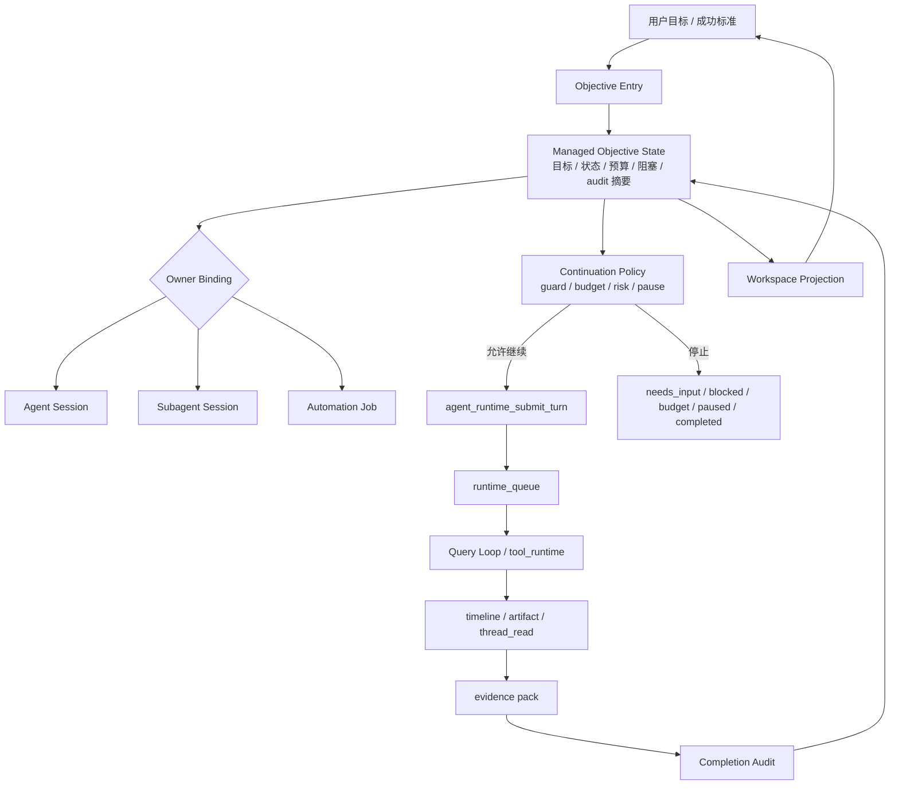
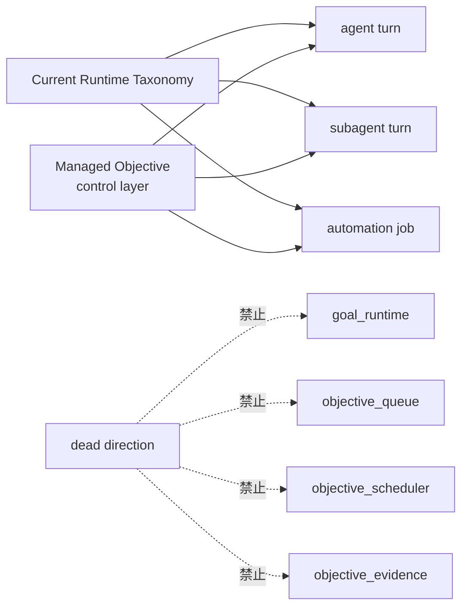
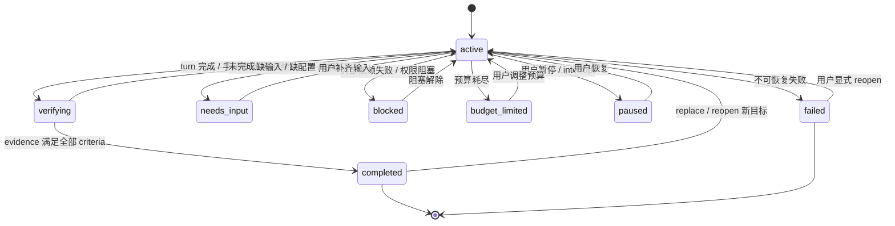
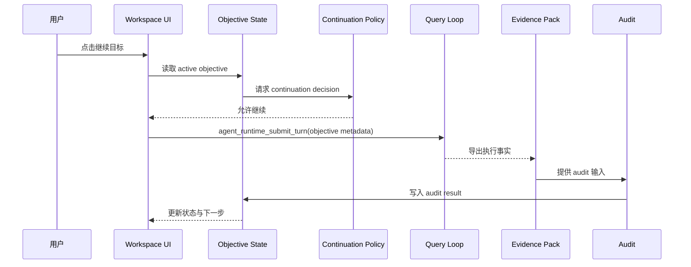
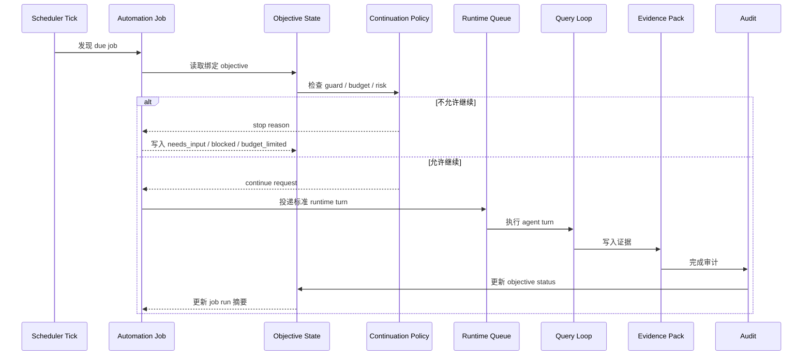
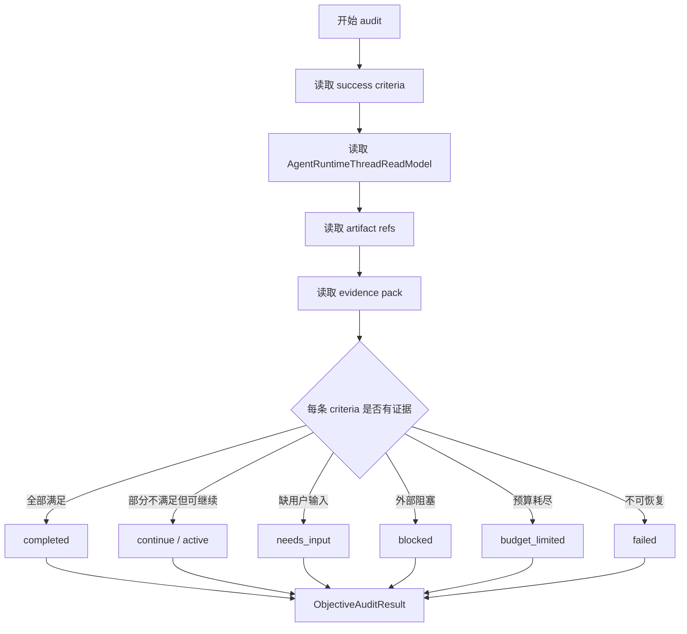
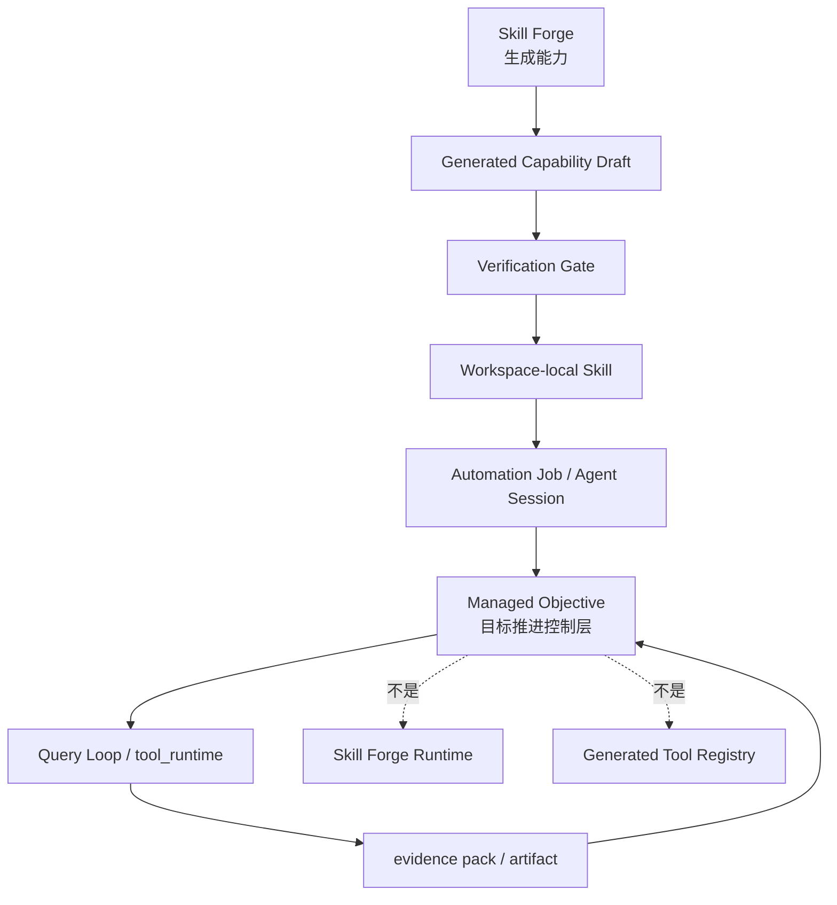

# Managed Objective 图纸

> 状态：proposal  
> 更新时间：2026-05-05  
> 目标：用图固定 Managed Objective 与 Query Loop、automation job、evidence pack、Workspace 的边界。

配套原型：

- [prototype.md](./prototype.md)

本文负责架构图、状态图、时序图和流程图；产品 UI 原型统一放在 `prototype.md`。

## 1. 总体主链图

固定判断：

1. Objective state 只控制目标推进。
2. Runtime execution 仍属于 Query Loop。
3. Durable 触发仍属于 automation job。
4. 完成审计读取 evidence pack 后回写 objective state。

## 2. 不是第四类 runtime 图

固定判断：

**Managed Objective 只能挂到现有执行实体，不能成为第四类 taxonomy。**

## 3. 状态机图

固定判断：

1. `running / queued / scheduled` 不属于 objective 状态。
2. `completed` 必须来自 audit。
3. `needs_input / blocked / budget_limited / paused` 都会阻止自动续跑。

## 4. Manual continuation 时序图

固定判断：

**手动 continue 也必须走 `agent_runtime_submit_turn`，不能成为 UI 私有执行入口。**

## 5. Automation owner 时序图

固定判断：

1. scheduler tick 只发现 due job。
2. automation job 是 durable owner。
3. objective 不自建 scheduler。
4. Query Loop 仍执行真实 turn。

## 6. Completion audit 流程图

固定判断：

1. `unknown` 不能判完成。
2. 模型总结只解释 evidence，不替代 evidence。
3. audit result 是 objective state 的输入，不是 evidence pack 的替代品。

## 7. 与 CreoAI / Skill Forge 的关系图

固定判断：

1. Skill Forge 负责生成能力。
2. Managed Objective 负责推进目标。
3. 两者都必须回到 current runtime 和 evidence 主链。

## 8. 后续改图规则

后续如果实现修改了状态机、owner 绑定或 audit 输入，必须同步更新本文。更新时遵守：

1. 图中不能新增第四类 runtime。
2. 图中不能让 objective 直接执行 tool。
3. 图中不能出现 evidence pack 的平行替代品。
4. 图中不能把 UI 画成完成状态事实源。
