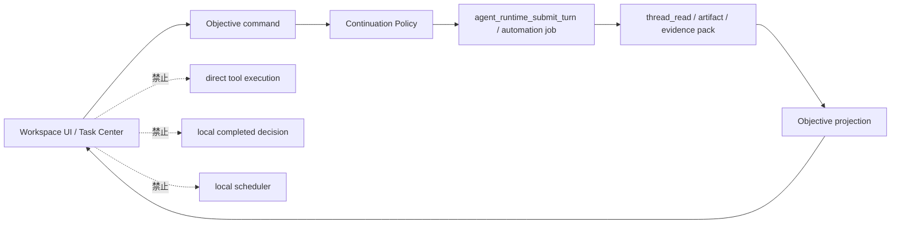

# Managed Objective 产品原型图

> 状态：proposal  
> 更新时间：2026-05-05  
> 目标：把 Managed Objective 在 Workspace、Task Center、Audit Drawer 和创建流程中的用户可见形态画出来，避免只停留在 runtime 概念。

依赖文档：

- [./README.md](./README.md)
- [./architecture.md](./architecture.md)
- [./diagrams.md](./diagrams.md)

## 1. 原型原则

Managed Objective 的 UI 不应该像“又一个自动化配置页”。它应该让用户一眼看懂三件事：

1. **这个目标要完成什么**。
2. **系统为什么继续或为什么停下**。
3. **完成判断背后的证据在哪里**。

固定边界：

1. UI 只展示后端 projection，不自行判断 completed。
2. UI 的 `继续` 操作只触发 continuation policy，不直接执行 tool。
3. UI 的 evidence 入口只打开 evidence pack / artifact / thread read 派生视图，不重建第二套证据。

## 2. Workspace 目标卡原型

```text
┌──────────────────────────────────────────────────────────────┐
│ Workspace · Objectives                                       │
├──────────────────────────────────────────────────────────────┤
│ 目标                                                         │
│ 每天 9 点生成 Markdown 趋势摘要，连续 7 次成功后完成          │
│                                                              │
│ 状态        active                                           │
│ Owner       automation job · daily-trend-report              │
│ 成功标准    0/7 连续成功 · 最近一次成功 2026-05-05 09:02       │
│ 预算        30 min / run · 2 retries · read-only tools        │
│ 下一步      下次运行 2026-05-06 09:00                         │
│                                                              │
│ [暂停] [手动继续] [查看审计] [打开产物]                         │
└──────────────────────────────────────────────────────────────┘
```

信息优先级：

1. 目标文本。
2. 当前状态。
3. owner 类型和 owner 名称。
4. 成功标准进度。
5. 下一步动作。
6. 暂停 / 继续 / 审计 / 产物入口。

## 3. 状态变体原型

### 3.1 `needs_input`

```text
┌──────────────────────────────────────────────────────────────┐
│ 目标：生成每日趋势摘要                                      │
│ 状态：needs_input                                            │
├──────────────────────────────────────────────────────────────┤
│ 系统暂停续跑，因为缺少输入：                                │
│ - API token 已过期                                           │
│ - 最近一次请求返回 401                                      │
│                                                              │
│ 需要你提供：                                                 │
│ [更新凭证] [改为本地文件输入] [取消目标]                      │
│                                                              │
│ 证据：request_log#20260505-0901 · evidence pack              │
└──────────────────────────────────────────────────────────────┘
```

### 3.2 `blocked`

```text
┌──────────────────────────────────────────────────────────────┐
│ 目标：生成每日趋势摘要                                      │
│ 状态：blocked                                                │
├──────────────────────────────────────────────────────────────┤
│ 阻塞原因：连续 2 次 dry-run 失败                             │
│ 最近失败：CLI 返回 exit code 2                               │
│ 建议下一步：检查配置文件路径或重新验证 skill                 │
│                                                              │
│ [重新验证 skill] [手动继续一次] [暂停目标] [查看失败证据]      │
└──────────────────────────────────────────────────────────────┘
```

### 3.3 `completed`

```text
┌──────────────────────────────────────────────────────────────┐
│ 目标：生成每日趋势摘要                                      │
│ 状态：completed                                              │
├──────────────────────────────────────────────────────────────┤
│ 完成原因：7 条成功标准全部满足                               │
│ - 连续 7 次成功：通过                                       │
│ - 每次生成 Markdown artifact：通过                           │
│ - 无未处理失败：通过                                        │
│                                                              │
│ [查看审计报告] [打开全部产物] [基于此目标创建新目标]          │
└──────────────────────────────────────────────────────────────┘
```

固定判断：

1. `needs_input` 强调用户要补什么。
2. `blocked` 强调为什么系统不能继续。
3. `completed` 强调哪些证据满足了成功标准。

## 4. Task Center 列表原型

```text
┌──────────────────────────────────────────────────────────────┐
│ Task Center                                                  │
├──────────────┬─────────────┬───────────────┬────────────────┤
│ 任务          │ Objective   │ 状态          │ 下一步          │
├──────────────┼─────────────┼───────────────┼────────────────┤
│ daily report │ 7-day goal  │ active        │ 明天 09:00      │
│ price watch  │ monitor     │ needs_input   │ 等待凭证         │
│ draft export │ publish prep│ paused        │ 用户恢复后继续   │
└──────────────┴─────────────┴───────────────┴────────────────┘
```

列表只展示 objective projection，不把 task center 变成调度事实源。

## 5. Audit Drawer 原型

```text
┌──────────────────────────────────────────────────────────────┐
│ Completion Audit · daily-trend-report                        │
├──────────────────────────────────────────────────────────────┤
│ Decision: continue                                           │
│ Summary : 已完成 3/7 次成功，仍需继续 4 次                    │
│                                                              │
│ Criteria                                                     │
│ [✓] 每次运行生成 Markdown artifact                           │
│     artifact: workspace://reports/2026-05-05.md              │
│ [✓] 最近一次运行无 tool error                                │
│     evidence: evidence_pack/runtime.json                     │
│ [ ] 连续 7 次成功                                            │
│     current streak: 3                                        │
│ [?] 输出摘要是否覆盖所有数据源                               │
│     unknown: 数据源 B 本次为空，需要下一轮确认                │
│                                                              │
│ Next action                                                  │
│ 下次 automation job 到期时继续运行。                         │
└──────────────────────────────────────────────────────────────┘
```

审计抽屉必须显示：

1. audit decision。
2. 每条 criteria 的状态。
3. evidence refs。
4. artifact refs。
5. unknown / unsatisfied 的下一步。

## 6. 创建目标弹窗原型

```text
┌──────────────────────────────────────────────────────────────┐
│ Create Managed Objective                                     │
├──────────────────────────────────────────────────────────────┤
│ 目标                                                         │
│ [每天 9 点生成 Markdown 趋势摘要，连续 7 次成功后完成      ] │
│                                                              │
│ Owner                                                        │
│ ( ) 当前 agent session                                      │
│ ( ) subagent session                                        │
│ (●) automation job: daily-trend-report                       │
│                                                              │
│ 成功标准                                                     │
│ [✓] 生成 Markdown artifact                                  │
│ [✓] 连续 7 次成功                                           │
│ [✓] 无未处理失败                                            │
│ [+ 添加标准]                                                 │
│                                                              │
│ 风险策略                                                     │
│ [✓] 只读工具可自动执行                                      │
│ [ ] 外部写操作自动执行                                      │
│ [✓] 高风险动作需要确认                                      │
│                                                              │
│ [取消]                                  [创建目标]           │
└──────────────────────────────────────────────────────────────┘
```

创建时必须校验：

1. owner 必填。
2. 成功标准至少一条。
3. 高风险策略默认关闭自动执行。
4. 未验证 skill 不能绑定自动目标。

## 7. 移动端压缩原型

```text
┌────────────────────────────┐
│ Objective                  │
├────────────────────────────┤
│ 每日趋势摘要               │
│ active · 3/7 success       │
│ owner: daily report        │
│ next: 明天 09:00           │
│                            │
│ [暂停] [继续] [审计]        │
└────────────────────────────┘
```

移动端只保留：目标、状态、进度、下一步、核心操作。

## 8. UI 与 runtime 的边界图



固定判断：

**原型里的按钮都是控制入口，不是新的执行入口。**
