# 灵感库 / 记忆系统图谱

> 状态：current diagrams  
> 更新时间：2026-05-01  
> 目标：用架构图、时序图和流程图固定普通用户灵感库与底层记忆主链的边界。

## 1. 总体架构图

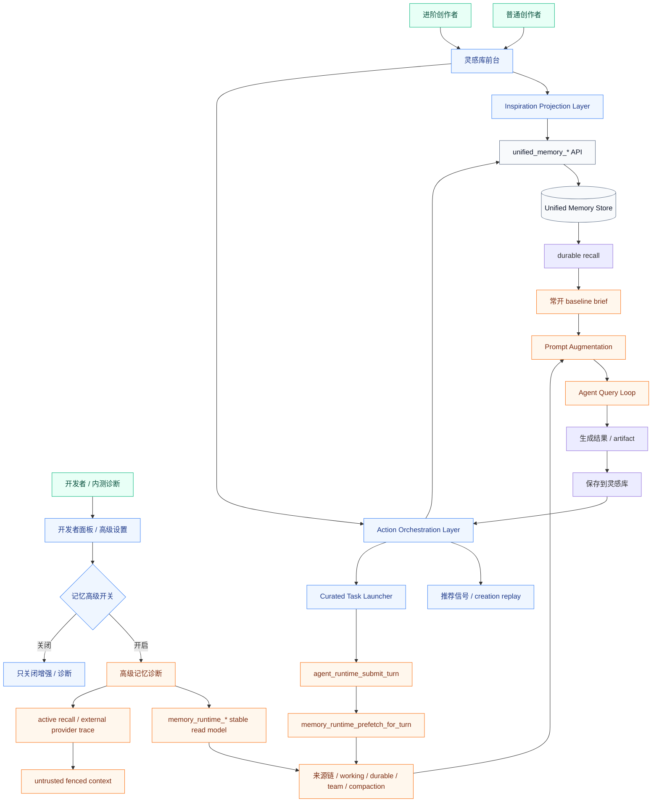

固定判断：

- `灵感库前台` 只接 projection 和 action orchestration。
- `高级记忆诊断` 只读 `memory_runtime_*`，并受开发者面板开关控制。
- 两者共享底层事实源，但不共享前台语言。
- 开发者开关关闭时只关闭增强 / 诊断，不关闭常开 baseline。

## 1.1 Memory Baseline / Enhancement 成本流

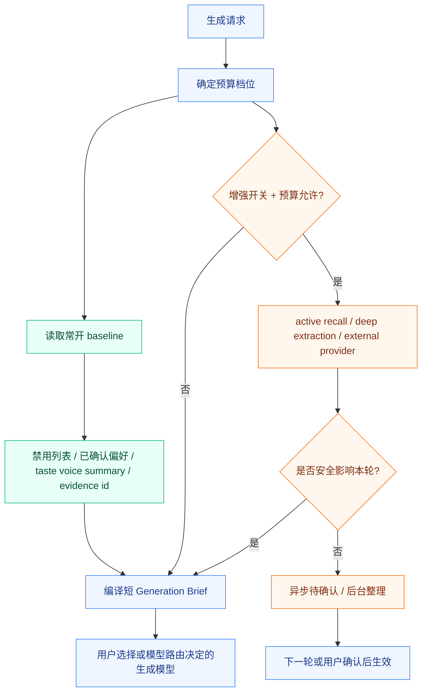

成本降级顺序：

1. 保留 baseline。
2. 降低 durable memory top-k。
3. 去掉原文，只保留 summary / evidence id。
4. 跳过 active recall / deep extraction / external provider。
5. 延迟到后台整理或用户确认，不阻塞本轮生成。

## 2. 产品分层图

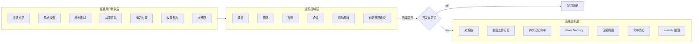

固定判断：

- 普通用户默认只进入 `Frontstage`。
- `Control` 可以逐步开放，但必须使用创作者语言。
- `Advanced` 只能通过开发者面板 / 高级入口进入，默认 off。

## 3. 保存结果到灵感库时序图

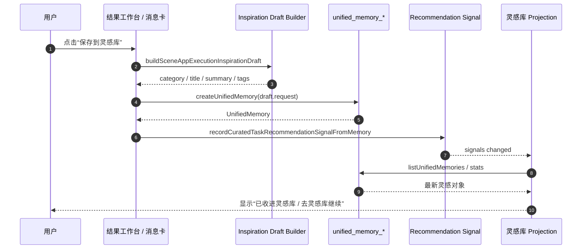

验收重点：

- 保存入口统一。
- 重复保存有稳定状态。
- 推荐信号刷新后，灵感库首页推荐同步更新。

## 4. 围绕灵感继续生成时序图

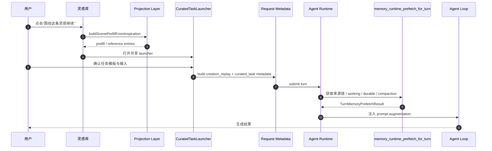

验收重点：

- 不退回裸 prompt。
- 灵感条目通过 reference selection 进入 request metadata。
- runtime recall 仍走 `memory_runtime_prefetch_for_turn`。

## 5. 自动整理候选流程图

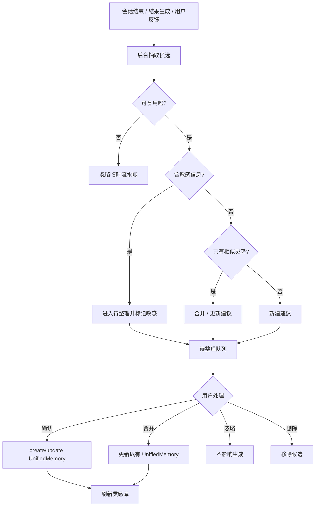

固定判断：

- 自动候选未确认前不影响默认生成。
- 临时流水账不进入灵感库。
- 敏感候选必须优先进入审核状态。

## 6. 普通入口与高级入口判定流程

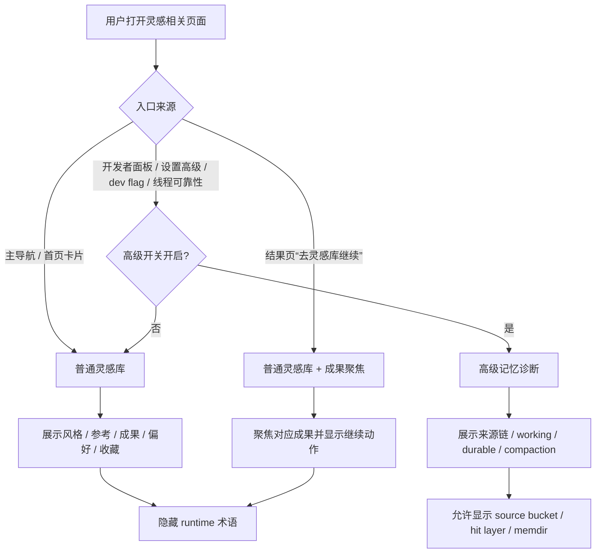

验收重点：

- 主导航进入时不显示高级诊断分区。
- 线程可靠性或设置高级入口可以进入诊断层。
- 结果页跳转必须聚焦成果，而不是泛化首页。

## 7. 状态机

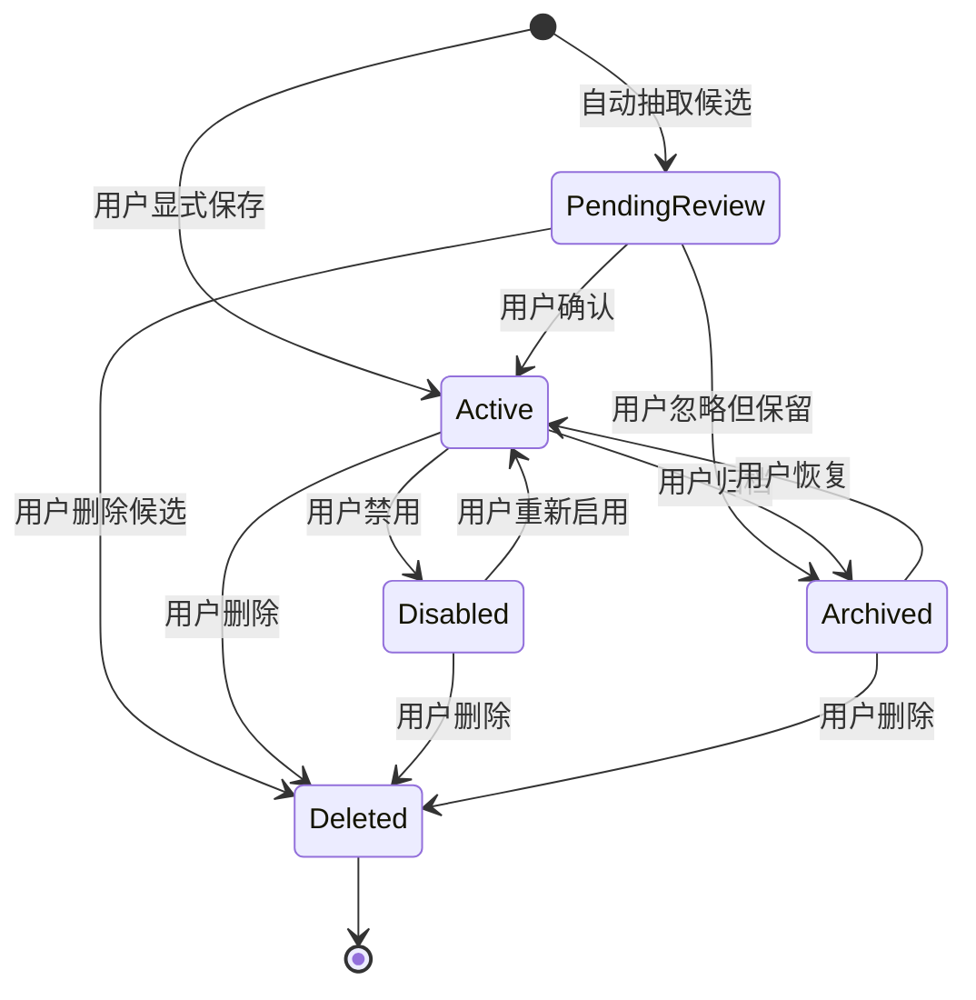

固定判断：

- 只有 `Active` 默认影响生成。
- `PendingReview` 不默认影响生成。
- `Disabled` 保留展示，但不进入默认 reference selection。

## 8. 诊断数据读取图

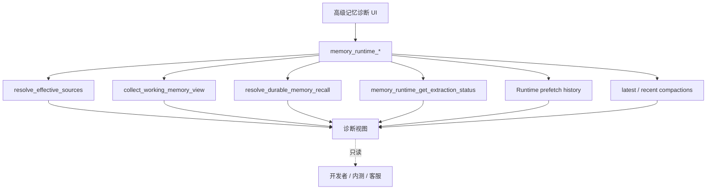

固定判断：

- 诊断 UI 不扫描磁盘。
- 诊断 UI 不自己拼 prompt。
- 诊断 UI 只解释 current read model。

## 9. 开发者面板记忆开关流程

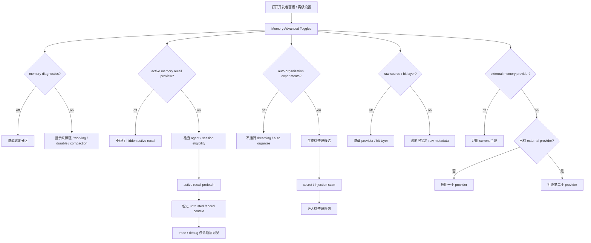

固定判断：开关只放大可观察性和实验能力，不改变 `unified_memory_*` / `memory_runtime_*` 的事实源地位。

## 10. Active Memory 默认关闭流程

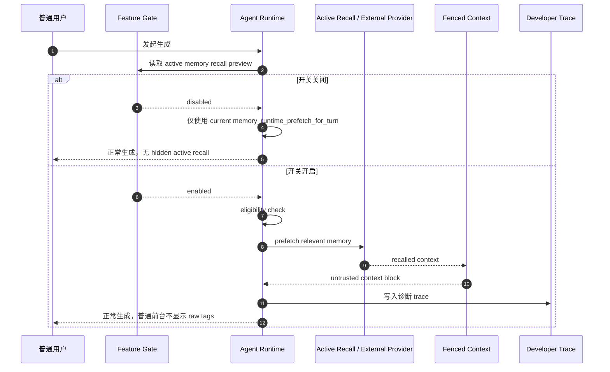

验收重点：默认关闭时不产生 hidden recall；开启后也不把 recalled context 当用户新输入。
