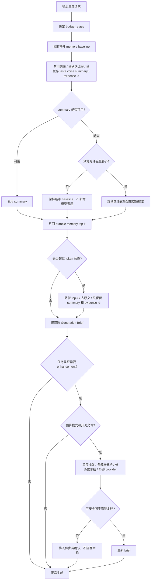
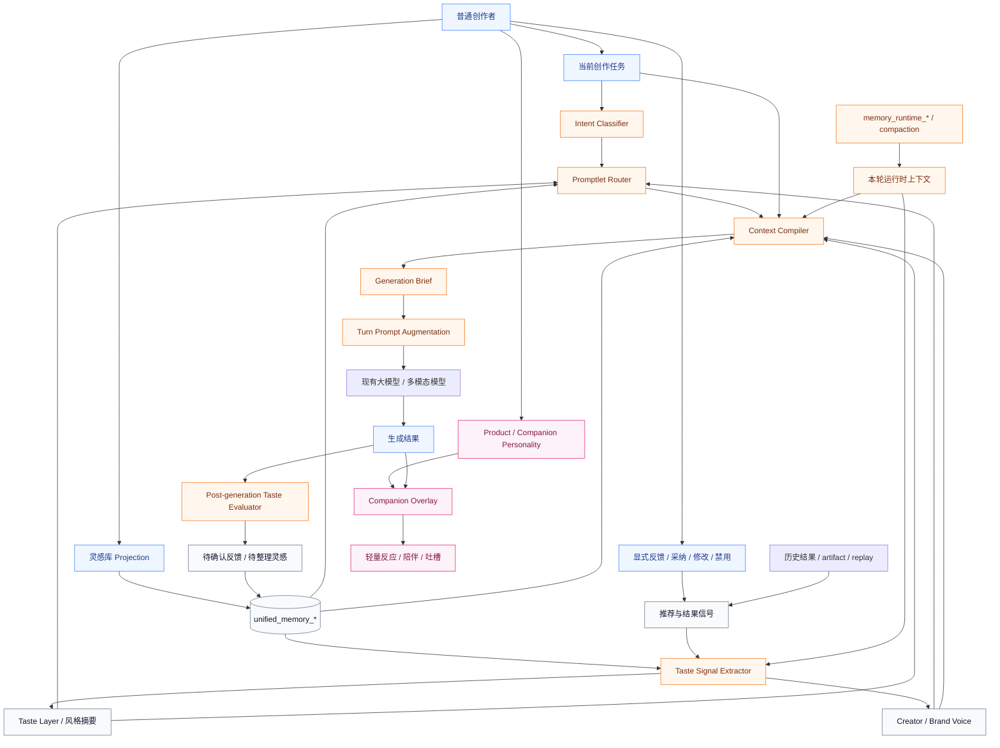
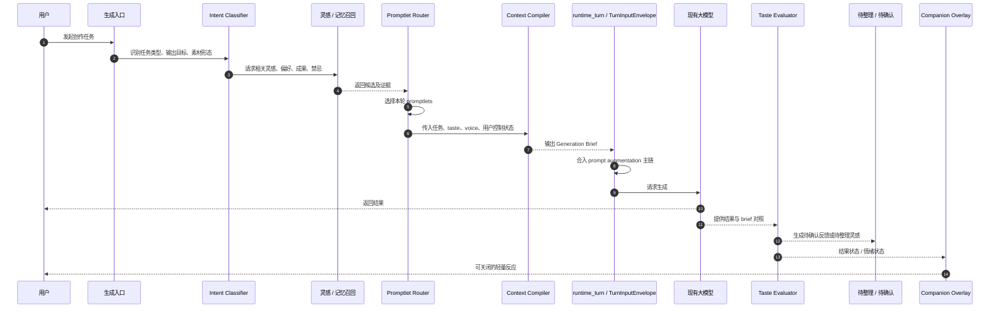
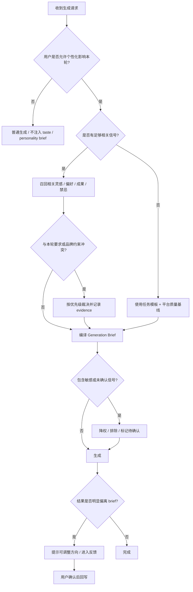
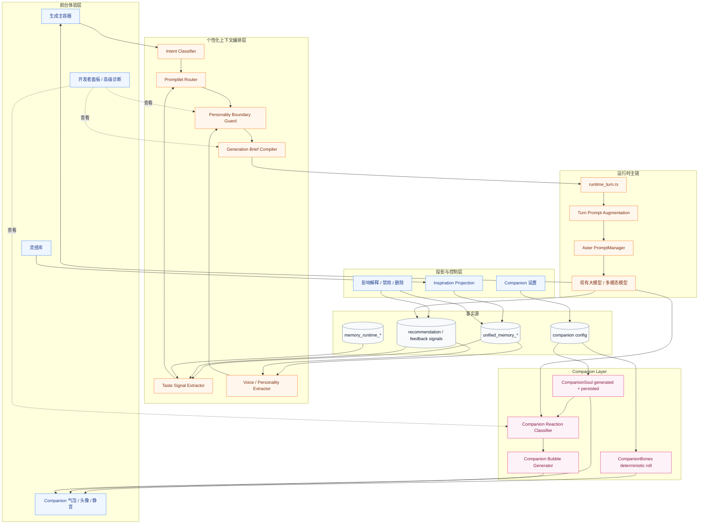
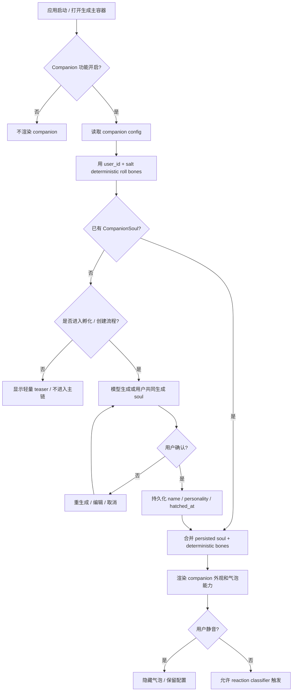
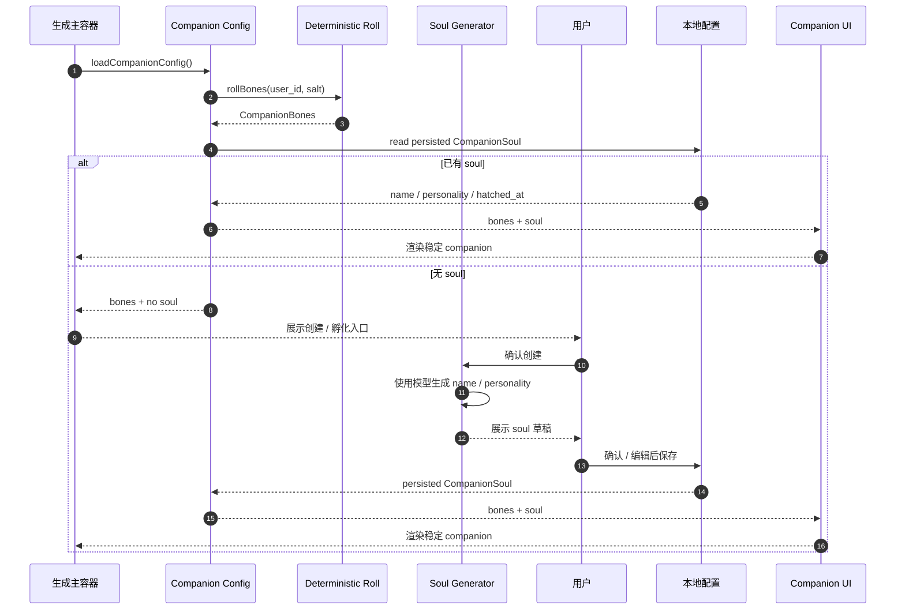
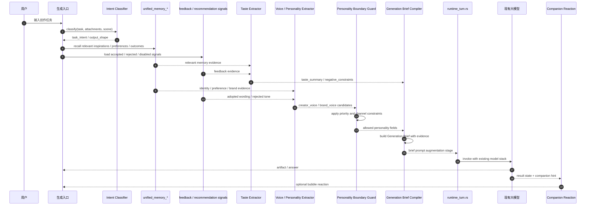
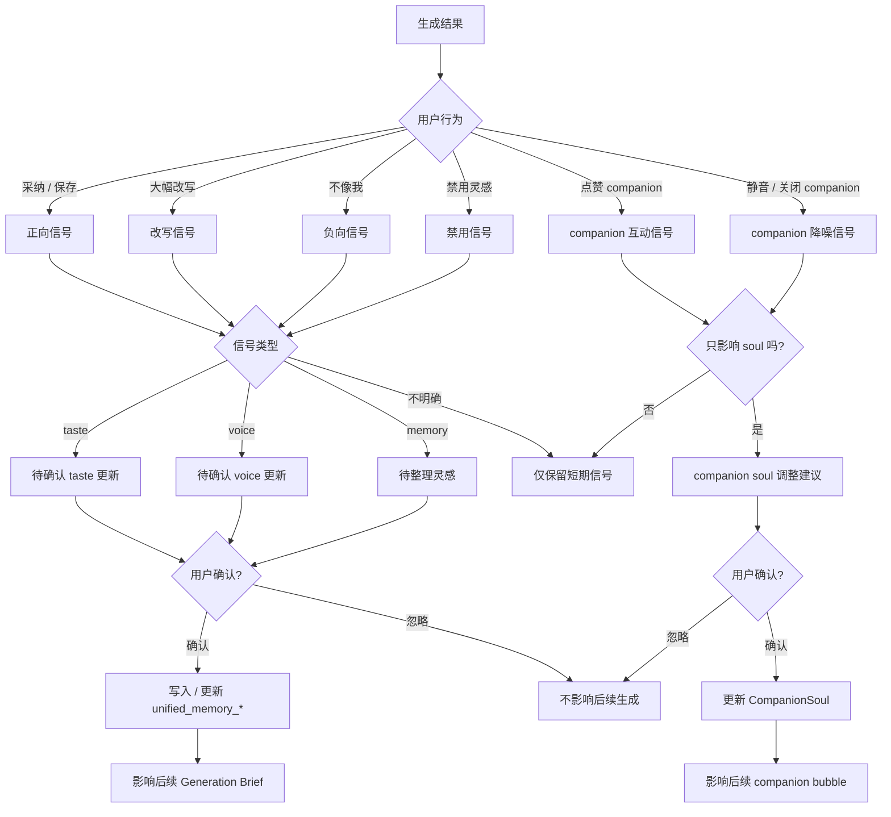

# 下一次生成如何更像我

> 状态：current roadmap plan  
> 更新时间：2026-05-01  
> 目标：定义 Lime 如何把灵感库、记忆、历史结果和用户反馈编译成下一次生成可执行的个性化上下文，而不是依赖单个 system prompt，也不把自训小模型作为默认路线。

## 1. 固定结论

一句话：

**Lime 默认路线不训练自有小模型，也不把个性化做成重服务端 AI Agent；先把“灵感如何让下一次生成更像我”做成客户端优先、低成本、可解释的 `Taste + Personality` 个性化上下文编排。**

更准确的拆法是：

```text
Memory = 事实、历史、素材和证据底座
Taste = 用户觉得什么好、什么像自己、什么审美状态应该延续
Personality = 谁在说话、用什么人格和口吻陪伴 / 表达
Feedback = 哪些结果被采纳、修改、否定，驱动 taste 和 personality 演进
```

所以你说“这块应该是 taste 和 personality”是对的，但要加一个边界：**memory 不是被替代，而是退到底层当证据；taste 和 personality 才是普通用户能感知到的个性化表达层。**

客户端产品的架构原则：

1. 个性化状态优先保留在客户端或用户可控存储中。
2. 服务端不承担长期 AI Agent 编排主链。
3. 服务端不默认训练、托管或持续更新 Lime 自有小模型。
4. 服务端只做必要的同步、授权、模型访问代理、配置下发和可选云能力。
5. 任何需要云侧 AI 的能力都必须有明确成本上限、用户授权和本地降级路径。

这里的顶层能力不叫 `Prompt Router`，而叫：

```text
Personalization Context Orchestration
个性化上下文编排
```

原因：

1. `router` 在 Lime 已经用于模型路由、执行器路由和能力候选决策，继续把顶层能力叫 `Prompt Router` 会和 `model routing` 混淆。
2. Lime 的核心不是“把 prompt 路由到哪里”，而是“把用户品味、灵感、历史结果和当前任务编译成一份可执行创作简报”。
3. `Promptlet Router` 可以保留为子模块，职责仅是选择本轮需要启用哪些细粒度 promptlet。
4. 面向普通创作者时，用户不应该理解 router、system prompt 或 context compile；用户只需要感到“它越来越知道我要什么”。

固定术语：

| 术语 | 定位 | 是否面向普通用户 |
| --- | --- | --- |
| `Personalization Context Orchestration` | 顶层内部能力 | 否 |
| `Promptlet Router` | 选择 promptlet 的子模块 | 否 |
| `Taste Layer` | 用户品味的稳定摘要层 | 否 |
| `Personality Layer` | 用户 / 品牌声线、Lime 产品人格、companion 人格的边界层 | 否 |
| `Generation Brief` | 本轮生成前编译出的创作简报 | 可解释但不默认展示 |
| `Companion Overlay` | 伙伴人格与陪伴反应层 | 是，但只表现为陪伴 |
| `灵感库` | taste / reference / memory / feedback 的普通用户投影 | 是 |

Companion 的人格对象必须拆成两块：

| 对象 | 生成方式 | 是否持久化 | 作用 |
| --- | --- | --- | --- |
| `CompanionBones` | 由 user id / seed deterministic 生成 | 否，每次读取重算 | 外观、物种、稀有度、基础属性、stats |
| `CompanionSoul` | 由模型生成或用户共同生成 | 是 | 名字、personality、说话习惯、陪伴关系 |

这条规则直接借鉴 Claude Code Buddy：外观和基础属性 deterministic，避免用户靠改配置伪造稀有度；`soul / name / personality` 持久化，保证伙伴不是每次随机变脸。

`Personality Layer` 必须继续拆成三层，不能混成一个“有个性”的大 prompt：

| 子层 | 回答的问题 | 是否能影响正式生成 |
| --- | --- | --- |
| `Creator / Brand Voice` | 这篇内容应该像谁在说话 | 可以，但必须进入 `Generation Brief` 并可解释 |
| `Product Personality` | Lime 默认怎么和用户互动 | 只影响交互语气，不默认进入 artifact |
| `Companion Personality` | 伙伴怎么吐槽、陪伴、回应点名 | 只影响气泡 / 陪伴层，默认不影响正式内容 |

## 2. 为什么默认不训练自有小模型

Ribbi 公开访谈里同时强调两件事：一是 taste layer 会把画面品味转成可压缩上下文；二是青蛙人格让产品像一个“有品味、会进化的人”。这说明 Lime 应该把个性化拆成 `Taste Layer` 和 `Personality Layer`，但不等于 Lime 要把训练自有小模型写进默认路线。

外部参考：

1. Ribbi 创始人访谈转载：[智源社区](https://hub.baai.ac.cn/view/53981)
2. Ribbi 访谈原文线索：[知乎专栏](https://zhuanlan.zhihu.com/p/2027420996353761358)
3. Ribbi 商业与产品访谈：[36Kr](https://eu.36kr.com/zh/p/3778121523025154)
4. LangGraph 长短期记忆最佳实践：[Memory](https://docs.langchain.com/oss/python/langgraph/add-memory) 与 [Persistence](https://docs.langchain.com/oss/python/langgraph/persistence)

### 2.1 默认不训练小模型的理由

1. **客户端定位决定不能把成本堆到服务端**
   - Lime 做客户端产品，就是为了避免把长期 AI Agent、个性化状态和模型训练都搬到服务端。
   - 如果为了“更像我”再引入服务端小模型训练，会反向破坏客户端产品的成本、隐私和交付优势。

2. **成本结构不适合当前阶段**
   - 自训模型不是一次性成本，后续还有数据清洗、评估、部署、监控、回滚和重新训练成本。
   - Lime 对成本敏感，优先做按需调用、缓存、摘要和分层编译，而不是增加一条长期训练与推理基础设施。

3. **冷启动不成立**
   - Lime 还没有足够高质量、带反馈标签的个人创作数据。
   - 没有稳定评估集时训练小模型，只会把随机偏好固化成模型幻觉。

4. **隐私和信任成本过高**
   - 创作者的灵感、客户资料、品牌语气和未发布内容都可能敏感。
   - 训练链路比 prompt 编排更难解释、删除、回滚和审计。

5. **Ribbi 的小模型动机不是 Lime 的默认必需品**
   - Ribbi 的核心压力是多模态参考素材长期累积后，原图上下文成本和延迟爆炸。
   - Lime 现阶段可以先用现有多模态模型、摘要缓存、相关性召回和 brief 编译解决大部分问题。

6. **现有模型已经足够做第一阶段品味提取**
   - 现阶段关键是拆好任务、promptlet、证据和用户控制，而不是训练能力本身。
   - 如果 prompt 编排层都没有稳定，训练小模型只会把不成熟流程固化。

7. **评估应该先于训练**
   - 先定义“更像我”的可测指标：采纳率、少改率、禁忌命中率、风格一致性、用户复用率。
   - 没有这些指标，训练小模型没有优化方向。

### 2.2 成本优先策略

默认采用下面的成本阶梯，能用前一层解决就不进入后一层：

1. **规则和确定性逻辑**
   - deterministic bones、用户开关、禁用列表、优先级裁决、预算裁剪。
2. **缓存与摘要复用**
   - taste summary、voice summary、reference feature、generation brief evidence 缓存。
3. **便宜模型 / 轻量调用**
   - 用现有便宜模型做分类、抽取、排序和批处理，不做自训。
4. **昂贵多模态模型按需使用**
   - 只在保存高价值参考、用户明确要求分析素材、或缓存失效时调用。
5. **人工确认和异步整理**
   - 后台批量整理，避免每次生成都做完整 taste 推理。

### 2.3 自有小模型不是路线承诺

自有小模型、蒸馏或自训 VLM 不进入默认路线图，也不作为阶段目标。只有当业务已经明确从客户端产品演进出独立云服务，且用户、成本、隐私和 ROI 都成立时，才允许写新的独立研究 proposal。启动条件必须同时满足：

1. 用户明确选择云侧个性化，而不是默认客户端个性化。
2. 现有模型编排在质量、延迟或成本上被真实数据证明成为瓶颈。
3. 便宜模型、缓存、批处理、摘要和 promptlet 编排都已经无法继续降低成本。
4. 用户已积累足够多可授权、可撤回、可删除的数据。
5. `Generation Brief` 结构已经稳定，能作为训练 / 蒸馏目标。
6. 有离线评估集证明自有小模型在总拥有成本上优于现有模型编排，而不是只降低单次 token 价格。
7. 有明确退出条件：如果质量、维护成本或隐私风险不达标，研究项直接关闭，不进入产品路线。

固定裁决：

**默认后续也不训练自有小模型；Lime 的主线是客户端优先的 `Taste + Personality` 低成本个性化闭环。小模型不是 roadmap 阶段，只能作为未来云服务方向成立后的独立 proposal。**


### 2.4 Token 消耗与模型分层策略

如果把历史对话、灵感库、图片参考、taste summary、personality、companion 反应和诊断信息全量塞进每一轮 prompt，Token 消耗会很快失控。Lime 必须把“更像我”做成分层预算系统，而不是默认每轮都跑高价模型。

外部价格页也说明模型成本差异非常大：OpenAI 官方价格页显示旗舰模型、mini 模型、cached input、Batch API 的价格差距明显；Google Gemini 官方价格页也把 Flash-Lite 定位为面向大规模使用的低成本模型，并提供缓存 / batch 等成本手段。因此 Lime 的默认策略必须是高低搭配，而不是默认全用最贵模型。

本地参考项目也支持这个判断：

1. Codex：`memories/write/src/start.rs` 在后台 memory pipeline 运行前检查 rate limit，低于阈值就 `skipped_rate_limit`；`memories/read/src/prompts.rs` 只注入 5000 token 上限内的 `memory_summary.md`。
2. Claude Code：`SessionMemory` 默认要到 10000 tokens 才初始化、两次更新间隔 5000 tokens、3 次 tool calls；相关 memory 选择最多 5 条，失败返回空。
3. Hermes：built-in memory 常在，但默认 `MEMORY.md / USER.md` 字符预算只有 `2200 / 1375`，并用 frozen snapshot 保持 prompt cache 稳定。
4. Warp：AI 请求前先用 `has_any_ai_remaining()` 做 credits / overage / BYOK gate，模型 UI 明确展示 Cost / Speed / Intelligence。

固定策略：

1. **默认启用低成本个性化，不默认启用高成本深度分析**
   - 默认使用已确认的 taste / voice summary、禁用列表、相关性召回和短 brief。
   - 不默认每轮重新分析图片、长历史或全量灵感库。

2. **昂贵模型只用于明确高价值节点**
   - 高质量最终生成、复杂多模态理解、用户显式要求深度分析时才可进入高成本模型。
   - taste extraction、分类、排序、冲突检查优先走便宜模型或规则。

3. **高成本增强默认分层或关闭**
   - `deep_taste_analysis`：默认关闭，仅用户保存视觉参考、手动触发或高级模式开启。
   - `active_memory_recall_preview`：默认关闭，这指 raw recall / 命中预览，不是关闭基础 memory。
   - `raw_prompt_diagnostics`：默认关闭。
   - `companion_model_reaction_every_turn`：默认关闭；companion 反应优先规则、模板和缓存。

4. **先预算，后编译 brief**
   - 进入 `Generation Brief Compiler` 前必须先决定本轮 `budget_class`。
   - 如果预算不足，先裁剪 reference、使用已有 summary、降低模型档位，而不是静默烧 token。

5. **用户成本必须可见、可控、可回退**
   - 普通用户看到的是“经济 / 平衡 / 高质量”这类模式，不看 token 细账。
   - 开发者面板可以看 `estimated_cost_class`、召回数量、brief token 预算和 routing evidence。

建议预算档：

| 档位 | 默认状态 | 使用模型 | 适用场景 |
| --- | --- | --- | --- |
| `minimal` | 可作为省钱模式 | 规则、缓存、已有 summary，不新增模型调用 | 低成本续写、companion 静默、只套用已确认偏好 |
| `economy` | 默认推荐 | 便宜模型做分类 / 抽取 / 排序，用户选择的生成模型做输出 | 大多数普通生成 |
| `balanced` | 用户可选 | 便宜模型 + 标准模型，必要时少量多模态分析 | 重要创作、需要更强 taste 对齐 |
| `premium` | 默认关闭 | 高价模型 / 深度多模态 / 更长上下文 | 用户明确选择高质量或高价值交付 |
| `developer_trace` | 默认关闭 | 额外诊断、promptlet 日志、raw recall 预览 | 开发者面板 / 内测排查 |

与现有任务路由的关系：

1. 个性化编排只产生 `budget_class`、能力需求和 promptlet 需求。
2. 最终选哪个模型仍交给 `docs/roadmap/task/model-routing.md` 定义的 `CandidateModelSet -> RoutingDecision`。
3. 成本估算、真实 usage、限额、配额和 fallback 继续走 `docs/roadmap/task/cost-limit-events.md` 的 `cost_estimated / cost_recorded / rate_limit_hit / quota_low` 事件主链。
4. `Promptlet Router` 不能绕过模型路由直接指定高价模型。

### 2.5 Memory 不能整体关闭，但必须分层控成本

Memory 是 Lime “更像我”的底座，不能作为普通用户可关闭的整体能力；否则灵感库、生成连续性、禁用偏好、taste summary、voice summary 和“不要再用这条”的纠偏都会失效。但这不等于每一轮都要高成本读取、重排、重抽取或全量注入 memory。

固定判断：

**Memory baseline 常开；Memory enhancement 分层、预算化、可解释；开发者面板开关只控制增强和诊断，不控制产品失忆。**

这个判断不是拍脑袋，四个本地项目分别给出边界：

1. **Codex** 有 `use_memories / generate_memories`，说明 read / write 要拆开；同时 read path 只注入截断后的 summary，write path 会受 rate limit gate。它支持“分层控制”，不支持 Lime 普通用户总关闭 memory。
2. **Claude Code** 把 session memory 放在 feature gate、token 阈值和 forked subagent 后面，相关召回最多 5 条；它支持“高成本增强按需跑”，不支持每轮全量拼接。
3. **Hermes** 明确 built-in memory always active，外部 provider 只是 additive 且最多一个；它支持“baseline 常在，外部增强受控”。
4. **Warp** 没有给出长期 memory 方案，但它证明 AI 请求、模型成本和上下文附件必须先过 usage / budget gate。

分层如下：

| 层 | 默认状态 | 成本策略 | 用户控制 |
| --- | --- | --- | --- |
| `runtime working memory` | 必须开启 | 本地状态 / 会话摘要 / 当前任务上下文，不额外跑高价模型 | 不提供整体关闭，只随会话结束、清空线程或项目隔离变化 |
| `confirmed durable memory` | 默认开启 | 只召回 top-k、只注入摘要和 evidence id，不全量拼接 | 条目级删除、禁用、归档、解释影响 |
| `taste / voice summary cache` | 默认开启 | 保存已确认摘要，优先复用缓存；缺失时先降级，不强制高价补齐 | 可重算、可纠偏、可禁用具体来源 |
| `active recall expansion` | 默认低档 / 受预算 | 只有相关性不足或任务需要时扩展召回；省钱模式可跳过 | 通过经济 / 平衡 / 高质量模式控制 |
| `deep memory extraction` | 默认不在每轮运行 | 保存灵感、会话结束、空闲、批处理或用户确认后运行 | 待确认队列，确认前不影响生成 |
| `external memory provider` | 默认关闭 | 同一时刻最多一个 provider，必须 fenced / untrusted，不能绕过 current 主链 | 开发者 / 高级开关 |
| `raw hit diagnostics` | 默认关闭 | 只在开发者面板展示命中层、source bucket、token 预算 | 开发者开关 |

这意味着：

1. 普通用户不应该看到“关闭 Memory”这个主开关，因为它会破坏产品主价值。
2. 普通用户应该看到“这条灵感是否影响生成”“省钱 / 平衡 / 高质量”“不要再用这条”。
3. 高成本 memory 能力不应默认每轮执行，尤其是图片重新理解、长历史重总结、全库语义重排、external provider 和 raw diagnostics。
4. 默认生成链只带短 `Generation Brief`、少量 relevant evidence 和已缓存 summary。
5. 如果预算不足，系统应该降级为“使用已确认 memory baseline”，而不是完全无记忆生成。
6. 如果用户选择极省钱模式，系统可以跳过新抽取、新重排和新多模态分析，但仍保留禁用列表、已确认偏好和最小 summary。

### 2.6 Memory Token 预算流程



预算规则：

1. `memory_baseline_token_budget` 必须小而稳定，优先放 summary、禁用列表、已确认偏好和 evidence id，不放原文。
2. `durable_memory_top_k` 由 budget class 决定，省钱模式可以只取 1-3 条。
3. 图片、长文、长历史默认只使用已缓存的 feature / summary。
4. raw memory hit 不进入普通 prompt，只进入开发者诊断。
5. 任何超预算 memory 都进入异步整理或待确认，不阻塞当前生成。
6. 成本压力下的降级顺序是：保 baseline -> 降 top-k -> 去原文 -> 跳 enhancement -> 延迟后台整理；不要直接无记忆生成。

### 2.7 四个本地项目对 Lime 的硬约束

| 项目 | 本地源码事实 | Lime 约束 |
| --- | --- | --- |
| Codex | `use_memories` 和 `generate_memories` 分开；read path 只注入 5000 token 内的 `memory_summary.md`；write pipeline 异步、rate-limit gate、无 diff 可跳过 | 拆 baseline read、background write、diagnostics；高成本写 / 整理可跳过，read baseline 不全量注入 |
| Claude Code | 相关 memory 最多 5 条；SessionMemory 10000 token 初始化、5000 token 更新间隔、3 次 tool call；forked subagent 后台跑；autocompact 有 buffer 和 3 次失败熔断 | 记忆召回 top-k；session / deep extraction 必须 gate；后台增强不污染主线程 |
| Hermes Agent | built-in memory always active；external provider 最多一个且 additive；`MEMORY.md / USER.md` frozen snapshot；字符预算 `2200 / 1375`；fenced recall | baseline 常开；external provider 默认关闭且单一；长期记忆写入安全扫描、预算化、fenced |
| Warp | AI 请求前检查 request / bonus / overage / BYOK；模型选择展示 Cost / Speed / Intelligence；pending context 是下一次 query 附件并做 bounded summary | 成本模式和配额先于 brief 编译；普通用户看档位，不看 token 细账；context 附件不等于长期 memory |

综合裁决：

1. **Memory baseline 不能关**：否则 Lime 的灵感库、禁用偏好、taste / voice summary 和“更像我”主价值断掉。
2. **Memory enhancement 必须能关 / 能降级**：否则成本、隐私、误召回和解释成本会失控。
3. **默认经济档必须可用**：只靠缓存、摘要、top-k 和用户选择的最终生成模型，不额外每轮烧高价分析。
4. **开发者面板是增强开关，不是普通用户主心智**：raw hit、provider、prompt excerpt、trace 只服务排障。

## 3. Claude Code 和 Ribbi 分别学什么

### 3.1 Claude Code：学多 prompt 边界，不学前台心智

Claude Code 的价值在于证明：

1. 现在不是一个巨大 system prompt 解决所有问题的时代。
2. 不同能力应该有独立 prompt、边界、触发条件和测试面。
3. 记忆抽取、会话压缩、计划、权限、subagent、companion 等都应该有专用 prompt。
4. 主运行时应该只装配本轮需要的上下文，而不是把所有规则全量塞入。

对 Lime 的映射：

| Claude Code | Lime 应学 | Lime 不学 |
| --- | --- | --- |
| 多 prompt 文件 | promptlet 分层、按需装配 | 把 prompt 文件心智暴露给用户 |
| memory extraction | 灵感 / 偏好 / 禁忌抽取 | `/memory` 工程命令 |
| session memory | 本轮创作状态 | 编程项目规则语言 |
| Buddy | companion overlay | 编程宠物养成复杂度 |
| prompt dump / diagnostics | 开发者面板诊断 | 普通用户默认可见 |

固定判断：

**Claude Code 是底层 prompt fabric 参考，不是 Lime 普通用户产品模板。**

### 3.2 Ribbi：学 taste layer 和单主生成容器，不学青蛙 IP

Ribbi 对 Lime 的价值在于：

1. 前台像一个主生成容器，而不是工具页大拼盘。
2. 后台持续处理 taste、memory、feedback、reference。
3. 参考素材不会简单全量塞入模型，而是被压缩成可复用的品味状态。
4. 有一个强人格 companion，让系统不像冷冰冰的工具。
5. taste 回答“什么像我”，personality 回答“谁在陪我、谁在表达”。

Lime 不应照搬：

1. Ribbi 的青蛙 IP。
2. 默认粗口、毒舌、痞感。
3. 收藏池命名。
4. “自训 VLM”作为第一阶段路线。
5. 为了像 Ribbi 而增加平行页面或平行事实源。

固定判断：

**Ribbi 是产品形态北极星；Lime 学它的 taste / personality 分层和上下文闭环，不学它的品牌表皮。**

## 4. 目标架构



固定边界：

1. `灵感库` 仍是 `unified_memory_*` 的前台投影，不新增 `inspiration_*` 平行事实源。
2. 运行时读取仍向 `memory_runtime_*`、`runtime_turn.rs`、`TurnInputEnvelope` 和 Aster `PromptManager` 主链收敛。
3. `Taste Layer` P0 可以是摘要视图和编译结果，不必先新增独立数据库。
4. `Personality Layer` P0 可以先是配置、摘要和 `CompanionSoul`，不必先新增长期人格数据库。
5. `Promptlet Router` 不选择模型；模型选择仍归 `model routing`。
6. `Companion Overlay` 不写入创作事实源，不决定生成内容，只做可关闭的人格层。
7. `Creator / Brand Voice` 可以影响正式生成，但必须进入 `Generation Brief`，不能从 companion 气泡偷渡。

## 5. Promptlet 分层

P0 不做一个超级 prompt，而是把个性化能力拆成可测试的 promptlet。

| 层 | Promptlet | 输入 | 输出 |
| --- | --- | --- | --- |
| intake | `inspiration_intake_normalizer` | 用户保存的灵感、链接、图片、片段 | 归一化灵感草稿 |
| extraction | `taste_signal_extractor` | 灵感、历史结果、用户反馈 | 风格、节奏、审美、禁忌信号 |
| extraction | `reference_feature_extractor` | 参考素材 | 可复用参考特征 |
| extraction | `outcome_pattern_extractor` | 被采纳结果 | 成功结构、常用打法 |
| extraction | `negative_constraint_extractor` | 用户删改、禁用、差评 | 不要做什么 |
| extraction | `voice_personality_extractor` | 用户显式声线、品牌规则、被采纳文案 | 用户 / 品牌表达人格 |
| selection | `task_intent_classifier` | 当前输入、模板、附件 | 本轮任务类型与意图 |
| selection | `inspiration_relevance_ranker` | 当前任务、灵感库 | 相关灵感候选 |
| selection | `conflict_resolver` | 用户要求、品牌约束、灵感偏好 | 冲突裁决 |
| selection | `personality_boundary_guard` | 任务类型、输出渠道、companion 状态 | 哪类 personality 可进入本轮 |
| compilation | `generation_brief_compiler` | 任务、taste、灵感、约束 | `Generation Brief` |
| evaluation | `post_generation_taste_evaluator` | 生成结果、brief、反馈 | 是否像用户、哪里偏离 |
| evaluation | `personality_fit_evaluator` | 生成结果、voice brief、用户反馈 | 是否像该用户 / 品牌在说话 |
| companion | `companion_reaction_classifier` | 任务状态、结果状态、用户情绪 | companion 是否该出现 |
| companion | `companion_bubble_generator` | 反应类型、人格设定 | 轻量气泡文案 |

固定规则：

1. 每个 promptlet 都必须有明确输入、输出和触发条件。
2. promptlet 不直接读 UI 状态；它们消费由编排层传入的结构化上下文。
3. promptlet 输出先进入 brief 或待确认队列，不直接写长期事实源。
4. 任何会长期影响生成的信号，都必须能解释、禁用或删除。

## 6. Generation Brief

`Generation Brief` 是“更像我”的核心产物。它不是用户看到的一段 prompt，而是本轮生成前的结构化创作简报。

建议 P0 结构：

```text
GenerationBrief
  task_goal: 本轮要完成什么
  audience: 面向谁
  output_shape: 输出形态、长度、渠道、格式
  taste_summary: 本轮相关的品味摘要
  voice_personality: 本轮相关的用户 / 品牌声线
  reference_points: 本轮可用参考，不超过预算
  outcome_patterns: 可复用的成功结构
  negative_constraints: 明确不要做什么
  brand_or_project_constraints: 品牌 / 项目硬约束
  companion_hint: 是否允许 companion 做轻量反应
  evidence: 哪些灵感 / 记忆 / 反馈影响了 brief
```

优先级固定为：

```text
用户明确本轮要求
  > 品牌 / 项目硬约束
  > 用户 / 品牌声线
  > 用户长期 taste
  > 任务类型模板
  > Lime 产品人格
  > Companion personality
```

这条优先级解决四类冲突：

1. 用户本轮说“这次不要搞怪”，companion personality 不能继续痞感吐槽。
2. 品牌项目要求正式克制，长期个人偏好不能强行活泼。
3. 灵感库里旧风格与当前任务冲突时，当前任务优先。
4. Companion 只能作为陪伴层，不能覆盖生成策略。
5. 用户 / 品牌声线可以塑造 artifact，但 product personality 和 companion personality 默认不能污染 artifact。

## 7. 生成时序



验收重点：

1. brief 编译发生在生成前，而不是生成后再解释。
2. 召回必须有预算和相关性排序，不能全量拼接灵感库。
3. 生成后评价不直接改长期偏好，先进入待确认或可撤销信号。
4. companion 与主生成链分离。

## 8. 决策流程



固定判断：

1. 个性化是默认温和启用的产品能力，但 active memory、raw recall 和诊断默认关闭。
2. 用户显式禁用的灵感不得影响生成。
3. 未确认的自动候选不得默认进入 brief。
4. 敏感信号必须先降权或 fenced，不能静默注入。

## 9. Personality Layer / Companion Overlay

`Personality` 不是一个单点能力，而是三层边界：

1. `Creator / Brand Voice`
   - 用户或品牌希望正式内容呈现出来的表达人格。
   - 可以进入 `Generation Brief`，并影响正式生成。
2. `Product Personality`
   - Lime 作为产品默认怎么说话、怎么鼓励、怎么解释失败。
   - 只影响交互，不默认写进 artifact。
3. `Companion Personality`
   - 类似 Claude Code Buddy 或 Ribbi 青蛙的可感知伙伴人格。
   - 只影响气泡、陪伴和点名回应。

Claude Code 的 Buddy 和 Ribbi 的青蛙都说明一件事：

**创作者工具需要一个有人味的陪伴层，但这个层不能成为事实源，也不能抢主 Agent。**

### 9.1 可借鉴点

Claude Code Buddy 可借鉴：

1. companion 是 separate watcher，不是主 assistant。
2. 用户点名 companion 时，主 assistant 让位，不替 companion 发言。
3. 外观 / 物种 / 稀有度 / stats 等 `CompanionBones` 可由用户标识 deterministic 生成，避免被配置伪造。
4. `CompanionSoul` 由模型生成或用户共同生成，并持久化 `name / personality / hatchedAt`，形成稳定轻量个性。
5. 可静音，避免干扰高专注任务。

Ribbi 青蛙可借鉴：

1. 它让产品有记忆点，而不是只有工具理性。
2. 它可以轻量吐槽失败结果、缓冲等待、降低创作焦虑。
3. 它可以把“系统更懂我”表现成可感知的人格反馈。

### 9.2 不可照搬点

Lime 不照搬：

1. 青蛙 IP。
2. 默认粗口、攻击性或痞感。
3. 让 companion 代替主 Agent 解释事实、做生成决策或给专业建议。
4. 把 companion 的情绪写入长期创作事实源。
5. 把 companion 变成复杂养成游戏，抢走创作主线。

### 9.3 Lime 的 companion 定位

P0 定位：

```text
Companion Overlay = 可关闭的产品人格层 + 情绪缓冲层 + 轻量反馈层
```

P0 数据边界：

```text
CompanionBones
  rarity / species / visual traits / base stats
  = deterministic(user_id + salt)
  = 不持久化

CompanionSoul
  name / personality / relationship tone / hatched_at
  = model-generated 或 user co-created
  = 持久化到 companion 配置
```

固定规则：

1. deterministic 只用于外观和基础属性，不用于生成每次变化的 personality。
2. `CompanionSoul` 一旦孵化就保持稳定，除非用户主动重生成、编辑或重置。
3. `CompanionSoul` 可影响 companion 气泡，不默认影响正式 artifact。
4. `CompanionBones` 变化不得导致已持久化 soul 丢失。

它可以做：

1. 等待时陪伴。
2. 结果失败时轻微吐槽。
3. 用户连续修改时提醒“这更像你的方向”。
4. 用户保存灵感时给一点反馈。
5. 在用户点名时短句回应。

它不能做：

1. 不能改变 `Generation Brief` 的事实内容。
2. 不能覆盖用户、品牌或任务约束。
3. 不能默认把吐槽风格带入正式文案。
4. 不能成为记忆写入来源。
5. 不能在高风险、严肃或客户交付任务里强行出现。

Companion 口吻优先级固定为最低：

```text
brand_voice > creator_voice > user_taste > task_skill_tone > product_personality > companion_personality
```

## 10. 用户控制与默认开关

普通用户默认看到：

1. 哪些灵感会影响本轮生成。
2. 哪些声线 / personality 会影响本轮正式内容。
3. “不要再用这条”的禁用动作。
4. “这不像我 / 这不像我的口吻”的负反馈入口。
5. 保存结果到灵感库。
6. 围绕某条灵感继续生成。
7. companion 的静音 / 关闭。

普通用户默认不看到：

1. raw prompt。
2. promptlet 列表。
3. memory runtime hit layer。
4. active recall trace。
5. provider / embedding / cache 诊断。
6. context token 预算明细。

开发者面板 / 高级设置可开启：

1. promptlet 选择日志。
2. `Generation Brief` 预览。
3. 召回 evidence。
4. active memory recall preview。
5. personality boundary guard 结果。
6. companion 触发诊断。
7. taste / personality evaluator 对照结果。

固定判断：

**普通用户要的是可控的个性化，不是可见的 prompt 工程。**

## 11. 与现有 Lime 主链的关系

不得新增平行事实源：

1. 长期资产继续收敛到 `unified_memory_*`。
2. 运行时上下文继续收敛到 `memory_runtime_*`。
3. prompt 注入继续走 `runtime_turn.rs -> prompt_context / prompt services -> TurnInputEnvelope -> PromptManager`。
4. 推荐信号继续挂到现有结果保存、creation replay 和 curated task recommendation 体系。
5. 高级诊断继续只读 current read model。

P0 允许新增的只是编排文档和后续实现切片，不允许为了“更像我”新建一套 `taste_memory_*`、`inspiration_prompt_*` 或 companion 事实源。

如果未来需要持久化 `Taste Layer`，必须先写单独 schema PRD，并解释它和 `unified_memory_*` 的同步、删除、禁用、导出关系。

如果未来需要持久化 `Personality Layer`，必须先拆清：

1. 用户 / 品牌声线是否属于 `unified_memory.preference / identity` 的投影。
2. Lime 产品人格是否属于应用配置或文案系统。
3. `CompanionSoul` 是否只属于 companion 配置，且与 deterministic `CompanionBones` 分离。
4. 三者如何删除、禁用、导出和解释影响。

## 12. 分阶段路线

| 阶段 | 目标 | 产物 |
| --- | --- | --- |
| Phase 0 | 固定术语与边界 | 本文档、README 索引、promptlet taxonomy |
| Phase 1 | 生成前 brief 编译 | 从灵感库与任务生成 `Generation Brief`，仅使用现有模型 |
| Phase 2 | 反馈闭环 | “像我 / 不像我 / 不要这样”进入待确认信号和禁忌抽取 |
| Phase 3 | Taste + Voice Summary | 从长期灵感与成果中生成可解释 taste summary 与 creator / brand voice |
| Phase 4 | Personality / Companion Overlay | 独立伙伴人格、可静音、只做反应层 |
| Phase 5 | 高级诊断 | 开发者面板展示 promptlet、brief、evidence、召回命中 |
| Phase 6 | 成本治理与本地化优化 | 缓存、批处理、便宜模型分工、本地降级和云侧调用预算 |

## 13. 验收标准

产品验收：

1. 用户能感到结果更接近自己的风格，但不会觉得系统偷看或擅自记住。
2. 用户能知道哪些灵感会影响生成，并能禁用。
3. 用户能通过“这不像我 / 这不像我的口吻”纠偏，而不是只能重写 prompt。
4. 新用户没有个人信号时，仍能获得平台质量基线。
5. companion 有个性，但不会污染正式创作结果。

工程验收：

1. `Promptlet Router` 只选择 promptlet，不参与模型路由。
2. `Generation Brief` 有 evidence，可解释到灵感、反馈或项目约束。
3. 未确认候选和禁用灵感不进入默认 brief。
4. promptlet 输出不会直接写长期记忆。
5. 高级诊断默认关闭，并受开发者面板控制。
6. 不新增平行 `inspiration_*` 或 `taste_*` 长期事实源。
7. `Creator / Brand Voice`、`Product Personality`、`Companion Personality` 三者有明确边界。

研究验收：

1. 能解释为什么 Lime 默认路线不训练自有小模型。
2. 能解释 Claude Code、Ribbi、Buddy 分别借鉴哪一层。
3. 能解释 `Prompt Router` 为什么不是顶层架构名。
4. 能解释为什么 Lime 面向普通创作者时，要把复杂 prompt 工程藏在后台。
5. 能解释为什么“更像我”应拆成 taste 和 personality，而 memory 是证据底座。

## 14. 当前必须避免的误区

1. 把 `Prompt Router` 当成顶层产品架构名。
2. 把所有灵感直接拼进 prompt，造成上下文噪音和隐私风险。
3. 把 companion 的“痞感”当成 Lime 默认人格。
4. 用训练小模型绕过产品闭环和用户控制。
5. 把自动抽取候选直接变成长期品味。
6. 把用户声线、产品人格和 companion 人格混在一个 personality prompt 里。
7. 因为要像 Ribbi，就照搬青蛙、收藏池命名或自训 VLM 路线。
8. 因为 Claude Code prompt 很多，就把 Lime 做成开发者可见的 prompt 管理器。

固定收口：

**Lime 的 10 星方向不是“有很多 prompt”，而是“每次创作前都能把我过去认可的东西，编译成这次刚好有用的创作简报”。**

## 15. 实现架构图



实现边界：

1. `unified_memory_*` 继续是长期灵感 / 偏好 / 声线证据源。
2. `memory_runtime_*` 继续是本轮运行时 read model。
3. `CompanionConfig` 只保存 `CompanionSoul` 和用户开关，不保存 deterministic bones。
4. `Generation Brief Compiler` 是唯一把 taste / voice / personality 编译进本轮生成的边界。
5. `Companion Reaction` 只读结果状态和 soul，不写入创作事实源。

## 16. Companion bones / soul 初始化流程图



固定规则：

1. `CompanionBones` 每次由 `user_id + salt` 重算，不落库。
2. `CompanionSoul` 由模型生成或用户共同生成，确认后持久化。
3. 用户可以重生成或编辑 soul；这不改变 deterministic bones。
4. 静音只影响展示，不删除 soul。
5. 删除 / 重置 companion 时，只清 soul 和开关，不影响下次 bones roll 规则。

## 17. Companion 初始化时序图



验收重点：

1. 同一个用户在同一 salt 下看到稳定外观和基础属性。
2. 用户编辑配置不能伪造稀有度或基础属性。
3. `personality / soul` 不会每次启动重新生成。
4. soul 重置是显式动作，不是自动漂移。

## 18. Taste + Personality 编译时序图



验收重点：

1. taste 回答“什么审美 / 结构 / 禁忌像我”。
2. creator / brand voice 回答“正式内容应该像谁在说话”。
3. product / companion personality 只影响交互与气泡。
4. 所有进入 `Generation Brief` 的 personality 字段都要有 evidence。
5. companion reaction 不反向改写本轮 artifact。

## 19. 反馈回写流程图



固定规则：

1. 正式内容反馈优先进入 taste / voice / memory 的待确认队列。
2. companion 互动反馈默认只影响 companion soul，不影响正式内容生成。
3. “不像我”必须能区分 taste 不像、voice 不像、事实不对、任务理解错。
4. 未确认反馈不直接写长期事实源。
5. 禁用信号优先级高于相似灵感召回。

## 20. 实现切片建议

| 切片 | 目标 | 不做什么 |
| --- | --- | --- |
| Slice 1 | 文档和术语统一：`Taste + Personality + Memory evidence` | 不改代码 |
| Slice 2 | 生成 `Generation Brief` 的只读原型，使用现有 `unified_memory_*` 和推荐信号 | 不新增数据库 |
| Slice 3 | Companion `bones + soul` 配置边界，soul 可生成 / 编辑 / 持久化 | 不让 companion 影响 artifact |
| Slice 4 | `personality_boundary_guard`，把 creator / brand voice 与 companion personality 分开 | 不暴露 promptlet 给普通用户 |
| Slice 5 | 反馈分类：taste / voice / memory / companion soul | 不自动写长期事实源 |
| Slice 6 | 开发者面板诊断：brief、evidence、boundary guard、companion reaction | 不默认开启 active memory / raw hit layer |
