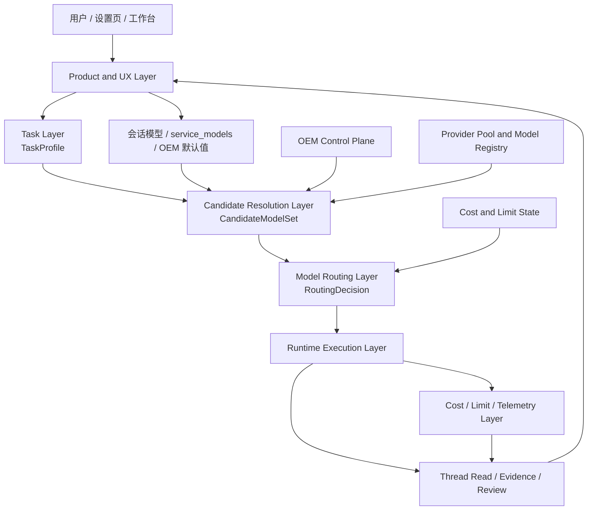
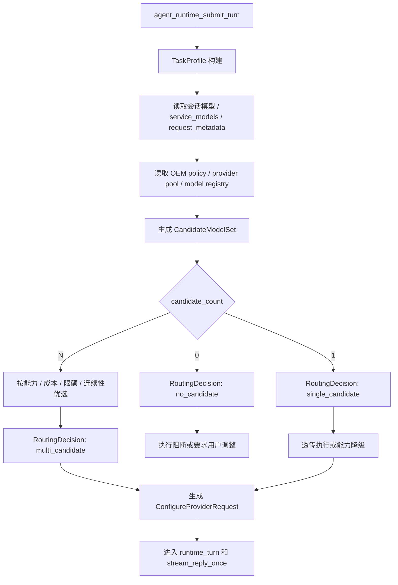
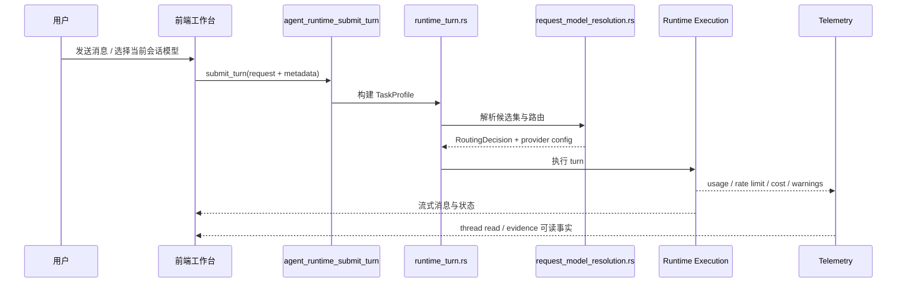
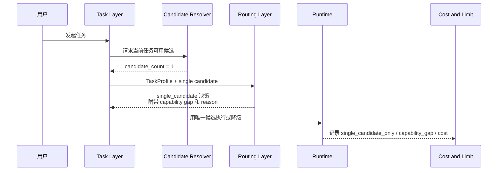
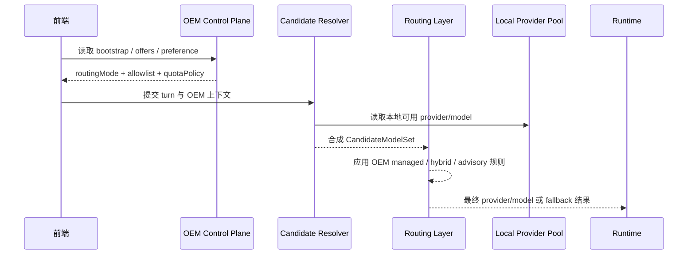
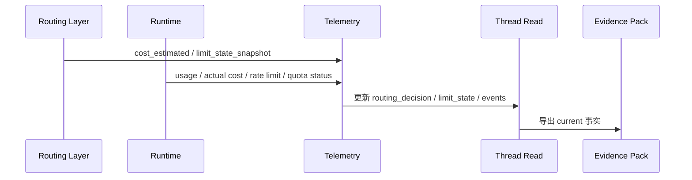
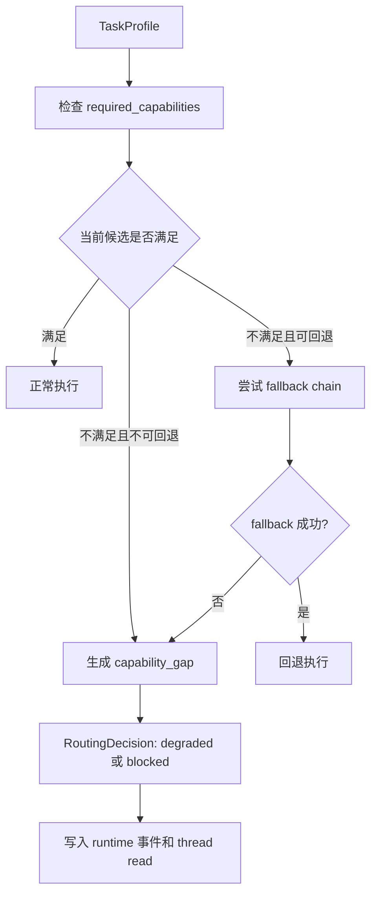
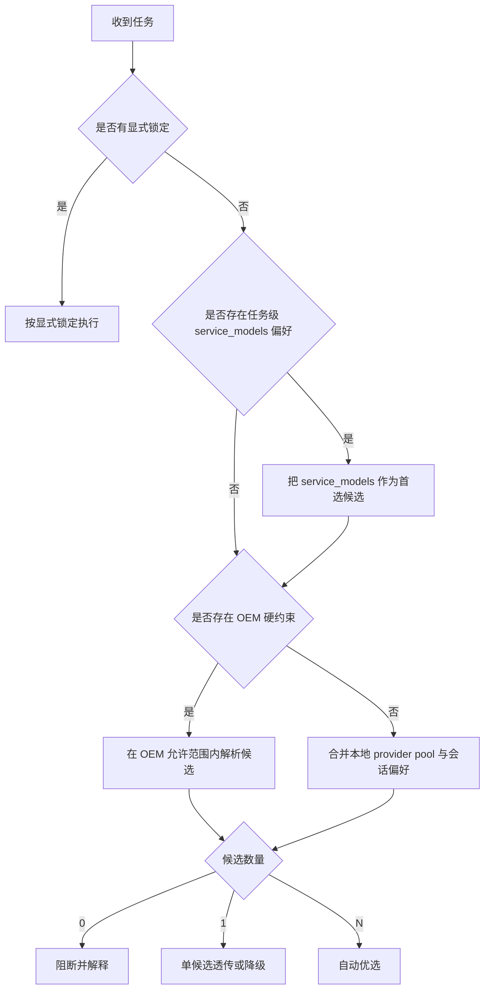
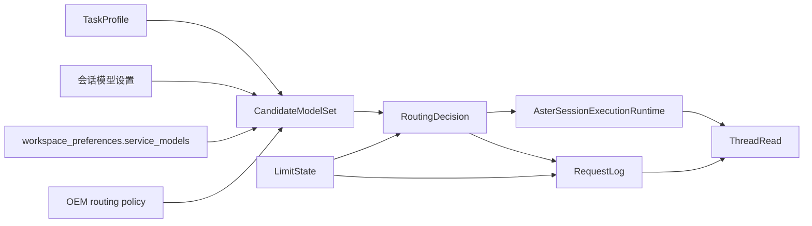

# Lime 任务层 / 模型层图纸集

> 状态：提案
> 更新时间：2026-04-23
> 作用：把任务层、候选解析、模型路由、OEM 约束、成本/限额事件和单模型降级链画成可复查图纸。
> 依赖文档：
> - `./architecture.md`
> - `./task-taxonomy.md`
> - `./model-routing.md`
> - `./oem-and-local-policy.md`
> - `./cost-limit-events.md`

## 1. 总体架构图

## 2. 主流程图：提交到路由决策

## 3. 主对话时序图

## 4. 单候选时序图

## 5. OEM 与本地协同时序图

## 6. 成本与限额事件时序图

## 7. 能力缺口降级流程图

## 8. 自动与设置平衡流程图

## 9. 数据模型关系图

## 10. 图纸使用规则

1. 图只表达主链职责，不单独固化最终 wire 字段名。
2. 图中所有节点都必须能映射到 Lime 仓库真实模块或真实配置面。
3. 后续若实现先落地，再优先更新本图，而不是只改散文说明。
