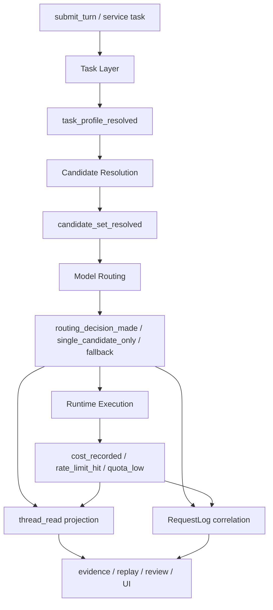

# Lime 事件链与 Claude Code 对照

> 状态：提案
> 更新时间：2026-04-23
> 作用：把 Claude Code 的事件分层、Lime 当前已有事件骨架、以及后续如何把任务 / 模型 / 成本 / 限额收进同一条事件链讲清楚。
> 依赖文档：
> - `./cost-limit-events.md`
> - `./runtime-integration.md`
> - `docs/aiprompts/state-history-telemetry.md`

## 1. 为什么事件链必须单独定义

任务层 / 模型层方案如果只有对象定义，没有事件链，后面一定会再次分裂：

1. 路由逻辑写在解析函数里，UI 只能靠猜。
2. 成本与限额只存在于请求日志里，thread read 看不到。
3. `service_models`、OEM 约束、自动 fallback 发生了，但 evidence 无法解释“为什么”。
4. 单模型与多模型场景都能执行，却没有统一事实告诉产品层“现在是不是只有一个候选”。

所以事件链不是附属物，而是把“运行时事实”从函数内部带到 UI、thread read、evidence、review 的中介层。

## 2. Claude Code 里的事件，不是一种事件

这部分不是只靠公开文档推断，而是直接对照本地源码
`/Users/coso/Documents/dev/js/claudecode` 得出的结论。

### 2.1 Hook 事件层非常完整，而且是显式枚举的

在 `src/entrypoints/sdk/coreTypes.ts` 与 `src/entrypoints/sdk/coreSchemas.ts` 里，Claude Code 直接把 `HOOK_EVENTS` 固定成一组 SDK 级事件：

- `PreToolUse`
- `PostToolUse`
- `PostToolUseFailure`
- `Notification`
- `UserPromptSubmit`
- `SessionStart`
- `SessionEnd`
- `Stop`
- `StopFailure`
- `SubagentStart`
- `SubagentStop`
- `PreCompact`
- `PostCompact`
- `PermissionRequest`
- `PermissionDenied`
- `Setup`
- `TeammateIdle`
- `TaskCreated`
- `TaskCompleted`
- `Elicitation`
- `ElicitationResult`
- `ConfigChange`
- `WorktreeCreate`
- `WorktreeRemove`
- `InstructionsLoaded`
- `CwdChanged`
- `FileChanged`

这里最关键的不是数量，而是它把：

1. 正常停止和失败停止拆成 `Stop / StopFailure`
2. 子代理、任务、工作树、配置变更都变成一等 hook 事件
3. “询问用户”和“权限请求”都不是 UI 特例，而是事件协议的一部分

### 2.2 Hook 执行流和主消息流是分开的

`src/utils/hooks/hookEvents.ts` 明确把 hook 事件系统定义成“独立于主消息流”的广播层。

它内部有三类执行事件：

- `started`
- `progress`
- `response`

而且还有两个非常重要的实现细节：

1. `SessionStart` 和 `Setup` 属于 `ALWAYS_EMITTED_HOOK_EVENTS`
2. 其他 hook 只有在 `includeHookEvents` 或 remote 模式下才会全部放出来

这说明 Claude Code 的设计不是“所有事件都默认展示”，而是：

- 先完整产生事件
- 再决定哪些对当前消费端可见

### 2.3 SDK 消息层把不同事件类型拆得很开

在 `src/entrypoints/sdk/coreSchemas.ts` 里，可以直接看到 Claude Code SDK 的消息类型拆分：

- `stream_event`
- `result`
- `rate_limit_event`
- `tool_progress`
- `system:init`
- `system:compact_boundary`
- `system:hook_started`
- `system:hook_progress`
- `system:hook_response`

这里最有价值的点有三个：

1. `rate_limit_event` 是独立消息，不混进 `result`
2. hook 执行过程不是日志字符串，而是 `hook_started / progress / response`
3. `stream_event` 和 `result` 是两条不同语义的层

并且 `rate_limit_event` 背后不是一个简单布尔值。

`src/services/claudeAiLimits.ts`、`src/utils/messages/mappers.ts` 和
`src/cli/print.ts` 这条链路表明，Claude Code 会把限额状态整理成
`rate_limit_info`，其中至少包括：

- `status`
- `resetsAt`
- `rateLimitType`
- `utilization`
- `overageStatus`
- `overageResetsAt`
- `overageDisabledReason`
- `isUsingOverage`
- `surpassedThreshold`

这和 Lime 后续要落的 `LimitState` 非常接近，说明“限额事件”在上游也是结构化状态，不是 toast 文案。

### 2.4 成本、预算和模型使用都是结果协议的一部分

在 `src/main.tsx`、`src/QueryEngine.ts`、`src/cost-tracker.ts`、`src/bootstrap/state.ts` 里，可以直接看到：

1. `main.tsx` 会把 `maxTurns`、`maxBudgetUsd` 传入 headless / query 主循环
2. `QueryEngine.ts` 在超出轮次或预算时，直接 yield：
   - `result.subtype = error_max_turns`
   - `result.subtype = error_max_budget_usd`
3. 无论成功还是失败，`result` 都会带：
   - `total_cost_usd`
   - `usage`
   - `modelUsage`
   - `num_turns`
   - `stop_reason`

而 `cost-tracker.ts` 与 `bootstrap/state.ts` 则说明：

- 成本不是临时计算文案，而是 runtime 累计状态
- `modelUsage` 是按模型聚合的真实会话使用量

这就是你前面关心的“Haiku / Sonnet / Opus 调度和成本关系”在 Claude Code 里的关键落点：

**它最终不是只靠策略说明，而是会回收到 `modelUsage + total_cost_usd` 这一组结果事实里。**

## 3. Claude Code 给 Lime 的真正启发

真正应该借鉴的不是把 Claude Code 的事件名原样搬来，而是借鉴下面这组结构：

1. 控制事件和执行事件分开。
2. 执行事件和经济事件分开。
3. 最终结果对象会回收成本、使用量、停止原因。
4. 事件可以进入 observability，而不是只留在 CLI 层。

换句话说，Claude Code 不是“多打几个日志”，而是把 agent loop 的关键决策点变成可消费事件。

## 4. Lime 当前已经有什么

Lime 其实不是没有事件，而是已经有一条相当强的事件骨架。

### 4.1 运行时事件总线已经存在

`src-tauri/crates/agent/src/protocol.rs` 里的 `AgentEvent` 已经覆盖：

- `thread_started`
- `turn_started`
- `item_started / item_updated / item_completed`
- `text_delta / thinking_delta`
- `tool_start / tool_end`
- `artifact_snapshot`
- `action_required`
- `turn_context`
- `model_change`
- `context_trace`
- `context_compaction_started / completed`
- `runtime_status`
- `queue_added / queue_removed / queue_started / queue_cleared`
- `done / final_done`
- `warning / error / message`

这说明 Lime 已经有“流式 runtime 事件层”，不是从零开始。

### 4.2 时间线投影也已经存在

`src-tauri/src/services/agent_timeline_service.rs` 已经会把一部分 runtime event 投影进 timeline：

- turn 生命周期
- item 生命周期
- artifact
- compaction
- warning
- error

这相当于 Lime 已经有“事件 -> 持久化投影”的第二层。

### 4.3 稳定线程读模型也已经存在

`AgentRuntimeThreadReadModel` 已经能汇总：

- `pending_requests`
- `last_outcome`
- `incidents`
- `queued_turns`
- `diagnostics`

这相当于 Lime 已经有“原始事件 -> 稳定读模型”的第三层。

### 4.4 Request telemetry 也已经存在

`src-tauri/crates/infra/src/telemetry/types.rs` 中的 `RequestLog` 已经记录：

- `session_id / thread_id / turn_id`
- `provider / model`
- `status / duration_ms`
- `input_tokens / output_tokens / total_tokens`
- `credential_id`

这说明 Lime 也已经有“请求级经济与遥测事实层”。

### 4.5 但 Lime 还没有做成 Claude Code 那种“事件层 != 展示层”

Claude Code 在 `src/remote/sdkMessageAdapter.ts` 明确把一部分事件当成 SDK-only：

- `tool_use_summary`
- `rate_limit_event`

它们会被消费，但不会默认渲染到 REPL。

这件事对 Lime 很重要，因为它说明：

- 不是所有 runtime event 都应该直接变成聊天气泡
- 但即便不展示，它们也必须是稳定事件事实

## 5. Lime 当前真正缺的，不是事件数量，而是事件语义缺口

当前缺口主要有五类：

### 5.1 缺少任务层事件

现在还没有稳定事件告诉下游：

- 本次 `task_kind` 是什么
- 命中了哪个 `service_models` 槽位
- 本次任务的 `budget_class` / `required_capabilities` 是什么

### 5.2 缺少模型路由事件

现在还没有统一事实告诉下游：

- 当前 `candidate_count`
- 当前 `routing_mode`
- 当前 `decision_source`
- 当前为什么 fallback
- 当前是不是 `single_candidate`

### 5.3 缺少成本 / 限额 typed events

虽然已经有 `RequestLog` 和 usage，但还没有统一 typed event：

- `cost_estimated`
- `cost_recorded`
- `rate_limit_hit`
- `quota_low`
- `quota_blocked`
- `single_candidate_only`
- `single_candidate_capability_gap`

### 5.4 缺少 OEM / 设置约束可解释事件

当前还缺少能稳定解释下面问题的事件：

- 是 OEM `managed` 阻止了回退，还是本地设置锁定了模型
- 是 `service_models` 首选生效，还是运行时可解释回退
- 自动策略到底有没有真正介入

### 5.5 缺少最终回收面

`AsterSessionExecutionRuntime` 当前更多还是会话与偏好快照，还没有把下面这些作为稳定事实暴露给前端：

- `task_profile`
- `routing_decision`
- `limit_state`

所以 UI 目前很容易只能“显示当前 provider/model”，却看不到“为什么”。

## 6. 对照结论

| 层 | Claude Code 当前做法 | Lime 当前状态 | 缺口 |
| --- | --- | --- | --- |
| 控制事件 | hooks 覆盖 prompt、tool、stop、session、compact | 有 `action_required`、queue、runtime status，但没有任务/路由守卫统一层 | 缺少 task/routing/limit 统一控制事件 |
| 执行事件 | 主循环 + tool progress + task notifications | 已有 `AgentEvent` runtime 总线 | 基础够，但没有路由语义 |
| 经济事件 | result 带 `total_cost_usd`、`usage`，TS SDK 还有 rate limits | 有 `RequestLog` 与 usage | 缺少 typed routing/limit events |
| 稳定读模型 | result / session / observability 可解释 | 已有 `thread_read`、evidence、review 链 | 缺少 task/routing/limit 快照 |

## 7. Lime 应该怎么办

固定原则只有一句：

**不要新造第二条事件系统，而是在现有 `AgentEvent -> timeline -> thread_read -> evidence / RequestLog` 主链上补齐任务 / 路由 / 经济事件。**

### 7.1 继续复用 `AgentEvent`

后续应优先扩展 `lime_agent::AgentEvent`，而不是另造一个平行 `RoutingEventBus`。

建议补齐的 runtime 事件：

- `task_profile_resolved`
- `candidate_set_resolved`
- `routing_decision_made`
- `routing_fallback_applied`
- `routing_not_possible`
- `limit_state_updated`
- `cost_estimated`
- `cost_recorded`
- `rate_limit_hit`
- `quota_low`
- `quota_blocked`
- `single_candidate_only`
- `single_candidate_capability_gap`

### 7.2 不是所有事件都要直接持久化成 timeline item

建议分三层：

1. 原始 runtime event
2. timeline 可读投影
3. thread read 稳定摘要

例如：

- `cost_estimated` 可以只进 runtime + thread read 摘要
- `routing_decision_made` 应进 runtime，并投影出一条可读 explanation
- `rate_limit_hit` / `quota_blocked` 应同时影响 incident / diagnostics

这里应直接借鉴 `claudecode` 的经验：

- 允许存在 SDK-only / telemetry-only 事件
- 不要求每个事件都变成用户可见消息
- 但所有关键路由与限额事件都必须能被 replay / export / review 消费

### 7.3 让模型路由事件携带设置来源

每个路由事件至少要能回答：

- `settings_source`
- `decision_source`
- `candidate_count`
- `routing_mode`
- `oem_mode`
- `fallback_chain`

否则“自动和设置要平衡”就永远无法在 UI 和 evidence 中被解释。

### 7.4 让经济事件与请求日志对齐

成本 / 限额事件不要替代 `RequestLog`，而要和它配对：

- `RequestLog` 负责 provider 调用事实
- routing / limit event 负责运行时决策事实

最终 evidence 通过 `session / thread / turn / request` 关联键把两者拼起来。

## 8. 建议的事件链流向

## 9. 在 current Lime 主链里的落点

### 9.1 `buildUserInputSubmitOp.ts`

继续负责把会话模型、偏好、metadata 带进请求，但不负责生成最终事件真相。

### 9.2 `runtime_turn.rs`

这里最适合补：

- `task_profile_resolved`
- turn metadata 初始写入

### 9.3 `request_model_resolution.rs`

这里最适合补：

- `candidate_set_resolved`
- `routing_decision_made`
- `single_candidate_only`
- `routing_not_possible`

### 9.4 provider 请求完成 / 出错路径

这里最适合补：

- `cost_recorded`
- `rate_limit_hit`
- `quota_low / quota_blocked`

并同步写入 `RequestLog`。

### 9.5 `dto.rs` / `thread_read`

这里应该稳定汇总：

- 当前任务类型
- 当前路由模式
- 当前是否单候选
- 当前决策来源
- 当前限额摘要

### 9.6 `agentExecutionRuntime.ts`

前端运行时快照应新增：

- `task_profile`
- `routing_decision`
- `limit_state`

这样 UI 才不需要自己猜。

## 10. 验收判断

如果后续实现后仍然出现下面任一情况，说明事件链没有真正打通：

1. UI 只能显示最终模型，不能解释为什么选它。
2. `service_models` 已经触发回退，但 thread read 看不到原因。
3. OEM 禁止 fallback，但 evidence 无法读出约束来源。
4. `RequestLog` 里有 token 和 usage，但没有对应路由 / 限额上下文。
5. 单模型场景仍然对外宣称“自动最优模型”。

## 11. 参考来源

- 本地源码：`/Users/coso/Documents/dev/js/claudecode`
- Claude Code hooks：<https://docs.anthropic.com/en/docs/claude-code/hooks>
- Claude Agent SDK loop：<https://platform.claude.com/docs/en/agent-sdk/agent-loop>
- Claude Agent SDK 成本追踪：<https://platform.claude.com/docs/en/agent-sdk/cost-tracking>
- Claude Code SDK 输出格式：<https://docs.anthropic.com/s/claude-code-sdk>

## 12. 这一步如何服务主线

本文件的主线收益是：

**把“任务 / 模型 / 成本 / 限额是环环相扣的”这件事，从一句原则，落成 Lime 当前可以直接接线的事件主链方案。**
