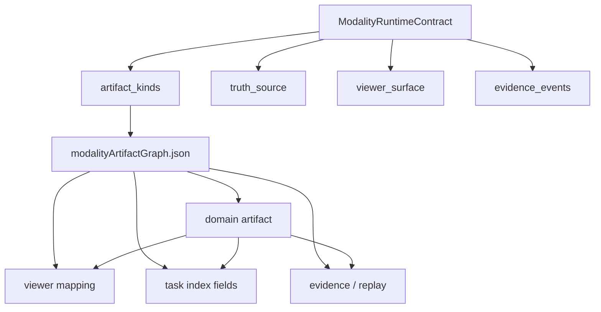
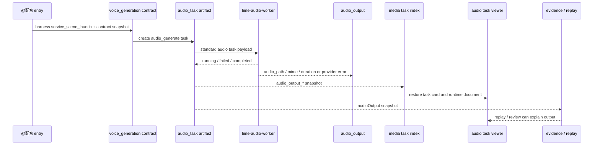
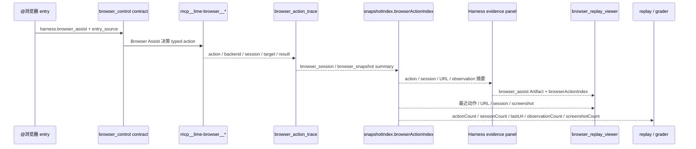
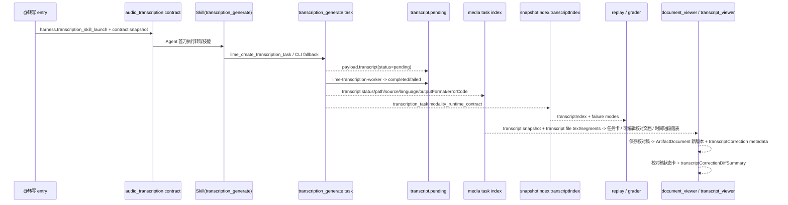

# 领域化 Artifact Graph

> 状态：current planning source
> 更新时间：2026-04-30
> 目标：把 Warp 路线图 Phase 4 从“artifact kind 列表”推进成可检查事实源，约束多模态结果必须落到领域化产物、viewer、evidence 与 task index，而不是继续退回普通文件卡或聊天文本。

## 1. 事实源

当前机器可检查事实源：

1. Graph：`src/lib/governance/modalityArtifactGraph.json`
2. Contract：`src/lib/governance/modalityRuntimeContracts.json`
3. Check：`scripts/check-modality-runtime-contracts.mjs`
4. npm 入口：`npm run governance:modality-contracts`

本文件解释字段语义；JSON graph 是校验输入。

## 2. 固定原则

1. Artifact kind 描述底层产物，不描述 `@` 命令。
2. Contract 引用的每个 `artifact_kinds` 必须存在于 artifact graph。
3. Contract 的 `truth_source`、`viewer_surface`、`evidence_events` 必须能与对应 artifact kind 对上。
4. `generic_file` 只允许作为兜底，不允许成为图片、音频、浏览器、PDF、报告、PPT、网页等多模态主结果。
5. Viewer 只消费 artifact graph 或 runtime truth source，不从 UI 状态反推执行事实。
6. Evidence / replay / task index 消费同一组 artifact kind，不另建第二套恢复事实源。

## 3. Graph 字段

| 字段                    | 说明                                                                             |
| ----------------------- | -------------------------------------------------------------------------------- |
| `kind`                  | artifact kind 主键，例如 `audio_output`                                          |
| `lifecycle`             | `current` / `compat` / `deprecated` / `dead`                                     |
| `modality`              | `text` / `image` / `audio` / `video` / `browser` / `document` / `code` / `mixed` |
| `implementation_status` | `current` / `partial` / `planned`，描述实现成熟度，不改变生命周期                |
| `truth_sources`         | 产物事实源，例如 `audio_task_artifact`、`runtime_timeline_event`                 |
| `viewer_surfaces`       | 允许消费该产物的 viewer surface                                                  |
| `evidence_events`       | Evidence pack 至少能解释到的 runtime event                                       |
| `task_index_fields`     | 进入任务索引 / 复盘 / 诊断的最小字段                                             |
| `current_contracts`     | 当前引用该 artifact kind 的 contract                                             |
| `notes`                 | 当前缺口或边界说明                                                               |

## 4. 当前 Artifact Graph

| artifact kind           | 实现状态       | 当前合同                                          | viewer                                       | 主缺口                                                                                                                                                                                                                                                                            |
| ----------------------- | -------------- | ------------------------------------------------- | -------------------------------------------- | --------------------------------------------------------------------------------------------------------------------------------------------------------------------------------------------------------------------------------------------------------------------------------- |
| `image_task`            | current        | `image_generation`                                | `image_workbench`                            | 继续把更多图片子入口收敛到同一 task graph                                                                                                                                                                                                                                         |
| `image_output`          | current        | `image_generation`                                | `image_workbench`                            | 防止普通文件卡重复展示                                                                                                                                                                                                                                                            |
| `audio_task`            | current        | `voice_generation`                                | `audio_player`                               | 后续接 execution profile / provider policy                                                                                                                                                                                                                                        |
| `audio_output`          | current        | `voice_generation`                                | `audio_player`                               | 后续接 Provider 设置修复入口与 LimeCore offer                                                                                                                                                                                                                                     |
| `transcript`            | partial        | `audio_transcription`                             | `document_viewer` / 后续 `transcript_viewer` | 已有 `transcription_generate` task writer、`lime-transcription-worker`、`transcript.completed/failed` 回写、媒体任务索引、聊天任务卡、可编辑校对的运行时文档 viewer、JSON/SRT/VTT 时间轴与说话人段落展示、ArtifactDocument 版本化校对稿保存、校对稿状态/差异摘要、Evidence `transcriptIndex` 与 Replay 检查；还缺更专用的逐段 transcript viewer 交互与更多 ASR adapter |
| `browser_session`       | partial        | `browser_control`                                 | `browser_replay_viewer`                      | entry binding 已回挂 registry；`snapshotIndex.browserActionIndex` 已进入 Harness evidence 面板与最小复盘 viewer，还缺权限 profile 与完整交互回放                                                                                                                                  |
| `browser_snapshot`      | partial        | `browser_control`                                 | `browser_replay_viewer`                      | observation / screenshot 已进 evidence 索引、Harness 摘要与最小复盘 viewer；截图/DOM/network 深层展开仍需补齐                                                                                                                                                                     |
| `pdf_extract`           | partial        | `pdf_extract`                                     | `document_viewer`                            | 还缺页码/引用恢复与专属 PDF artifact viewer                                                                                                                                                                                                                                       |
| `report_document`       | partial        | `pdf_extract` / `web_research` / `text_transform` | `document_viewer` / `report_viewer`          | 还缺 report viewer 与来源索引闭环                                                                                                                                                                                                                                                 |
| `presentation_document` | planned        | 无                                                | `presentation_viewer` / `document_viewer`    | 还缺 presentation contract                                                                                                                                                                                                                                                        |
| `webpage_artifact`      | planned        | `web_research`                                    | `webpage_viewer` / `document_viewer`         | 还缺 webpage artifact / viewer 分离                                                                                                                                                                                                                                               |
| `generic_file`          | current compat | `text_transform`                                  | `generic_file_viewer` / `document_viewer`    | 只能兜底，不能继续承载多模态主结果                                                                                                                                                                                                                                                |

## 5. 运行关系图

读法：

1. Contract 声明“会产出什么 kind”。
2. Artifact graph 声明“这个 kind 的事实源、viewer、evidence 和索引字段是什么”。
3. Viewer、task index、replay 都从 artifact graph 消费同一事实，不允许各自猜。

## 6. `voice_generation` 样板

当前最接近闭环的样板是：

这条样板已经证明：

1. `audio_task` 与 `audio_output` 不再是普通文件卡。
2. 失败态保留 `audio_provider_*` 错误码，不伪造音频路径。
3. 媒体任务索引可直接恢复任务卡与 viewer。
4. Evidence / replay 能区分 `audio_output.completed` 和 provider 失败。

## 7. `browser_control` 索引闭环

本轮补齐的最小 browser index 不新增 browser task 协议，只消费已有 Browser Assist tool timeline metadata：

索引字段先固定为：

1. `actionCount`、`statusCounts`、`actionCounts`：判断是否真的产生 browser action。
2. `sessionIds`、`targetIds`、`profileKeys`、`backendCounts`：定位执行环境和 backend。
3. `lastUrl`：快速恢复最近页面位置。
4. `observationCount`、`screenshotCount`：区分普通 session action 与 snapshot/observation。
5. `items[].artifactKind`：在同一索引内区分 `browser_session` 与 `browser_snapshot`。

这一步把 `browser_control` 从 raw trace 人工扫描推进到可检索诊断层，并让 Harness evidence panel 能直接展示 Browser Assist 摘要、打开最小 `browser_replay_viewer`；后续完整交互回放、权限 profile 可视化与截图/DOM/network 深层展开仍消费同一份 index，不能另起 browser task 文件协议。

## 8. `audio_transcription` Transcript 索引闭环

本轮把 `audio_transcription` 从入口合同推进到最小 transcript task / index / evidence / replay 闭环：

当前已经固定的索引字段：

1. `transcript_count`、`transcript_statuses`、`transcript_error_codes`：判断转写产物是否已进入统一媒体任务索引。
2. `items[].transcript_status`、`transcript_path`、`transcript_source_url`、`transcript_source_path`：定位 transcript 状态、输出路径与来源。
3. `items[].transcript_language`、`transcript_output_format`：保留用户请求或 Provider 返回的语言和输出格式。
4. `snapshotIndex.transcriptIndex.items[]`：在 evidence / replay 中携带 provider、model、worker、errorCode 与 retryable。

这一步把 transcript 从 pending 事实推进到可执行 worker 与用户可见恢复闭环：OpenAI-compatible provider 成功时写入 `.lime/runtime/transcripts/*` 并回写 `transcript.completed`；Provider / source / contract 失败时写入 `transcript.failed` 与明确错误码；聊天区恢复层优先消费 `list_media_task_artifacts` 的 `transcript_*` snapshot，同步任务卡与 `.lime/runtime/transcription-generate/*.md` 运行时文档，只有索引缺失时才回退读取单个 task artifact。第四十三刀继续读取 `transcript_path` 指向的文本文件，把 transcript 内容嵌入运行时文档的 `code_block`，使用户能在 Lime 内部复制和校对文本。第四十四刀继续从 JSON verbose transcript、SRT 与 VTT 解析 `start/end/speaker/text` 段落，把时间轴预览展示到聊天轻卡，并把“转写时间轴（可逐段编辑校对）”表格写入同一个运行时文档。第四十五刀复用 ArtifactDocument 编辑保存链路：用户保存转写文本或时间轴校对结果时，只写回同一运行时文档的新版本和 `transcriptCorrection*` / `transcriptSegmentsCorrected` metadata，不改写原始 ASR 输出文件。第四十六刀继续把保存状态显性化：保存后运行时文档会插入/更新“校对稿已保存”状态卡，并写入 `transcriptCorrectionDiffSummary`，用于展示原文与校对稿的文本长度、段落和说话人数差异。更专用的逐段 transcript viewer、更多 ASR adapter 与本地离线 ASR 后续继续消费同一份 `transcription_generate` task file 和 `transcriptIndex`，不能另起 `generic_file` 或前端直连 ASR 旁路。

## 9. 未完成主线

下一批必须继续补：

1. `browser_session` / `browser_snapshot`：Harness evidence panel 与最小 `browser_replay_viewer` 已能展示摘要；继续把权限 profile、截图/DOM/network 深层展开与完整交互回放接到 `snapshotIndex.browserActionIndex`，形成可操作复盘闭环。
2. `pdf_extract`：页码、引用、来源文件与 viewer 恢复还未形成稳定 artifact graph。
3. `report_document`：研报 / 竞品 / 分析仍缺 report viewer 与来源索引。
4. `transcript`：task writer、OpenAI-compatible ASR worker、完成/失败态回写、媒体任务索引、聊天任务卡、可编辑校对运行时文档 viewer、JSON/SRT/VTT 时间轴与说话人段落展示、ArtifactDocument 版本化校对稿保存、校对稿状态/差异摘要、Evidence `transcriptIndex` 与 Replay 检查已补齐；继续补更专用的逐段 transcript viewer、更多 ASR adapter 与本地离线 ASR，不允许由 `generic_file` 冒充。
5. `presentation_document` / `webpage_artifact`：还缺对应 contract、artifact writer 与 viewer mapping。
6. `generic_file`：继续收口为 compat fallback，不能作为新增多模态能力的默认输出。

## 10. 机器守卫

`npm run governance:modality-contracts` 现在必须检查：

1. 每个已声明 artifact kind 都在 graph 中有定义。
2. 每个 contract 引用的 artifact kind 都能找到 viewer intersection。
3. 每个 contract 引用的 artifact kind 都能找到 truth source intersection。
4. 每个 contract 引用的 artifact kind 都能找到 evidence event intersection。
5. Graph 中的 current / partial artifact 至少声明 `task_id`、`contract_key`、`artifact_kind`、`status` 这组 task index 字段。

这样 Phase 4 不再只停留在文档表格，而是会阻止新 contract 继续把多模态结果丢给未知 viewer、未知 evidence 或 `generic_file` 旁路。
