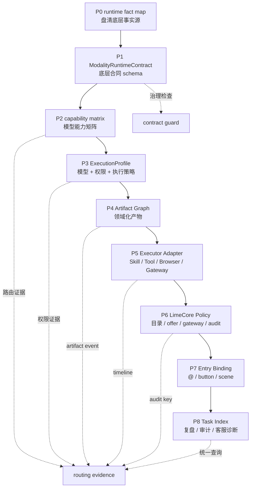
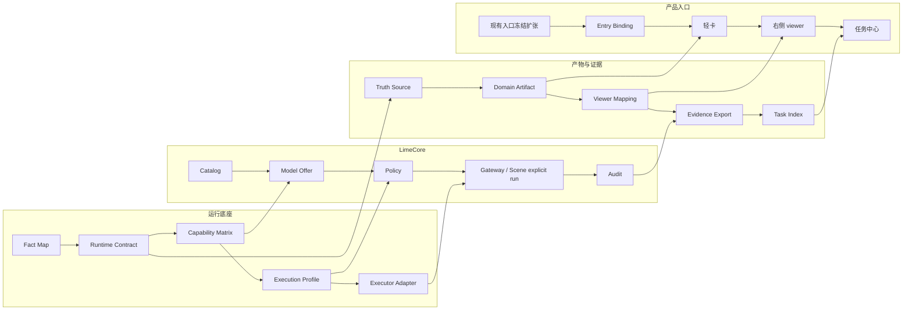
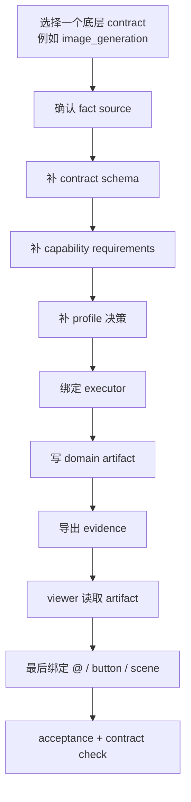
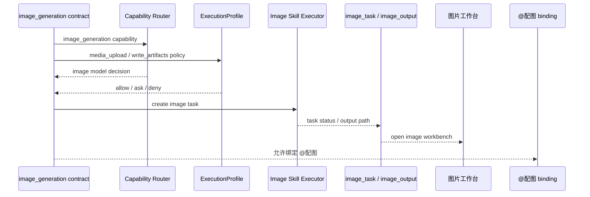
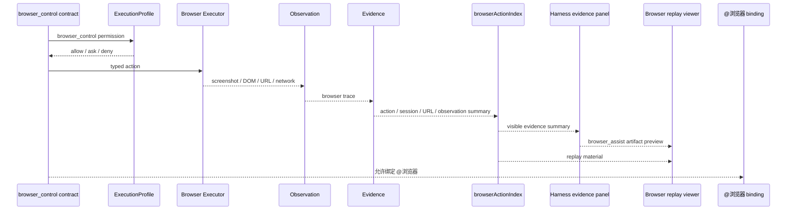
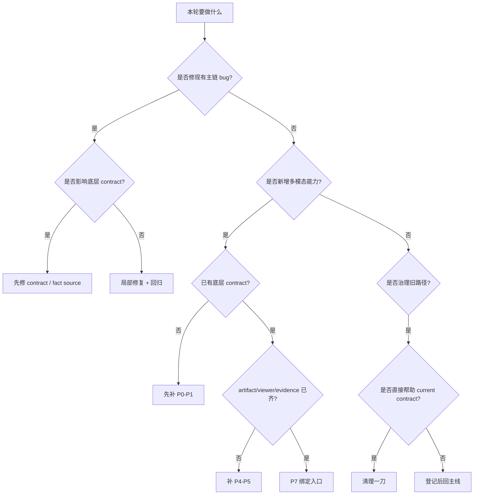

# Lime 多模态演进迭代指南

> 状态：current planning source
> 更新时间：2026-04-30
> 目标：把 Warp / ClaudeCode 参考转成 Lime 可持续演进的工程节奏，明确每一阶段先交付什么、如何验收、何时允许接上层入口。

## 1. 演进原则

本指南只服务一个目标：

**先把底层多模态运行系统做成可解释、可落盘、可验收的 current 主链，再把 `@` 命令、按钮和 Scene 作为薄入口绑定上来。**

固定原则：

1. 先事实源，后入口。
2. 先 contract，后页面。
3. 先 capability / profile / artifact / evidence，后自动化体验。
4. 先一条 vertical slice 闭环，再横向扩展更多模态。
5. LimeCore 先做目录和策略控制面，不默认接管本地执行。

## 2. 演进总图

读法：

1. P0-P6 都是在打底层，不以 `@` 命令为主对象。
2. P7 才允许把 `@`、按钮、Scene 绑定进来。
3. P8 不是收尾文档，而是让任务中心、复盘、审计消费同一事实源。

## 3. 四条泳道演进图

固定判断：

1. 产品入口泳道不能跑在运行底座前面。
2. artifact 与 evidence 泳道要从 P1 开始就参与，不能最后补日志。
3. LimeCore 泳道提供约束，不替代本地执行泳道。

## 4. 每一刀的标准闭环

每一轮实现都必须尽量走完整小闭环，而不是只补一个字段或一个页面。

一刀完成标准：

1. 能从 contract 解释输入、模型、权限、执行器、artifact、viewer、evidence。
2. 能从 artifact 回到 thread / turn / task / model routing。
3. 能在失败时解释是 capability gap、permission denied、executor gap 还是 LimeCore policy 限制。
4. 能证明上层入口只是 metadata binding。

## 5. 推荐首个 vertical slice

推荐第一刀选 `image_generation` 或 `browser_control`，不要同时做所有模态。

### 5.1 `image_generation` slice

适合作为第一刀，因为已有 image task artifact 和图片工作台基础。

完成后再扩展：`image_edit`、`image_variation`、`poster_generation`、`cover_generation`。

### 5.2 `browser_control` slice

适合作为第二刀，因为它能验证 high-risk permission、typed action、observation、evidence。

完成后再扩展：站点搜索、网页提取、竞品浏览、自动填表。

## 6. 阶段门禁

| 阶段          | 允许进入下一阶段的条件                                               | 不允许的捷径                      |
| ------------- | -------------------------------------------------------------------- | --------------------------------- |
| P0 Fact Map   | 每个底层事实源有 owner、读写方、持久化和 evidence 关系               | 先从 `@` 命令盘点开始             |
| P1 Contract   | Contract 以底层能力为主键，引用真实 truth source / artifact / viewer | 用入口名当 contract 主键          |
| P2 Capability | 路由能输出候选、唯一候选、候选为空和能力缺口                         | 只看 provider/model id            |
| P3 Profile    | `modalityExecutionProfiles.json` 覆盖 current contracts；模型、权限、租户策略、用户锁定能合并解释 | skill 内部临时判断权限            |
| P4 Artifact   | domain artifact 能被 viewer 和 evidence 共同消费                     | 所有结果写成 generic file         |
| P5 Executor   | executor adapter registry 对齐 contract 绑定、支持位、产物、权限与 failure mapping | 自由 Bash 或裸 CLI                |
| P6 LimeCore   | catalog/policy/offer/audit 能约束本地执行                            | LimeCore 默认代跑所有入口         |
| P7 Entry      | 入口只提交 metadata 并绑定 contract                                  | 入口直建 task / artifact / viewer |
| P8 Index      | task index 能按 contract、entry、modality、artifact 查询             | 只靠聊天线程恢复                  |

## 7. 迭代选择流程

固定判断：

1. 新能力默认从 contract 开始。
2. 治理清理必须服务当前 contract，否则登记不偏航。
3. 入口绑定不是能力建设的替代品。

## 8. 文档产物演进表

| 阶段 | 文档产物                                           | 代码产物                                          | 验证入口                                   |
| ---- | -------------------------------------------------- | ------------------------------------------------- | ------------------------------------------ |
| P0   | `runtime-fact-map.md`                              | 无或只读脚本                                      | 链接/owner 一致性检查                      |
| P1   | `contract-schema.md`                               | schema / governance check                         | contract check                             |
| P2   | capability matrix doc                              | routing 类型和证据                                | 路由单测 / thread read 断言                |
| P3   | `execution-profile.md`                             | `modalityExecutionProfiles.json` / profile merge / policy source | profile registry 守卫 + 权限与降级测试     |
| P4   | `artifact-graph.md` + `modalityArtifactGraph.json` | artifact kind / viewer / evidence / index mapping | artifact graph 守卫 + artifact/viewer 回归 |
| P5   | `execution-profile.md` 的 executor adapter 章节     | executor adapter registry / browser action        | adapter registry 守卫 + executor / browser trace 测试 |
| P6   | `limecore-integration.md`                          | catalog/policy SDK 消费                           | Lime + LimeCore contract test              |
| P7   | entry binding inventory                            | `@` / button / scene binding                      | acceptance 场景                            |
| P8   | task index doc                                     | index / replay / audit query                      | evidence pack / replay 测试                |

## 9. 版本演进目标

### V0：底层可解释

目标：能用一份 contract 解释一次多模态运行。

完成标志：

1. `runtime-fact-map.md` 存在。
2. `contract-schema.md` 存在。
3. `capability-matrix.md`、`execution-profile.md`、`artifact-graph.md` 存在。
4. 至少一个 contract 完成 capability/profile/artifact/evidence 字段。

### V1：单能力闭环

目标：一个底层能力从 contract 到 viewer 闭环。

完成标志：

1. `image_generation` 或 `browser_control` 完成 vertical slice。
2. viewer 只读 artifact，不猜消息。
3. evidence 能导出 routing/profile/artifact/timeline。

### V2：入口薄绑定

目标：上层入口只绑定 contract。

完成标志：

1. `@配图` 或 `@浏览器` 不再拥有底层事实写入逻辑。
2. 入口 contract check 能阻断缺失 truth source 的新入口。
3. 失败能解释 capability / permission / executor / policy gap。

### V3：多模态横向扩展

目标：多模态不再复制旁路。

完成标志：

1. 图片、浏览器、PDF、音频、搜索至少覆盖 3 类 contract。
2. artifact graph 支持多个 domain kind。
3. task index 能跨 modality 查询。

### V4：LimeCore 策略化

目标：云端目录和策略成为事实源，但不抢本地执行。

完成标志：

1. online catalog 覆盖 current skills/scenes。
2. provider offer / model catalog 进入 routing constraints。
3. Gateway / cloud scene 有显式 audit，与 Lime evidence 可关联。

## 10. 每轮收口模板

每轮推进本路线图时，收口必须回答：

1. 本轮推进的是哪个 phase 和哪个 contract？
2. 是否新增或修改了底层 truth source？
3. 是否影响模型能力矩阵或 execution profile？
4. 是否新增 artifact kind 或 viewer mapping？
5. 是否新增 executor adapter 或 Browser typed action？
6. 是否接入 LimeCore catalog / policy / audit？
7. 是否只是绑定上层入口？如果是，是否已有底层 contract？
8. evidence / replay / task index 是否能解释本轮变化？
9. 运行了哪些最小验证？
10. 哪些旧路径被标为 compat / deprecated / dead？

一句话：

**每一刀都必须让 Lime 更接近“底层 contract 驱动的多模态系统”，而不是更接近“更多入口和更多旁路”。**
