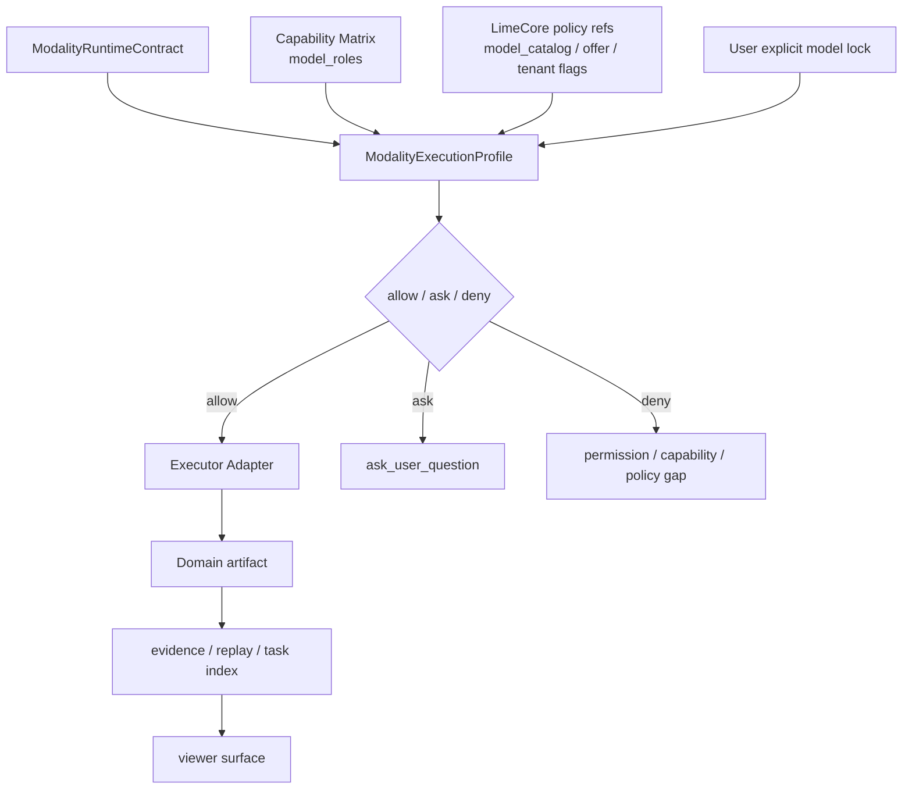
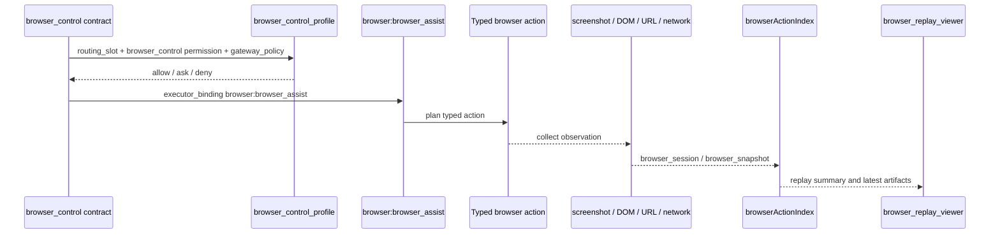

# ModalityExecutionProfile 与 Executor Adapter

> 状态：current planning source
> 更新时间：2026-04-30
> 目标：把 Warp 路线图 Phase 3 / Phase 5 从散文约束推进成可机器检查的 profile 与 executor adapter registry，确保每个 current 多模态合同都能解释模型角色、权限、执行器、产物策略、LimeCore 策略引用和失败映射。

## 1. 事实源

当前机器可检查事实源：

1. Profile registry：`src/lib/governance/modalityExecutionProfiles.json`
2. Contract registry：`src/lib/governance/modalityRuntimeContracts.json`
3. Capability matrix：`src/lib/governance/modalityCapabilityMatrix.json`
4. Artifact graph：`src/lib/governance/modalityArtifactGraph.json`
5. TS resolver：`src/lib/governance/modalityExecutionProfiles.ts`
6. Check：`scripts/check-modality-runtime-contracts.mjs`
7. npm 入口：`npm run governance:modality-contracts`

本文件解释字段语义；JSON registry 是校验输入。当前已建立治理事实源与前端 TS resolver，所有 current contract 的 launch metadata 可以携带 `execution_profile` 与 `executor_adapter` 快照；仍不新增 Tauri command、bridge、mock 或具体 Skill / ServiceSkill / Browser executor 分支。

## 2. 固定原则

1. Execution profile 描述底层运行策略，不描述 `@` 命令。
2. 每个 `current` contract 必须被至少一个 execution profile 覆盖。
3. Contract 的 `routing_slot`、`permission_profile_keys`、`limecore_policy_refs`、`artifact_kinds` 与 `executor_binding` 必须能在 profile / adapter registry 中找到对应声明。
4. Executor adapter 的 `adapter_key` 必须等于 `executor_kind:binding_key`，并与 contract 的 `executor_binding` 对齐。
5. Adapter 的 progress / cancel / resume / artifact 支持位必须和 contract 一致，不能伪造能力。
6. `generic_file` 只能作为 compat fallback；新增多模态主结果必须优先落到领域化 artifact kind。
7. LimeCore 在本阶段只作为 catalog / policy / offer / audit 引用，不是默认执行器。

## 3. Profile 字段

| 字段 | 说明 |
| --- | --- |
| `profile_key` | profile 主键，例如 `audio_transcription_profile` |
| `lifecycle` | `current` / `compat` / `deprecated` / `dead` |
| `supported_contracts` | 该 profile 覆盖的底层合同 |
| `model_role_slots` | 对应 capability matrix 的模型角色槽位 |
| `permission_profile_keys` | 运行前必须合并解释的权限面 |
| `executor_adapter_keys` | 允许调用的 executor adapter |
| `artifact_policy.write_mode` | 产物写入模式，例如 `domain_task_artifact` |
| `artifact_policy.artifact_kinds` | 允许写出的领域产物 |
| `artifact_policy.viewer_surfaces` | 允许消费该产物的 viewer surface |
| `limecore_policy_refs` | LimeCore 控制面引用，例如 `model_catalog`、`provider_offer`、`tenant_feature_flags` |
| `user_lock_policy` | 用户显式模型锁定的处理规则 |
| `fallback_behavior` | 权限、能力、执行器或来源失败时的降级 / 阻断口径 |
| `evidence_events` | profile 决策至少需要解释到的 evidence event |
| `audit_fields` | 后续 thread read / audit / evidence 需要携带的字段 |
| `notes` | 当前边界与后续缺口 |

## 4. Executor Adapter 字段

| 字段 | 说明 |
| --- | --- |
| `adapter_key` | `executor_kind:binding_key`，例如 `skill:transcription_generate` |
| `lifecycle` | 生命周期分类 |
| `executor_kind` | `skill` / `tool` / `service_skill` / `browser` / `gateway` / `scene_cloud` / `local_cli` |
| `binding_key` | 执行器在 runtime 中的绑定名 |
| `supported_contracts` | 该 adapter 允许服务的底层合同 |
| `supports_progress` | 是否能报告进度 |
| `supports_cancel` | 是否能取消 |
| `supports_resume` | 是否能恢复 |
| `supports_artifact` | 是否能写标准 artifact |
| `artifact_output_kinds` | adapter 可以写出的 artifact kind |
| `permission_requirements` | adapter 所需权限 |
| `credential_requirements` | adapter 所需凭证或云控制面引用 |
| `failure_mapping` | 失败必须映射到的标准原因 |
| `evidence_events` | adapter 执行至少需要解释到的 evidence event |
| `notes` | 当前实现边界 |

## 5. 当前覆盖

| contract | profile | executor adapter | artifact policy | 当前说明 |
| --- | --- | --- | --- | --- |
| `image_generation` | `image_generation_profile` | `skill:image_generate` | `image_task` / `image_output` | 图片生成只能写标准 image task/output，不回退 legacy CLI |
| `browser_control` | `browser_control_profile` | `browser:browser_assist` | `browser_session` / `browser_snapshot` | 浏览器动作必须保留 typed action 与 observation trace，不降级 WebSearch |
| `pdf_extract` | `pdf_extract_profile` | `skill:pdf_read` | `pdf_extract` / `report_document` | PDF 读取必须保留文件读取证据，页码/引用 viewer 后续补齐 |
| `voice_generation` | `voice_generation_profile` | `service_skill:voice_runtime` | `audio_task` / `audio_output` | 本地 ServiceSkill/worker 写音频任务，不把 LimeCore 当默认执行器 |
| `audio_transcription` | `audio_transcription_profile` | `skill:transcription_generate` | `transcript` | 转写固定走 transcription task / transcriptIndex，不走 frontend ASR 或 generic_file |
| `web_research` | `web_research_profile` | `skill:research` | `report_document` / `webpage_artifact` | 联网研究保留搜索来源与报告型产物，来源索引后续继续补 |
| `text_transform` | `text_transform_profile` | `skill:text_transform` | `report_document` / `generic_file` | `generic_file` 只保留为 compat fallback，主结果继续向 document viewer 收敛 |

## 6. 决策流程

读法：

1. Contract 声明底层能力需求。
2. Profile 合并模型角色、权限、LimeCore 策略、用户锁定与 fallback。
3. 前端 launch metadata 先携带 profile / adapter 快照，后续 Rust runtime preflight 再消费同一事实源执行 allow / ask / deny。
4. Adapter 只在 profile 允许后执行，并按声明写 domain artifact。
5. Evidence / task index / viewer 消费同一执行与产物事实。

## 7. Browser adapter 时序

固定约束：如果 profile 未允许 `browser_control`，不得把浏览器任务改写成普通 WebSearch；如果 adapter 没有 observation，就不能写 `browser_snapshot`。

## 8. 机器守卫

`npm run governance:modality-contracts` 现在必须检查：

1. `modalityExecutionProfiles.json` 存在且 `version/status/owner` 正确。
2. Profile / adapter 主键唯一。
3. Profile 引用的 contract、model role、permission、adapter、artifact、viewer、LimeCore policy 与 evidence event 必须存在。
4. 每个 current contract 必须被 profile 覆盖。
5. 每个 current contract 的 `executor_binding` 必须存在于 `executor_adapters`。
6. Adapter 的支持位、artifact output、permission requirements、failure mapping 必须覆盖 contract 声明。
7. Profile 的 model role、permission、LimeCore policy 与 artifact policy 必须覆盖 contract 声明。

这一步把 Phase 3 / Phase 5 从“应该有 profile / executor adapter”推进成会阻断错误 contract 的机器事实源。

## 9. 未完成主线

后续继续补：

1. Rust / Agent 运行时真实 `ExecutionProfile` merge：把 `modalityExecutionProfiles.json` 或其生成快照接入 `TaskProfile`、权限判断、用户模型锁定和 thread read。
2. LimeCore policy snapshot：把 `model_catalog`、`provider_offer`、`tenant_feature_flags`、`gateway_policy` 的实际命中值写回 profile decision。
3. GUI / evidence 可视化：在 Harness evidence、任务卡或 viewer 中展示 profile allow / ask / deny、adapter key 和 policy gap。
4. Executor registry 运行时化：让 Skill / ServiceSkill / Browser / Gateway 的 adapter 能从同一事实源生成执行前检查。
5. Task index 统一层：把 `executor_kind`、`adapter_key`、`profile_key`、`policy_snapshot` 纳入统一查询字段。
6. LimeCore Phase 6：继续接目录、offer、Gateway/Scene policy 与 audit，不把 LimeCore 扩张成默认 executor。
