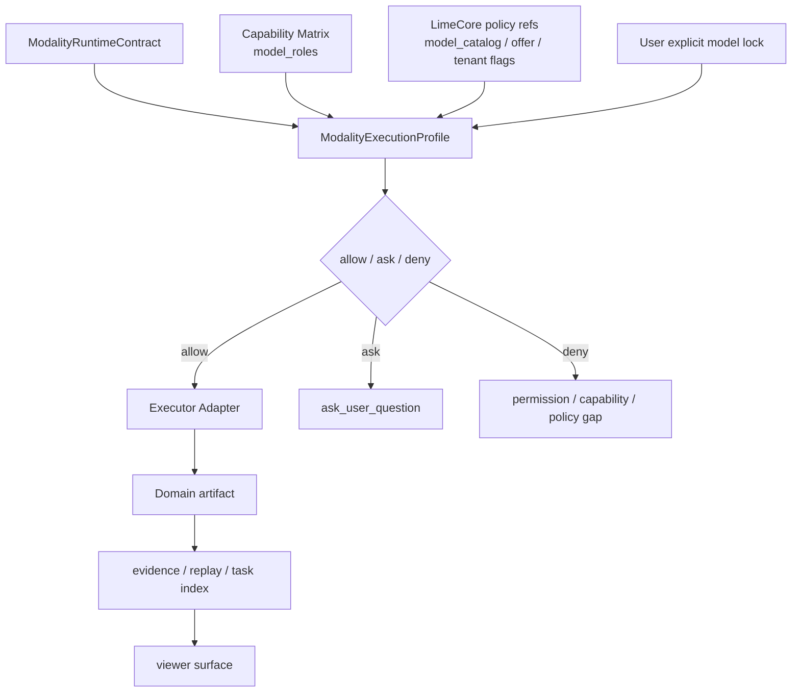
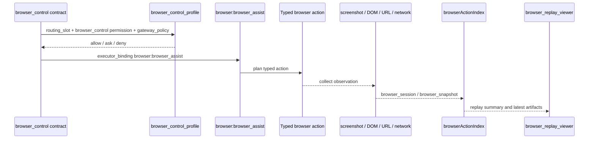

# ModalityExecutionProfile 与 Executor Adapter

> 状态：current planning source
> 更新时间：2026-05-05
> 目标：把 Warp 路线图 Phase 3 / Phase 5 从散文约束推进成可机器检查的 profile 与 executor adapter registry，确保每个 current 多模态合同都能解释模型角色、权限、执行器、产物策略、LimeCore 策略引用和失败映射。

## 1. 事实源

当前机器可检查事实源与最小 runtime 消费点：

1. Profile registry：`src/lib/governance/modalityExecutionProfiles.json`
2. Contract registry：`src/lib/governance/modalityRuntimeContracts.json`
3. Capability matrix：`src/lib/governance/modalityCapabilityMatrix.json`
4. Artifact graph：`src/lib/governance/modalityArtifactGraph.json`
5. TS resolver：`src/lib/governance/modalityExecutionProfiles.ts`
6. Check：`scripts/check-modality-runtime-contracts.mjs`
7. npm 入口：`npm run governance:modality-contracts`
8. 媒体 worker preflight：`src-tauri/src/commands/media_task_cmd.rs`
9. Browser Assist preflight：`src-tauri/src/commands/aster_agent_cmd/tool_runtime/browser_tools.rs`
10. Skill tool preflight / metadata seed：`src-tauri/crates/agent/src/tools/skill_tool_gate.rs`
11. ServiceSkill compat guard：`src-tauri/src/commands/aster_agent_cmd/tool_runtime/service_skill_tools.rs`
12. Provider/model resolution：`src-tauri/src/commands/aster_agent_cmd/request_model_resolution.rs`

本文件解释字段语义；JSON registry 是校验输入。当前已建立治理事实源与前端 TS resolver，所有 current contract 的 launch metadata 可以携带 `execution_profile` 与 `executor_adapter` 快照；图片、配音、转写媒体 worker 已在进入真实执行器前消费同一快照做最小 profile / adapter / executor binding preflight；Browser Assist 工具层现在也会在真实浏览器动作前消费 `browser_control` runtime contract，校验 `browser_control_profile`、`browser:browser_assist` 与 `browser:browser_assist` binding，失败时返回带合同 metadata 的 `runtime_preflight` 工具错误；`LimeSkillTool` 现在会把 current Skill 主链映射回底层合同，并从治理 JSON 注入 `modality_runtime_contract`、`execution_profile`、`executor_adapter` 与 `executor_binding` metadata，显式传入冲突合同快照时会以 `runtime_preflight` 工具结果阻断进入 Skill 执行器；旧 `lime_run_service_skill` 仍是 compat guard，命中 `voice_generation` 时会携带并校验 `voice_generation_profile`、`service_skill:voice_runtime` adapter 与 `service_skill:voice_runtime` binding，通过后也只返回本地主链提示，不触发云 run/poll。LimeCore policy 也已形成稳定接线：默认 `pending_hit_refs` 指向待接 refs，`policy_value_hits=[]` 与 `policy_value_hit_count=0` 明确表示真实控制面命中值尚未接入；如果同一 snapshot 已携带 `status=resolved` 的 `policy_value_hits`，resolver seam 会把该 ref 计入 `evaluated_refs`，并从 `missing_inputs / pending_hit_refs` 中移除。图片任务执行前的本地 model registry assessment 已先接成最小 `model_catalog` hit producer；图片任务进入真实执行器前也会从已解析的 runner config/API key 与 task payload provider/model 生成最小 `provider_offer` hit，且不序列化 API key；Browser Assist 与 Web Research 类 launch 现在会从请求侧 `harness.oem_routing` 生成最小 `gateway_policy` hit，Workspace send metadata 会从 OEM Cloud bootstrap `features` 生成最小 `tenant_feature_flags` hit，且二者都不携带 token；`policy_evaluation` 会在所有 refs resolved 时用最小本地 `policy_input_evaluator` 折叠 `allow / ask / deny`，仍有 missing inputs 时顶层决策继续保持 local default；thread read 已并列暴露 `runtime_summary.limecorePolicy` 与 `runtime_summary.modalityRuntime`，分别解释最近 policy decision input 与同一合同的 profile / adapter / executor binding 摘要；`SessionExecutionRuntimeTaskProfile` 已开始承载同一合同的 `modalityContractKey`、`routingSlot`、`executionProfileKey`、`executorAdapterKey`、`executorKind`、`executorBindingKey`、`permissionProfileKeys` 与 `userLockPolicy`，供运行期事件、前端 execution runtime 类型与 provider/model resolution 消费；`request_model_resolution` 已把 `routingSlot` 映射成最小 runtime model capability requirements，并用它过滤候选池、fallback 候选与多候选自动重选。显式用户模型锁定仍 honored，但能力不匹配会通过 `capability_gap` 暴露 `*_candidate_missing`。`permissionProfileKeys` 也已进入 `lime_runtime.permission_state` 最小权限摘要，并通过 `AgentRuntimeThreadReadModel.permission_state` 结构化暴露完整 required / ask / blocking profile keys 与 notes；`requires_confirmation` 声明态现在还会进入现有 `runtime_status(phase=permission_review)` 事件流，并以 `declared_only=true` 标明它不是真实授权结果。这不是完整权限系统，不执行真实授权、不生成 pending approval、也不阻断 turn。统一媒体任务索引已经暴露 evaluation status / decision / blocking / ask / pending refs；仍不新增 Tauri command 或上层 `@` 事实源；Gateway executor preflight 等 registry 出现明确 `gateway:*` adapter 后再接入。

## 2. 固定原则

1. Execution profile 描述底层运行策略，不描述 `@` 命令。
2. 每个 `current` contract 必须被至少一个 execution profile 覆盖。
3. Contract 的 `routing_slot`、`permission_profile_keys`、`limecore_policy_refs`、`artifact_kinds` 与 `executor_binding` 必须能在 profile / adapter registry 中找到对应声明。
4. Executor adapter 的 `adapter_key` 必须等于 `executor_kind:binding_key`，并与 contract 的 `executor_binding` 对齐。
5. Adapter 的 progress / cancel / resume / artifact 支持位必须和 contract 一致，不能伪造能力。
6. `generic_file` 只能作为 compat fallback；新增多模态主结果必须优先落到领域化 artifact kind。
7. LimeCore 在本阶段只作为 catalog / policy / offer / audit 引用，不是默认执行器。

## 3. Profile 字段

| 字段                              | 说明                                                                                |
| --------------------------------- | ----------------------------------------------------------------------------------- |
| `profile_key`                     | profile 主键，例如 `audio_transcription_profile`                                    |
| `lifecycle`                       | `current` / `compat` / `deprecated` / `dead`                                        |
| `supported_contracts`             | 该 profile 覆盖的底层合同                                                           |
| `model_role_slots`                | 对应 capability matrix 的模型角色槽位                                               |
| `permission_profile_keys`         | 运行前必须合并解释的权限面                                                          |
| `executor_adapter_keys`           | 允许调用的 executor adapter                                                         |
| `artifact_policy.write_mode`      | 产物写入模式，例如 `domain_task_artifact`                                           |
| `artifact_policy.artifact_kinds`  | 允许写出的领域产物                                                                  |
| `artifact_policy.viewer_surfaces` | 允许消费该产物的 viewer surface                                                     |
| `limecore_policy_refs`            | LimeCore 控制面引用，例如 `model_catalog`、`provider_offer`、`tenant_feature_flags` |
| `user_lock_policy`                | 用户显式模型锁定的处理规则                                                          |
| `fallback_behavior`               | 权限、能力、执行器或来源失败时的降级 / 阻断口径                                     |
| `evidence_events`                 | profile 决策至少需要解释到的 evidence event                                         |
| `audit_fields`                    | 后续 thread read / audit / evidence 需要携带的字段                                  |
| `notes`                           | 当前边界与后续缺口                                                                  |

## 4. Executor Adapter 字段

| 字段                      | 说明                                                                                     |
| ------------------------- | ---------------------------------------------------------------------------------------- |
| `adapter_key`             | `executor_kind:binding_key`，例如 `skill:transcription_generate`                         |
| `lifecycle`               | 生命周期分类                                                                             |
| `executor_kind`           | `skill` / `tool` / `service_skill` / `browser` / `gateway` / `scene_cloud` / `local_cli` |
| `binding_key`             | 执行器在 runtime 中的绑定名                                                              |
| `supported_contracts`     | 该 adapter 允许服务的底层合同                                                            |
| `supports_progress`       | 是否能报告进度                                                                           |
| `supports_cancel`         | 是否能取消                                                                               |
| `supports_resume`         | 是否能恢复                                                                               |
| `supports_artifact`       | 是否能写标准 artifact                                                                    |
| `artifact_output_kinds`   | adapter 可以写出的 artifact kind                                                         |
| `permission_requirements` | adapter 所需权限                                                                         |
| `credential_requirements` | adapter 所需凭证或云控制面引用                                                           |
| `failure_mapping`         | 失败必须映射到的标准原因                                                                 |
| `evidence_events`         | adapter 执行至少需要解释到的 evidence event                                              |
| `notes`                   | 当前实现边界                                                                             |

## 5. 当前覆盖

| contract              | profile                       | executor adapter               | artifact policy                        | 当前说明                                                                           |
| --------------------- | ----------------------------- | ------------------------------ | -------------------------------------- | ---------------------------------------------------------------------------------- |
| `image_generation`    | `image_generation_profile`    | `skill:image_generate`         | `image_task` / `image_output`          | 图片生成只能写标准 image task/output，不回退 legacy CLI                            |
| `browser_control`     | `browser_control_profile`     | `browser:browser_assist`       | `browser_session` / `browser_snapshot` | 浏览器动作必须保留 typed action 与 observation trace，不降级 WebSearch             |
| `pdf_extract`         | `pdf_extract_profile`         | `skill:pdf_read`               | `pdf_extract` / `report_document`      | PDF 读取必须保留文件读取证据，页码/引用 viewer 后续补齐                            |
| `voice_generation`    | `voice_generation_profile`    | `service_skill:voice_runtime`  | `audio_task` / `audio_output`          | 本地 ServiceSkill/worker 写音频任务，不把 LimeCore 当默认执行器                    |
| `audio_transcription` | `audio_transcription_profile` | `skill:transcription_generate` | `transcript`                           | 转写固定走 transcription task / transcriptIndex，不走 frontend ASR 或 generic_file |
| `web_research`        | `web_research_profile`        | `skill:research`               | `report_document` / `webpage_artifact` | 联网研究保留搜索来源与报告型产物，来源索引后续继续补                               |
| `text_transform`      | `text_transform_profile`      | `skill:text_transform`         | `report_document` / `generic_file`     | `generic_file` 只保留为 compat fallback，主结果继续向 document viewer 收敛         |

## 6. 决策流程

读法：

1. Contract 声明底层能力需求。
2. Profile 合并模型角色、权限、LimeCore 策略、用户锁定与 fallback。
3. 前端 launch metadata 先携带 profile / adapter 快照，后续 Rust runtime preflight 再消费同一事实源执行 allow / ask / deny。
4. Adapter 只在 profile 允许后执行，并按声明写 domain artifact。
5. Evidence / task index / viewer 消费同一执行与产物事实。

## 7. Browser adapter 时序

固定约束：如果 profile 未允许 `browser_control`，不得把浏览器任务改写成普通 WebSearch；如果 adapter 没有 observation，就不能写 `browser_snapshot`。

## 8. 机器守卫

`npm run governance:modality-contracts` 现在必须检查：

1. `modalityExecutionProfiles.json` 存在且 `version/status/owner` 正确。
2. Profile / adapter 主键唯一。
3. Profile 引用的 contract、model role、permission、adapter、artifact、viewer、LimeCore policy 与 evidence event 必须存在。
4. 每个 current contract 必须被 profile 覆盖。
5. 每个 current contract 的 `executor_binding` 必须存在于 `executor_adapters`。
6. Adapter 的支持位、artifact output、permission requirements、failure mapping 必须覆盖 contract 声明。
7. Profile 的 model role、permission、LimeCore policy 与 artifact policy 必须覆盖 contract 声明。

这一步把 Phase 3 / Phase 5 从“应该有 profile / executor adapter”推进成会阻断错误 contract 的机器事实源。

## 9. 未完成主线

后续继续补：

1. Rust / Agent 运行时真实 `ExecutionProfile` merge：thread read 已能从最近 `runtime_contract` 投影 `modalityRuntime` 摘要，`SessionExecutionRuntimeTaskProfile` 也已开始承载 profile / adapter / binding、权限 profile 与用户锁定策略摘要；`routingSlot` 已进入 provider/model resolution 的最小模型能力 enforcement，非显式用户锁定路径会优先选满足 slot 的候选模型，显式用户模型锁定路径会保留锁定模型并输出 capability gap。`permissionProfileKeys` 已进入 `SessionExecutionRuntimePermissionState`，`lime_runtime.permission_state`、`runtime_summary.permissionStatus / permissionAskCount / permissionBlockingCount` 与 `AgentRuntimeThreadReadModel.permission_state` 能解释声明权限、需确认权限和空阻断清单；`requires_confirmation` 已产生 `permission_review` runtime status，供事件流观察声明态权限确认需求。后续还需把该摘要接入真实权限授权、用户锁定 gap 接入确认/阻断执行，并补更完整的 runtime decision explanation。
2. LimeCore policy snapshot：已把 `limecore_policy_refs` 与最小 `limecore_policy_snapshot(status=local_defaults_evaluated, decision=allow, decision_source=local_default_policy, decision_scope=local_defaults_only, policy_inputs, missing_inputs, pending_hit_refs, policy_value_hits, policy_value_hit_count)` 写入 runtime contract、Evidence Pack、Replay / grader 与统一媒体任务索引；当前 `allow` 只代表本地默认策略没有阻断 current 路由。默认 `policy_inputs` 仍标记为 `declared_only / limecore_pending`；当某条 snapshot 仍是 `policy_value_hits=[]` / `policy_value_hit_count=0` 时，只代表这条 snapshot 尚未携带对应控制面命中值。如果已有 `status=resolved` hit，同一 resolver seam 会把对应 input 标为 `resolved`，用 hit 的 `value_source` 解释来源，并自动收缩 `missing_inputs / pending_hit_refs`。当前图片任务已能从本地 model registry assessment 生成 `model_catalog` hit，并在进入真实执行器前从已解析的 runner config/API key 与 payload provider/model 生成 `provider_offer` hit；Browser Assist 与 Web Research 类 launch 已能从 `harness.oem_routing` 生成 `gateway_policy` hit；Workspace send metadata 已能从 OEM Cloud bootstrap `features` 生成 `tenant_feature_flags` hit；最小 `policy_input_evaluator` 已能在所有 refs resolved 时输出 `allow / ask / deny`；thread read 已能通过 `runtime_summary.limecorePolicy` 暴露最近一次 policy decision explanation，统一媒体任务索引也已汇总 evaluation status / decision / source 与 blocking / ask / pending refs；配音/转写任务卡恢复层、图片 viewer 和图片消息轻卡已开始展示 input gap / deny / ask meta，云端 LimeCore evaluator 与更完整 GUI 展示仍待后续接入。
3. GUI / evidence 可视化：Harness evidence 已能展示 `LimeCore 策略缺口`，包括 refs、missing inputs、local default decision、profile / adapter 与 `declared_only / limecore_pending` 输入状态；Replay / grader 已把这些 gap 纳入可复盘验收；配音/转写任务卡恢复层、图片 viewer 与图片消息轻卡已显示 `LimeCore 策略输入待命中 / 阻断 / 需确认` meta，更多任务卡与云端真实 allow / ask / deny 解释继续后置。
4. Executor registry 运行时化：图片、配音、转写媒体 worker 已从同一事实源执行最小 preflight；Browser Assist 工具层已在真实浏览器动作前校验 `browser_control` profile / adapter / binding，并把错误结果作为 `runtime_preflight` 合同阻断写回工具 metadata；`LimeSkillTool` 已覆盖 current Skill 主线的 metadata seed 与显式冲突合同阻断，避免 `pdf_extract`、`web_research`、`text_transform`、`audio_transcription` 只停留在上层 launch prompt；旧 `lime_run_service_skill` 已收成 `voice_generation` compat guard，只校验 `service_skill:voice_runtime` 合同并返回本地主链提示；后续继续扩展到真实 Gateway adapter，并补更完整 allow / ask / deny 解释。
5. Task index 统一层：已把 `adapter_key` / `profile_key` / `executor_kind` / `executor_binding_key` / `limecore_policy_refs` / `limecore_policy_snapshot_status` / `limecore_policy_decision_source` / `limecore_policy_unresolved_refs` / `limecore_policy_missing_inputs` / `limecore_policy_pending_hit_refs` / `limecore_policy_value_hits` / `limecore_policy_value_hit_count` / `limecore_policy_evaluation_*` 纳入 `list_media_task_artifacts` 的统一查询 snapshot，并先被配音/转写任务卡恢复层消费；图片 viewer 与图片消息轻卡则从同一 task artifact runtime contract 读取 evaluation meta。后续继续补跨任务族查询、云端 policy decision 与更多 GUI 展示。
6. LimeCore Phase 6：继续接目录、offer、Gateway/Scene policy 与 audit，不把 LimeCore 扩张成默认 executor。
